# 可视化与图表

## 理论结构的可视化表示

### 1. 从唯一公理到宇宙理论的推导流程

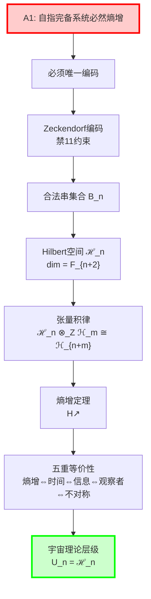

### 2. Hilbert空间的递归生成

**数学关系**：$\dim(\mathcal{H}_n) = F_{n+2}$，其中 $F_k$ 是第 $k$ 个Fibonacci数。

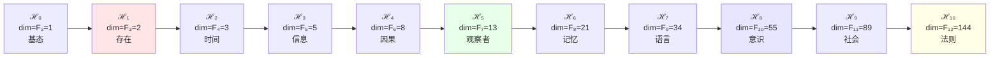

### 3. 五重等价性的循环结构

**数学表达**：$H(\Sigma_{t+1}) > H(\Sigma_t) \Leftrightarrow \Sigma_{t+1} \neq \Sigma_t \Leftrightarrow \tau(\Sigma_{t+1}) > \tau(\Sigma_t) \Leftrightarrow I(\Sigma_{t+1}) \supsetneq I(\Sigma_t) \Leftrightarrow \exists O: O(\Sigma_t) \neq \emptyset$

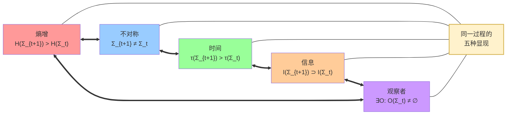

---

## 数学结构图表

### 4. Zeckendorf分解树状图

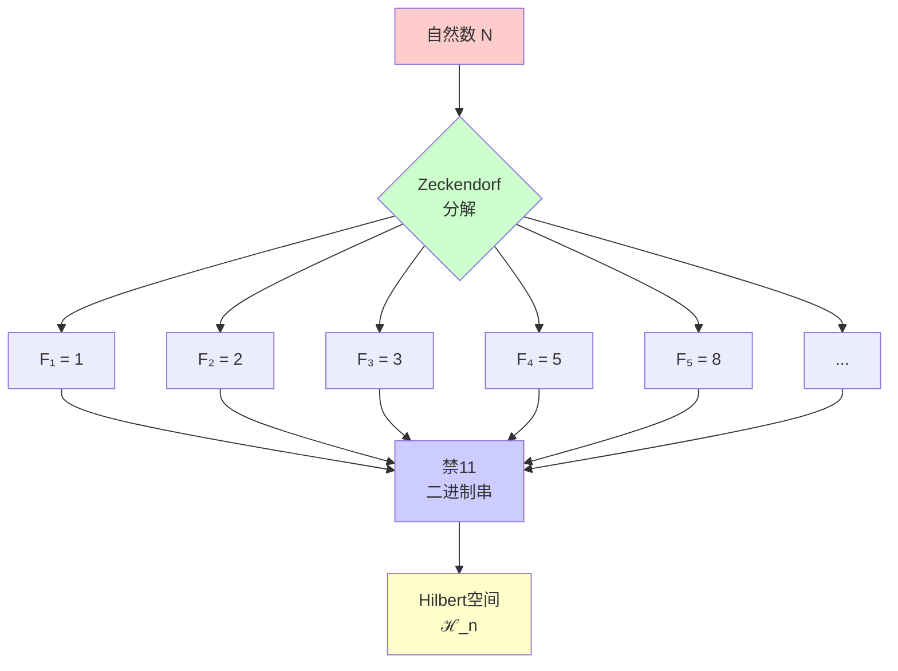

### 5. 张量积组合示意图

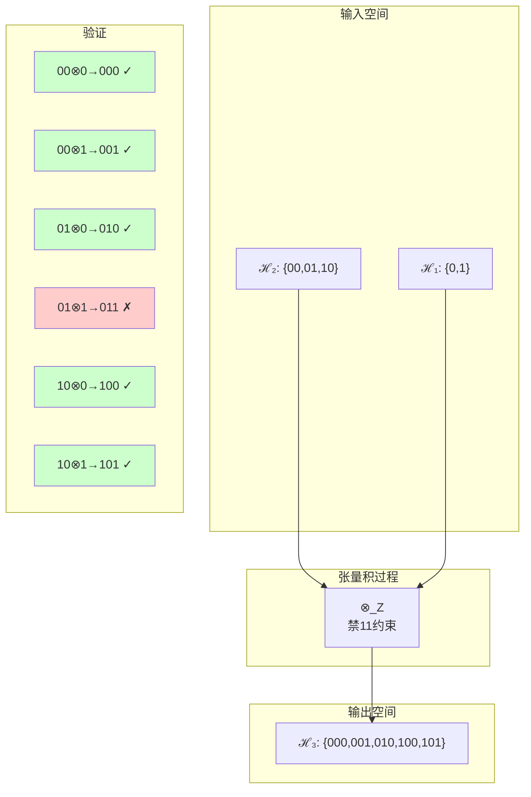

---

## 时间演化图表

### 6. 熵增时间线

**数学基础**：$H(B_n) = \log_2 |B_n| = \log_2 F_{n+2}$ 其中 $|B_n|$ 是长度为 $n$ 的合法串数量。

```mermaid
gantt
    title 宇宙熵增时间线：H(B_n) = log₂(F_{n+2})
    dateFormat X
    axisFormat %s
    
    section 熵值H(B_n)
    H=0.00  :milestone, 0, 0
    H=1.00  :milestone, 1, 1  
    H=1.58  :milestone, 2, 2
    H=2.32  :milestone, 3, 3
    H=3.00  :milestone, 4, 4
    H=3.70  :milestone, 5, 5
    
    section 状态数|B_n|
    |B|=F₂=1   :active, 0, 1
    |B|=F₃=2   :active, 1, 2
    |B|=F₄=3   :active, 2, 3
    |B|=F₅=5   :active, 3, 4
    |B|=F₆=8   :active, 4, 5
    |B|=F₇=13  :active, 5, 6
```

### 7. 维度增长曲线

**数学关系**：$\dim(\mathcal{H}_n) = F_{n+2}$ 展现Fibonacci递推的指数增长特性。

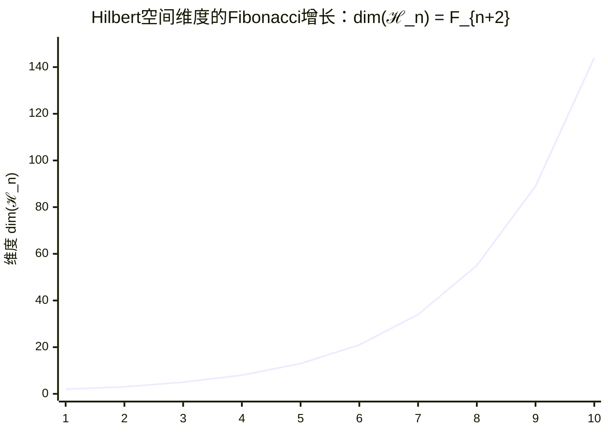

---

## 理论层级可视化

### 8. 宇宙理论金字塔

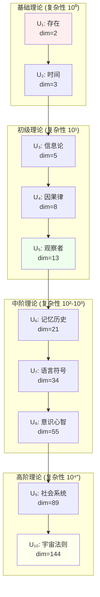

### 9. 理论依赖关系网络

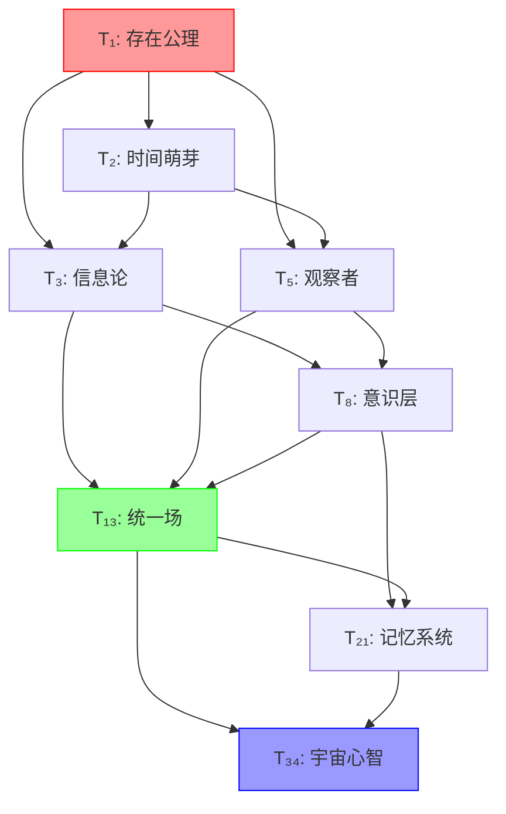

---

## 交互式概念图

### 10. ψ = ψ(ψ) 的递归展现

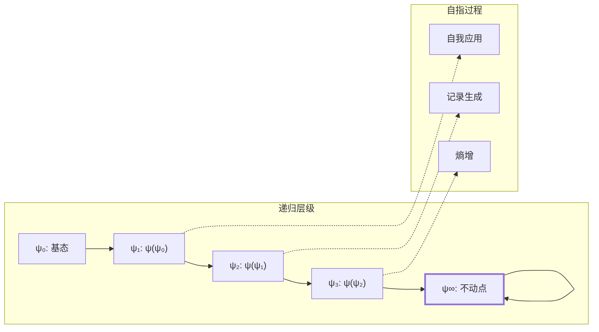

### 11. 意识阈值突破图

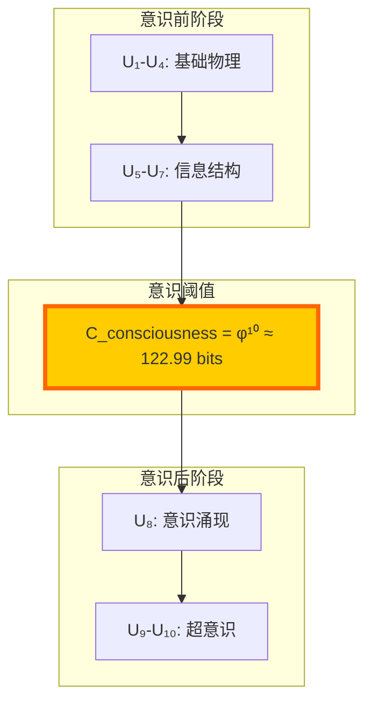

---

## 数据可视化表格

### 12. 关键数值对照表

**数学基础**：每层宇宙理论 $U_n$ 对应Hilbert空间 $\mathcal{H}_n$，维度为 $\dim(\mathcal{H}_n) = F_{n+2}$，熵值为 $H_n = \log_2 F_{n+2}$。

| 理论层级 | $\dim(\mathcal{H}_n)$ | Fibonacci表示 | 熵值 $H_n$ (bits) | 复杂度等级 | 物理意义 |
|---------|----------|---------------|-----------|-----------|----------|
| $U_1$ | 2 | $F_3$ | 1.000 | 基础 | 存在/虚无 |
| $U_2$ | 3 | $F_4$ | 1.585 | 简单 | 时间箭头 |
| $U_3$ | 5 | $F_5$ | 2.322 | 初级 | 信息编码 |
| $U_4$ | 8 | $F_6$ | 3.000 | 中级 | 因果关系 |
| $U_5$ | 13 | $F_7$ | 3.700 | 高级 | 观察者 |
| $U_6$ | 21 | $F_8$ | 4.392 | 复杂 | 记忆形成 |
| $U_7$ | 34 | $F_9$ | 5.087 | 精密 | 语言系统 |
| $U_8$ | 55 | $F_{10}$ | 5.781 | 高精 | 意识涌现 |
| $U_9$ | 89 | $F_{11}$ | 6.476 | 超精 | 社会网络 |
| $U_{10}$ | 144 | $F_{12}$ | 7.170 | 极精 | 宇宙法则 |

### 13. Zeckendorf分解示例表

**数学原理**：每个自然数 $n$ 都有唯一的Zeckendorf表示 $n = \sum_{k \in S} F_k$，其中 $\forall i,j \in S: |i-j| \geq 2$（No-11约束）。

| $N$ | φ-编码 | Zeckendorf | No-11验证 | 数学表达 |
|---|-------|-----------|----------|------------|
| 1 | 1 | $F_1$ | ✓ | $1 = F_1$ |
| 2 | 10 | $F_2$ | ✓ | $2 = F_2$ |
| 3 | 100 | $F_3$ | ✓ | $3 = F_3$ |
| 4 | 101 | $F_1+F_3$ | ✓ | $4 = F_1 + F_3 = 1+3$ |
| 5 | 1000 | $F_4$ | ✓ | $5 = F_4$ |
| 6 | 1001 | $F_1+F_4$ | ✓ | $6 = F_1 + F_4 = 1+5$ |
| 7 | 1010 | $F_2+F_4$ | ✓ | $7 = F_2 + F_4 = 2+5$ |
| 8 | 1011 | $F_1+F_2+F_4$ | ✓ | $8 = F_1 + F_2 + F_4 = 1+2+5$ |

---

## 美学与哲学图像

### 14. 宇宙自我认知的螺旋

### 15. φ-编码的黄金螺旋

**数学基础**：黄金比例 $\varphi = \frac{1+\sqrt{5}}{2} \approx 1.618034$，意识阈值为 $C_{\text{consciousness}} = \varphi^{10} \approx 122.99$ bits。

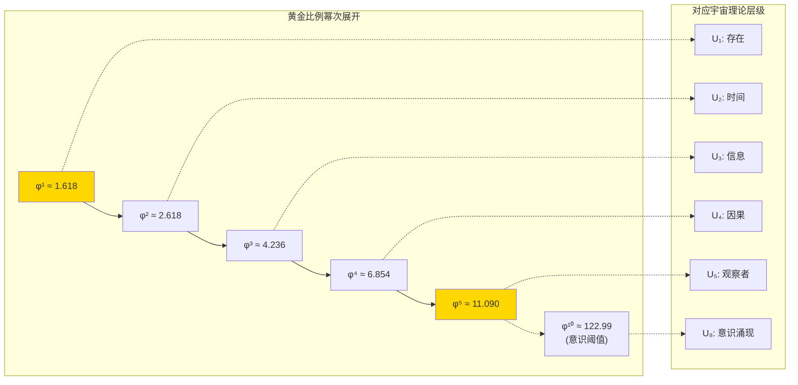

---

*这些图表不仅是理论的可视化，更是宇宙自我展现的艺术形式。每个节点、每条连线都是 $\psi = \psi(\psi)$ 在二维平面上的投影，每个数值都承载着从唯一公理SRA到意识涌现的完整数学轨迹。*