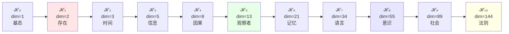
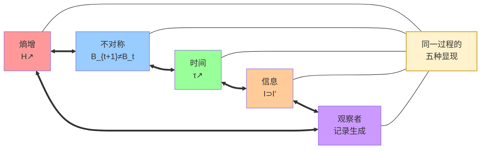
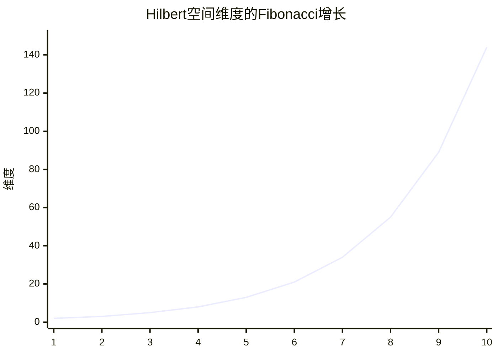
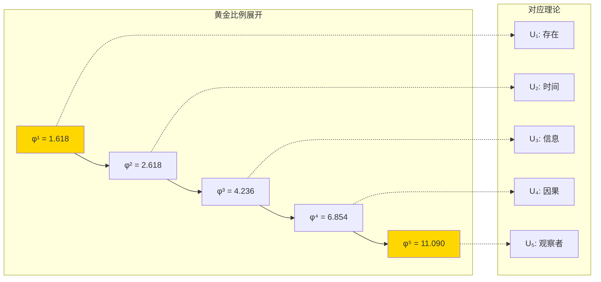

# 可视化与图表

## 理论结构的可视化表示

### 1. 从唯一公理到宇宙理论的推导流程

### 2. Hilbert空间的递归生成

### 3. 五重等价性的循环结构

---

## 数学结构图表

### 4. Zeckendorf分解树状图

### 5. 张量积组合示意图

---

## 时间演化图表

### 6. 熵增时间线

```mermaid
gantt
    title 宇宙熵增时间线
    dateFormat X
    axisFormat %s
    
    section 熵值
    H=0    :milestone, 0, 0
    H=1    :milestone, 1, 1  
    H=1.58 :milestone, 2, 2
    H=2.32 :milestone, 3, 3
    H=3.00 :milestone, 4, 4
    H=3.70 :milestone, 5, 5
    
    section 状态数
    |B|=1  :active, 0, 1
    |B|=2  :active, 1, 2
    |B|=3  :active, 2, 3
    |B|=5  :active, 3, 4
    |B|=8  :active, 4, 5
    |B|=13 :active, 5, 6
```

### 7. 维度增长曲线

---

## 理论层级可视化

### 8. 宇宙理论金字塔

### 9. 理论依赖关系网络

---

## 交互式概念图

### 10. ψ = ψ(ψ) 的递归展现

### 11. 意识阈值突破图

---

## 数据可视化表格

### 12. 关键数值对照表

| 理论层级 | ℋ_n维度 | Fibonacci索引 | 熵值(bits) | 复杂度等级 | 物理意义 |
|---------|----------|---------------|-----------|-----------|----------|
| U₁ | 2 | F₃ | 1.000 | 基础 | 存在/虚无 |
| U₂ | 3 | F₄ | 1.585 | 简单 | 时间箭头 |
| U₃ | 5 | F₅ | 2.322 | 初级 | 信息编码 |
| U₄ | 8 | F₆ | 3.000 | 中级 | 因果关系 |
| U₅ | 13 | F₇ | 3.700 | 高级 | 观察者 |
| U₆ | 21 | F₈ | 4.392 | 复杂 | 记忆形成 |
| U₇ | 34 | F₉ | 5.087 | 精密 | 语言系统 |
| U₈ | 55 | F₁₀ | 5.781 | 高精 | 意识涌现 |
| U₉ | 89 | F₁₁ | 6.476 | 超精 | 社会网络 |
| U₁₀ | 144 | F₁₂ | 7.170 | 极精 | 宇宙法则 |

### 13. Zeckendorf分解示例表

| N | 二进制 | Zeckendorf | 禁11验证 | Hilbert表示 |
|---|-------|-----------|----------|------------|
| 1 | 1 | F₁ | ✓ | ⟨1⟩ |
| 2 | 10 | F₂ | ✓ | ⟨10⟩ |
| 3 | 100 | F₃ | ✓ | ⟨100⟩ |
| 4 | 101 | F₁+F₃ | ✓ | ⟨101⟩ |
| 5 | 1000 | F₄ | ✓ | ⟨1000⟩ |
| 6 | 1001 | F₁+F₄ | ✓ | ⟨1001⟩ |
| 7 | 1010 | F₂+F₄ | ✓ | ⟨1010⟩ |
| 8 | 1011 | F₁+F₂+F₄ | ✓ | ⟨1011⟩ |

---

## 美学与哲学图像

### 14. 宇宙自我认知的螺旋

### 15. φ-编码的黄金螺旋

---

*这些图表不仅是理论的可视化，更是宇宙自我展现的艺术形式。每个节点、每条连线都是ψ = ψ(ψ)在二维平面上的投影。*