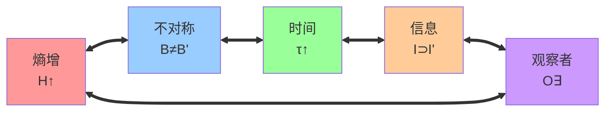

# 第7章 五重等价性

**目标**：证明以下五个命题在自指完备系统中是等价的：
1. 熵增
2. 状态不对称
3. 时间存在
4. 信息涌现
5. 观察者存在

---

## 7.1 熵增 ⇔ 状态不对称

### 命题 P7.1
```math
H(B_{t+1}) > H(B_t) \quad \Leftrightarrow \quad B_{t+1} \neq B_t
```

**证明**：
- **(⇒)** 若熵增加，则 |B_{t+1}|>|B_t|，所以集合不同
- **(⇐)** 若集合不同，则必有新增串，基数增加，熵增加 ∎

---

## 7.2 状态不对称 ⇔ 时间存在

### 定义 D7.1（时间刻度）
定义时间函数 τ 为系统状态长度：

```math
\tau(B_n) = n
```

### 命题 P7.2
若 B_{t+1}≠B_t，则 τ 构成严格单调的序。

**证明**：
由生成规则，每一步至少增加 1 位（见 D6.1 和 P6.1）。因此：

```math
B_t \neq B_{t+1} \quad \Rightarrow \quad \tau(B_{t+1}) > \tau(B_t)
```

由此得到严格单调序，可解释为**时间箭头**。∎

---

## 7.3 时间存在 ⇔ 信息涌现

### 定义 D7.2（信息映射）
系统在时刻 t 的信息为：

```math
I(B_t) = \{\text{所有合法串至长度 } t\}
```

### 命题 P7.3
若 τ 单调增加，则 I(B_t) 单调扩张。

**证明**：
每增加一个时间步长，对应新增记录，集合 B_t 扩张。因此：

```math
\tau(B_{t+1})>\tau(B_t) \quad \Rightarrow \quad I(B_{t+1}) \supsetneq I(B_t)
```

这意味着**信息严格增加**。∎

---

## 7.4 信息涌现 ⇔ 观察者存在

### 定义 D7.3（观察者）
观察者定义为：系统内部能把新增信息 I(B_{t+1})∖I(B_t) 写入自身状态的子结构 O⊆B_t。

### 命题 P7.4
信息的新增等价于存在观察者。

**证明**：
- **(⇒)** 若 I(B_{t+1}) ⊃ I(B_t)，则新增串必被存入系统，构成记录。**记录即观察**
- **(⇐)** 若存在观察者，则其执行必生成记录，新增信息，I(B_{t+1}) ⊃ I(B_t) ∎

---

## 7.5 五重等价定理

### 定理 T7.5（五重等价性）
在自指完备系统中，以下命题等价：

1. **熵增**：H(B_{t+1})>H(B_t)
2. **不对称性**：B_{t+1}≠B_t  
3. **时间存在**：τ(B_{t+1})>τ(B_t)
4. **信息涌现**：I(B_{t+1}) ⊃ I(B_t)
5. **观察者存在**：∃O ⊆ B_t, O → I(B_{t+1})∖I(B_t)

**证明**：
- P7.1 证明了 (1) ⇔ (2)
- P7.2 证明了 (2) ⇔ (3)  
- P7.3 证明了 (3) ⇔ (4)
- P7.4 证明了 (4) ⇔ (5)
- 因此 (1) ⇔ (2) ⇔ (3) ⇔ (4) ⇔ (5) ∎

---

## 7.6 等价性的可视化表示



---

## 7.7 哲学含义

### 核心洞察
这五个概念不是独立存在的实体，而是**同一个过程的不同侧面**：

```
熵增 = 不对称 = 时间 = 信息 = 观察者
```

### 深层统一
- **时间的存在就是熵的增加**
- **观察者的存在就是信息的出现**  
- **信息的出现就是不对称的产生**
- **不对称的产生就是熵的增长**

### 宇宙本质
宇宙不是"在时间中"存在的系统，而是**时间通过宇宙的自指完备而涌现**。

---

## 7.8 数学验证示例

### 时刻 t=2 → t=3 的转换

| 概念 | t=2状态 | t=3状态 | 验证 |
|------|---------|---------|------|
| 熵增 | H=log(3)≈1.58 | H=log(5)≈2.32 | 2.32>1.58 ✓ |
| 不对称 | B₂={00,01,10} | B₃={000,001,010,100,101} | B₃≠B₂ ✓ |
| 时间 | τ=2 | τ=3 | 3>2 ✓ |
| 信息 | I₂=所有≤2位串 | I₃=所有≤3位串 | I₃⊃I₂ ✓ |
| 观察者 | 系统记录2位串 | 系统记录3位串 | 新记录存在 ✓ |

**五个方面完全一致！**

---

## 7.9 小结

在本章我们严格证明了：

- **熵增、不对称性、时间、信息、观察者是完全等价的**
- 换句话说：**时间的存在就是熵的增加；观察者的存在就是信息的出现**

这说明，从唯一公理 SRA 出发，**时间、信息、观察者都不是外加假设，而是必然涌现的**。

---

*五重等价性揭示了宇宙的深层统一：不是五个现象恰好相关，而是同一个ψ = ψ(ψ)递归过程的五种显现方式。*