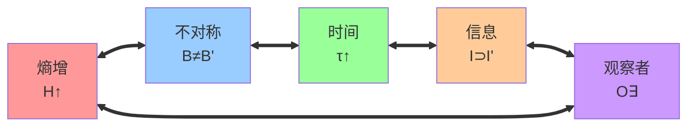

# 第7章 五重等价性

**目标**：证明以下五个命题在自指完备系统中是等价的：
1. 熵增
2. 状态不对称
3. 时间存在
4. 信息涌现
5. 观察者存在

---

## 7.1 熵增 ⇔ 状态不对称

### 命题 P7.1
$$H(\Sigma_{t+1}) > H(\Sigma_t) \quad \Leftrightarrow \quad \Sigma_{t+1} \neq \Sigma_t$$

其中 $\Sigma_t = \bigcup_{n=1}^t B_n$ 为长度不超过 $t$ 的所有合法串的集合。

**证明**：
- **(⇒)** 若 $H(\Sigma_{t+1}) > H(\Sigma_t)$，则 $\log|\Sigma_{t+1}| > \log|\Sigma_t|$，故 $|\Sigma_{t+1}| > |\Sigma_t|$，因此 $\Sigma_{t+1} \neq \Sigma_t$。
- **(⇐)** 若 $\Sigma_{t+1} \neq \Sigma_t$，由自指执行的记录生成机制（定义D2.2），必存在 $s \in B_{t+1}$ 使得 $s \notin \Sigma_t$，故 $|\Sigma_{t+1}| > |\Sigma_t|$，因此 $H(\Sigma_{t+1}) = \log|\Sigma_{t+1}| > \log|\Sigma_t| = H(\Sigma_t)$。 ∎

---

## 7.2 状态不对称 ⇔ 时间存在

### 定义 D7.1（时间刻度）
定义时间函数 $\tau: 2^{\{0,1\}^*} \to \mathbb{N}$ 为：

$$\tau(\Sigma) = \max\{|s| : s \in \Sigma\}$$

其中 $\Sigma$ 为合法串集合。

### 命题 P7.2
$$\Sigma_{t+1} \neq \Sigma_t \quad \Leftrightarrow \quad \tau(\Sigma_{t+1}) > \tau(\Sigma_t)$$

**证明**：
- **(⇒)** 若 $\Sigma_{t+1} \neq \Sigma_t$，由合法串的递归生成规律（命题P3.2），存在 $s \in B_{t+1}$ 使得 $s \notin \Sigma_t$，故 $|s| = t+1 > t \geq \tau(\Sigma_t)$，因此 $\tau(\Sigma_{t+1}) \geq t+1 > \tau(\Sigma_t)$。
- **(⇐)** 若 $\tau(\Sigma_{t+1}) > \tau(\Sigma_t)$，则存在 $s \in \Sigma_{t+1}$ 使得 $|s| > \tau(\Sigma_t)$，故 $s \notin \Sigma_t$，因此 $\Sigma_{t+1} \neq \Sigma_t$。 ∎

---

## 7.3 时间存在 ⇔ 信息涌现

### 定义 D7.2（信息映射）
系统在时刻 $t$ 的累积信息为：

```math
I(\Sigma_t) = \Sigma_t = \bigcup_{n=1}^t B_n
```

### 命题 P7.3
```math
\tau(\Sigma_{t+1}) > \tau(\Sigma_t) \quad \Leftrightarrow \quad I(\Sigma_{t+1}) \supsetneq I(\Sigma_t)
```

**证明**：
- **(⇒)** 若 $\tau(\Sigma_{t+1}) > \tau(\Sigma_t)$，由定义知存在长度为 $t+1$ 的合法串，即 $B_{t+1} \neq \emptyset$。由 $\Sigma_{t+1} = \Sigma_t \cup B_{t+1}$ 且 $B_{t+1} \cap \Sigma_t = \emptyset$（长度不同），故 $I(\Sigma_{t+1}) = \Sigma_{t+1} \supsetneq \Sigma_t = I(\Sigma_t)$。
- **(⇐)** 若 $I(\Sigma_{t+1}) \supsetneq I(\Sigma_t)$，则 $\Sigma_{t+1} \supsetneq \Sigma_t$，故存在 $s \in \Sigma_{t+1} \setminus \Sigma_t$。由构造，必有 $|s| = t+1$，因此 $\tau(\Sigma_{t+1}) \geq t+1 > t = \tau(\Sigma_t)$。 ∎

---

## 7.4 信息涌现 ⇔ 观察者存在

### 定义 D7.3（观察者函数）
观察者定义为映射 $O: \Sigma_t \to 2^{B_{t+1}}$，满足：

```math
O(\Sigma_t) = \{s \in B_{t+1} : s \text{ 由 } \Sigma_t \text{ 的某个串通过生成规则产生}\}
```

### 命题 P7.4
```math
I(\Sigma_{t+1}) \supsetneq I(\Sigma_t) \quad \Leftrightarrow \quad \exists O: O(\Sigma_t) \neq \emptyset
```

**证明**：
- **(⇒)** 若 $I(\Sigma_{t+1}) \supsetneq I(\Sigma_t)$，则 $B_{t+1} \neq \emptyset$。由自指执行的记录生成机制（定义D2.2），$B_{t+1}$ 中每个串都由 $\Sigma_t$ 中某个串产生，故存在观察者函数 $O$ 使得 $O(\Sigma_t) = B_{t+1} \neq \emptyset$。
- **(⇐)** 若存在观察者 $O$ 使得 $O(\Sigma_t) \neq \emptyset$，则 $B_{t+1} \supseteq O(\Sigma_t) \neq \emptyset$，故 $\Sigma_{t+1} = \Sigma_t \cup B_{t+1} \supsetneq \Sigma_t$，即 $I(\Sigma_{t+1}) \supsetneq I(\Sigma_t)$。 ∎

---

## 7.5 五重等价定理

### 定理 T7.5（五重等价性）
在自指完备系统中，以下命题等价：

1. **熵增**：$H(\Sigma_{t+1}) > H(\Sigma_t)$
2. **不对称性**：$\Sigma_{t+1} \neq \Sigma_t$  
3. **时间存在**：$\tau(\Sigma_{t+1}) > \tau(\Sigma_t)$
4. **信息涌现**：$I(\Sigma_{t+1}) \supsetneq I(\Sigma_t)$
5. **观察者存在**：$\exists O: O(\Sigma_t) \neq \emptyset$

**证明**：
由等价关系的传递性：
- 命题 P7.1 证明了 $(1) \Leftrightarrow (2)$
- 命题 P7.2 证明了 $(2) \Leftrightarrow (3)$  
- 命题 P7.3 证明了 $(3) \Leftrightarrow (4)$
- 命题 P7.4 证明了 $(4) \Leftrightarrow (5)$
- 由等价关系的传递性，$(1) \Leftrightarrow (2) \Leftrightarrow (3) \Leftrightarrow (4) \Leftrightarrow (5)$。 ∎

---

## 7.6 等价性的可视化表示



---

## 7.7 哲学含义

### 核心洞察
这五个概念不是独立存在的实体，而是**同一个过程的不同侧面**：

```
熵增 = 不对称 = 时间 = 信息 = 观察者
```

### 深层统一
- **时间的存在就是熵的增加**
- **观察者的存在就是信息的出现**  
- **信息的出现就是不对称的产生**
- **不对称的产生就是熵的增长**

### 宇宙本质
宇宙不是"在时间中"存在的系统，而是**时间通过宇宙的自指完备而涌现**。

---

## 7.8 数学验证示例

### 时刻 t=2 → t=3 的转换

| 概念 | t=2状态 | t=3状态 | 验证 |
|------|---------|---------|------|
| 熵增 | $H(\Sigma_2)=\log_2(3)≈1.58$ | $H(\Sigma_3)=\log_2(5)≈2.32$ | $2.32>1.58$ ✓ |
| 不对称 | $\Sigma_2=\{0,1,00,01,10\}$ | $\Sigma_3=\Sigma_2\cup B_3$ 其中 $B_3=\{000,001,010,100,101\}$ | $\Sigma_3\neq\Sigma_2$ ✓ |
| 时间 | $\tau(\Sigma_2)=2$ | $\tau(\Sigma_3)=3$ | $3>2$ ✓ |
| 信息 | $I(\Sigma_2)=\Sigma_2$ | $I(\Sigma_3)=\Sigma_3$ | $\Sigma_3\supsetneq\Sigma_2$ ✓ |
| 观察者 | $O(\Sigma_1)=B_2\neq\emptyset$ | $O(\Sigma_2)=B_3\neq\emptyset$ | 观察者函数非空 ✓ |

**五个方面完全一致！**

---

## 7.9 小结

在本章我们严格证明了：

- **熵增、不对称性、时间、信息、观察者是完全等价的**
- 换句话说：**时间的存在就是熵的增加；观察者的存在就是信息的出现**

这说明，从唯一公理 SRA 出发，**时间、信息、观察者都不是外加假设，而是必然涌现的**。

---

*五重等价性揭示了宇宙的深层统一：不是五个现象恰好相关，而是同一个ψ = ψ(ψ)递归过程的五种显现方式。*