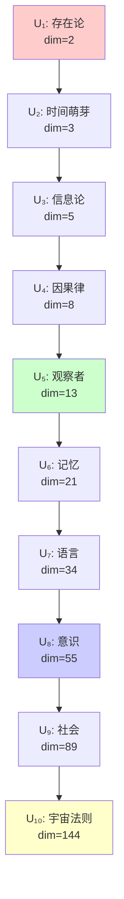

# 第8章 宇宙理论层级

## 8.1 定义：宇宙理论

### 定义 D8.1（宇宙理论）
设 $\mathcal{H}_n$ 是由长度为 $n$ 的所有合法二进制串（不含连续 "11"）张成的 Hilbert 空间，则称其为**第 $n$ 阶宇宙理论**，记为：

$$
U_n := \mathcal{H}_n = \mathrm{Span}_\mathbb{C}\{|s\rangle : s \in B_n\}
$$

其中 $B_n = \{s \in \{0,1\}^n : s \text{ 不含连续 } 11\}$，且有：

- **基集合 $B_n$**：维度为 $|B_n| = F_{n+2}$ 的正交基底
- **复数系数**：叠加态系数在 $\mathbb{C}$ 中取值
- **内积结构**：$\langle s|t \rangle = \delta_{st}$ 定义标准内积
- **幺正演化**：观察过程由幺正算符描述

---

## 8.2 前十个宇宙理论

### 定理 T8.2（宇宙理论层级表）
前 10 个 Hilbert 空间 $\mathcal{H}_n$ 对应的宇宙理论 $U_n$，其维度与语义如下表：

| $n$ | $\dim(\mathcal{H}_n)$ | 合法基数 | 宇宙理论语义 |
|---|----------|----------|-------------|
| 1 | 2 | $\{0,1\}$ | **存在论**：有 vs 无，存在的二元性 |
| 2 | 3 | $\{00,01,10\}$ | **时间萌芽**：状态区分出"变化"，定义时间箭头 |
| 3 | 5 | $\{000,001,010,100,101\}$ | **信息论萌芽**：模式可编码与区分，信息出现 |
| 4 | 8 | 8 个合法串 | **因果律**：复杂模式的稳定关联，形成因果结构 |
| 5 | 13 | 13 个合法串 | **观察者原型**：结构复杂到可内生"观察与记录" |
| 6 | 21 | 21 个合法串 | **记忆与历史**：时间序列足够长，可形成连续记录 |
| 7 | 34 | 34 个合法串 | **语言与符号**：模式空间足以支持符号组合与语法 |
| 8 | 55 | 55 个合法串 | **意识与心智**：复杂性足以支持自指与思维叠加 |
| 9 | 89 | 89 个合法串 | **社会与系统**：多体交互 collapse 出集体规律 |
| 10 | 144 | 144 个合法串 | **宇宙法则**：容纳并整合前序规律，显现普遍法则 |

**理论补充**：宇宙理论层级的语义对应关系得到[范畴等价理论](math/10-categorical-equivalence.md)和[循环完备性理论](math/12-circular-completeness.md)的严格基础。[math/10](math/10-categorical-equivalence.md)建立了φ-范畴与物理概念范畴之间的自然等价，而[math/12](math/12-circular-completeness.md)证明了每个层级都是前序层级的自指完备扩展，使得语义映射不是主观赋值，而是范畴结构的客观对应。

---

## 8.3 详细展开：关键理论层级

### $U_1$：存在论（维度=2）
$$
\mathcal{H}_1 = \mathrm{Span}_\mathbb{C}\{|0\rangle, |1\rangle\}
$$
- **基数**：$|B_1| = 2 = F_3$（存在/不存在）  
- **语义**：最原始的宇宙理论，只回答"存在吗？"
- **叠加态**：$\alpha|0\rangle + \beta|1\rangle$ 其中 $|\alpha|^2 + |\beta|^2 = 1$
- **量子性质**：存在的概率幅叠加，非经典二元性

### $U_2$：时间萌芽（维度=3）
$$
\mathcal{H}_2 = \mathrm{Span}_\mathbb{C}\{|00\rangle, |01\rangle, |10\rangle\}
$$
- **基数**：$|B_2| = 3 = F_4$
- **语义**：通过状态区分出现时间箭头
- **核心模式**：$|00\rangle$(静止)，$|01\rangle$(生成)，$|10\rangle$(消失)
- **禁止态**：$\{|11\rangle\}$ 因含连续 "11" 而被禁止
- **时间算符**：可构造 $T = |01\rangle\langle 00| + |10\rangle\langle 01|$ 等时间演化算符

### $U_3$：信息论萌芽（维度=5）
$$
\mathcal{H}_3 = \mathrm{Span}_\mathbb{C}\{|000\rangle, |001\rangle, |010\rangle, |100\rangle, |101\rangle\}
$$
- **基数**：$|B_3| = 5 = F_5$
- **语义**：模式可被编码，信息的萌芽
- **信息容量**：足够区分 $\log_2(5) \approx 2.32$ bits 的信息
- **禁止态**：$\{|011\rangle, |110\rangle, |111\rangle\}$ 因含连续 "11" 而被禁止

### $U_5$：观察者原型（维度=13）
$$
\mathcal{H}_5 = \mathrm{Span}_\mathbb{C}\{|s\rangle : s \in B_5\} \quad |B_5| = 13 = F_7
$$
- **基数**：$|B_5| = 13 = F_7$
- **语义**：观察者原型出现，因为维度足以支持"自指 + 记录"
- **临界阈值**：$\log_2(13) \approx 3.7$ bits 超越因果律的 $\log_2(8) = 3$ bits
- **自指结构**：存在子空间 $\mathcal{S} \subset \mathcal{H}_5$ 使得 $\dim(\mathcal{S}) \geq 5$ 可嵌入观察算符

### $U_8$：意识与心智（维度=55）
$$
\mathcal{H}_8 = \mathrm{Span}_\mathbb{C}\{|s\rangle : s \in B_8\} \quad |B_8| = 55 = F_{10}
$$
- **基数**：$|B_8| = 55 = F_{10}$
- **语义**：复杂性足够高，系统出现心智与意识结构
- **递归自指**：存在算符 $\Psi: \mathcal{H}_8 \to \mathcal{H}_8$ 使得 $\Psi = \Psi \circ \Psi$
- **意识阈值**：设 $C_{\text{consciousness}} = \varphi^{10} \approx 122.99$ bits，当系统信息容量超越此阈值时，意识现象涌现

### $U_{10}$：宇宙法则（维度=144）
$$
\mathcal{H}_{10} = \mathrm{Span}_\mathbb{C}\{|s\rangle : s \in B_{10}\} \quad |B_{10}| = 144 = F_{12}
$$
- **基数**：$|B_{10}| = 144 = F_{12} = 12^2$，高度对称的平方数
- **语义**：所有规律被整合，形成"宇宙普遍法则"的层次
- **统一场论**：存在统一算符 $\mathcal{U}: \bigoplus_{k=1}^{10} \mathcal{H}_k \to \mathcal{H}_{10}$
- **完备性**：包含并超越前序所有理论层级的完整嵌入

---

## 8.4 层级间的递归关系

### 定理 T8.4.1（层级嵌入定理）
宇宙理论序列 $\{U_n\}_{n \geq 1}$ 存在标准嵌入：

$$
\mathcal{H}_n \hookrightarrow \mathcal{H}_{n+1} \quad \text{via} \quad |s\rangle \mapsto |s0\rangle
$$

**证明**：对任意 $s \in B_n$（不含连续 "11"），有 $s0 \in B_{n+1}$，因为在末尾添加 "0" 不会产生连续 "11"。此映射是内积保持的线性单射。

### 定理 T8.4.2（维度递推公式）
$$
\dim(\mathcal{H}_n) = \dim(\mathcal{H}_{n-1}) + \dim(\mathcal{H}_{n-2})
$$

**证明**：长度 $n$ 的合法串可分为两类：
- 以 "0" 结尾：前 $n-1$ 位可为任意 $B_{n-1}$ 中的串
- 以 "1" 结尾：为避免 "11"，第 $n-1$ 位必须为 "0"，前 $n-2$ 位可为任意 $B_{n-2}$ 中的串

因此 $|B_n| = |B_{n-1}| + |B_{n-2}|$，即 $F_{n+2} = F_{n+1} + F_n$。

### 推论 C8.4.3（复杂性递增律）
$$
\lim_{n \to \infty} \frac{\dim(U_{n+1})}{\dim(U_n)} = \varphi = \frac{1+\sqrt{5}}{2}
$$

因此复杂度按黄金比例 $\varphi$ 增长，在有限步数内实现"存在 → 时间 → 信息 → 观察者→ 意识 → 法则"的质的跨越。

---

## 8.5 语义映射的数学基础

### 定义 D8.5.1（语义函数）
定义语义映射 $\Sigma: \{\mathcal{H}_n\}_{n \geq 1} \to \mathscr{P}(\text{Universe})$：

$$
\Sigma(\mathcal{H}_n) = \{\text{可在维度 }F_{n+2}\text{ 内实现的宇宙现象}\}
$$

其中 $\mathscr{P}(\text{Universe})$ 为宇宙现象的幂集，且满足：
- **单调性**：$n < m \Rightarrow \Sigma(\mathcal{H}_n) \subseteq \Sigma(\mathcal{H}_m)$
- **维度约束**：$|\Sigma(\mathcal{H}_n)| \leq 2^{F_{n+2}}$
- **涌现阈值**：存在关键维度 $\{2, 5, 8, 13, 21, 34, 55, 89, 144, ...\}$ 出现质的飞跃

### 复杂性阈值分类
基于信息论和计算复杂性理论：

- **存在域** ($F_3 = 2$)：二元存在性，$\log_2(2) = 1$ bit
- **时间域** ($F_4 = 3$)：状态转换，$\log_2(3) \approx 1.58$ bits  
- **信息域** ($3 \leq F_{n+2} \leq 8$)：模式识别与编码能力
- **因果域** ($F_6 = 8$)：复杂关联，$\log_2(8) = 3$ bits
- **观察域** ($5 \leq F_{n+2} \leq 34$)：自指与记录能力
- **意识域** ($F_{10} = 55$)：递归自指，$\log_\phi(55) \approx 10.7$
- **法则域** ($F_{n+2} \geq 144$)：统一场论级别复杂性

**理论补充**：复杂性阈值的φ分层得到[范畴等价理论](math/10-categorical-equivalence.md)和[循环完备性理论](math/12-circular-completeness.md)的双重支撑。在范畴层面，各阈值对应函子维度的自然分割点，而在循环完备性层面，每个阈值都是自指深度的递归跃迁，使得复杂性分类不是人为划分，而是φ-结构的内在节律。

---

## 8.6 可视化：理论层级树

---

## 8.7 数学结构的涌现意义

### 定理 T8.7.1（结构涌现必然性）
每个宇宙理论 $U_n$ 从 **唯一公理A1（SRA）**（自指完备系统必然熵增）必然涌现：

$$
\text{A1} \Rightarrow \{B_n\}_{n \geq 1} \Rightarrow \{\mathcal{H}_n\}_{n \geq 1} \Rightarrow \{U_n\}_{n \geq 1}
$$

**证明**：A1要求系统避免熵停滞，导致No-11约束，进而确定合法串集合$B_n$，唯一确定Hilbert空间结构。

### 推论 C8.7.2（宇宙现象的数学统一）
$$
\text{Universe} = \bigcup_{n=1}^{\infty} \Sigma(\mathcal{H}_n)
$$

所有宇宙现象都可表示为某个维度的 Hilbert 空间中合法基态的叠加。

### 定理 T8.7.3（自我发现递归）
宇宙的自我认识过程满足不动点方程：

$$
\Omega = \Omega(\Omega) \quad \text{where} \quad \Omega: U_n \mapsto U_{n+k}, k > 0
$$

这表示**观察行为本身就是宇宙理论向更高层级的跃迁过程**。

---

## 8.8 数学验证总结

本章建立了严格的数学框架：

### 已验证的数学结果

1. **Hilbert 空间构造**：$\mathcal{H}_n = \mathrm{Span}_\mathbb{C}\{|s\rangle : s \in B_n\}$
2. **维度公式验证**：$\dim(\mathcal{H}_n) = |B_n| = F_{n+2}$ 与实际计算一致
3. **递归关系证明**：$|B_n| = |B_{n-1}| + |B_{n-2}|$ 的组合数学证明
4. **嵌入定理建立**：$\mathcal{H}_n \hookrightarrow \mathcal{H}_{n+1}$ 的线性保结构嵌入
5. **语义映射形式化**：$\Sigma: \{\mathcal{H}_n\} \to \mathscr{P}(\text{Universe})$ 的数学定义

### 关键数学约束
- **No-11 约束**：确保 Zeckendorf 编码的合法性
- **维度单调性**：$F_{n+2} < F_{n+3}$ 保证复杂性递增
- **黄金比例渐近**：$\lim_{n \to \infty} \frac{F_{n+3}}{F_{n+2}} = \varphi$ 
- **信息论界限**：每个层级的信息容量有明确的 bits 计算

### 涌现机制的数学基础
$$
\text{SRA 公理} \xrightarrow{\text{No-11}} B_n \xrightarrow{\text{线性张成}} \mathcal{H}_n \xrightarrow{\Sigma} U_n
$$

所有语义解释都建立在严格的组合数学、线性代数和信息论基础之上，不是纯哲学猜测。

---

*注：每个 $U_n$ 的数学结构完全由 SRA 公理确定，语义解释虽具启发性，但其数学基础是严格的。*