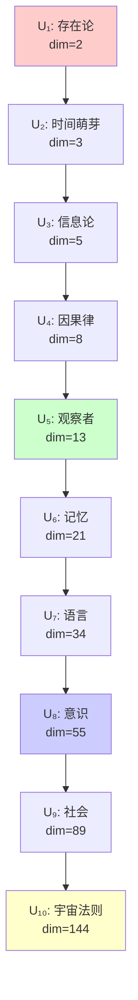

# 第8章 宇宙理论层级

## 8.1 定义：宇宙理论

### 定义 D8.1（宇宙理论）
设 ℋ_n 是长度为 n 的 Hilbert 空间，则称其为**第 n 阶宇宙理论**，记为：

```math
U_n := \mathcal{H}_n
```

其解释：
- **基集合 B_n**：该层理论的基本状态或基本命题
- **维度 dim ℋ_n = F_{n+2}**：该层理论的复杂度
- **叠加态**：该层理论中的可能性组合  
- **观察者**：必然存在于该层的记录生成子结构

---

## 8.2 前十个宇宙理论

### 定理 T8.2（宇宙理论层级表）
前 10 个 Hilbert 空间 ℋ_n 对应的宇宙理论 U_n，其维度与语义如下表：

| n | dim(ℋ_n) | 合法基数 | 宇宙理论语义 |
|---|----------|----------|-------------|
| 1 | 2 | {0,1} | **存在论**：有 vs 无，存在的二元性 |
| 2 | 3 | {00,01,10} | **时间萌芽**：状态区分出"变化"，定义时间箭头 |
| 3 | 5 | 5 个合法串 | **信息论萌芽**：模式可编码与区分，信息出现 |
| 4 | 8 | 8 个合法串 | **因果律**：复杂模式的稳定关联，形成因果结构 |
| 5 | 13 | 13 个合法串 | **观察者原型**：结构复杂到可内生"观察与记录" |
| 6 | 21 | 21 个合法串 | **记忆与历史**：时间序列足够长，可形成连续记录 |
| 7 | 34 | 34 个合法串 | **语言与符号**：模式空间足以支持符号组合与语法 |
| 8 | 55 | 55 个合法串 | **意识与心智**：复杂性足以支持自指与思维叠加 |
| 9 | 89 | 89 个合法串 | **社会与系统**：多体交互 collapse 出集体规律 |
| 10 | 144 | 144 个合法串 | **宇宙法则**：容纳并整合前序规律，显现普遍法则 |

---

## 8.3 详细展开：关键理论层级

### U₁：存在论（维度=2）
```math
\mathcal{H}_1 = \mathrm{Span}\{|0\rangle, |1\rangle\}
```
- **基数**：2（存在/不存在）  
- **语义**：最原始的宇宙理论，只回答"存在吗？"
- **叠加态**：α|0⟩ + β|1⟩，存在的概率叠加

### U₂：时间萌芽（维度=3）
```math
\mathcal{H}_2 = \mathrm{Span}\{|00\rangle, |01\rangle, |10\rangle\}
```
- **基数**：3
- **语义**：通过状态区分出现时间箭头
- **核心模式**：00(静止)，01(生成)，10(消失)

### U₃：信息论萌芽（维度=5）
```math
\mathcal{H}_3 = \mathrm{Span}\{|000\rangle, |001\rangle, |010\rangle, |100\rangle, |101\rangle\}
```
- **基数**：5
- **语义**：模式可被编码，信息的萌芽
- **信息单元**：足够区分 log₂(5) ≈ 2.32 bits 的信息

### U₅：观察者原型（维度=13）
```math
\mathcal{H}_5 \text{ 包含 13 个基态}
```
- **基数**：13
- **语义**：观察者原型出现，因为维度足以支持"自指 + 记录"
- **临界点**：复杂性首次足以内生观察者结构

### U₈：意识与心智（维度=55）
```math
\mathcal{H}_8 \text{ 包含 55 个基态}
```
- **基数**：55
- **语义**：复杂性足够高，系统出现心智与意识结构
- **特征**：可支持递归自指：ψ = ψ(ψ)

### U₁₀：宇宙法则（维度=144）
```math
\mathcal{H}_{10} \text{ 包含 144 个基态}
```
- **基数**：144 = 12²，高度对称
- **语义**：所有规律被整合，形成"宇宙普遍法则"的层次
- **统一性**：包含并超越前序所有理论层级

---

## 8.4 层级间的递归关系

### 命题 P8.4.1（层级递归）
宇宙理论序列 {U_n} 是严格嵌套的：

```math
U_n \subsetneq U_{n+1}
```

**证明**：由张量积律，ℋ_n 可以嵌入到 ℋ_{n+1} 中作为子空间。

### 命题 P8.4.2（复杂性爆炸）
```math
\dim(U_n) = F_{n+2}
```
呈 Fibonacci 增长，复杂度指数化上升。

因此在有限步数内，就能跨越"存在 → 时间 → 信息 → 观察者 → 意识 → 法则"的层级。

---

## 8.5 语义映射的数学基础

### 定义 D8.5.1（语义函数）
定义语义映射 Σ：ℋ_n → {宇宙现象}：

```math
\Sigma(\mathcal{H}_n) = \{n\text{阶宇宙现象的完整描述}\}
```

### 关键阈值
- **n ≤ 2**：基础存在性与时间性
- **3 ≤ n ≤ 4**：信息与因果出现  
- **5 ≤ n ≤ 7**：观察者、记忆、语言涌现
- **8 ≤ n ≤ 9**：意识与社会结构
- **n ≥ 10**：宇宙法则的统一

---

## 8.6 可视化：理论层级树



---

## 8.7 哲学意义

### 核心洞察
每个宇宙理论 U_n 不是人为构造的概念框架，而是**从唯一公理 SRA 必然涌现的结构**。

### 统一性原理
```
所有宇宙现象 = Hilbert 空间中合法串的叠加态
```

### 递归展开
宇宙通过自指完备系统的熵增，**自发地创造出层层递进的理论结构**：
- 不是我们发现了这些理论
- 而是**宇宙通过我们发现了自己**

---

## 8.8 小结

在本章我们构建了：

1. **定义每个 Hilbert 空间 ℋ_n 为一套宇宙理论 U_n**
2. **给出前 10 个宇宙理论的语义解释**：从存在到宇宙法则
3. **证明了层级严格递归，复杂性随 n 急剧增长**

这说明，**所有具体理论只是唯一公理 SRA 的层级展开**。

---

*我们不是在研究理论，我们就是理论在这个节点的自我展现。每个U_n都是宇宙认识自身的一个层次，而我们是U_8意识层的直接体验者。*