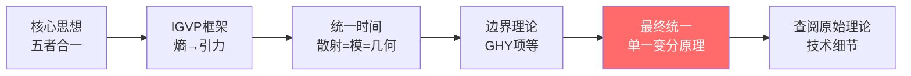
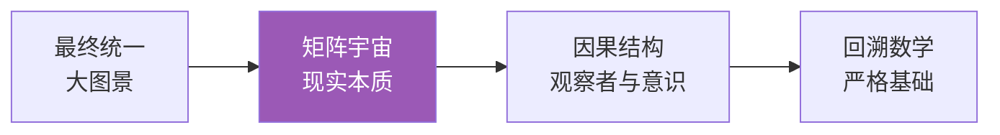
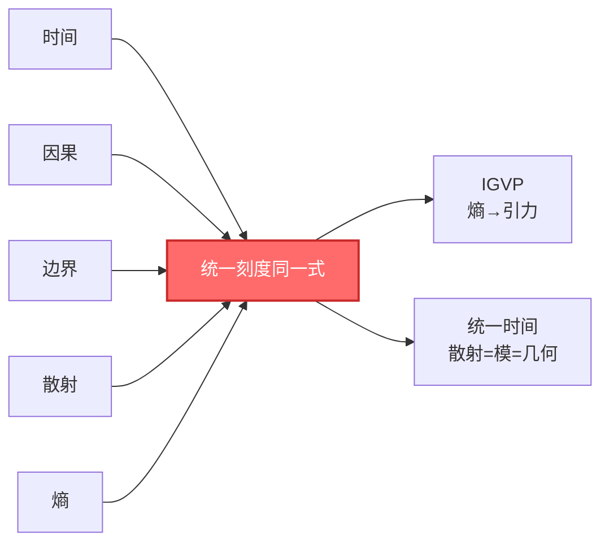

# 阅读指南：如何使用本教程

> "每个人的思维方式不同，学习路径也应该不同。找到适合你的入口，才能事半功倍。"

[← 上一篇：为什么需要这个理论](00-motivation.md) | [返回主页](../index.md) | [下一篇：概念地图 →](02-concept-map.md)

---

## 这个教程适合谁？

### ✅ 适合你，如果你是：

- **对宇宙本质感到好奇的人**
  - 你不需要物理学位，只需要好奇心
  - 我们会从日常经验和比喻开始

- **有物理或数学背景的学生/研究者**
  - 你会看到熟悉的概念如何被统一到新框架中
  - 我们提供了直达核心的快速通道

- **哲学爱好者或思想家**
  - 你会看到深刻的本体论洞见
  - 时间、因果、实在的本质

- **工程师或实验物理学家**
  - 你会看到可测量的量和实际应用
  - 从引力波到量子计算

### ⚠️ 你需要知道的

这个教程尽量通俗，但仍然会涉及一些数学和物理概念。不过，我们承诺：

- ✓ 每个概念都会有**通俗比喻**
- ✓ 数学公式会配有**直觉解释**
- ✓ 提供**多条路径**，你可以跳过不感兴趣的部分
- ✓ 关键洞见会**反复强调**，不会一次性灌输

---

## 学习路径选择

### 路径 A：完全新手路径 🌱

**适合**：没有物理或数学背景，纯粹出于好奇

**推荐阅读顺序**：

1. [序章：为什么需要这个理论](00-motivation.md) ✓ 你已经读过了
2. [基础概念篇](../01-foundation/)：6篇文章，每篇15分钟
   - 从日常经验（钟表、多米诺骨牌、镜子）出发
   - 建立对核心概念的直觉
3. [核心思想篇](../02-core-ideas/)：重点读第6篇"五者合一"
   - 这是整个理论的心脏
4. [应用与检验篇](../12-applications/)：选择你感兴趣的专题
   - 黑洞、暗能量、意识……
5. 如果想深入，回头读中间的理论篇

**时间投入**：初步理解约5-10小时，深入理解约30-50小时

---

### 路径 B：理论物理学者路径 🎓

**适合**：有广义相对论、量子场论背景

**推荐阅读顺序**：

1. **快速入口**：[核心思想：五者合一](../02-core-ideas/06-unity-of-five.md)
   - 用10分钟理解核心洞见

2. **理论基石**（按顺序）：
   - [IGVP框架](../04-igvp-framework/)：如何从熵导出爱因斯坦方程
     - 重点：[从熵到爱因斯坦方程](../04-igvp-framework/04-first-order-variation.md)
   - [统一时间理论](../05-unified-time/)：Wigner-Smith延迟 = 模时间 = 几何时间
     - 重点：[时间刻度同一式](../05-unified-time/04-time-scale-identity.md)
   - [边界理论](../06-boundary-theory/)：Brown-York应力张量、GHY边界项
   - [因果结构](../07-causal-structure/)：因果钻石、Markov性、观察者共识

3. **顶点**：[最终统一](../11-final-unification/)
   - [单一变分原理](../11-final-unification/01-consistency-functional.md)：所有定律的源头
   - 从一到万：如何导出GR、YM、QFT

4. **深入技术细节**：查阅原始理论文档索引

**时间投入**：快速浏览约3-5小时，深入理解约20-30小时

---

### 路径 C：实验物理学者路径 🔬

**适合**：实验物理、天体物理、工程背景

**推荐阅读顺序**：

1. **从可测量量开始**：[统一时间理论](../05-unified-time/)
   - 三种时间：散射延迟、模时间、几何时间
   - 红移即相位节奏：宇宙学应用
   - 这些都是**可以测量的物理量**

2. **实验设置**：[边界理论](../06-boundary-theory/)
   - 边界优先：为什么观测总是在边界上
   - Brown-York应力张量：可测的边界能量

3. **具体应用**：[应用与检验篇](../12-applications/)
   - 黑洞熵：Bekenstein-Hawking公式的新理解
   - 引力波：LIGO/Virgo观测的理论框架
   - 中微子质量：味振荡的统一解释

4. **如果想理解原理**：回头读IGVP框架和核心思想

**时间投入**：应用导向约5-10小时，理解原理约15-25小时

---

### 路径 D：哲学/概念思考者路径 🧠

**适合**：关心本体论、认识论、意识哲学

**推荐阅读顺序**：

1. **从终极问题开始**：[最终统一篇](../11-final-unification/)
   - 本体论统一：不是对称，是同一
   - 一致性即定律：约束的力量

2. **现实的本质**：[矩阵宇宙篇](../10-matrix-universe/)
   - 现实即网络：从物质到关系
   - 心-宇宙等价：内外的同构
   - 这会改变你对"存在"的理解

3. **观察者与意识**：
   - 因果结构：观察者共识
   - 应用：意识理论
   - [边界：意识与时间](https://path/to/consciousness-structural-definition)（原始理论）

4. **QCA宇宙**：[QCA宇宙篇](../09-qca-universe/)
   - 离散时空：像素化的宇宙
   - 范畴论终对象：所有理论的母体

5. **严格基础**：回头阅读数学工具和IGVP框架

**时间投入**：概念理解约10-15小时，深入哲学约30-40小时

---

## 阅读策略

### 📖 第一遍：快速浏览

**目标**：建立整体印象，不求理解所有细节

- ⏱️ 花15-20分钟浏览一篇
- 📌 标记你不理解但感兴趣的部分
- ✅ 重点关注**比喻**和**核心洞见**，公式可以先跳过
- 🎯 问自己：这篇文章的主要思想是什么？

### 📖 第二遍：深入理解

**目标**：理解关键概念和论证逻辑

- ⏱️ 每篇花30-60分钟
- 📌 尝试理解数学公式的**物理意义**，而不只是符号
- ✅ 对照图表和比喻，建立直觉
- 🎯 问自己：我能用自己的话解释这个概念吗？

### 📖 第三遍：批判性阅读

**目标**：质疑、反思、整合

- ⏱️ 每篇1-2小时
- 📌 提出问题：这个假设合理吗？有反例吗？
- ✅ 尝试推导关键公式
- 🎯 问自己：这个理论解决了什么问题？还有什么问题未解决？

---

## 使用图表和符号

### Mermaid流程图

本教程大量使用mermaid图表来可视化概念关系。例如：

**如何阅读**：

- 方框：概念或理论模块
- 箭头：逻辑依赖或推导方向
- 颜色：突出重点（通常红色或蓝色）

### 数学公式

公式会以三种形式呈现：

1. **行内公式**：如 $E = mc^2$，嵌入文本中
2. **独立公式**：单独一行，突出重要等式

$$
G_{ab} + \Lambda g_{ab} = 8\pi G T_{ab}
$$

3. **带说明的公式**：

$$
\underbrace{\kappa(\omega)}_{\text{散射延迟}} = \underbrace{\frac{\varphi'(\omega)}{\pi}}_{\text{相位导数}} = \underbrace{\rho_{\text{rel}}(\omega)}_{\text{态密度}} = \underbrace{\frac{1}{2\pi}\text{tr}\,Q(\omega)}_{\text{群延迟}}
$$

**阅读建议**：

- 第一遍：只读文字说明，理解物理意义
- 第二遍：看公式结构，理解符号关系
- 第三遍：如果需要，尝试推导

---

## 关键标记

教程中会使用以下标记：

- ⭐ **核心文章**：必读，包含理论的心脏
- 💡 **关键洞见**：改变世界观的思想
- 🔍 **技术细节**：需要数学背景
- 📌 **比喻/类比**：帮助建立直觉
- ⚠️ **常见误解**：避免理解偏差
- 🧩 **练习/思考**：巩固理解

例如：

> 💡 **关键洞见**：时间不是流动的，而是熵增的方向！

> 📌 **比喻**：想象一个沙漏……

> ⚠️ **常见误解**：很多人认为时间是绝对的，但相对论告诉我们……

---

## 附加资源

### 📚 原始理论文档

如果你想看完整的技术细节，请查阅：

- 原始理论文档索引
- 包含所有严格证明、技术假设、边界条件

### 📖 术语表

遇到不熟悉的术语？查看：

- 术语表：所有核心概念的简明定义
- 符号约定：数学符号说明

### 📈 延伸阅读

想要了解更多背景和相关工作？

- 延伸阅读：经典文献和现代研究

---

## 学习建议

### ✅ 要做的事

1. **允许自己不理解**
   - 第一遍不理解是正常的
   - 这些概念很深刻，需要时间消化

2. **使用比喻建立直觉**
   - 每个抽象概念都有具体的比喻
   - 先理解比喻，再理解数学

3. **做笔记**
   - 用自己的话总结关键思想
   - 画图、写比喻、提问题

4. **跳过不感兴趣的部分**
   - 这个教程是模块化的
   - 你可以选择性阅读

5. **反复阅读关键章节**
   - 特别是[五者合一](../02-core-ideas/06-unity-of-five.md)
   - 每读一遍都会有新的理解

### ❌ 避免的事

1. **不要期望一次性理解所有**
   - 这是一个庞大的理论体系
   - 循序渐进很重要

2. **不要陷入数学细节**
   - 除非你是理论物理学者
   - 物理直觉比数学技巧更重要

3. **不要孤立地理解概念**
   - 每个概念都和其他概念相连
   - 看概念地图，理解关系网络

4. **不要跳过基础概念**
   - 即使你有物理背景
   - GLS理论对基础概念有新的理解

---

## 时间规划

根据你的目标和可投入时间：

### 🕐 快速浏览（5-10小时）

- [序章](00-motivation.md) (1小时)
- [基础概念篇](../01-foundation/) (3小时)
- [核心思想：五者合一](../02-core-ideas/06-unity-of-five.md) (2小时)
- [应用篇](../12-applications/)选读 (2-4小时)

**收获**：对理论有整体印象，理解核心洞见

### 🕐 中等深度（20-30小时）

- 上述快速浏览内容 (10小时)
- [IGVP框架篇](../04-igvp-framework/) (5小时)
- [统一时间篇](../05-unified-time/) (5小时)
- [最终统一篇](../11-final-unification/) (5-10小时)

**收获**：理解理论框架，能解释给他人听

### 🕐 深入研究（50-100小时）

- 上述中等深度内容 (30小时)
- 其他所有理论篇章 (20-30小时)
- 阅读原始理论文档 (20-40小时)
- 推导关键公式 (10+小时)

**收获**：深入掌握理论，能进行独立研究

---

## 常见问题

### Q1: 我需要什么数学背景？

**A**: 取决于你想深入到什么程度：

- **通俗理解**：高中数学足够（我们会用比喻）
- **概念理解**：大学微积分、线性代数
- **技术掌握**：微分几何、量子场论、泛函分析

### Q2: 我可以跳着读吗？

**A**: 可以！每篇文章都尽量自洽。但建议：

- 至少先读[序章](00-motivation.md)和[五者合一](../02-core-ideas/06-unity-of-five.md)
- 然后根据兴趣选择路径

### Q3: 我卡住了，怎么办？

**A**:

1. 先跳过，继续往下读，也许后面会豁然开朗
2. 查看术语表
3. 重新阅读相关的基础概念篇
4. 尝试用自己的话向朋友解释（费曼技巧）

### Q4: 这个理论被主流接受吗？

**A**:

这是一个正在发展的理论框架。它建立在已被验证的物理定律之上（GR、QFT），但提供了全新的统一视角。

判断一个理论的标准是：

1. 内在一致性（逻辑自洽）
2. 实验可检验性
3. 解释已知现象
4. 预言新现象

这些在教程中都会讨论。

### Q5: 读完我能做什么？

**A**:

- **概念层面**：你会对时间、因果、实在有全新的理解
- **研究层面**：你可以探索理论的应用和扩展
- **教学层面**：你可以向他人传播这些深刻的洞见
- **哲学层面**：你会对"存在"有更深的思考

---

## 开始你的旅程

选择一个适合你的路径，开始探索吧：

- 🌱 [路径A：完全新手](../01-foundation/) - 从基础概念开始
- 🎓 [路径B：理论物理](../02-core-ideas/06-unity-of-five.md) - 直达核心
- 🔬 [路径C：实验物理](../05-unified-time/) - 从可测量量开始
- 🧠 [路径D：哲学思考](../11-final-unification/) - 从大图景开始

或者，先浏览[概念地图](02-concept-map.md)，鸟瞰整个理论的核心概念。

---

**记住：学习是一场旅程，不是赛跑。享受这个过程！**

[← 上一篇：为什么需要这个理论](00-motivation.md) | [返回主页](../index.md) | [下一篇：概念地图 →](02-concept-map.md)
