# Reading Guide: How to Use This Tutorial

> "Everyone thinks differently, so learning paths should differ too. Finding the right entry point for you makes all the difference."

[← Previous: Why Do We Need This Theory](00-motivation_en.md) | [Back to Home](../index_en.md) | [Next: Concept Map →](02-concept-map_en.md)

---

## Who Is This Tutorial For?

### ✅ It's for you if you are:

- **Someone curious about the nature of the universe**
  - You don't need a physics degree, just curiosity
  - We'll start from everyday experience and analogies

- **A student/researcher with physics or mathematics background**
  - You'll see how familiar concepts are unified into a new framework
  - We provide fast tracks straight to the core

- **A philosophy enthusiast or thinker**
  - You'll see profound ontological insights
  - The nature of time, causality, reality

- **An engineer or experimental physicist**
  - You'll see measurable quantities and practical applications
  - From gravitational waves to quantum computing

### ⚠️ What You Need to Know

This tutorial tries to be accessible, but will still involve some mathematics and physics concepts. However, we promise:

- ✓ Every concept will have **accessible analogies**
- ✓ Mathematical formulas will have **intuitive explanations**
- ✓ **Multiple paths** provided, you can skip parts you're not interested in
- ✓ Key insights will be **repeated**, not dumped all at once

---

## Learning Path Selection

### Path A: Complete Beginner Path 🌱

**Suitable for**: No physics or mathematics background, purely curious

**Recommended Reading Order**:

1. [Prologue: Why Do We Need This Theory](00-motivation_en.md) ✓ You've already read this
2. [Fundamental Concepts](../01-foundation/01-what-is-time_en.md): 6 articles, 15 minutes each
   - Start from everyday experience (clocks, dominoes, mirrors)
   - Build intuition for core concepts
3. [Core Ideas](../02-core-ideas/01-time-is-geometry_en.md): Focus on Article 6 "Unity of Five"
   - This is the heart of the entire theory
4. [Applications and Tests](../12-applications/00-intro_en.md): Choose topics you're interested in
   - Black holes, dark energy, consciousness...
5. If you want to go deeper, go back and read the intermediate theory sections

**Time Investment**: Initial understanding ~5-10 hours, deep understanding ~30-50 hours

---

### Path B: Theoretical Physics Path 🎓

**Suitable for**: Background in general relativity, quantum field theory

```mermaid
graph LR
    A["Core Ideas<br/>Unity of Five"] --> B["IGVP Framework<br/>Entropy→Gravity"]
    B --> C["Unified Time<br/>Scattering=Modular=Geometry"]
    C --> D["Boundary Theory<br/>GHY Terms, etc."]
    D --> E["Final Unification<br/>Single Variational Principle"]
    E --> F["Consult Original Theory<br/>Technical Details"]

    style E fill:#ff6b6b,color:#fff
```

**Recommended Reading Order**:

1. **Quick Entry**: [Core Ideas: Unity of Five](../02-core-ideas/06-unity-of-five_en.md)
   - Understand core insights in 10 minutes

2. **Theoretical Foundations** (in order):
   - [IGVP Framework](../04-igvp-framework/00-igvp-overview_en.md): How to derive Einstein equations from entropy
     - Focus: [From Entropy to Einstein Equations](../04-igvp-framework/04-first-order-variation_en.md)
   - [Unified Time Theory](../05-unified-time/00-time-overview_en.md): Wigner-Smith delay = modular time = geometric time
     - Focus: [Time Scale Identity](../05-unified-time/04-time-scale-identity_en.md)
   - [Boundary Theory](../06-boundary-theory/00-boundary-overview_en.md): Brown-York stress tensor, GHY boundary terms
   - [Causal Structure](../07-causal-structure/00-causal-overview_en.md): Causal diamonds, Markov property, observer consensus

3. **Culmination**: [Final Unification](../11-final-unification/00-intro_en.md)
   - [Single Variational Principle](../11-final-unification/01-consistency-functional_en.md): Source of all laws
   - From one to many: How to derive GR, YM, QFT

4. **Deep Technical Details**: Consult original theory document index

**Time Investment**: Quick browse ~3-5 hours, deep understanding ~20-30 hours

---

### Path C: Experimental Physics Path 🔬

**Suitable for**: Experimental physics, astrophysics, engineering background

**Recommended Reading Order**:

1. **Start with Measurable Quantities**: [Unified Time Theory](../05-unified-time/00-time-overview_en.md)
   - Three times: scattering delay, modular time, geometric time
   - Redshift as phase rhythm: cosmological applications
   - These are all **measurable physical quantities**

2. **Experimental Setup**: [Boundary Theory](../06-boundary-theory/00-boundary-overview_en.md)
   - Boundary priority: why observations are always on boundaries
   - Brown-York stress tensor: measurable boundary energy

3. **Specific Applications**: [Applications and Tests](../12-applications/00-intro_en.md)
   - Black hole entropy: new understanding of Bekenstein-Hawking formula
   - Gravitational waves: theoretical framework for LIGO/Virgo observations
   - Neutrino mass: unified explanation of flavor oscillations

4. **If You Want to Understand Principles**: Go back and read IGVP framework and core ideas

**Time Investment**: Application-oriented ~5-10 hours, understanding principles ~15-25 hours

---

### Path D: Philosophy/Conceptual Thinker Path 🧠

**Suitable for**: Concerned with ontology, epistemology, philosophy of mind

**Recommended Reading Order**:

1. **Start with Ultimate Questions**: [Final Unification](../11-final-unification/00-intro_en.md)
   - Ontological unification: not symmetry, but identity
   - Consistency as law: the power of constraints

2. **Nature of Reality**: [Matrix Universe](../10-matrix-universe/00-intro_en.md)
   - Reality as network: from matter to relations
   - Heart-Universe equivalence: isomorphism of inner and outer
   - This will change your understanding of "existence"

3. **Observer and Consciousness**:
   - Causal structure: observer consensus
   - Applications: consciousness theory
   - "Boundary: Consciousness and Time" in original theory documents

4. **QCA Universe**: [QCA Universe](../09-qca-universe/00-qca-overview_en.md)
   - Discrete spacetime: pixelated universe
   - Terminal object in category theory: parent of all theories

5. **Rigorous Foundations**: Go back and read mathematical tools and IGVP framework

**Time Investment**: Conceptual understanding ~10-15 hours, deep philosophy ~30-40 hours

---

## Reading Strategies

### 📖 First Pass: Quick Browse

**Goal**: Build overall impression, don't aim to understand all details

- ⏱️ Spend 15-20 minutes browsing each article
- 📌 Mark parts you don't understand but are interested in
- ✅ Focus on **analogies** and **core insights**, formulas can be skipped first
- 🎯 Ask yourself: What is the main idea of this article?

### 📖 Second Pass: Deep Understanding

**Goal**: Understand key concepts and argument logic

- ⏱️ Spend 30-60 minutes on each article
- 📌 Try to understand the **physical meaning** of mathematical formulas, not just symbols
- ✅ Compare with diagrams and analogies to build intuition
- 🎯 Ask yourself: Can I explain this concept in my own words?

### 📖 Third Pass: Critical Reading

**Goal**: Question, reflect, integrate

- ⏱️ 1-2 hours per article
- 📌 Ask questions: Is this assumption reasonable? Are there counterexamples?
- ✅ Try to derive key formulas
- 🎯 Ask yourself: What problems does this theory solve? What problems remain unsolved?

---

## Using Diagrams and Symbols

### Mermaid Flowcharts

This tutorial extensively uses mermaid diagrams to visualize conceptual relationships. For example:

**How to Read**:

- Boxes: Concepts or theoretical modules
- Arrows: Logical dependencies or derivation directions
- Colors: Highlight key points (usually red or blue)

### Mathematical Formulas

Formulas appear in three forms:

1. **Inline formulas**: Like $E = mc^2$, embedded in text
2. **Standalone formulas**: Separate line, highlighting important equations

$$
G_{ab} + \Lambda g_{ab} = 8\pi G T_{ab}
$$

3. **Formulas with explanations**:

$$
\underbrace{\kappa(\omega)}_{\text{scattering delay}} = \underbrace{\frac{\varphi'(\omega)}{\pi}}_{\text{phase derivative}} = \underbrace{\rho_{\text{rel}}(\omega)}_{\text{density of states}} = \underbrace{\frac{1}{2\pi}\text{tr}\,Q(\omega)}_{\text{group delay}}
$$

**Reading Suggestions**:

- First pass: Only read text explanations, understand physical meaning
- Second pass: Look at formula structure, understand symbol relationships
- Third pass: If needed, try to derive

---

## Key Markers

The tutorial uses the following markers:

- ⭐ **Core Articles**: Must-read, contain the heart of the theory
- 💡 **Key Insights**: Ideas that change worldview
- 🔍 **Technical Details**: Requires mathematical background
- 📌 **Analogies/Comparisons**: Help build intuition
- ⚠️ **Common Misconceptions**: Avoid understanding bias
- 🧩 **Exercises/Thinking**: Consolidate understanding

For example:

> 💡 **Key Insight**: Time is not flowing, but the direction of entropy increase!

> 📌 **Analogy**: Imagine an hourglass...

> ⚠️ **Common Misconception**: Many people think time is absolute, but relativity tells us...

---

## Additional Resources

### 📚 Original Theory Documents

If you want to see complete technical details, please consult:

- Original theory document index
- Contains all rigorous proofs, technical assumptions, boundary conditions

### 📖 Glossary

Encounter unfamiliar terms? Check:

- Glossary: Concise definitions of all core concepts
- Symbol conventions: Mathematical symbol explanations

### 📈 Extended Reading

Want to learn more background and related work?

- Extended reading: Classic literature and modern research

---

## Learning Suggestions

### ✅ Things to Do

1. **Allow yourself not to understand**
   - Not understanding on the first pass is normal
   - These concepts are profound and need time to digest

2. **Use analogies to build intuition**
   - Every abstract concept has concrete analogies
   - Understand analogies first, then mathematics

3. **Take notes**
   - Summarize key ideas in your own words
   - Draw diagrams, write analogies, ask questions

4. **Skip parts you're not interested in**
   - This tutorial is modular
   - You can read selectively

5. **Re-read key chapters repeatedly**
   - Especially [Unity of Five](../02-core-ideas/06-unity-of-five_en.md)
   - Each reading brings new understanding

### ❌ Things to Avoid

1. **Don't expect to understand everything at once**
   - This is a vast theoretical system
   - Step-by-step progression is important

2. **Don't get lost in mathematical details**
   - Unless you're a theoretical physicist
   - Physical intuition is more important than mathematical techniques

3. **Don't understand concepts in isolation**
   - Each concept connects to others
   - Look at concept maps, understand relationship networks

4. **Don't skip fundamental concepts**
   - Even if you have a physics background
   - GLS theory has new understanding of fundamental concepts

---

## Time Planning

Based on your goals and available time:

### 🕐 Quick Browse (5-10 hours)

- [Prologue](00-motivation_en.md) (1 hour)
- [Fundamental Concepts](../01-foundation/01-what-is-time_en.md) (3 hours)
- [Core Ideas: Unity of Five](../02-core-ideas/06-unity-of-five_en.md) (2 hours)
- [Applications](../12-applications/00-intro_en.md) selective reading (2-4 hours)

**Gain**: Overall impression of theory, understand core insights

### 🕐 Medium Depth (20-30 hours)

- Above quick browse content (10 hours)
- [IGVP Framework](../04-igvp-framework/00-igvp-overview_en.md) (5 hours)
- [Unified Time](../05-unified-time/00-time-overview_en.md) (5 hours)
- [Final Unification](../11-final-unification/00-intro_en.md) (5-10 hours)

**Gain**: Understand theoretical framework, can explain to others

### 🕐 Deep Study (50-100 hours)

- Above medium depth content (30 hours)
- All other theoretical chapters (20-30 hours)
- Read original theory documents (20-40 hours)
- Derive key formulas (10+ hours)

**Gain**: Deep mastery of theory, can conduct independent research

---

## Frequently Asked Questions

### Q1: What mathematical background do I need?

**A**: Depends on how deep you want to go:

- **Popular understanding**: High school mathematics is enough (we'll use analogies)
- **Conceptual understanding**: University calculus, linear algebra
- **Technical mastery**: Differential geometry, quantum field theory, functional analysis

### Q2: Can I skip around?

**A**: Yes! Each article tries to be self-contained. But we recommend:

- At least read [Prologue](00-motivation_en.md) and [Unity of Five](../02-core-ideas/06-unity-of-five_en.md) first
- Then choose a path based on interest

### Q3: I'm stuck, what should I do?

**A**:

1. Skip it first, continue reading, maybe it will become clear later
2. Check the glossary
3. Re-read relevant fundamental concept articles
4. Try explaining in your own words to a friend (Feynman technique)

### Q4: Is this theory accepted by the mainstream?

**A**:

This is a developing theoretical framework. It builds on verified physical laws (GR, QFT) but provides a completely new unified perspective.

Criteria for judging a theory:

1. Internal consistency (logical self-consistency)
2. Experimental testability
3. Explaining known phenomena
4. Predicting new phenomena

These will all be discussed in the tutorial.

### Q5: What can I do after reading?

**A**:

- **Conceptual level**: You'll have completely new understanding of time, causality, reality
- **Research level**: You can explore applications and extensions of the theory
- **Teaching level**: You can spread these profound insights to others
- **Philosophical level**: You'll have deeper thoughts about "existence"

---

## Begin Your Journey

Choose a path that suits you and start exploring:

- 🌱 [Path A: Complete Beginner](../01-foundation/01-what-is-time_en.md) - Start from fundamental concepts
- 🎓 [Path B: Theoretical Physics](../02-core-ideas/06-unity-of-five_en.md) - Go straight to the core
- 🔬 [Path C: Experimental Physics](../05-unified-time/00-time-overview_en.md) - Start from measurable quantities
- 🧠 [Path D: Philosophical Thinking](../11-final-unification/00-intro_en.md) - Start from the big picture

Or, first browse the [Concept Map](02-concept-map_en.md) for a bird's eye view of the core concepts of the entire theory.

---

**Remember: Learning is a journey, not a race. Enjoy the process!**

[← Previous: Why Do We Need This Theory](00-motivation_en.md) | [Back to Home](../index_en.md) | [Next: Concept Map →](02-concept-map_en.md)

