# 概念地图：核心概念总览

> "一张图胜过千言万语。让我们用视觉化的方式，鸟瞰整个理论的概念网络。"

[← 上一篇：阅读指南](01-reading-guide.md) | [返回主页](../index.md)

---

## 核心概念关系网络

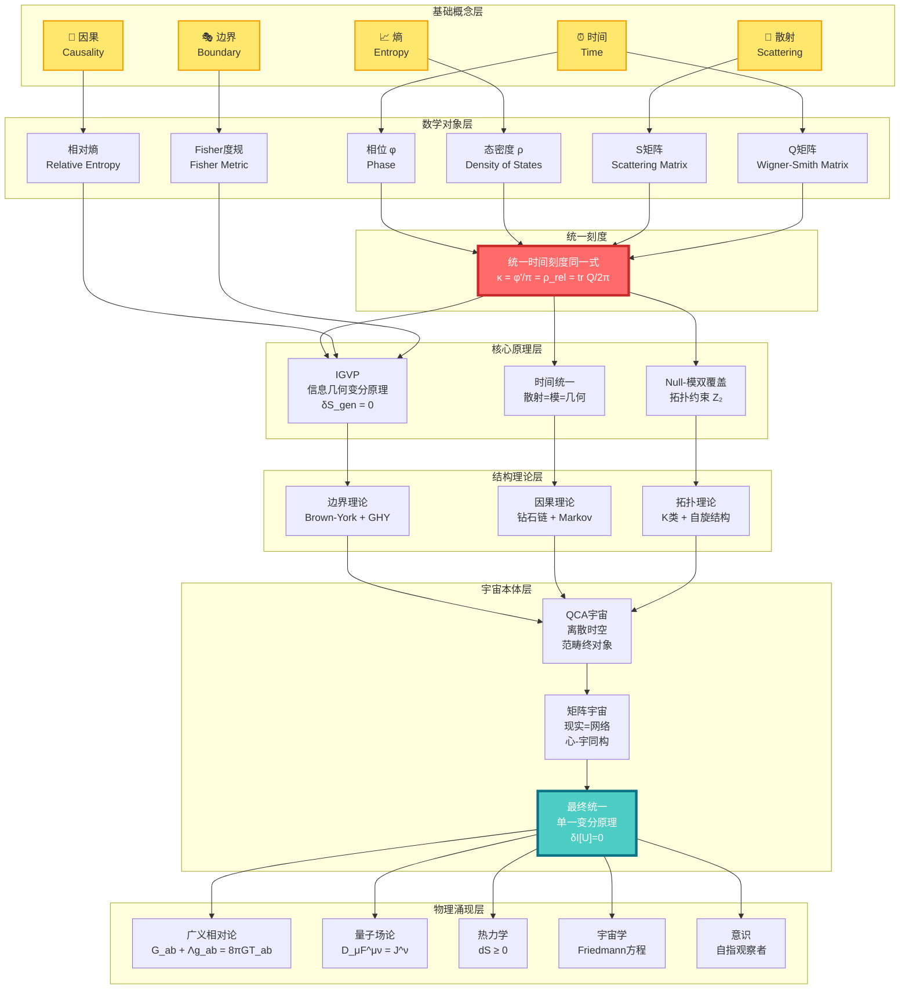

---

## 概念分层解读

### 第0层：基础概念（你已经熟悉的）

这一层是你日常经验中就能感受到的概念：

| 概念 | 日常理解 | 物理理解 | GLS理解 |
|------|----------|----------|---------|
| ⏰ **时间** | 钟表滴答，岁月流逝 | 相对论时空的一个维度 | 散射相位的导数，熵增的方向 |
| 🎯 **因果** | A导致B，多米诺骨牌 | 光锥结构，事件顺序 | 偏序关系，熵的单调性 |
| 🎭 **边界** | 容器的表面，国界线 | 区域的边缘，初边值问题 | 实在的本源，全息编码 |
| 🌊 **散射** | 回声，台球碰撞 | 粒子相互作用，S矩阵 | 幺正演化的本质，时间的来源 |
| 📈 **熵** | 房间的混乱度，不可逆 | 微观态数的对数 | 时间箭头，引力的源头 |

### 第1层：数学对象（概念的精确化）

这一层是将基础概念翻译成严格的数学语言：

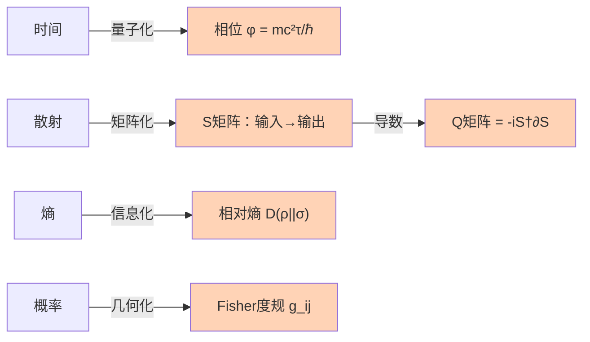

**关键数学对象**：

1. **相位** $\varphi$：量子态的"旋转角度"
   - 经典路径 → 作用量 $S$ → 相位 $\varphi = S/\hbar$

2. **S矩阵**（散射矩阵）：$S: \text{入态} \to \text{出态}$
   - 幺正性：$S^\dagger S = I$（概率守恒）
   - 相位：$\det S = e^{2i\varphi}$

3. **Q矩阵**（Wigner-Smith延迟矩阵）：

$$
Q(\omega) = -i S(\omega)^\dagger \frac{\partial S(\omega)}{\partial \omega}
$$

   - $\text{tr}\,Q$ = 总时间延迟

4. **相对熵**：

$$
D(\rho \| \sigma) = \text{tr}(\rho \ln \rho - \rho \ln \sigma)
$$

   - 度量两个态的"距离"
   - 总是非负，且单调递减

5. **Fisher-Rao度规**：

$$
g_{ij} = \mathbb{E}\left[\frac{\partial \ln p}{\partial \theta_i}\frac{\partial \ln p}{\partial \theta_j}\right]
$$

   - 概率空间的"距离"
   - 信息几何的核心

### 第2层：统一刻度（核心等式）

**这是整个理论的心脏**：

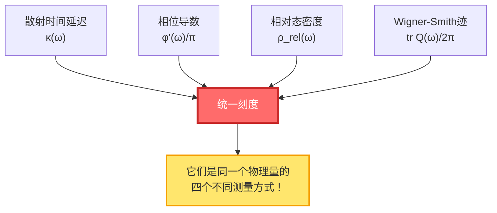

**统一时间刻度同一式**：

$$
\boxed{\kappa(\omega) = \frac{\varphi'(\omega)}{\pi} = \rho_{\text{rel}}(\omega) = \frac{1}{2\pi}\text{tr}\,Q(\omega)}
$$

**意义**：

- 你测量散射延迟 → 得到 $\kappa$
- 你计算相位变化率 → 得到 $\varphi'/\pi$
- 你数能级密度 → 得到 $\rho_{\text{rel}}$
- 你算Wigner-Smith矩阵 → 得到 $\text{tr}\,Q/2\pi$

**四个结果完全相同！** 这意味着它们本质上是同一个东西。

### 第3层：核心原理（理论基石）

三大支柱原理：

#### 3.1 IGVP（信息几何变分原理）

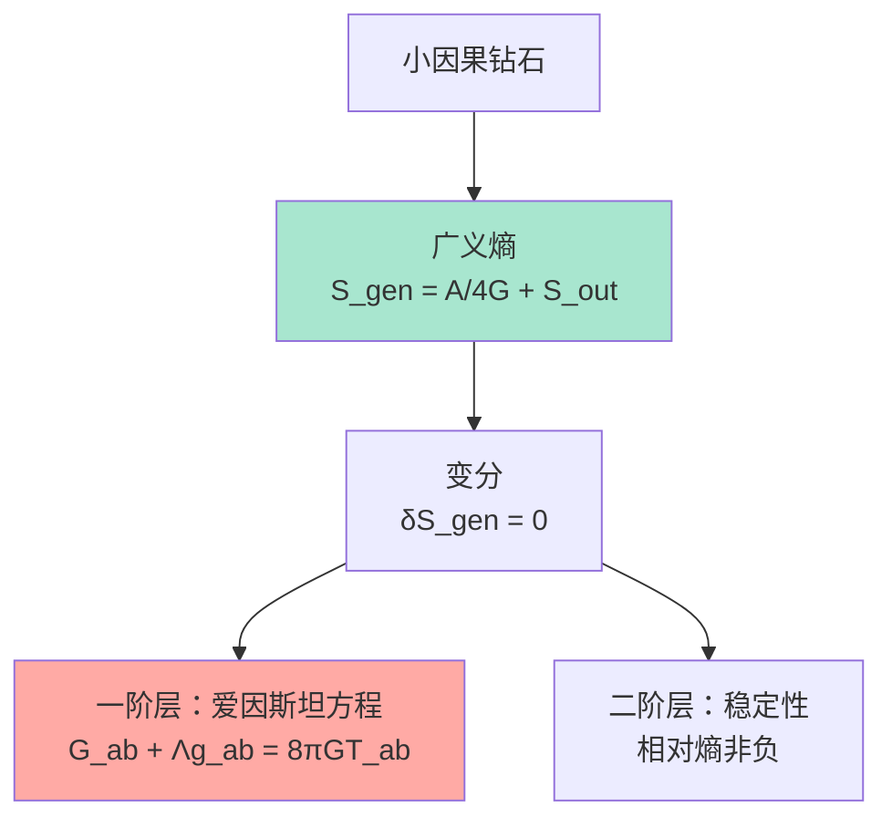

**核心思想**：

- 引力不是基本力，而是**熵极值的几何涌现**
- 就像肥皂泡自动形成球形（表面积最小），时空自动满足爱因斯坦方程（广义熵极值）

**广义熵**：

$$
S_{\text{gen}} = \underbrace{\frac{A}{4G\hbar}}_{\text{几何熵（面积）}} + \underbrace{S_{\text{out}}}_{\text{物质熵}}
$$

#### 3.2 时间统一（散射=模=几何）

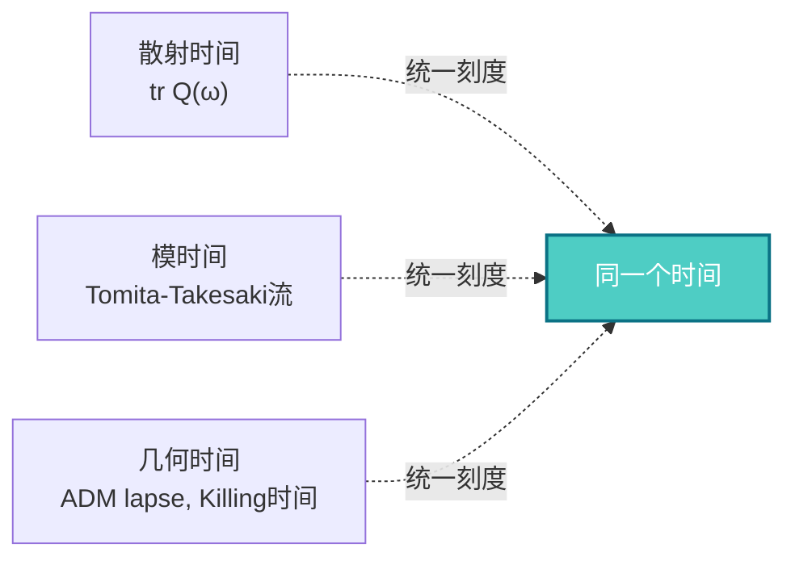

**核心思想**：

- 三种看似不同的"时间"，本质上是同一个时间的不同表现
- **散射时间**：粒子散射的延迟
- **模时间**：代数的内禀时间流
- **几何时间**：时空的坐标时间

#### 3.3 Null-模双覆盖（拓扑约束）

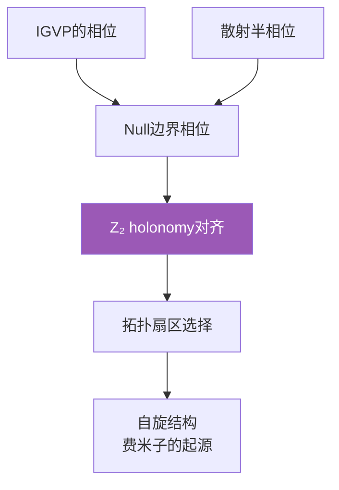

**核心思想**：

- 拓扑约束（$\mathbb{Z}_2$上同调）统一了IGVP和散射
- 费米子的存在，源于拓扑而非对称性

### 第4层：结构理论（如何实现）

三大理论框架：

#### 4.1 边界理论

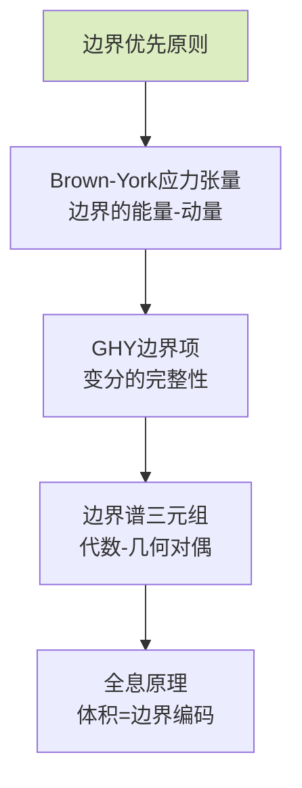

**核心思想**：

- 物理实在首先存在于**边界**上
- 体积中的物理是边界数据的**重构**
- 这解释了全息原理：3D引力 = 2D量子场论

#### 4.2 因果理论

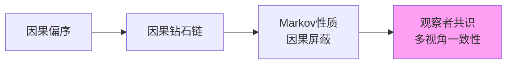

**核心思想**：

- 因果不是神秘的"力"，而是**偏序关系**
- 因果钻石是时空的"最小单元"
- Markov性：未来只依赖现在，不依赖过去的细节

#### 4.3 拓扑理论

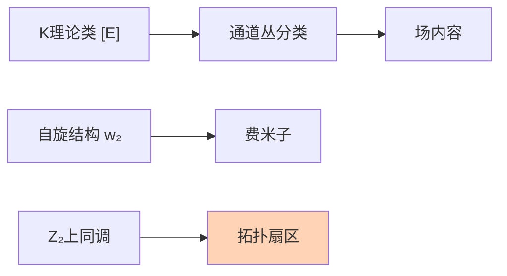

**核心思想**：

- 场的种类（玻色子、费米子）由**拓扑不变量**决定
- 不需要手工放入粒子，它们从拓扑中涌现

### 第5层：宇宙本体（终极图景）

#### 5.1 QCA宇宙（量子元胞自动机）

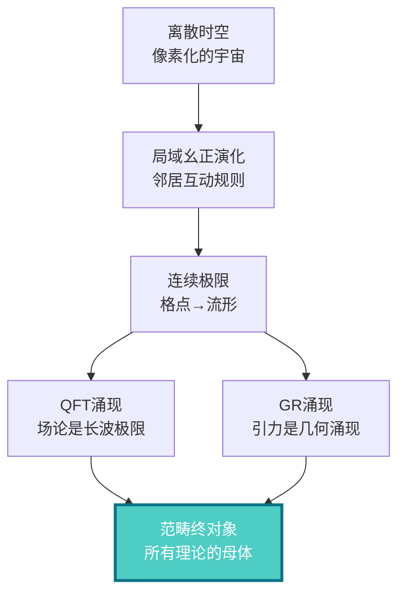

**核心思想**：

- 宇宙在最深层是**离散的**（像Game of Life）
- 连续的时空、场论、引力，都是离散规则的**涌现**
- QCA是所有物理理论的**范畴论终对象**（universal property）

#### 5.2 矩阵宇宙（现实的代数本质）

**核心思想**：

- 现实不是"物质"，而是**关系网络**
- "我"（观察者）与"宇宙"结构同构
- 主观（心）和客观（宇宙）是同一结构的两面

#### 5.3 最终统一（单一变分原理）

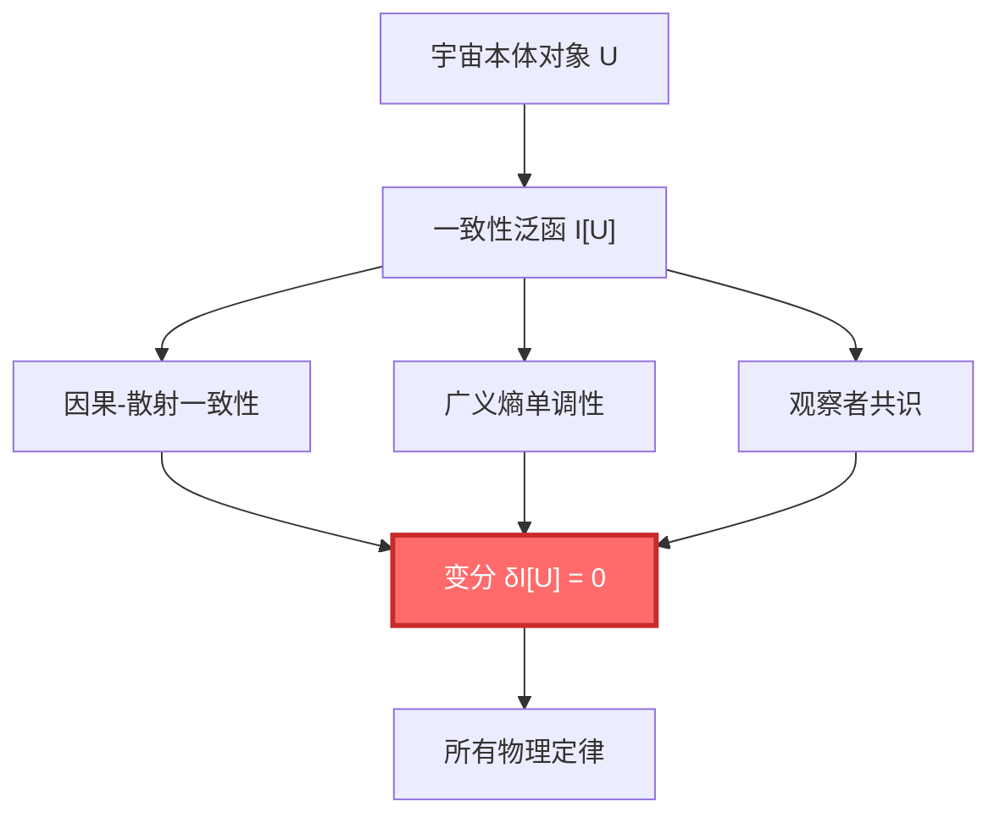

**核心思想**：

- 不需要分别假设不同的定律
- 只需要一个原理：**宇宙必须自洽**
- 所有物理定律（GR、QFT、热力学……）都是这个原理的必然结果

### 第6层：物理涌现（我们看到的世界）

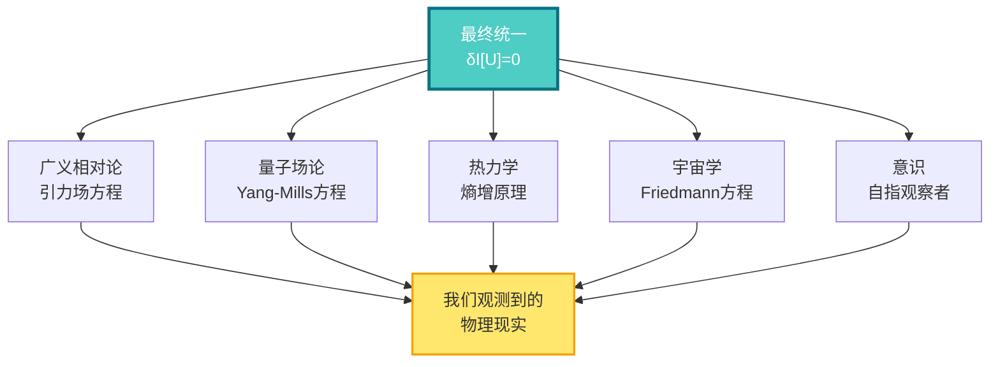

---

## 关键公式一览

### 统一时间刻度同一式（理论的心脏）

$$
\kappa(\omega) = \frac{\varphi'(\omega)}{\pi} = \rho_{\text{rel}}(\omega) = \frac{1}{2\pi}\text{tr}\,Q(\omega)
$$

### IGVP：从熵到爱因斯坦方程

$$
\delta S_{\text{gen}} = 0 \quad \Rightarrow \quad G_{ab} + \Lambda g_{ab} = 8\pi G T_{ab}
$$

### 最终统一：单一变分原理

$$
\delta \mathcal{I}[\mathfrak{U}] = 0 \quad \Rightarrow \quad \begin{cases}
G_{ab} + \Lambda g_{ab} = 8\pi G T_{ab} & \text{(引力)}\\
D_\mu F^{\mu\nu} = J^\nu & \text{(规范场)}\\
(i\gamma^\mu D_\mu - m)\psi = 0 & \text{(物质场)}\\
\partial_t \rho + \nabla \cdot (\rho v) = 0 & \text{(流体)}
\end{cases}
$$

### 广义熵

$$
S_{\text{gen}} = \frac{A}{4G\hbar} + S_{\text{out}}
$$

### Birman-Kreĭn公式

$$
\det S(\omega) = \exp\left(-2\pi i \xi(\omega)\right)
$$

其中 $\xi(\omega)$ 是谱移函数，$\rho_{\text{rel}} = -\xi'$

---

## 核心概念速查表

| 概念 | 符号 | 物理意义 | 数学定义 | 相关篇章 |
|------|------|----------|----------|----------|
| 时间 | $t, \tau$ | 演化的参数 | 依赖于刻度 | [统一时间](../05-unified-time/) |
| 相位 | $\varphi$ | 量子旋转角度 | $S/\hbar$ | [数学工具](../03-mathematical-tools/) |
| S矩阵 | $S(\omega)$ | 散射幅度 | 幺正矩阵 | [散射理论](../03-mathematical-tools/02-scattering-matrix.md) |
| Q矩阵 | $Q(\omega)$ | 时间延迟矩阵 | $-iS^\dagger \partial_\omega S$ | [Wigner-Smith延迟](../03-mathematical-tools/03-wigner-smith-delay.md) |
| 态密度 | $\rho(\omega)$ | 能级密度 | $\text{tr}\,\delta(\omega - H)$ | [谱理论](../03-mathematical-tools/01-spectral-theory-intro.md) |
| 谱移 | $\xi(\omega)$ | 相互作用的累积相移 | $\frac{1}{2\pi i}\ln\det S$ | [Birman-Kreĭn](../03-mathematical-tools/04-birman-krein-formula.md) |
| 相对熵 | $D(\rho\|\sigma)$ | 态的距离 | $\text{tr}(\rho\ln\rho - \rho\ln\sigma)$ | [相对熵](../03-mathematical-tools/06-relative-entropy.md) |
| Fisher度规 | $g_{ij}$ | 信息几何的度规 | $\mathbb{E}[\partial_i\ln p\,\partial_j\ln p]$ | [Fisher度规](../03-mathematical-tools/05-fisher-rao-metric.md) |
| 广义熵 | $S_{\text{gen}}$ | 几何+物质熵 | $A/4G + S_{\text{out}}$ | [IGVP](../04-igvp-framework/) |
| 因果钻石 | $\mathcal{D}$ | 时空的最小单元 | $J^+(p) \cap J^-(q)$ | [因果钻石](../04-igvp-framework/02-causal-diamond.md) |
| 观察者 | $\mathcal{O}$ | 测量装置/意识 | 自指散射网络 | [矩阵宇宙](../10-matrix-universe/) |

---

## 理论的逻辑流程图

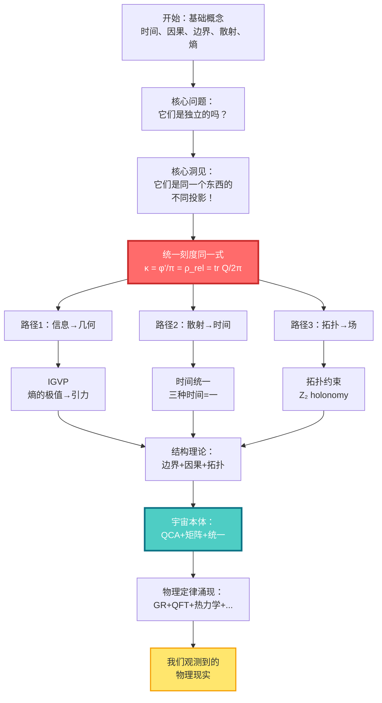

---

## 如何使用这个概念地图？

### 🎯 第一次阅读

- **目标**：建立整体印象
- **方法**：
  1. 从上到下浏览每一层
  2. 不需要理解所有细节
  3. 注意概念之间的**箭头**（依赖关系）
  4. 标记你感兴趣的概念

### 🎯 学习过程中

- **目标**：定位当前内容在整体中的位置
- **方法**：
  1. 读一篇文章前，先找到它在概念图中的位置
  2. 看看它依赖哪些前置概念
  3. 看看它会被哪些后续内容使用
  4. 这帮助你理解"为什么要学这个"

### 🎯 复习时

- **目标**：检验理解的完整性
- **方法**：
  1. 闭上眼睛，尝试凭记忆画出概念图
  2. 对每个概念，问自己：
     - 它的物理意义是什么？
     - 它和其他概念有什么关系？
     - 它在理论中扮演什么角色？
  3. 打开图对照，补充遗漏

---

## 概念之间的关键联系

### 🔗 时间 ↔ 散射

- 时间不是外部参数，而是**散射过程的涌现性质**
- Wigner-Smith延迟矩阵 $Q$ 的迹，就是时间延迟
- 相位 $\varphi$ 的变化率，就是能量（$E = \hbar\omega$）

### 🔗 因果 ↔ 熵

- 因果偏序 $\Leftrightarrow$ 熵的单调性
- "A在B之前" $\Leftrightarrow$ $S(A) \leq S(B)$
- 时间箭头 = 熵增方向

### 🔗 边界 ↔ 体积

- 边界数据决定体积物理（全息原理）
- 黑洞熵 $\propto$ 面积，而非体积
- Brown-York应力张量定义在边界上

### 🔗 信息 ↔ 几何

- Fisher度规 = 概率空间的度规
- 相对熵 = 态空间的"距离"
- 通过解析延拓 → 洛伦兹度规

### 🔗 拓扑 ↔ 粒子

- $\mathbb{Z}_2$ 上同调 → 自旋结构 → 费米子
- K理论类 → 通道丛 → 规范场
- 拓扑不变量决定场内容

---

## 不同视角的同一理论

GLS理论就像一座山，从不同方向看，风景不同：

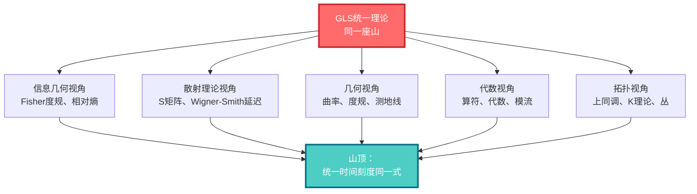

---

## 接下来做什么？

你已经鸟瞰了整个理论的概念网络。现在：

### 📚 开始学习之旅

根据你的兴趣和背景，选择一个入口：

- **完全新手** → [基础概念篇](../01-foundation/)
  - 从时间、因果、边界开始，建立直觉

- **有物理背景** → [核心思想篇](../02-core-ideas/)
  - 直达五者合一的统一刻度

- **想看数学** → [数学工具篇](../03-mathematical-tools/)
  - 理解散射、谱理论、信息几何

- **想看大图景** → [最终统一篇](../11-final-unification/)
  - 看单一变分原理如何导出所有定律

### 📖 保存这个概念图

建议你：

1. **打印或保存**这个概念图
2. 在学习过程中**反复回顾**
3. **标注**你已经理解的概念
4. **连线**你发现的新联系

这会帮助你建立完整的知识网络，而不是孤立的知识点。

---

**记住：理解这个理论，不是记住每个公式，而是看到它们之间的联系。概念图帮助你看到整体，避免迷失在细节中。**

[← 上一篇：阅读指南](01-reading-guide.md) | [返回主页](../index.md) | [开始学习 →](../01-foundation/)
