# Concept Map: Overview of Core Concepts

> "A picture is worth a thousand words. Let's visualize the conceptual network of the entire theory."

[← Previous: Reading Guide](01-reading-guide_en.md) | [Back to Home](../index_en.md)

---

## Core Conceptual Relationship Network

```mermaid
graph TB
    subgraph "Fundamental Concept Layer"
        Time["⏰ Time<br/>Time"]
        Cause["🎯 Causality<br/>Causality"]
        Bound["🎭 Boundary<br/>Boundary"]
        Scatter["🌊 Scattering<br/>Scattering"]
        Entropy["📈 Entropy<br/>Entropy"]
    end

    subgraph "Mathematical Object Layer"
        Phase["Phase φ<br/>Phase"]
        StateD["Density of States ρ<br/>Density of States"]
        SMatrix["S-Matrix<br/>Scattering Matrix"]
        QMatrix["Q-Matrix<br/>Wigner-Smith Matrix"]
        RelEnt["Relative Entropy<br/>Relative Entropy"]
        Fisher["Fisher Metric<br/>Fisher Metric"]
    end

    subgraph "Unified Scale"
        Unity["Unified Time Scale Identity<br/>κ = φ'/π = ρ_rel = tr Q/2π"]
    end

    subgraph "Core Principle Layer"
        IGVP["IGVP<br/>Information Geometry Variational Principle<br/>δS_gen = 0"]
        TimeUnif["Time Unification<br/>Scattering=Modular=Geometry"]
        NullMod["Null-Modular Double Cover<br/>Topological Constraint Z₂"]
    end

    subgraph "Structure Theory Layer"
        BoundaryT["Boundary Theory<br/>Brown-York + GHY"]
        CausalT["Causal Theory<br/>Diamond Chain + Markov"]
        TopoT["Topological Theory<br/>K-Class + Spin Structure"]
    end

    subgraph "Cosmic Ontology Layer"
        QCA["QCA Universe<br/>Discrete Spacetime<br/>Terminal Object in Category"]
        Matrix["Matrix Universe<br/>Reality=Network<br/>Heart-Universe Isomorphism"]
        FinalU["Final Unification<br/>Single Variational Principle<br/>δI[U]=0"]
    end

    subgraph "Physical Emergence Layer"
        GR["General Relativity<br/>G_ab + Λg_ab = 8πGT_ab"]
        QFT["Quantum Field Theory<br/>D_μF^μν = J^ν"]
        Thermo["Thermodynamics<br/>dS ≥ 0"]
        Cosmo["Cosmology<br/>Friedmann Equations"]
        Conscious["Consciousness<br/>Self-Referential Observer"]
    end

    Time --> Phase
    Time --> QMatrix
    Cause --> RelEnt
    Bound --> Fisher
    Scatter --> SMatrix
    Entropy --> StateD

    Phase --> Unity
    StateD --> Unity
    SMatrix --> Unity
    QMatrix --> Unity

    Unity --> IGVP
    Unity --> TimeUnif
    Unity --> NullMod

    IGVP --> BoundaryT
    TimeUnif --> CausalT
    NullMod --> TopoT

    BoundaryT --> QCA
    CausalT --> QCA
    TopoT --> QCA

    QCA --> Matrix
    Matrix --> FinalU

    FinalU --> GR
    FinalU --> QFT
    FinalU --> Thermo
    FinalU --> Cosmo
    FinalU --> Conscious

    RelEnt --> IGVP
    Fisher --> IGVP

    style Unity fill:#ff6b6b,stroke:#c92a2a,stroke-width:4px,color:#fff
    style FinalU fill:#4ecdc4,stroke:#0b7285,stroke-width:4px,color:#fff
    style Time fill:#ffe66d,stroke:#f59f00,stroke-width:2px
    style Cause fill:#ffe66d,stroke:#f59f00,stroke-width:2px
    style Bound fill:#ffe66d,stroke:#f59f00,stroke-width:2px
    style Scatter fill:#ffe66d,stroke:#f59f00,stroke-width:2px
    style Entropy fill:#ffe66d,stroke:#f59f00,stroke-width:2px
```

---

## Layered Interpretation of Concepts

### Layer 0: Fundamental Concepts (You Already Know)

This layer contains concepts you can feel in everyday experience:

| Concept | Everyday Understanding | Physical Understanding | GLS Understanding |
|---------|----------------------|----------------------|------------------|
| ⏰ **Time** | Clock ticking, years passing | A dimension of relativistic spacetime | Derivative of scattering phase, direction of entropy increase |
| 🎯 **Causality** | A causes B, dominoes | Light cone structure, event order | Partial order relation, monotonicity of entropy |
| 🎭 **Boundary** | Container surface, border | Edge of region, initial-boundary value problem | Source of reality, holographic encoding |
| 🌊 **Scattering** | Echo, billiard collision | Particle interactions, S-matrix | Essence of unitary evolution, source of time |
| 📈 **Entropy** | Room disorder, irreversibility | Logarithm of number of microstates | Time arrow, source of gravity |

### Layer 1: Mathematical Objects (Precision of Concepts)

This layer translates fundamental concepts into rigorous mathematical language:

```mermaid
graph LR
    A["Time"] -->|quantization| B["Phase φ = mc²τ/ℏ"]
    C["Scattering"] -->|matrixization| D["S-Matrix: Input→Output"]
    D -->|derivative| E["Q-Matrix = -iS†∂S"]
    F["Entropy"] -->|informationization| G["Relative Entropy D(ρ||σ)"]
    H["Probability"] -->|geometrization| I["Fisher Metric g_ij"]

    style B fill:#ffd3b6
    style D fill:#ffd3b6
    style E fill:#ffd3b6
    style G fill:#ffd3b6
    style I fill:#ffd3b6
```

**Key Mathematical Objects**:

1. **Phase** $\varphi$: "Rotation angle" of quantum state
   - Classical path → Action $S$ → Phase $\varphi = S/\hbar$

2. **S-Matrix** (Scattering Matrix): $S: \text{in-state} \to \text{out-state}$
   - Unitarity: $S^\dagger S = I$ (probability conservation)
   - Phase: $\det S = e^{2i\varphi}$

3. **Q-Matrix** (Wigner-Smith Delay Matrix):

$$
Q(\omega) = -i S(\omega)^\dagger \frac{\partial S(\omega)}{\partial \omega}
$$

   - $\text{tr}\,Q$ = Total time delay

4. **Relative Entropy**:

$$
D(\rho \| \sigma) = \text{tr}(\rho \ln \rho - \rho \ln \sigma)
$$

   - Measures "distance" between two states
   - Always non-negative and monotonically decreasing

5. **Fisher-Rao Metric**:

$$
g_{ij} = \mathbb{E}\left[\frac{\partial \ln p}{\partial \theta_i}\frac{\partial \ln p}{\partial \theta_j}\right]
$$

   - "Distance" in probability space
   - Core of information geometry

### Layer 2: Unified Scale (Core Equation)

**This is the heart of the entire theory**:

**Unified Time Scale Identity**:

$$
\boxed{\kappa(\omega) = \frac{\varphi'(\omega)}{\pi} = \rho_{\text{rel}}(\omega) = \frac{1}{2\pi}\text{tr}\,Q(\omega)}
$$

**Meaning**:

- You measure scattering delay → get $\kappa$
- You calculate phase change rate → get $\varphi'/\pi$
- You count energy level density → get $\rho_{\text{rel}}$
- You compute Wigner-Smith matrix → get $\text{tr}\,Q/2\pi$

**All four results are identical!** This means they are essentially the same thing.

### Layer 3: Core Principles (Theoretical Foundations)

Three pillar principles:

#### 3.1 IGVP (Information Geometry Variational Principle)

```mermaid
graph TB
    A["Small Causal Diamond"] --> B["Generalized Entropy<br/>S_gen = A/4G + S_out"]
    B --> C["Variation<br/>δS_gen = 0"]
    C --> D["First Order: Einstein Equations<br/>G_ab + Λg_ab = 8πGT_ab"]
    C --> E["Second Order: Stability<br/>Relative Entropy Non-Negative"]

    style B fill:#a8e6cf
    style D fill:#ffaaa5
```

**Core Idea**:

- Gravity is not a fundamental force, but **geometric emergence of entropy extremum**
- Just as soap bubbles automatically form spheres (minimum surface area), spacetime automatically satisfies Einstein's equations (generalized entropy extremum)

**Generalized Entropy**:

$$
S_{\text{gen}} = \underbrace{\frac{A}{4G\hbar}}_{\text{geometric entropy (area)}} + \underbrace{S_{\text{out}}}_{\text{matter entropy}}
$$

#### 3.2 Time Unification (Scattering=Modular=Geometry)

```mermaid
graph LR
    A["Scattering Time<br/>tr Q(ω)"] -.unified scale.-> D["Same Time"]
    B["Modular Time<br/>Tomita-Takesaki Flow"] -.unified scale.-> D
    C["Geometric Time<br/>ADM lapse, Killing Time"] -.unified scale.-> D

    style D fill:#4ecdc4,stroke:#0b7285,stroke-width:2px,color:#fff
```

**Core Idea**:

- Three seemingly different "times" are essentially different manifestations of the same time
- **Scattering Time**: Delay of particle scattering
- **Modular Time**: Intrinsic time flow of algebra
- **Geometric Time**: Coordinate time of spacetime

#### 3.3 Null-Modular Double Cover (Topological Constraints)

```mermaid
graph TD
    A["IGVP Phase"] --> B["Null Boundary Phase"]
    C["Scattering Half-Phase"] --> B
    B --> D["Z₂ Holonomy Alignment"]
    D --> E["Topological Sector Selection"]
    E --> F["Spin Structure<br/>Origin of Fermions"]

    style D fill:#9b59b6,color:#fff
```

**Core Idea**:

- Topological constraints ($\mathbb{Z}_2$ cohomology) unify IGVP and scattering
- Existence of fermions originates from topology, not symmetry

### Layer 4: Structure Theories (How to Realize)

Three theoretical frameworks:

#### 4.1 Boundary Theory

**Core Idea**:

- Physical reality first exists on the **boundary**
- Physics in volume is **reconstruction** of boundary data
- This explains holographic principle: 3D gravity = 2D quantum field theory

#### 4.2 Causal Theory

**Core Idea**:

- Causality is not a mysterious "force," but **partial order relation**
- Causal diamonds are "minimal units" of spacetime
- Markov property: Future depends only on present, not on details of past

#### 4.3 Topological Theory

```mermaid
graph LR
    A["K-Theory Class [E]"] --> B["Channel Bundle Classification"]
    B --> C["Field Content"]
    D["Spin Structure w₂"] --> E["Fermions"]
    F["Z₂ Cohomology"] --> G["Topological Sector"]

    style G fill:#ffd3b6
```

**Core Idea**:

- Types of fields (bosons, fermions) are determined by **topological invariants**
- No need to manually insert particles, they emerge from topology

### Layer 5: Cosmic Ontology (Ultimate Picture)

#### 5.1 QCA Universe (Quantum Cellular Automaton)

```mermaid
graph TD
    A["Discrete Spacetime<br/>Pixelated Universe"] --> B["Local Unitary Evolution<br/>Neighbor Interaction Rules"]
    B --> C["Continuous Limit<br/>Lattice→Manifold"]
    C --> D["QFT Emergence<br/>Field Theory is Long-Wave Limit"]
    C --> E["GR Emergence<br/>Gravity is Geometric Emergence"]
    D --> F["Terminal Object in Category<br/>Parent of All Theories"]
    E --> F

    style F fill:#4ecdc4,stroke:#0b7285,stroke-width:3px,color:#fff
```

**Core Idea**:

- Universe at deepest level is **discrete** (like Game of Life)
- Continuous spacetime, field theory, gravity are all **emergence** of discrete rules
- QCA is the **terminal object in category theory** (universal property) of all physical theories

#### 5.2 Matrix Universe (Algebraic Nature of Reality)

**Core Idea**:

- Reality is not "matter," but **relation network**
- "I" (observer) is structurally isomorphic to "universe"
- Subjective (heart) and objective (universe) are two sides of the same structure

#### 5.3 Final Unification (Single Variational Principle)

```mermaid
graph TD
    A["Cosmic Ontology Object U"] --> B["Consistency Functional I[U]"]
    B --> C["Causal-Scattering Consistency"]
    B --> D["Generalized Entropy Monotonicity"]
    B --> E["Observer Consensus"]
    C --> F["Variation δI[U] = 0"]
    D --> F
    E --> F
    F --> G["All Physical Laws"]

    style F fill:#ff6b6b,stroke:#c92a2a,stroke-width:3px,color:#fff
```

**Core Idea**:

- No need to separately assume different laws
- Only one principle needed: **Universe must be self-consistent**
- All physical laws (GR, QFT, thermodynamics...) are necessary consequences of this principle

### Layer 6: Physical Emergence (The World We See)

---

## Key Formulas Overview

### Unified Time Scale Identity (Heart of the Theory)

$$
\kappa(\omega) = \frac{\varphi'(\omega)}{\pi} = \rho_{\text{rel}}(\omega) = \frac{1}{2\pi}\text{tr}\,Q(\omega)
$$

### IGVP: From Entropy to Einstein Equations

$$
\delta S_{\text{gen}} = 0 \quad \Rightarrow \quad G_{ab} + \Lambda g_{ab} = 8\pi G T_{ab}
$$

### Final Unification: Single Variational Principle

$$
\delta \mathcal{I}[\mathfrak{U}] = 0 \quad \Rightarrow \quad \begin{cases}
G_{ab} + \Lambda g_{ab} = 8\pi G T_{ab} & \text{(Gravity)}\\
D_\mu F^{\mu\nu} = J^\nu & \text{(Gauge Field)}\\
(i\gamma^\mu D_\mu - m)\psi = 0 & \text{(Matter Field)}\\
\partial_t \rho + \nabla \cdot (\rho v) = 0 & \text{(Fluid)}
\end{cases}
$$

### Generalized Entropy

$$
S_{\text{gen}} = \frac{A}{4G\hbar} + S_{\text{out}}
$$

### Birman-Kreĭn Formula

$$
\det S(\omega) = \exp\left(-2\pi i \xi(\omega)\right)
$$

where $\xi(\omega)$ is the spectral shift function, $\rho_{\text{rel}} = -\xi'$

---

## Core Concept Quick Reference Table

| Concept | Symbol | Physical Meaning | Mathematical Definition | Related Chapters |
|---------|--------|------------------|-------------------------|------------------|
| Time | $t, \tau$ | Evolution parameter | Depends on scale | [Unified Time](../05-unified-time/00-time-overview_en.md) |
| Phase | $\varphi$ | Quantum rotation angle | $S/\hbar$ | [Mathematical Tools](../03-mathematical-tools/00-tools-overview_en.md) |
| S-Matrix | $S(\omega)$ | Scattering amplitude | Unitary matrix | [Scattering Theory](../03-mathematical-tools/03-scattering-theory_en.md) |
| Q-Matrix | $Q(\omega)$ | Time delay matrix | $-iS^\dagger \partial_\omega S$ | [Wigner-Smith Delay](../03-mathematical-tools/03-scattering-theory_en.md) |
| Density of States | $\rho(\omega)$ | Energy level density | $\text{tr}\,\delta(\omega - H)$ | [Spectral Theory](../03-mathematical-tools/01-spectral-theory_en.md) |
| Spectral Shift | $\xi(\omega)$ | Cumulative phase shift of interactions | $-\frac{1}{2\pi i}\ln\det S$ | [Birman-Kreĭn](../03-mathematical-tools/03-scattering-theory_en.md) |
| Relative Entropy | $D(\rho\|\sigma)$ | Distance between states | $\text{tr}(\rho\ln\rho - \rho\ln\sigma)$ | [Relative Entropy](../03-mathematical-tools/05-information-geometry_en.md) |
| Fisher Metric | $g_{ij}$ | Metric of information geometry | $\mathbb{E}[\partial_i\ln p\,\partial_j\ln p]$ | [Fisher Metric](../03-mathematical-tools/05-information-geometry_en.md) |
| Generalized Entropy | $S_{\text{gen}}$ | Geometric + matter entropy | $A/4G + S_{\text{out}}$ | [IGVP](../04-igvp-framework/00-igvp-overview_en.md) |
| Causal Diamond | $\mathcal{D}$ | Minimal unit of spacetime | $J^+(p) \cap J^-(q)$ | [Causal Diamond](../04-igvp-framework/02-causal-diamond_en.md) |
| Observer | $\mathcal{O}$ | Measurement device/consciousness | Self-referential scattering network | [Matrix Universe](../10-matrix-universe/00-intro_en.md) |

---

## Logical Flow Diagram of the Theory

```mermaid
graph TD
    Start["Start: Fundamental Concepts<br/>Time, Causality, Boundary, Scattering, Entropy"] --> Question["Core Question:<br/>Are They Independent?"]

    Question --> Insight["Core Insight:<br/>They Are Different Projections<br/>of the Same Thing!"]

    Insight --> Identity["Unified Scale Identity<br/>κ = φ'/π = ρ_rel = tr Q/2π"]

    Identity --> Branch1["Path 1: Information→Geometry"]
    Identity --> Branch2["Path 2: Scattering→Time"]
    Identity --> Branch3["Path 3: Topology→Field"]

    Branch1 --> IGVP["IGVP<br/>Entropy Extremum→Gravity"]
    Branch2 --> TimeU["Time Unification<br/>Three Times=One"]
    Branch3 --> Topo["Topological Constraints<br/>Z₂ Holonomy"]

    IGVP --> Structure["Structure Theories:<br/>Boundary+Causality+Topology"]
    TimeU --> Structure
    Topo --> Structure

    Structure --> Ontology["Cosmic Ontology:<br/>QCA+Matrix+Unification"]

    Ontology --> Laws["Physical Laws Emerge:<br/>GR+QFT+Thermodynamics+..."]

    Laws --> End["Physical Reality<br/>We Observe"]

    style Identity fill:#ff6b6b,stroke:#c92a2a,stroke-width:3px,color:#fff
    style Ontology fill:#4ecdc4,stroke:#0b7285,stroke-width:3px,color:#fff
    style End fill:#ffe66d,stroke:#f59f00,stroke-width:2px
```

---

## How to Use This Concept Map?

### 🎯 First Reading

- **Goal**: Build overall impression
- **Method**:
  1. Browse each layer from top to bottom
  2. Don't need to understand all details
  3. Pay attention to **arrows** between concepts (dependencies)
  4. Mark concepts you're interested in

### 🎯 During Learning

- **Goal**: Locate current content's position in the whole
- **Method**:
  1. Before reading an article, find its position in the concept map
  2. See which prerequisite concepts it depends on
  3. See which subsequent content will use it
  4. This helps you understand "why learn this"

### 🎯 When Reviewing

- **Goal**: Test completeness of understanding
- **Method**:
  1. Close your eyes, try to draw the concept map from memory
  2. For each concept, ask yourself:
     - What is its physical meaning?
     - How does it relate to other concepts?
     - What role does it play in the theory?
  3. Open the map and compare, fill in omissions

---

## Key Connections Between Concepts

### 🔗 Time ↔ Scattering

- Time is not an external parameter, but an **emergent property of scattering processes**
- Trace of Wigner-Smith delay matrix $Q$ is time delay
- Rate of change of phase $\varphi$ is energy ($E = \hbar\omega$)

### 🔗 Causality ↔ Entropy

- Causal partial order $\Leftrightarrow$ Monotonicity of entropy
- "A before B" $\Leftrightarrow$ $S(A) \leq S(B)$
- Time arrow = Direction of entropy increase

### 🔗 Boundary ↔ Volume

- Boundary data determines volume physics (holographic principle)
- Black hole entropy $\propto$ area, not volume
- Brown-York stress tensor defined on boundary

### 🔗 Information ↔ Geometry

- Fisher metric = Metric of probability space
- Relative entropy = "Distance" in state space
- Through analytic continuation → Lorentz metric

### 🔗 Topology ↔ Particles

- $\mathbb{Z}_2$ cohomology → Spin structure → Fermions
- K-theory classes → Channel bundles → Gauge fields
- Topological invariants determine field content

---

## Same Theory from Different Perspectives

GLS theory is like a mountain—viewed from different directions, the scenery differs:

---

## What's Next?

You've already seen a bird's eye view of the conceptual network of the entire theory. Now:

### 📚 Begin Your Learning Journey

Based on your interests and background, choose an entry point:

- **Complete Beginner** → [Fundamental Concepts](../01-foundation/01-what-is-time_en.md)
  - Start from time, causality, boundary, build intuition

- **Have Physics Background** → [Core Ideas](../02-core-ideas/01-time-is-geometry_en.md)
  - Go straight to unified scale of unity of five

- **Want to See Mathematics** → [Mathematical Tools](../03-mathematical-tools/00-tools-overview_en.md)
  - Understand scattering, spectral theory, information geometry

- **Want to See Big Picture** → [Final Unification](../11-final-unification/00-intro_en.md)
  - See how single variational principle derives all laws

### 📖 Save This Concept Map

We suggest you:

1. **Print or save** this concept map
2. **Review repeatedly** during learning
3. **Mark** concepts you've understood
4. **Connect** new relationships you discover

This will help you build a complete knowledge network, not isolated knowledge points.

---

**Remember: Understanding this theory is not about memorizing each formula, but seeing the connections between them. The concept map helps you see the whole, avoiding getting lost in details.**

[← Previous: Reading Guide](01-reading-guide_en.md) | [Back to Home](../index_en.md) | [Start Learning →](../01-foundation/01-what-is-time_en.md)

