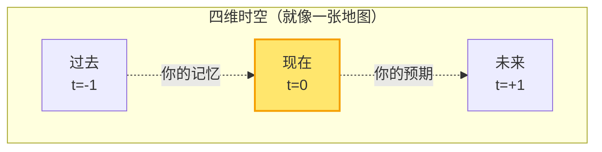
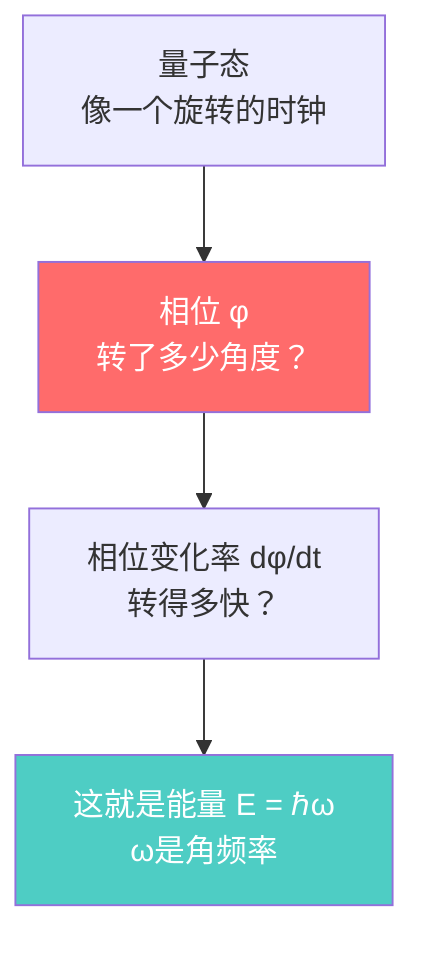
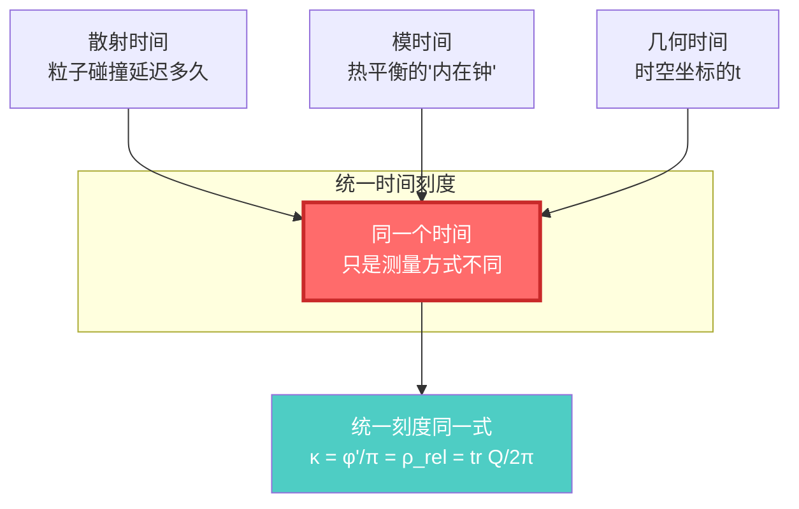
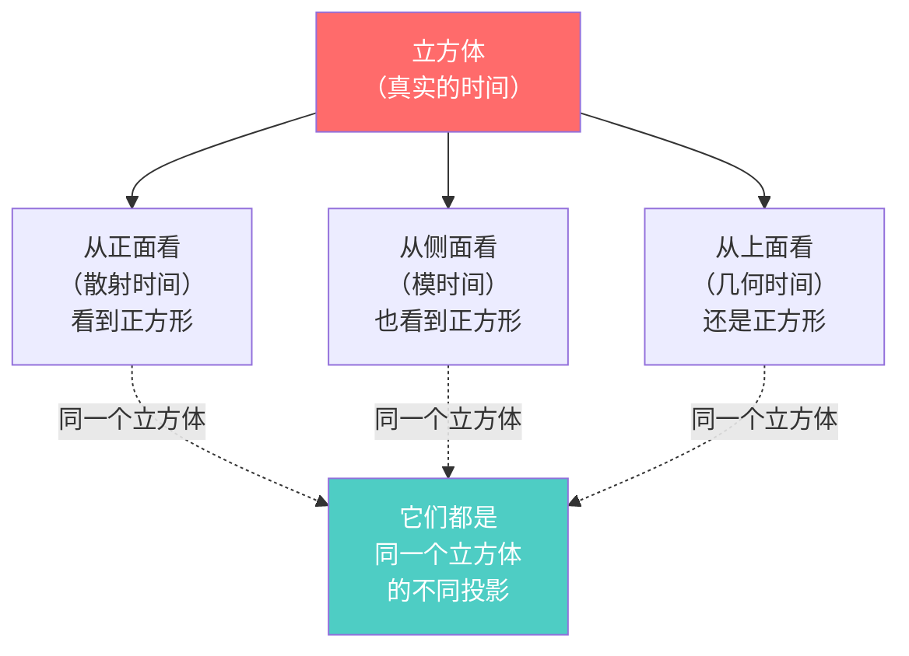
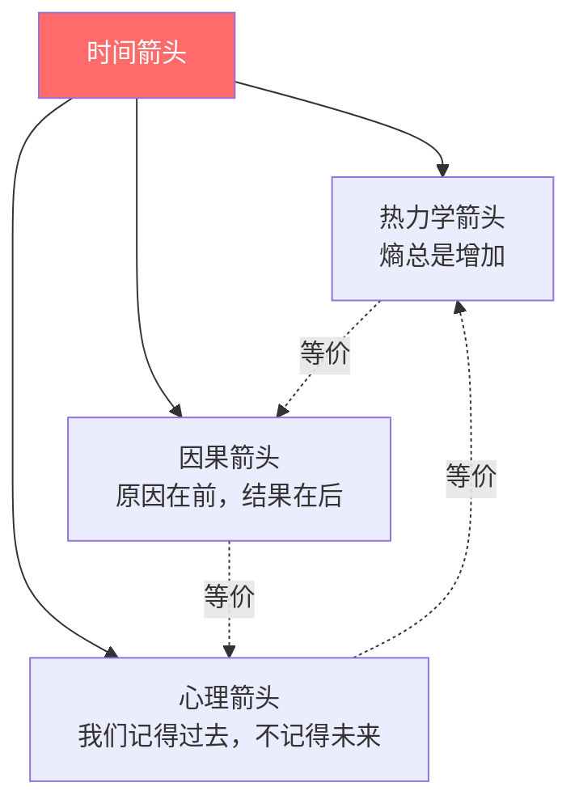
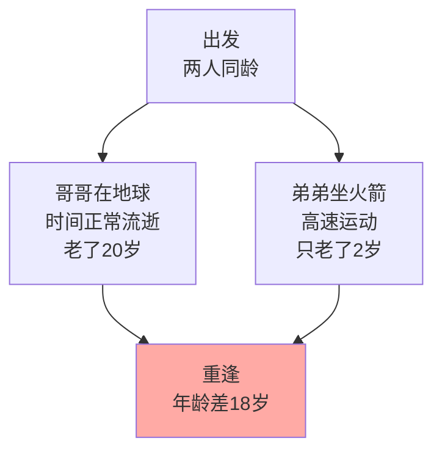
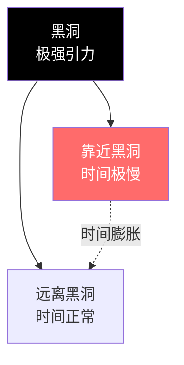

# 时间是什么？

> "时间是宇宙最大的谜团。我们每个人都活在时间中，却很少有人真正理解它。"

[← 返回主页](../index.md) | [下一篇：因果是什么 →](02-what-is-causality.md)

---

## 从钟表开始

想象你手腕上的表。秒针滴答滴答地走，一秒、两秒、三秒……

这个"滴答"是什么？它在测量什么？

### 🕰️ 机械钟的原理

打开一个老式机械钟表，你会看到：

**核心部件是摆轮**：一个小轮子来回摆动，周期非常稳定。

- 每摆动一次 → 齿轮转一格
- 齿轮转动 → 指针移动
- 指针移动 → 我们说"时间流逝了"

> 💡 **关键洞见**：时间的"流逝"，本质上是**周期性振动的计数**！

### ⚛️ 原子钟：更精确的"滴答"

现代最精确的钟是原子钟。它的原理是：

1. 铯原子在两个能级之间跃迁
2. 吸收或发射特定频率的电磁波
3. 频率极其稳定：$\nu = 9,192,631,770$ Hz（每秒）
4. 计数这个振荡，定义"秒"

> 📌 **比喻**：如果机械钟的摆轮是钟摆，那么原子钟就是用原子这个"超级精确的钟摆"来计时。

但问题来了：**为什么振动的计数就是"时间"？**

---

## 两种时间观：流动 vs 几何

### 观点1：时间是流动的河流（日常直觉）

我们的直觉告诉我们：

- 时间像河流一样"流动"
- 过去已经流走了，无法返回
- 未来还没到来
- 只有"现在"是真实的

这是**A理论**（A-theory）：时间有绝对的"现在"，时间真的在流动。

### 观点2：时间是几何的维度（物理学）

爱因斯坦的相对论告诉我们另一个图景：

- 时间是四维时空的一个维度
- 过去、现在、未来都同样"存在"
- "流动"是幻觉，是我们意识的一种感受
- 时间更像是**空间的一个方向**

这是**B理论**（B-theory）：时间不流动，所有时刻都同样存在，就像地图上所有地点都存在一样。

> ⚠️ **常见误解**：很多人认为相对论说"时间可以倒流"。错！相对论说时间是相对的（速度快的人时间慢），但时间仍然有方向（熵增）。

---

## GLS理论的时间观：三合一

GLS统一理论提供了第三种视角，融合了上述两种观点。

### 核心洞见：时间 = 相位的变化

在量子力学中，任何物体都有一个"相位" $\varphi$，就像一个不断旋转的指针：

**关键公式**（不用害怕，我们会解释）：

$$
\varphi = \frac{mc^2}{\hbar} \int d\tau
$$

翻译成人话：

- $\tau$ = 本征时间（物体自己的"手表"走过的时间）
- $\varphi$ = 量子相位（波函数的"旋转角度"）
- $mc^2/\hbar$ = 一个常数（告诉你旋转有多快）

**意思是**：物体的本征时间 = 它的量子相位变化量（除以一个常数）

### 三种时间，一个本质

GLS理论的震撼发现是：**三种看似不同的"时间"，其实是同一个东西**！

**三种时间**：

1. **散射时间**：一个粒子被散射后，延迟了多久才出来
2. **模时间**：一个系统达到热平衡后，它内在的"热时间"
3. **几何时间**：广义相对论中，时空坐标的时间分量

**统一刻度同一式**：

$$
\kappa(\omega) = \frac{\varphi'(\omega)}{\pi} = \rho_{\text{rel}}(\omega) = \frac{1}{2\pi}\text{tr}\,Q(\omega)
$$

这个公式说：**这四个量完全相等！**

- $\kappa$ = 散射延迟
- $\varphi'/\pi$ = 相位变化率
- $\rho_{\text{rel}}$ = 能级密度
- $\text{tr}\,Q/2\pi$ = Wigner-Smith群延迟

> 💡 **关键洞见**：你用不同的方法测量"时间"，都会得到同样的答案！这不是巧合，而是因为它们本质上就是同一个东西。

---

## 时间的三个面孔

让我们用一个比喻来理解：

### 📦 比喻：立方体的投影

想象一个立方体，你从三个不同角度看它：

- **立方体** = 真正的"时间"（统一时间刻度）
- **正面投影** = 散射时间（物理学家用散射实验测量）
- **侧面投影** = 模时间（用热平衡态的内在演化测量）
- **顶面投影** = 几何时间（广义相对论的坐标时间）

**三个投影看起来不同，但它们描述的是同一个立方体！**

这就是GLS理论对时间的理解：**时间不是三个独立的东西，而是同一个实在的三种测量方式。**

---

## 时间的方向：为什么不能倒流？

既然时间是几何的维度（像空间一样），为什么我们不能在时间中"来回走动"，就像在空间中前后走动一样？

### 🔑 答案：熵

**热力学第二定律**：封闭系统的熵（混乱度）总是增加或不变，永不减少。

**例子**：

- 打碎鸡蛋：鸡蛋 → 碎片（熵增）✓ 可能
- 复原鸡蛋：碎片 → 完整鸡蛋（熵减）✗ 几乎不可能

> 📌 **比喻**：房间只会越来越乱（如果你不整理），不会自动变整洁。时间的"箭头"，就是这个混乱度增加的方向。

### 时间箭头的三种表述

GLS理论指出，时间箭头有三种等价的表述：

**它们本质上是同一回事**：

- 熵增 → 定义了因果顺序
- 因果顺序 → 决定了记忆方向
- 记忆方向 → 感受到时间"流逝"

---

## 时间的相对性：你的钟和我的钟不一样快

### 狭义相对论：运动使时间变慢

**双生子佯谬**：

- 哥哥留在地球上
- 弟弟坐火箭以接近光速旅行
- 弟弟回来时，发现哥哥已经老了很多，而自己还很年轻

**原因**：运动的时钟走得慢！

$$
\Delta \tau = \Delta t \sqrt{1 - \frac{v^2}{c^2}}
$$

- $\Delta t$ = 地球上的时间
- $\Delta \tau$ = 火箭上的时间（本征时间）
- $v$ = 火箭速度
- $c$ = 光速

当 $v$ 接近 $c$ 时，$\Delta \tau \ll \Delta t$（火箭上的时间慢很多）

### 广义相对论：引力使时间变慢

靠近引力源（比如黑洞），时间也会变慢！

**例子**：

- 地球表面的钟
- GPS卫星上的钟（距离地球更远，引力更弱）

GPS卫星上的时间走得**更快**，每天快约38微秒。如果不修正，GPS定位会每天偏差10公里！

**Tolman-Ehrenfest红移**：引力势越深，时间越慢，频率越低（红移）

---

## 小结：时间的多重面孔

让我们总结一下对"时间"的不同理解：

| 视角 | 时间是什么 | 核心思想 | 比喻 |
|------|-----------|---------|------|
| **日常经验** | 流动的河流 | 过去→现在→未来 | 钟表的滴答 |
| **狭义相对论** | 几何的第四维 | 时空是统一的 | 地图上的一个方向 |
| **广义相对论** | 可弯曲的几何 | 引力使时空弯曲 | 橡皮膜被重物压弯 |
| **量子力学** | 相位的变化 | φ = (mc²/ℏ)τ | 旋转的指针 |
| **热力学** | 熵增的方向 | 混乱度总是增加 | 房间越来越乱 |
| **GLS统一理论** | 三者合一 | 散射=模=几何 | 立方体的三个投影 |

### 🎯 核心要点

1. **时间不是绝对的**：速度和引力都会改变时间的流逝速度
2. **时间有方向**：熵增定义了时间箭头
3. **时间是几何**：时间是时空的一个维度，不是独立的参数
4. **时间是相位**：量子层面，时间等价于相位的变化
5. **时间是统一的**：三种看似不同的时间（散射、模、几何），本质上是同一个时间的不同测量方式

### 💡 最深刻的洞见

> **时间不是外部强加的"参数"，而是物理系统内在涌现的性质。**

就像温度不是基本量（它是分子运动的平均动能），时间也不是基本量——它是更深层结构的涌现属性。

---

## 接下来

现在你对"时间"有了更深的理解。接下来我们要问：

- 什么是**因果**？为什么A会导致B？
- 如果时间都不是绝对的，因果关系还成立吗？
- 因果和时间有什么关系？

这些问题的答案，就在下一篇：

[下一篇：因果是什么？ →](02-what-is-causality.md)

---

**记住**：理解时间，是理解宇宙的第一步。时间不是我们想象的那样简单，但它的真实面目更加美丽。

[← 返回主页](../index.md) | [下一篇：因果是什么 →](02-what-is-causality.md)
