# What is Time?

> "Time is the universe's greatest mystery. We all live in time, but few truly understand it."

[← Back to Home](../index_en.md) | [Next: What is Causality →](02-what-is-causality_en.md)

---

## Starting from Clocks

Imagine the watch on your wrist. The second hand ticks, one second, two seconds, three seconds...

What is this "tick"? What is it measuring?

### 🕰️ Principle of Mechanical Clocks

Open an old mechanical clock, and you'll see:

**The core component is the balance wheel**: A small wheel oscillating back and forth with very stable period.

- Each oscillation → Gear turns one notch
- Gear turns → Hand moves
- Hand moves → We say "time has passed"

> 💡 **Key Insight**: The "passing" of time is essentially **counting periodic oscillations**!

### ⚛️ Atomic Clock: More Precise "Tick"

The most precise modern clocks are atomic clocks. Their principle:

1. Cesium atoms transition between two energy levels
2. Absorb or emit electromagnetic waves of specific frequency
3. Frequency is extremely stable: $\nu = 9,192,631,770$ Hz (per second)
4. Count this oscillation to define the "second"

> 📌 **Analogy**: If the mechanical clock's balance wheel is a pendulum, then atomic clocks use atoms as "super-precise pendulums" to tell time.

But the question arises: **Why is counting oscillations "time"?**

---

## Two Views of Time: Flow vs Geometry

### View 1: Time is a Flowing River (Everyday Intuition)

Our intuition tells us:

- Time "flows" like a river
- The past has flowed away, cannot return
- The future hasn't arrived yet
- Only "now" is real

This is **A-theory**: Time has an absolute "now," time really flows.

### View 2: Time is a Geometric Dimension (Physics)

Einstein's relativity tells us another picture:

- Time is a dimension of four-dimensional spacetime
- Past, present, and future all equally "exist"
- "Flow" is an illusion, a feeling of our consciousness
- Time is more like **a direction in space**

This is **B-theory**: Time doesn't flow, all moments equally exist, just like all locations on a map exist.

> ⚠️ **Common Misconception**: Many think relativity says "time can flow backward." Wrong! Relativity says time is relative (fast-moving people experience slower time), but time still has a direction (entropy increase).

---

## GLS Theory's View of Time: Three in One

GLS unified theory provides a third perspective that merges the above two views.

### Core Insight: Time = Change of Phase

In quantum mechanics, any object has a "phase" $\varphi$, like a constantly rotating pointer:

```mermaid
graph TD
    A["Quantum State<br/>Like a Rotating Clock"] --> B["Phase φ<br/>How Many Degrees Rotated?"]
    B --> C["Phase Change Rate dφ/dt<br/>How Fast is it Rotating?"]
    C --> D["This is Energy E = ℏω<br/>ω is Angular Frequency"]

    style B fill:#ff6b6b,color:#fff
    style D fill:#4ecdc4,color:#fff
```

**Key Formula** (don't be afraid, we'll explain):

$$
\varphi = \frac{mc^2}{\hbar} \int d\tau
$$

Translation:

- $\tau$ = Proper time (time elapsed on the object's own "watch")
- $\varphi$ = Quantum phase ("rotation angle" of wave function)
- $mc^2/\hbar$ = A constant (tells you how fast it rotates)

**Meaning**: Object's proper time = Its quantum phase change (divided by a constant)

### Three Times, One Essence

GLS theory's stunning discovery: **Three seemingly different "times" are actually the same thing**!

```mermaid
graph TD
    subgraph "Unified Time Scale"
        Unity["Same Time<br/>Just Different Ways to Measure"]
    end

    A["Scattering Time<br/>How Long Particle Delayed After Collision"] --> Unity
    B["Modular Time<br/>Intrinsic 'Clock' of Thermal Equilibrium"] --> Unity
    C["Geometric Time<br/>Time Coordinate t of Spacetime"] --> Unity

    Unity --> D["Unified Scale Identity<br/>κ = φ'/π = ρ_rel = tr Q/2π"]

    style Unity fill:#ff6b6b,stroke:#c92a2a,stroke-width:3px,color:#fff
    style D fill:#4ecdc4,color:#fff
```

**Three Times**:

1. **Scattering Time**: How long a particle is delayed after scattering
2. **Modular Time**: Intrinsic "thermal time" after a system reaches thermal equilibrium
3. **Geometric Time**: Time component of spacetime coordinates in general relativity

**Unified Scale Identity**:

$$
\kappa(\omega) = \frac{\varphi'(\omega)}{\pi} = \rho_{\text{rel}}(\omega) = \frac{1}{2\pi}\text{tr}\,Q(\omega)
$$

This formula says: **These four quantities are completely equal!**

- $\kappa$ = Scattering delay
- $\varphi'/\pi$ = Phase change rate
- $\rho_{\text{rel}}$ = Density of energy levels
- $\text{tr}\,Q/2\pi$ = Wigner-Smith group delay

> 💡 **Key Insight**: You measure "time" using different methods, and you get the same answer! This isn't coincidence—they're essentially the same thing.

---

## Three Faces of Time

Let's understand with an analogy:

### 📦 Analogy: Projections of a Cube

Imagine a cube, viewed from three different angles:

- **Cube** = True "time" (unified time scale)
- **Front Projection** = Scattering time (physicists measure with scattering experiments)
- **Side Projection** = Modular time (measured with intrinsic evolution of thermal equilibrium states)
- **Top Projection** = Geometric time (coordinate time in general relativity)

**The three projections look different, but they describe the same cube!**

This is GLS theory's understanding of time: **Time is not three independent things, but three ways to measure the same reality.**

---

## Direction of Time: Why Can't It Flow Backward?

Since time is a geometric dimension (like space), why can't we "walk back and forth" in time, like walking forward and backward in space?

### 🔑 Answer: Entropy

**Second Law of Thermodynamics**: In a closed system, entropy (disorder) always increases or stays constant, never decreases.

**Examples**:

- Breaking an egg: Egg → Fragments (entropy increase) ✓ Possible
- Restoring an egg: Fragments → Whole egg (entropy decrease) ✗ Almost impossible

> 📌 **Analogy**: A room only gets messier (if you don't clean it), doesn't automatically become tidy. The "arrow" of time is the direction of increasing disorder.

### Three Formulations of Time Arrow

GLS theory points out that the time arrow has three equivalent formulations:

**They are essentially the same thing**:

- Entropy increase → Defines causal order
- Causal order → Determines memory direction
- Memory direction → Feels time "flowing"

---

## Relativity of Time: Your Clock and My Clock Run Differently

### Special Relativity: Motion Slows Time

**Twin Paradox**:

- Older brother stays on Earth
- Younger brother travels in rocket at near light speed
- When younger brother returns, finds older brother much older, while he's still young

**Reason**: Moving clocks run slow!

$$
\Delta \tau = \Delta t \sqrt{1 - \frac{v^2}{c^2}}
$$

- $\Delta t$ = Time on Earth
- $\Delta \tau$ = Time on rocket (proper time)
- $v$ = Rocket speed
- $c$ = Speed of light

When $v$ approaches $c$, $\Delta \tau \ll \Delta t$ (time on rocket is much slower)

### General Relativity: Gravity Slows Time

Near a gravitational source (like a black hole), time also slows!

**Example**:

- Clock on Earth's surface
- Clock on GPS satellite (farther from Earth, weaker gravity)

Time on GPS satellite runs **faster**, about 38 microseconds per day. Without correction, GPS positioning would drift 10 km per day!

**Tolman-Ehrenfest Redshift**: Deeper gravitational potential → Slower time → Lower frequency (redshift)

---

## Summary: Multiple Faces of Time

Let's summarize different understandings of "time":

| Perspective | What is Time | Core Idea | Analogy |
|------------|--------------|-----------|---------|
| **Everyday Experience** | Flowing river | Past→Present→Future | Clock ticking |
| **Special Relativity** | Fourth dimension of geometry | Spacetime is unified | A direction on a map |
| **General Relativity** | Bendable geometry | Gravity bends spacetime | Rubber membrane pressed by weight |
| **Quantum Mechanics** | Change of phase | φ = (mc²/ℏ)τ | Rotating pointer |
| **Thermodynamics** | Direction of entropy increase | Disorder always increases | Room getting messier |
| **GLS Unified Theory** | Three in One | Scattering=Modular=Geometry | Three projections of a cube |

### 🎯 Key Points

1. **Time is not absolute**: Speed and gravity change the rate of time flow
2. **Time has direction**: Entropy increase defines the time arrow
3. **Time is geometry**: Time is a dimension of spacetime, not an independent parameter
4. **Time is phase**: At quantum level, time equals change of phase
5. **Time is unified**: Three seemingly different times (scattering, modular, geometric) are essentially different ways to measure the same time

### 💡 Most Profound Insight

> **Time is not an externally imposed "parameter," but an intrinsic emergent property of physical systems.**

Just as temperature is not fundamental (it's average kinetic energy of molecules), time is not fundamental—it's an emergent property of deeper structures.

---

## What's Next

Now you have a deeper understanding of "time." Next we ask:

- What is **causality**? Why does A cause B?
- If time isn't absolute, does causality still hold?
- What's the relationship between causality and time?

Answers to these questions are in the next article:

[Next: What is Causality? →](02-what-is-causality_en.md)

---

**Remember**: Understanding time is the first step to understanding the universe. Time isn't as simple as we imagine, but its true nature is even more beautiful.

[← Back to Home](../index_en.md) | [Next: What is Causality →](02-what-is-causality_en.md)

