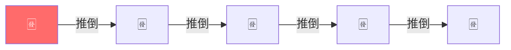
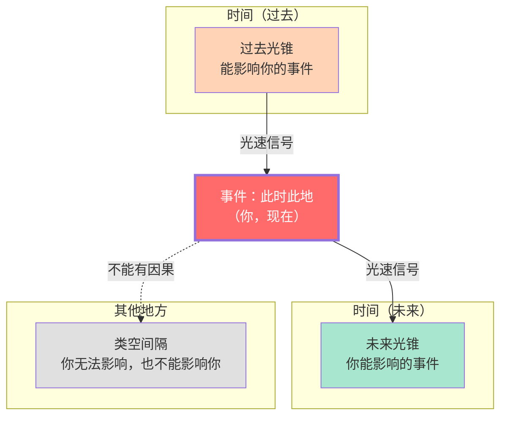
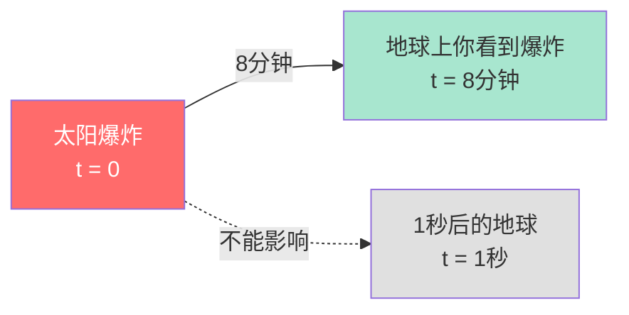
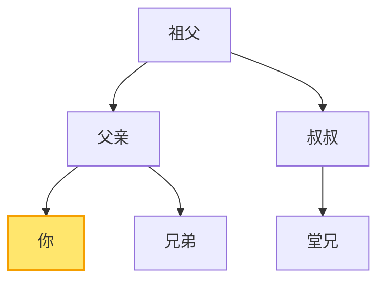
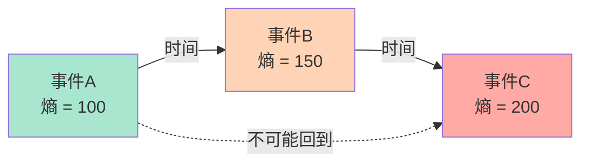
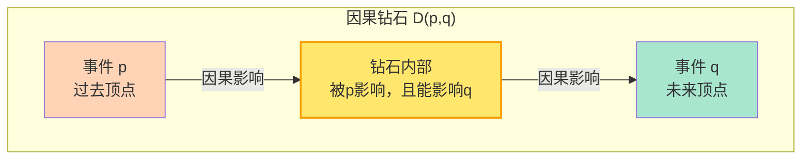
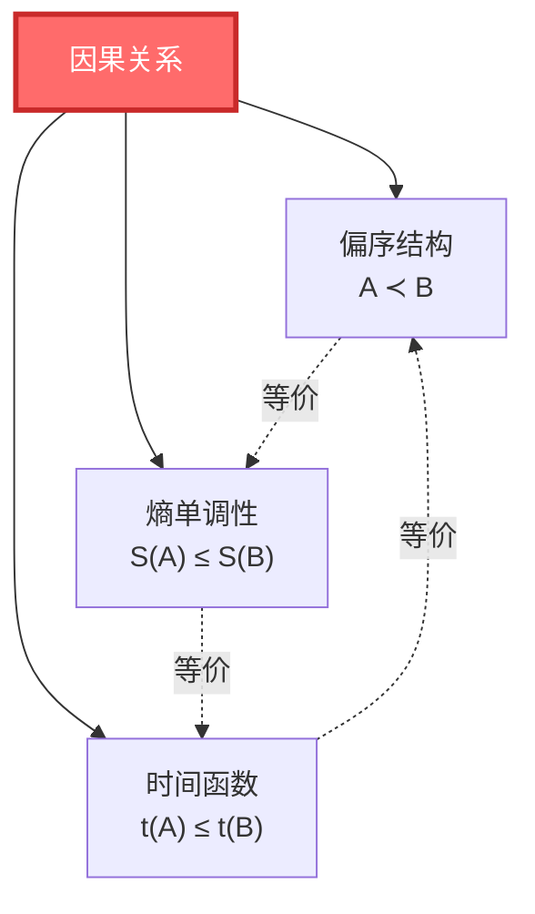
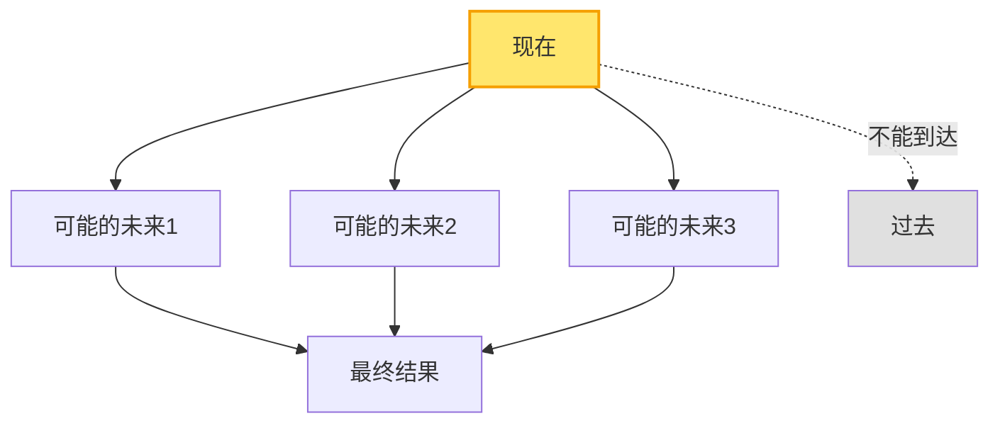

# 因果是什么？

> "万物皆有因。但'因导致果'到底是什么意思？这个问题比你想象的要深刻得多。"

[← 上一篇：时间是什么](01-what-is-time.md) | [返回主页](../index.md) | [下一篇：边界是什么 →](03-what-is-boundary.md)

---

## 从多米诺骨牌开始

想象一排多米诺骨牌：



你推倒第一张牌，它倒下，撞击第二张，第二张倒下，撞击第三张……

我们说：**第一张牌的倒下"导致"了第二张牌的倒下。**

### 🤔 但"导致"是什么意思？

让我们分析一下：

1. **时间顺序**：第一张牌**先**倒，第二张牌**后**倒
2. **空间接触**：第一张牌必须**碰到**第二张牌
3. **规律性**：每次实验，结果都一样（如果第一张倒，第二张必定倒）
4. **反事实条件**：如果第一张没倒，第二张也不会倒

> 💡 **关键问题**：这四个条件够吗？能不能给"因果"一个严格的定义？

---

## 休谟的挑战：因果是幻觉吗？

18世纪哲学家大卫·休谟提出了一个震撼的观点：

> **我们从未"看到"因果关系，我们只看到事件的相继发生。**

**例子**：台球碰撞


你看到了什么？

1. 白球在动
2. 白球碰到红球
3. 红球开始动

但你**没有看到**"导致"本身。你只是**推断**：白球"导致"了红球的运动。

> ⚠️ **休谟的观点**：因果不是客观存在的东西，而是我们心智的习惯。我们习惯于把"总是先后发生"的事件说成"因果关系"。

这引发了一个深刻的问题：**因果关系是真实的，还是我们强加给世界的一种解释？**

---

## 物理学的因果：光锥结构

物理学对因果有更严格的定义，核心是**光锥**（light cone）。

### 🌟 什么是光锥？

在相对论中，任何事件都有一个"光锥"，它划分了三个区域：



**三个区域**：

1. **过去光锥**：所有能影响"你现在"的事件
   - 必须在你的过去
   - 距离足够近，光能从那里传到这里

2. **未来光锥**：所有"你现在"能影响的事件
   - 必须在你的未来
   - 距离足够近，你能用光速信号影响它

3. **类空间隔**：与你"现在"无因果关系的事件
   - 太远了，光都来不及传递
   - 不能影响你，你也不能影响它

> 💡 **物理学的因果定义**：事件A能"导致"事件B，当且仅当B在A的未来光锥内。

### 📏 因果的物理限制：光速

**关键限制**：没有任何信息或影响可以传播得比光速更快！

这给出了因果的严格约束：

$$
\text{如果 } A \text{ 导致 } B \quad \Rightarrow \quad (x_B - x_A)^2 - c^2(t_B - t_A)^2 \leq 0
$$

翻译成人话：

- $x_B - x_A$ = 空间距离
- $t_B - t_A$ = 时间间隔
- 如果 $c(t_B - t_A) \geq |x_B - x_A|$（时间够长，光能传到），则可能有因果

**例子**：太阳爆炸



- 太阳距地球1.5亿公里，光需要8分钟
- 太阳爆炸后1秒，地球上的你**还不知道**（光还没传到）
- 8分钟后，你才能受影响

在那8分钟里，太阳爆炸和地球上的你**没有因果关系**（类空间隔）。

---

## GLS理论的因果：偏序 = 熵单调

GLS统一理论**提出**了因果的第三种理解，试图统一上述观点：

> **因果关系 = 偏序关系 = 熵的单调性**

### 📊 什么是偏序？

"偏序"是数学中描述"顺序"的概念。

**例子**：家族树



**偏序的性质**：

1. **自反性**：你 ≤ 你（废话，但数学上需要）
2. **反对称性**：如果 A ≤ B 且 B ≤ A，则 A = B
3. **传递性**：如果 A ≤ B 且 B ≤ C，则 A ≤ C

在家族树中：

- 祖父 < 父亲 < 你（传递性）
- 你和堂兄**无法比较**（这就是"偏"序，不是所有元素都能比）

### 🔗 因果 = 偏序

GLS理论**提出**：**时空中的因果关系，在数学结构上等价于事件的偏序关系！**

$$
A \prec B \quad \Leftrightarrow \quad \text{A在B的因果过去中}
$$

符号 $\prec$ 读作"在……之前"。

**性质**：

1. 自反：$A \prec A$（事件可以影响自己）
2. 反对称：如果 $A \prec B$ 且 $B \prec A$，则 $A = B$（没有闭合因果环）
3. 传递：如果 $A \prec B$ 且 $B \prec C$，则 $A \prec C$（因果可传递）

### 📈 因果 = 熵单调

**核心理论推论**：因果顺序可能等价于熵的单调性！

$$
A \prec B \quad \Leftrightarrow \quad S(A) \leq S(B)
$$

其中 $S$ 是广义熵（后面会详细讲）。

> 💡 **关键洞见**：说"A在B之前"，等价于说"A的熵不大于B的熵"！

**为什么？**

因为熵总是增加（或不变），所以：

- 如果 $S(A) < S(B)$，那么 A 必定在 B 之前
- 如果 $S(A) = S(B)$，A 和 B 可能同时，或者在可逆过程中
- 如果 $S(A) > S(B)$，那么 A 不可能在 B 之前（违反热力学第二定律）



---

## 小因果钻石：因果的最小单元

GLS理论引入了一个核心概念：**小因果钻石**（causal diamond）或**因果菱形**。

### 💎 什么是因果钻石？

想象时空中两个事件 $p$ 和 $q$，其中 $q$ 在 $p$ 的未来。

因果钻石是：

$$
D(p,q) = J^+(p) \cap J^-(q)
$$

翻译：

- $J^+(p)$ = p 的未来（p能影响的所有事件）
- $J^-(q)$ = q 的过去（能影响q的所有事件）
- $D(p,q)$ = 两者的交集（被p影响，且能影响q的所有事件）



**为什么叫"钻石"？**

在二维时空中画出来，形状像钻石：

```
      q (未来)
     /│\
    / │ \
   /  │  \
  /   │   \
 /____|____\
      │
      p (过去)
```

### 🔬 小因果钻石的重要性

在GLS理论中，**小因果钻石是时空的基本构建单元**，就像乐高积木：

1. **局域因果**：钻石内的因果关系是明确的
2. **广义熵**：可以在钻石上定义熵
3. **场方程涌现**：爱因斯坦方程可以从小钻石上的熵极值导出

> 💡 **类比**：如果时空是一座建筑，小因果钻石就是砖块。理解了砖块的性质，就能理解整座建筑。

---

## 因果的三重等价

GLS理论的核心命题之一：



**三种表述，一个本质**：

1. **几何表述**：存在时间函数 $t: M \to \mathbb{R}$，使得 $A \prec B \Leftrightarrow t(A) \leq t(B)$
2. **偏序表述**：因果关系满足自反、反对称、传递性
3. **热力学表述**：广义熵沿因果方向单调递增

**为什么它们等价？**

因为它们都在描述**同一个时空结构的不同侧面**：

- 时间函数 = 给事件"排序"
- 偏序 = "排序"的数学语言
- 熵单调 = "排序"的物理内容

---

## 因果与自由意志

一个哲学问题：如果一切都有因果，我们还有自由意志吗？

### 🤖 决定论 vs 自由意志

**决定论**：

- 给定现在的状态，未来完全被决定
- 就像台球桌：知道所有球的位置和速度，就能预测未来
- 经典物理学是决定论的

**量子不确定性**：

- 量子力学引入真正的随机性
- 即使知道现在的状态，未来仍有多种可能
- 但这只是"随机"，不是"自由选择"

**GLS理论的视角**：

因果不是"强制"，而是"约束"：

- **允许的**：A 在 B 之前，A 能影响 B
- **禁止的**：A 在 B 之后，A 不能影响 B
- **自由的**：在因果约束下，系统有多种可能的演化路径



> 💡 **类比**：因果就像道路网络。你不能随意穿墙（因果限制），但你可以选择走哪条路（自由意志）。

---

## 反因果与时间旅行

### ⏰ 时间旅行可能吗？

如果你能回到过去杀死你的祖父，你就不会出生，也就不能回到过去……这是著名的**祖父悖论**。

**GLS理论的推论**：**因果结构在数学上禁止闭合类时曲线（closed timelike curves, CTC）**。

在满足稳定因果性的时空中，**不存在闭合的因果环**：

$$
A \prec B \prec C \prec \cdots \prec A \quad \text{不可能！}
$$

> ⚠️ **为什么？** 如果存在因果环，熵会怎样？

如果 $A \prec B \prec A$，则：

$$
S(A) \leq S(B) \leq S(A) \quad \Rightarrow \quad S(A) = S(B)
$$

但这意味着熵完全不变，违反了除可逆过程之外的所有物理过程。

宇宙拒绝时间旅行，**不是因为技术限制，而是因为因果-熵结构的基本自洽性**。

---

## 小结：因果的多重面孔

| 视角 | 因果是什么 | 关键思想 | 比喻 |
|------|-----------|---------|------|
| **日常经验** | 推倒多米诺骨牌 | A导致B | 骨牌效应 |
| **哲学（休谟）** | 心智的习惯 | 我们推断因果，未观察到因果 | 联想 |
| **经典物理** | 决定论轨迹 | 知道初值，可预测未来 | 台球桌 |
| **相对论** | 光锥结构 | 光速限制因果传播 | 未来/过去光锥 |
| **量子力学** | 概率幅演化 | 态的幺正演化 | 薛定谔方程 |
| **GLS统一理论** | 偏序=熵单调 | 因果≡时间≡熵增 | 家族树的偏序 |

### 🎯 核心要点

1. **因果不是绝对的**：光速限制了因果影响的范围
2. **因果有结构**：因果关系满足偏序的数学性质
3. **因果等价于熵**：说"A在B之前"等价于"A的熵≤B的熵"
4. **小因果钻石**：时空的基本因果单元
5. **因果三重等价**：几何(时间函数) = 偏序(≺) = 热力学(熵增)

### 💡 最深刻的洞见

> **GLS理论提出：因果可能不是万物之间的"神秘力量"，而是时空几何与熵结构的必然结果。**

就像"直线"不是基本概念（它是测地线），"因果"也不是基本概念——它是更深层的偏序-熵-时间统一结构的表现。

---

## 接下来

我们已经理解了时间和因果。接下来的问题是：

- 什么是**边界**？为什么说"边界即实在"？
- 物理世界真的存在于"体积"中吗？还是一切都编码在"表面"上？
- 全息原理是什么？

这些问题的答案，就在下一篇：

[下一篇：边界是什么？ →](03-what-is-boundary.md)

---

**记住**：因果不是魔法，而是几何。理解因果的偏序结构，你就迈出了理解宇宙的第二步。

[← 上一篇：时间是什么](01-what-is-time.md) | [返回主页](../index.md) | [下一篇：边界是什么 →](03-what-is-boundary.md)
