# What is Causality?

> "Everything has a cause. But what does 'cause leads to effect' really mean? This question is far deeper than you imagine."

[← Previous: What is Time](01-what-is-time_en.md) | [Back to Home](../index_en.md) | [Next: What is Boundary →](03-what-is-boundary_en.md)

---

## Starting from Dominoes

Imagine a row of dominoes:


You knock down the first domino, it falls, hits the second, the second falls, hits the third...

We say: **The fall of the first domino "causes" the fall of the second domino.**

### 🤔 But What Does "Cause" Mean?

Let's analyze:

1. **Temporal Order**: First domino falls **before**, second falls **after**
2. **Spatial Contact**: First domino must **touch** the second
3. **Regularity**: Every experiment, same result (if first falls, second must fall)
4. **Counterfactual Condition**: If first didn't fall, second wouldn't fall

> 💡 **Key Question**: Are these four conditions enough? Can we give "causality" a strict definition?

---

## Hume's Challenge: Is Causality an Illusion?

18th-century philosopher David Hume proposed a shocking view:

> **We never "see" causality, we only see events occurring in sequence.**

**Example**: Billiard ball collision


What do you see?

1. White ball is moving
2. White ball touches red ball
3. Red ball starts moving

But you **don't see** "causing" itself. You only **infer**: White ball "causes" red ball's motion.

> ⚠️ **Hume's View**: Causality is not an objective thing, but a habit of our mind. We're used to calling events that "always occur in sequence" as "causal relationships."

This raises a profound question: **Is causality real, or an interpretation we impose on the world?**

---

## Physics' Causality: Light Cone Structure

Physics has a stricter definition of causality, centered on the **light cone**.

### 🌟 What is a Light Cone?

In relativity, any event has a "light cone" that divides three regions:

```mermaid
graph TB
    subgraph "Time (Future)"
        Future["Future Light Cone<br/>Events You Can Affect"]
    end

    Event["Event: Here and Now<br/>(You, Now)"]

    subgraph "Time (Past)"
        Past["Past Light Cone<br/>Events That Can Affect You"]
    end

    subgraph "Elsewhere"
        Elsewhere["Spacelike Separation<br/>Cannot Affect You,<br/>You Cannot Affect"]
    end

    Past -->|light-speed signal| Event
    Event -->|light-speed signal| Future
    Event -.no causality.-> Elsewhere

    style Event fill:#ff6b6b,color:#fff,stroke-width:3px
    style Future fill:#a8e6cf
    style Past fill:#ffd3b6
    style Elsewhere fill:#e0e0e0
```

**Three Regions**:

1. **Past Light Cone**: All events that can affect "you now"
   - Must be in your past
   - Close enough that light can travel from there to here

2. **Future Light Cone**: All events that "you now" can affect
   - Must be in your future
   - Close enough that you can affect it with light-speed signals

3. **Spacelike Separation**: Events with no causal relationship to "you now"
   - Too far, light can't reach in time
   - Cannot affect you, you cannot affect it

> 💡 **Physics' Definition of Causality**: Event A can "cause" event B if and only if B is in A's future light cone.

### 📏 Physical Limit of Causality: Speed of Light

**Key Constraint**: No information or influence can propagate faster than light!

This gives strict constraints on causality:

$$
\text{If } A \text{ causes } B \quad \Rightarrow \quad (x_B - x_A)^2 - c^2(t_B - t_A)^2 \leq 0
$$

Translation:

- $x_B - x_A$ = Spatial distance
- $t_B - t_A$ = Time interval
- If $c(t_B - t_A) \geq |x_B - x_A|$ (enough time for light to travel), then causality is possible

**Example**: Sun Explosion


- Sun is 150 million km from Earth, light takes 8 minutes
- 1 second after sun explodes, you on Earth **don't know yet** (light hasn't arrived)
- After 8 minutes, you can be affected

During those 8 minutes, the sun explosion and you on Earth **have no causal relationship** (spacelike separation).

---

## GLS Theory's Causality: Partial Order = Entropy Monotonicity

GLS unified theory **proposes** a third understanding of causality, attempting to unify the above views:

> **Causal Relationship = Partial Order Relationship = Monotonicity of Entropy**

### 📊 What is Partial Order?

"Partial order" is a mathematical concept describing "ordering."

**Example**: Family Tree


**Properties of Partial Order**:

1. **Reflexivity**: You ≤ You (obvious, but mathematically needed)
2. **Antisymmetry**: If A ≤ B and B ≤ A, then A = B
3. **Transitivity**: If A ≤ B and B ≤ C, then A ≤ C

In the family tree:

- Grandfather < Father < You (transitivity)
- You and cousin **cannot compare** (this is "partial" order, not all elements can be compared)

### 🔗 Causality = Partial Order

GLS theory **proposes**: **Causal relationships in spacetime might be mathematically equivalent to partial order relationships of events!**

$$
A \prec B \quad \Leftrightarrow \quad \text{A is in B's causal past}
$$

Symbol $\prec$ reads as "before."

**Properties**:

1. Reflexive: $A \prec A$ (event can affect itself)
2. Antisymmetric: If $A \prec B$ and $B \prec A$, then $A = B$ (no closed causal loops)
3. Transitive: If $A \prec B$ and $B \prec C$, then $A \prec C$ (causality is transitive)

### 📈 Causality = Entropy Monotonicity

A **core theoretical inference**: Causal order might be equivalent to monotonicity of entropy!

$$
A \prec B \quad \Leftrightarrow \quad S(A) \leq S(B)
$$

where $S$ is generalized entropy (will be detailed later).

> 💡 **Key Insight**: Saying "A is before B" is equivalent to saying "A's entropy is not greater than B's entropy"!

**Why?**

Because entropy always increases (or stays constant), so:

- If $S(A) < S(B)$, then A must be before B
- If $S(A) = S(B)$, A and B may be simultaneous, or in a reversible process
- If $S(A) > S(B)$, then A cannot be before B (violates second law of thermodynamics)


---

## Small Causal Diamonds: Minimal Units of Causality

GLS theory introduces a core concept: **Small Causal Diamonds** (causal diamond) or **Causal Rhombus**.

### 💎 What is a Causal Diamond?

Imagine two events $p$ and $q$ in spacetime, where $q$ is in $p$'s future.

Causal diamond is:

$$
D(p,q) = J^+(p) \cap J^-(q)
$$

Translation:

- $J^+(p)$ = Future of p (all events p can affect)
- $J^-(q)$ = Past of q (all events that can affect q)
- $D(p,q)$ = Intersection (all events affected by p and can affect q)


**Why Called "Diamond"?**

Drawn in two-dimensional spacetime, it looks like a diamond:

```
      q (future)
     /│\
    / │ \
   /  │  \
  /   │   \
 /____|____\
      │
      p (past)
```

### 🔬 Importance of Small Causal Diamonds

In GLS theory, **small causal diamonds are fundamental building blocks of spacetime**, like LEGO bricks:

1. **Local Causality**: Causal relationships within diamond are clear
2. **Generalized Entropy**: Entropy can be defined on diamond
3. **Field Equations Emerge**: Einstein equations can be derived from entropy extremum on small diamond

> 💡 **Analogy**: If spacetime is a building, small causal diamonds are the bricks. Understanding brick properties helps understand the whole building.

---

## Triple Equivalence of Causality

One of GLS theory's core propositions:

```mermaid
graph TD
    Causal["Causal Relationship"] --> Order["Partial Order Structure<br/>A ≺ B"]
    Causal --> Entropy["Entropy Monotonicity<br/>S(A) ≤ S(B)"]
    Causal --> Time["Time Function<br/>t(A) ≤ t(B)"]

    Order -.equivalent.-> Entropy
    Entropy -.equivalent.-> Time
    Time -.equivalent.-> Order

    style Causal fill:#ff6b6b,stroke:#c92a2a,stroke-width:3px,color:#fff
```



**Three Formulations, One Essence**:

1. **Geometric Formulation**: There exists a time function $t: M \to \mathbb{R}$ such that $A \prec B \Leftrightarrow t(A) \leq t(B)$
2. **Partial Order Formulation**: Causal relationships satisfy reflexivity, antisymmetry, transitivity
3. **Thermodynamic Formulation**: Generalized entropy monotonically increases along causal direction

**Why Are They Equivalent?**

Because they all describe **different aspects of the same spacetime structure**:

- Time function = "Ordering" events
- Partial order = Mathematical language of "ordering"
- Entropy monotonicity = Physical content of "ordering"

---

## Causality and Free Will

A philosophical question: If everything has causes, do we have free will?

### 🤖 Determinism vs Free Will

**Determinism**:

- Given current state, future is completely determined
- Like billiard table: knowing all ball positions and velocities, can predict future
- Classical physics is deterministic

**Quantum Uncertainty**:

- Quantum mechanics introduces true randomness
- Even knowing current state, future has multiple possibilities
- But this is just "random," not "free choice"

**GLS Theory's Perspective**:

Causality is not "force," but "constraint":

- **Allowed**: A before B, A can affect B
- **Forbidden**: A after B, A cannot affect B
- **Free**: Under causal constraints, system has multiple possible evolution paths


> 💡 **Analogy**: Causality is like a road network. You can't walk through walls (causal limits), but you can choose which road to take (free will).

---

## Anti-Causality and Time Travel

### ⏰ Is Time Travel Possible?

If you could go back and kill your grandfather, you wouldn't be born, so you couldn't go back... This is the famous **Grandfather Paradox**.

**GLS Theory's Inference**: **Causal structure mathematically forbids closed timelike curves (CTCs)**.

In spacetimes satisfying stable causality, **no closed causal loops exist**:

$$
A \prec B \prec C \prec \cdots \prec A \quad \text{Impossible!}
$$

> ⚠️ **Why?** What happens to entropy if causal loops exist?

If $A \prec B \prec A$, then:

$$
S(A) \leq S(B) \leq S(A) \quad \Rightarrow \quad S(A) = S(B)
$$

But this means entropy is completely constant, violating all physical processes except reversible ones.

The universe rejects time travel, **not because of technical limitations, but because of the fundamental self-consistency of causal-entropy structure**.

---

## Summary: Multiple Faces of Causality

| Perspective | What is Causality | Key Idea | Analogy |
|------------|------------------|----------|---------|
| **Everyday Experience** | Knocking down dominoes | A causes B | Domino effect |
| **Philosophy (Hume)** | Habit of mind | We infer causality, don't observe it | Association |
| **Classical Physics** | Deterministic trajectory | Knowing initial values, can predict future | Billiard table |
| **Relativity** | Light cone structure | Light speed limits causal propagation | Future/past light cones |
| **Quantum Mechanics** | Probability amplitude evolution | Unitary evolution of states | Schrödinger equation |
| **GLS Unified Theory** | Partial Order=Entropy Monotonicity | Causality≡Time≡Entropy Increase | Partial order of family tree |

### 🎯 Key Points

1. **Causality is not absolute**: Light speed limits the range of causal influence
2. **Causality has structure**: Causal relationships satisfy mathematical properties of partial order
3. **Causality equals entropy**: Saying "A before B" equals "A's entropy ≤ B's entropy"
4. **Small Causal Diamonds**: Fundamental causal units of spacetime
5. **Triple Equivalence of Causality**: Geometry(time function) = Partial Order(≺) = Thermodynamics(entropy increase)

### 💡 Most Profound Insight

> **GLS theory proposes: Causality might not be a "mysterious force" between things, but a necessary consequence of spacetime geometry and entropy structure.**

Just as "straight line" is not fundamental (it's a geodesic), "causality" is not fundamental—it's a manifestation of deeper partial order-entropy-time unified structure.

---

## What's Next

We've understood time and causality. Next question:

- What is **boundary**? Why say "boundary is reality"?
- Does the physical world really exist in "volume"? Or is everything encoded on the "surface"?
- What is the holographic principle?

Answers to these questions are in the next article:

[Next: What is Boundary? →](03-what-is-boundary_en.md)

---

**Remember**: Causality is not magic, but geometry. Understanding the partial order structure of causality, you've taken the second step in understanding the universe.

[← Previous: What is Time](01-what-is-time_en.md) | [Back to Home](../index_en.md) | [Next: What is Boundary →](03-what-is-boundary_en.md)

