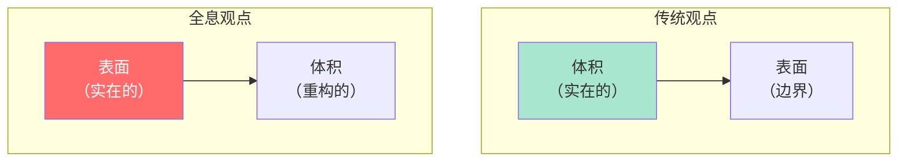
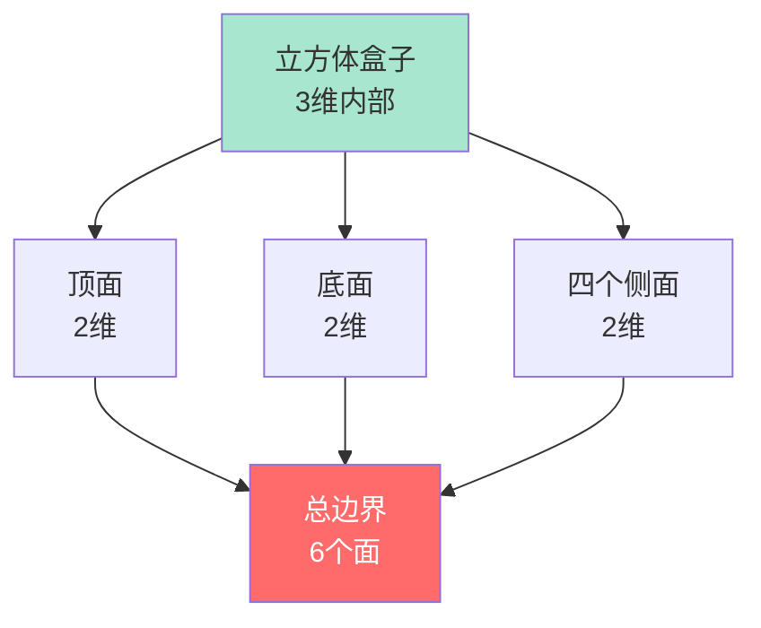
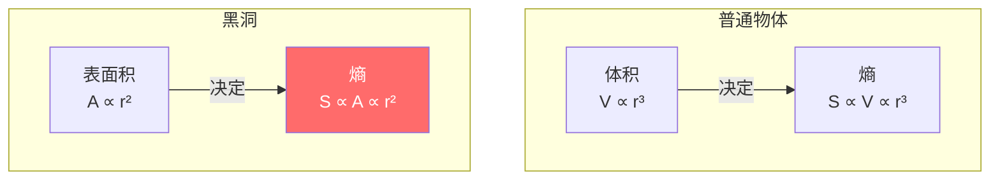
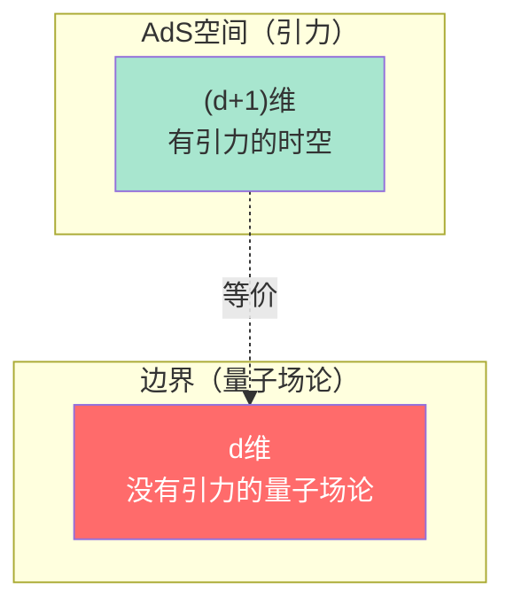
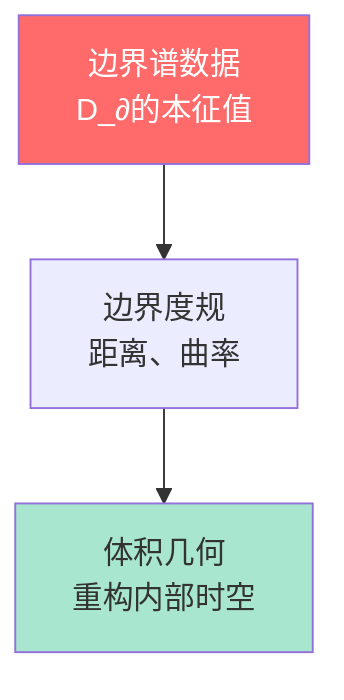
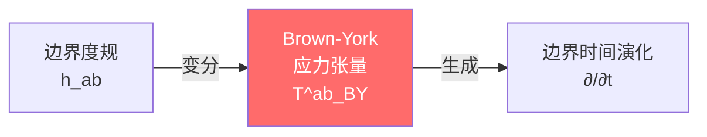
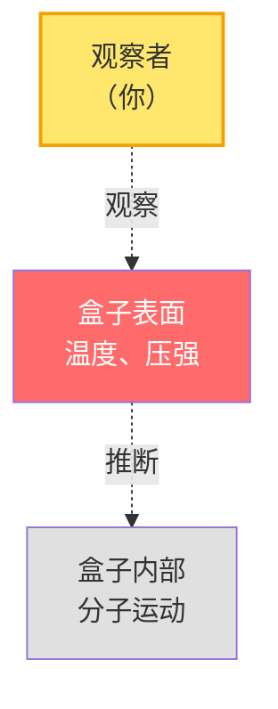
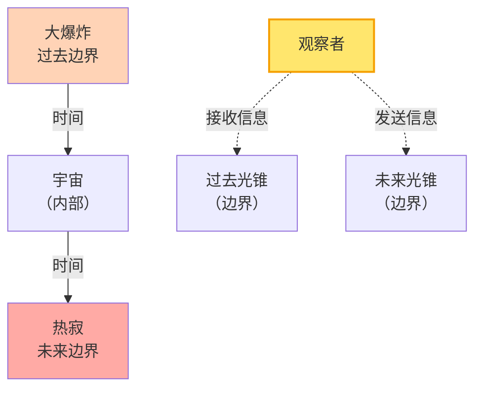
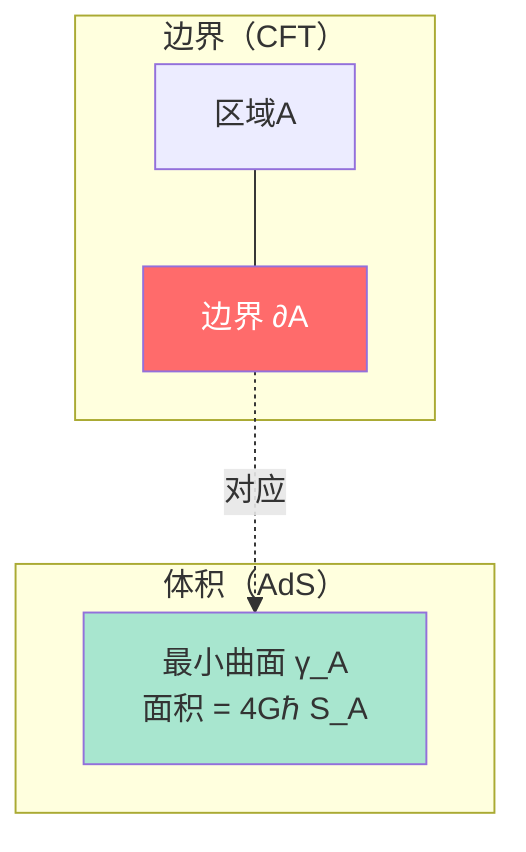
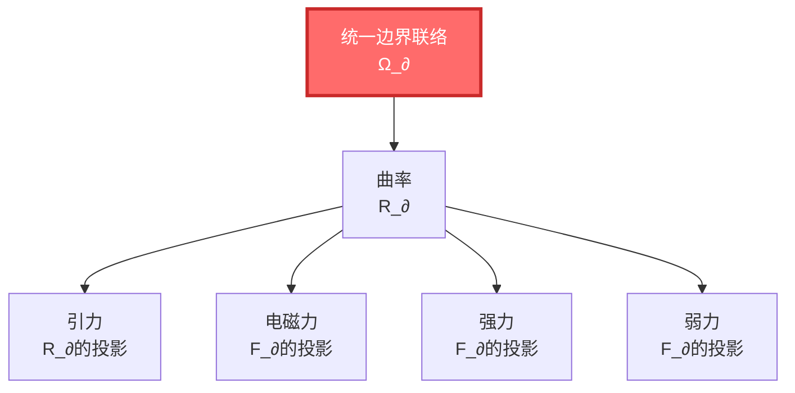

# 边界是什么？

> "我们认为实在存在于空间的'内部'。但如果真正的实在其实存在于'表面'呢？"

[← 上一篇：因果是什么](02-what-is-causality.md) | [返回主页](../index.md) | [下一篇：散射是什么 →](04-what-is-scattering.md)

---

## 从气球开始

拿一个气球，吹气。气球膨胀了。

现在问你：气球的"体积"是实在的吗？

### 🎈 气球的两种理解

**理解1（常识）**：体积是实在的

- 气球内部有空气（物质）
- 体积越大，空气越多
- 体积是"真实存在"的三维空间

**理解2（全息观点）**：表面才是实在的

- 你能直接观察的只有气球的**表面**
- 表面的张力和形变，决定了内部的压强
- 你捏气球，表面变形，"内部"的形状随之改变
- **表面包含了关于内部的所有信息**



> 💡 **GLS理论提出**：宇宙可能像这个气球。真正的"实在"可能存在于边界（表面）上，而"体积"中的物理是从边界数据重构出来的！

---

## 什么是边界？

在数学和物理中，边界的定义很清晰：

**边界** = 区域的"界面"，分隔内外

### 📦 例子：盒子

一个立方体盒子：

- **内部**：三维空间，体积 $V = L^3$
- **边界**：六个面（二维），面积 $A = 6L^2$
- **维度差**：体积是3维，边界是2维



**关键观察**：边界的维度总是比内部少1！

---

## 边界的惊人性质：贝肯斯坦-霍金熵

### 🕳️ 黑洞的熵之谜

1970年代，物理学家发现了一个令人震惊的事实：

**黑洞的熵正比于表面积，而不是体积！**

$$
S_{\text{BH}} = \frac{A}{4G\hbar}
$$

其中：
- $S_{\text{BH}}$ = 黑洞的熵（信息量）
- $A$ = 黑洞视界的面积
- $G$ = 引力常数
- $\hbar$ = 普朗克常数

### 🤯 为什么这很震撼？

通常，熵应该和**体积**成正比：

- 房间越大，混乱的方式越多
- 体积加倍 → 熵约加倍

但黑洞违反了这个规律：

- 黑洞半径加倍 → 面积变为4倍 → 熵变为4倍
- 但体积变为了8倍！

**这意味着什么？**

> 黑洞的"信息"全部编码在它的**表面**（视界）上，而不是内部！



就像一个全息图：三维的图像被编码在二维的胶片上。

---

## 全息原理：宇宙是全息图

### 🌌 特霍夫特和萨斯坎德的猜想

受黑洞熵的启发，物理学家提出了**全息原理**：

> **任何有限区域的物理，可以被完全编码在其边界上。**

就像一张全息卡片：


### 🧮 AdS/CFT对应

最著名的全息例子是**AdS/CFT对应**（马尔达塞纳，1997）：

- **AdS**：反德西特空间（一种特殊的引力时空）
- **CFT**：共形场论（一种量子场论）

**核心思想**：

一个$(d+1)$维引力理论 = 一个$d$维量子场论（在边界上）



**例子**：

- 5维AdS空间中的引力理论 $\Leftrightarrow$ 4维边界上的量子场论
- 引力中的黑洞 $\Leftrightarrow$ 量子场论中的热平衡态

**为什么重要？**

这表明：

1. **引力不是基本的**：引力可能是边界量子理论的"涌现"现象
2. **维度可以涌现**：额外的空间维度来自边界信息的重组
3. **全息是普遍的**：宇宙的"内部"可能是"表面"的全息投影

---

## GLS理论：边界优先原则

GLS统一理论将全息原理提升为基本公理：

> **公理：边界优先性**
>
> 物理实在首先以边界可观测代数及其谱数据呈现，体域动力学是边界数据的延拓。

### 📏 边界谱三元组

在GLS理论中，边界的数学描述是一个**边界谱三元组**：

$$
(\mathcal{A}_{\partial}, \mathcal{H}_{\partial}, D_{\partial})
$$

**三个组成部分**：

1. $\mathcal{A}_{\partial}$ = 边界上的可观测量代数
2. $\mathcal{H}_{\partial}$ = 边界上的希尔伯特空间
3. $D_{\partial}$ = 边界上的狄拉克算子（决定几何）

> 💡 **关键思想**：边界的几何（度规）不需要先验给定，而是由$D_{\partial}$的谱结构定义！



### 🎯 Brown-York应力张量

边界上有一个特殊的物理量：**Brown-York应力张量** $T^{ab}_{\text{BY}}$

它的定义是：

$$
T^{ab}_{\text{BY}} = \frac{2}{\sqrt{-h}}\frac{\delta S_{\text{grav}}}{\delta h_{ab}}
$$

翻译成人话：

- $h_{ab}$ = 边界上的度规（几何）
- $S_{\text{grav}}$ = 引力作用量
- $T^{ab}_{\text{BY}}$ = 度规变分的响应（应力-能量）

**物理意义**：

Brown-York应力张量告诉你：**边界上的能量-动量密度**。

它生成边界上的"时间平移"，因此**边界上有自己的时间演化**！



---

## 为什么边界是实在的起点？

### 🔍 观察者总在边界上

想一想：你如何观察一个物理系统？

**例子**：观察一个盒子里的气体



你能做的：

- ✓ 测量盒子表面的温度
- ✓ 测量盒子表面的压强
- ✓ 通过透明墙看到内部（光从边界传出）

你不能做的：

- ✗ 直接"看到"内部某个分子的位置（除非光携带信息到达边界）

**结论**：所有观测数据都来自边界（或者通过边界传播出来的信号）！

### 🌍 宇宙的边界在哪里？

如果宇宙是无限大的，它有边界吗？

**答案**：有！但不是空间边界，而是**时间边界**。

1. **宇宙学视界**：由于宇宙膨胀，有些地方的光永远到不了我们这里
   - 我们的"可观测宇宙"有一个边界（视界）
   - 半径约460亿光年

2. **因果边界**：在GLS理论中，边界可以是**null边界**（光速边界）
   - 过去的null边界：大爆炸（时间开始）
   - 未来的null边界：热寂（熵最大）



**GLS理论的观点**：

宇宙的"内部"（我们生活的3D空间）可能是编码在这些时间边界上的全息投影！

---

## 边界与熵：面积定律

### 📐 纠缠熵的面积定律

在量子场论中，将空间分成两个区域A和B：

```
+-------------------+
| Region A |Region B|
|          |        |
|    \∂A/ |        |
+-------------------+
     边界
```

**纠缠熵**：区域A与B之间的量子纠缠程度

$$
S_A = -\text{tr}(\rho_A \ln \rho_A)
$$

**令人惊讶的发现**：

$$
S_A \propto \frac{\text{Area}(\partial A)}{\epsilon^{d-2}}
$$

纠缠熵正比于**边界面积**，而不是体积！

- $\partial A$ = 区域A的边界
- $\epsilon$ = UV截断（短距离截断）
- $d$ = 空间维度

> 💡 **这又是全息的信号**：量子纠缠的信息，主要编码在边界上！

### 🔬 Ryu-Takayanagi公式

在AdS/CFT对应中，**Ryu-Takayanagi公式**给出了全息的精确形式：

$$
S_A = \frac{\text{Area}(\gamma_A)}{4G\hbar}
$$

其中：
- $S_A$ = 边界场论中区域A的纠缠熵
- $\gamma_A$ = 体内连接$\partial A$的最小曲面（极值面）
- $G$ = 引力常数



**意义**：边界上的纠缠熵，对应于体内极值面的面积！

---

## 边界理论的深刻洞见

### 💎 无基本力定理

GLS理论推导出一个**核心结论**：

> **定理：无基本力**
>
> 所有"力"（引力、电磁力、强力、弱力）都不是基本对象，而是统一边界联络曲率的不同投影。

想象一个**统一的边界联络**：

$$
\Omega_{\partial} = \omega_{\text{Levi-Civita}} \oplus A_{\text{Yang-Mills}} \oplus \Gamma_{\text{分辨率}}
$$

**三个部分**：

1. $\omega$ = Levi-Civita联络（引力）
2. $A$ = Yang-Mills联络（规范场：电磁、强、弱）
3. $\Gamma$ = 分辨率联络（粗粒化效应）

所有"力"都来自这个统一联络的**曲率**：

$$
\mathcal{R}_{\partial} = R_{\partial} \oplus F_{\partial} \oplus \mathcal{R}_{\text{res}}
$$



> 💡 **关键洞见**：GLS理论认为，这4种基本力可能是同一个边界几何结构的不同侧面！

---

## 小结：边界的革命性视角

| 传统观点 | GLS边界理论 |
|---------|------------|
| 体积是实在的，边界是界面 | 边界是实在的，体积是重构 |
| 熵正比于体积 | 熵正比于边界面积 |
| 引力是基本力 | 引力是边界几何的涌现 |
| 观察者在体积中 | 观察者总在边界上 |
| 维度是先验的 | 维度从边界涌现 |

### 🎯 核心要点

1. **全息原理**：体积中的物理可以被完全编码在边界上
2. **黑洞熵**：$S \propto A$（面积），不是$V$（体积）
3. **AdS/CFT**：$(d+1)$维引力 = $d$维量子场论
4. **边界优先**：物理实在首先在边界上呈现
5. **无基本力**：所有力都是边界联络曲率的投影

### 💡 最深刻的洞见

> **宇宙可能不是一个"实心的"三维空间，而是一个巨大的全息投影——真正的信息存在于"表面"（边界）上。**

我们感觉自己生活在三维空间中，但这可能是幻觉。真正的自由度，可能在一个更低维的边界上。

---

## 接下来

我们理解了边界的重要性。但还有一个关键概念：**散射**。

- 为什么粒子的碰撞能告诉我们关于时间的信息？
- 什么是S矩阵？
- 散射延迟和时间有什么关系？

这些问题的答案，就在下一篇：

[下一篇：散射是什么？ →](04-what-is-scattering.md)

---

**记住**：边界不是无关紧要的"壳"，而是实在的本源。理解边界，你就理解了全息宇宙的秘密。

[← 上一篇：因果是什么](02-what-is-causality.md) | [返回主页](../index.md) | [下一篇：散射是什么 →](04-what-is-scattering.md)
