# What is Boundary?

> "We think reality exists in the 'interior' of space. But what if true reality actually exists on the 'surface'?"

[← Previous: What is Causality](02-what-is-causality_en.md) | [Back to Home](../index_en.md) | [Next: What is Scattering →](04-what-is-scattering_en.md)

---

## Starting from a Balloon

Take a balloon, blow it up. The balloon expands.

Now ask: Is the balloon's "volume" real?

### 🎈 Two Understandings of a Balloon

**Understanding 1 (Common Sense)**: Volume is real

- Balloon interior has air (matter)
- Larger volume, more air
- Volume is "truly existing" three-dimensional space

**Understanding 2 (Holographic View)**: Surface is real

- What you can directly observe is only the balloon's **surface**
- Surface tension and deformation determine internal pressure
- You squeeze balloon, surface deforms, "interior" shape changes accordingly
- **Surface contains all information about interior**


> 💡 **GLS Theory's Shocking View**: The universe is like this balloon. True "reality" exists on the boundary (surface), and physics in "volume" is reconstructed from boundary data!

---

## What is Boundary?

In mathematics and physics, the definition of boundary is clear:

**Boundary** = "Interface" of a region, separating inside and outside

### 📦 Example: Box

A cubic box:

- **Interior**: Three-dimensional space, volume $V = L^3$
- **Boundary**: Six faces (two-dimensional), area $A = 6L^2$
- **Dimension Difference**: Volume is 3D, boundary is 2D


**Key Observation**: Boundary dimension is always 1 less than interior!

---

## Amazing Property of Boundary: Bekenstein-Hawking Entropy

### 🕳️ Mystery of Black Hole Entropy

In the 1970s, physicists discovered a shocking fact:

**Black hole entropy is proportional to surface area, not volume!**

$$
S_{\text{BH}} = \frac{A}{4G\hbar}
$$

where:
- $S_{\text{BH}}$ = Black hole entropy (information content)
- $A$ = Black hole event horizon area
- $G$ = Gravitational constant
- $\hbar$ = Planck constant

### 🤯 Why Is This Shocking?

Usually, entropy should be proportional to **volume**:

- Larger room, more ways to be disordered
- Double volume → Entropy roughly doubles

But black holes violate this rule:

- Black hole radius doubles → Area becomes 4 times → Entropy becomes 4 times
- But volume becomes 8 times!

**What Does This Mean?**

> Black hole "information" is all encoded on its **surface** (horizon), not interior!

```mermaid
graph TB
    subgraph "Ordinary Object"
        V["Volume<br/>V ∝ r³"] -->|determines| S1["Entropy<br/>S ∝ V ∝ r³"]
    end

    subgraph "Black Hole"
        A["Surface Area<br/>A ∝ r²"] -->|determines| S2["Entropy<br/>S ∝ A ∝ r²"]
    end

    style S2 fill:#ff6b6b,color:#fff
```



Like a hologram: A three-dimensional image encoded on a two-dimensional film.

---

## Holographic Principle: Universe is a Hologram

### 🌌 't Hooft and Susskind's Conjecture

Inspired by black hole entropy, physicists proposed the **Holographic Principle**:

> **Physics of any finite region can be completely encoded on its boundary.**

Like a holographic card:


### 🧮 AdS/CFT Correspondence

The most famous holographic example is **AdS/CFT correspondence** (Maldacena, 1997):

- **AdS**: Anti-de Sitter space (special type of gravitational spacetime)
- **CFT**: Conformal Field Theory (a quantum field theory)

**Core Idea**:

A $(d+1)$-dimensional gravity theory = A $d$-dimensional quantum field theory (on boundary)


**Example**:

- 5D AdS space gravity theory $\Leftrightarrow$ 4D boundary quantum field theory
- Black hole in gravity $\Leftrightarrow$ Thermal equilibrium state in quantum field theory

**Why Important?**

This suggests:

1. **Gravity is not fundamental**: Gravity may be an "emergent" phenomenon of boundary quantum theory
2. **Dimensions can emerge**: Extra spatial dimensions come from reorganization of boundary information
3. **Holography is universal**: Universe's "interior" may be a holographic projection of "surface"

---

## GLS Theory: Boundary Priority Principle

GLS unified theory elevates holographic principle to a fundamental axiom:

> **Axiom: Boundary Priority**
>
> Physical reality first manifests as boundary observable algebra and its spectral data; bulk dynamics is extension of boundary data.

### 📏 Boundary Spectral Triple

In GLS theory, the mathematical description of boundary is a **Boundary Spectral Triple**:

$$
(\mathcal{A}_{\partial}, \mathcal{H}_{\partial}, D_{\partial})
$$

**Three Components**:

1. $\mathcal{A}_{\partial}$ = Observable algebra on boundary
2. $\mathcal{H}_{\partial}$ = Hilbert space on boundary
3. $D_{\partial}$ = Dirac operator on boundary (determines geometry)

> 💡 **Key Idea**: Boundary geometry (metric) doesn't need to be given a priori, but is defined by spectral structure of $D_{\partial}$!

```mermaid
graph TB
    Spectral["Boundary Spectral Data<br/>Eigenvalues of D_∂"] --> Metric["Boundary Metric<br/>Distance, Curvature"]
    Metric --> Bulk["Bulk Geometry<br/>Reconstruct Interior Spacetime"]

    style Spectral fill:#ff6b6b,color:#fff
    style Bulk fill:#a8e6cf
```



### 🎯 Brown-York Stress Tensor

There's a special physical quantity on boundary: **Brown-York Stress Tensor** $T^{ab}_{\text{BY}}$

Its definition:

$$
T^{ab}_{\text{BY}} = \frac{2}{\sqrt{-h}}\frac{\delta S_{\text{grav}}}{\delta h_{ab}}
$$

Translation:

- $h_{ab}$ = Metric on boundary (geometry)
- $S_{\text{grav}}$ = Gravitational action
- $T^{ab}_{\text{BY}}$ = Response to metric variation (stress-energy)

**Physical Meaning**:

Brown-York stress tensor tells you: **Energy-momentum density on boundary**.

It generates "time translation" on boundary, so **boundary has its own time evolution**!

```mermaid
graph LR
    BoundaryMetric["Boundary Metric<br/>h_ab"] -->|variation| BY["Brown-York<br/>Stress Tensor<br/>T^ab_BY"]
    BY -->|generates| TimeEvolution["Boundary Time Evolution<br/>∂/∂t"]

    style BY fill:#ff6b6b,color:#fff
```



---

## Why Is Boundary the Starting Point of Reality?

### 🔍 Observers Are Always on Boundary

Think: How do you observe a physical system?

**Example**: Observing gas in a box


What you can do:

- ✓ Measure temperature on box surface
- ✓ Measure pressure on box surface
- ✓ See inside through transparent wall (light propagates from boundary)

What you cannot do:

- ✗ Directly "see" position of a molecule inside (unless light carries information to boundary)

**Conclusion**: All observational data comes from boundary (or signals propagating from boundary)!

### 🌍 Where Is the Universe's Boundary?

If the universe is infinitely large, does it have a boundary?

**Answer**: Yes! But not a spatial boundary, but a **temporal boundary**.

1. **Cosmological Horizon**: Due to cosmic expansion, some places' light will never reach us
   - Our "observable universe" has a boundary (horizon)
   - Radius about 46 billion light-years

2. **Causal Boundary**: In GLS theory, boundary can be **null boundary** (light-speed boundary)
   - Past null boundary: Big Bang (beginning of time)
   - Future null boundary: Heat death (maximum entropy)


**GLS Theory's View**:

The universe's "interior" (3D space we live in) may be a holographic projection encoded on these temporal boundaries!

---

## Boundary and Entropy: Area Law

### 📐 Area Law of Entanglement Entropy

In quantum field theory, divide space into two regions A and B:

```
+-------------------+
|| Region A |Region B|
||          |        |
||    \∂A/ |        |
+-------------------+
     Boundary
```

**Entanglement Entropy**: Degree of quantum entanglement between regions A and B

$$
S_A = -\text{tr}(\rho_A \ln \rho_A)
$$

**Surprising Discovery**:

$$
S_A \propto \frac{\text{Area}(\partial A)}{\epsilon^{d-2}}
$$

Entanglement entropy is proportional to **boundary area**, not volume!

- $\partial A$ = Boundary of region A
- $\epsilon$ = UV cutoff (short-distance cutoff)
- $d$ = Spatial dimension

> 💡 **Another Holographic Signal**: Quantum entanglement information is mainly encoded on boundary!

### 🔬 Ryu-Takayanagi Formula

In AdS/CFT correspondence, **Ryu-Takayanagi formula** gives precise holographic form:

$$
S_A = \frac{\text{Area}(\gamma_A)}{4G\hbar}
$$

where:
- $S_A$ = Entanglement entropy of region A in boundary field theory
- $\gamma_A$ = Minimal surface in bulk connecting $\partial A$ (extremal surface)
- $G$ = Gravitational constant



```mermaid
graph TB
    subgraph "Boundary (CFT)"
        A["Region A"] --- Bdry["Boundary ∂A"]
    end

    subgraph "Bulk (AdS)"
        Surface["Minimal Surface γ_A<br/>Area = 4Gℏ S_A"]
    end

    Bdry -.corresponds to.-> Surface

    style Bdry fill:#ff6b6b,color:#fff
    style Surface fill:#a8e6cf
```

**Meaning**: Entanglement entropy on boundary corresponds to area of extremal surface in bulk!

---

## Profound Insights of Boundary Theory

### 💎 No Fundamental Forces Theorem

GLS theory has a shocking result:

> **Theorem: No Fundamental Forces**
>
> All "forces" (gravity, electromagnetic, strong, weak) are not fundamental objects, but different projections of unified boundary connection curvature.

Imagine a **unified boundary connection**:

$$
\Omega_{\partial} = \omega_{\text{Levi-Civita}} \oplus A_{\text{Yang-Mills}} \oplus \Gamma_{\text{resolution}}
$$

**Three Parts**:

1. $\omega$ = Levi-Civita connection (gravity)
2. $A$ = Yang-Mills connection (gauge fields: electromagnetic, strong, weak)
3. $\Gamma$ = Resolution connection (coarse-graining effects)

All "forces" come from **curvature** of this unified connection:

$$
\mathcal{R}_{\partial} = R_{\partial} \oplus F_{\partial} \oplus \mathcal{R}_{\text{res}}
$$



```mermaid
graph TD
    Unified["Unified Boundary Connection<br/>Ω_∂"] --> Curvature["Curvature<br/>R_∂"]

    Curvature --> Gravity["Gravity<br/>Projection of R_∂"]
    Curvature --> EM["Electromagnetic Force<br/>Projection of F_∂"]
    Curvature --> Strong["Strong Force<br/>Projection of F_∂"]
    Curvature --> Weak["Weak Force<br/>Projection of F_∂"]

    style Unified fill:#ff6b6b,stroke:#c92a2a,stroke-width:3px,color:#fff
```

> 💡 **Key Insight**: You think there are 4 fundamental forces, but they're different aspects of the same boundary geometric structure!

---

## Summary: Revolutionary Perspective of Boundary

| Traditional View | GLS Boundary Theory |
|-----------------|---------------------|
| Volume is real, boundary is interface | Boundary is real, volume is reconstructed |
| Entropy proportional to volume | Entropy proportional to boundary area |
| Gravity is fundamental force | Gravity is emergence of boundary geometry |
| Observer in volume | Observer always on boundary |
| Dimensions are a priori | Dimensions emerge from boundary |

### 🎯 Key Points

1. **Holographic Principle**: Physics in volume can be completely encoded on boundary
2. **Black Hole Entropy**: $S \propto A$ (area), not $V$ (volume)
3. **AdS/CFT**: $(d+1)$D gravity = $d$D quantum field theory
4. **Boundary Priority**: Physical reality first manifests on boundary
5. **No Fundamental Forces**: All forces are projections of boundary connection curvature

### 💡 Most Profound Insight

> **The universe may not be a "solid" three-dimensional space, but a huge holographic projection—true information exists on the "surface" (boundary).**

We feel we live in three-dimensional space, but this may be an illusion. True degrees of freedom may be on a lower-dimensional boundary.

---

## What's Next

We understand the importance of boundary. But there's one more key concept: **Scattering**.

- Why can particle collisions tell us about time?
- What is the S-matrix?
- What's the relationship between scattering delay and time?

Answers to these questions are in the next article:

[Next: What is Scattering? →](04-what-is-scattering_en.md)

---

**Remember**: Boundary is not an irrelevant "shell," but the source of reality. Understanding boundary, you understand the secret of the holographic universe.

[← Previous: What is Causality](02-what-is-causality_en.md) | [Back to Home](../index_en.md) | [Next: What is Scattering →](04-what-is-scattering_en.md)

