# 散射是什么？

> "回声告诉你山洞的形状。散射告诉你粒子的性质，甚至告诉你时间本身。"

[← 上一篇：边界是什么](03-what-is-boundary.md) | [返回主页](../index.md) | [下一篇：熵是什么 →](05-what-is-entropy.md)

---

## 从回声开始

站在山谷中大喊一声："喂——"

几秒钟后，你听到回声："喂——"

### 🗻 回声告诉你什么？

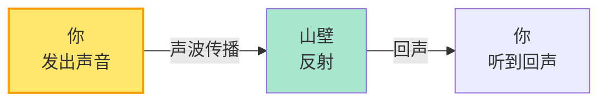

通过回声，你能推断：

1. **距离**：延迟时间 × 声速 ÷ 2 = 山壁距离
2. **形状**：回声的方向 → 山壁的形状
3. **材质**：回声的音色变化 → 岩石的性质

> 💡 **关键洞见**：你向山谷"发射"声波，山壁"散射"声波，你接收散射后的声波，从而了解山谷。

这就是**散射**的基本思想！

---

## 什么是散射？

在物理学中，散射是指：

> **物体（粒子、波）与另一个物体相互作用后，改变方向或性质的过程。**

### 📊 散射的三要素

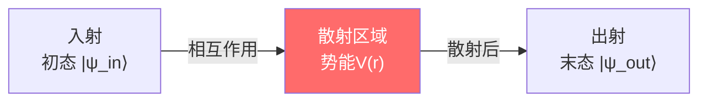

**三个关键部分**：

1. **入态** $|\psi_{\text{in}}\rangle$：散射前的状态
2. **散射区**：相互作用发生的区域
3. **出态** $|\psi_{\text{out}}\rangle$：散射后的状态

### 🎱 经典例子：台球碰撞

台球桌上，白球撞红球：

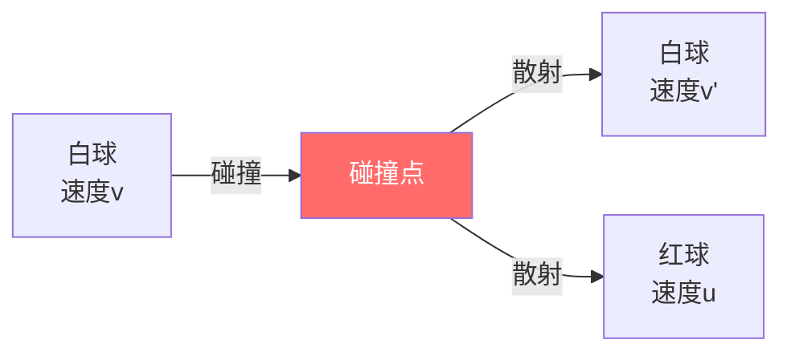

**散射的结果**：

- 白球改变方向和速度
- 红球获得动量
- 总动量守恒

通过测量散射后的速度和角度，可以推断：

- 球的质量
- 碰撞的弹性系数
- 相互作用的时间

---

## 量子散射：S矩阵

在量子力学中，散射用**S矩阵**（散射矩阵）描述。

### 📐 S矩阵的定义

S矩阵连接入态和出态：

$$
|\psi_{\text{out}}\rangle = S |\psi_{\text{in}}\rangle
$$

**S矩阵的性质**：

1. **幺正性**：$S^\dagger S = I$（概率守恒）
2. **能量依赖**：$S = S(\omega)$（$\omega$是能量）
3. **对称性**：反映系统的对称性（时间反演、宇称等）

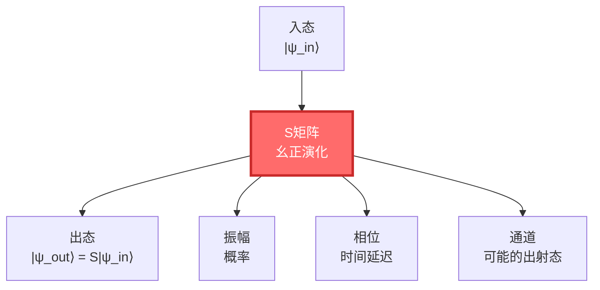

### 🔍 从S矩阵能知道什么？

**例子**：粒子物理实验

在大型对撞机（如LHC）中：

1. **入态**：两个质子对撞
2. **散射**：质子在极高能量下碰撞，产生各种粒子
3. **出态**：探测器观测到的粒子（电子、μ子、光子等）

通过测量S矩阵，物理学家发现了：

- 夸克
- W/Z玻色子
- 希格斯玻色子

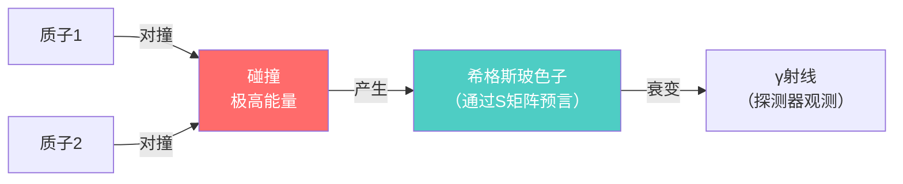

> 💡 **S矩阵是粒子物理的"字典"**：它告诉你"给定入态，可能的出态及其概率"。

---

## 散射延迟：时间从何而来

### ⏱️ Wigner-Smith时间延迟

在散射过程中，粒子在散射区"停留"了多久？

这由**Wigner-Smith时间延迟矩阵**描述：

$$
Q(\omega) = -i S(\omega)^\dagger \frac{\partial S(\omega)}{\partial \omega}
$$

**Q矩阵的物理意义**：

- $Q$ 的本征值 = 不同散射通道的时间延迟
- $\text{tr}\,Q$ = 总时间延迟（所有通道的平均）

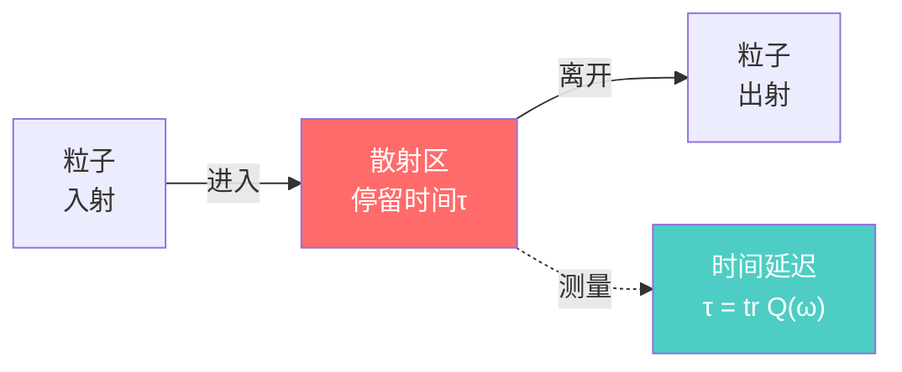

**例子**：隧穿效应

量子隧穿：粒子穿过势垒，即使能量不够

```
     能量
       ↑
       |    ╭──势垒──╮
       |    │       │
  E ──|────┼───→  │  粒子隧穿
       |    │       │
       └────┴───────┴─→ 位置
```

**时间延迟告诉你**：粒子在势垒中"停留"了多久

- 势垒越厚 → 延迟越长
- 能量越低 → 延迟越长

### 🌊 相位与时间

散射过程中，波函数获得一个相位：

$$
\psi_{\text{out}} = e^{i\varphi(\omega)} \psi_{\text{in}}
$$

**关键关系**：

$$
\text{时间延迟} = \frac{\partial \varphi}{\partial \omega}
$$

也就是说：**相位对能量的导数，就是时间延迟！**

> 💡 **这是时间的量子起源**：时间不是外部参数，而是散射相位的导数！

---

## GLS理论：散射即演化

GLS统一理论的核心洞见之一：

> **散射不仅仅是粒子的碰撞，它是时间演化的本质。**

### 🔄 演化 = 散射

想象宇宙是一个巨大的散射系统：

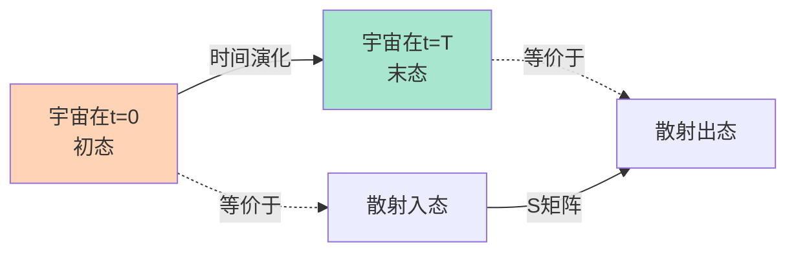

**幺正演化算子** $U(t) = e^{-iHt/\hbar}$ 可以看作能量本征态基下的"散射矩阵"：

$$
U(t) \leftrightarrow S(\omega)
$$

**统一时间刻度同一式的一部分**：

$$
\text{散射延迟} = \frac{1}{2\pi}\text{tr}\,Q(\omega) = \frac{\varphi'(\omega)}{\pi}
$$

翻译：

- **散射延迟**（$\text{tr}\,Q$）= 粒子在散射区停留的时间
- **相位导数**（$\varphi'$）= 波函数相位对能量的变化率

**它们是同一个东西！**

---

## Birman-Kreĭn公式：相位与谱

### 📊 谱移函数

当你给系统加一个扰动（比如势能$V$），能级会移动：

```
    无扰动        有扰动
    ------   →    ------  E₃' (上移)
    ------   →    ------  E₂' (几乎不变)
    ------   →    ------  E₁' (下移)
```

**谱移函数** $\xi(\omega)$ 告诉你：能量在$\omega$附近的能级总共移动了多少

**Birman-Kreĭn公式**：

$$
\det S(\omega) = e^{-2\pi i \xi(\omega)}
$$

也就是说：

- S矩阵的行列式的相位 = 谱移函数
- 谱移函数的导数 = 相对态密度

$$
\rho_{\text{rel}}(\omega) = -\xi'(\omega)
$$

### 🎯 统一时间刻度的完整形式

现在我们可以写出完整的统一时间刻度同一式：

$$
\boxed{\kappa(\omega) = \frac{\varphi'(\omega)}{\pi} = \rho_{\text{rel}}(\omega) = \frac{1}{2\pi}\text{tr}\,Q(\omega)}
$$

**四个等价的量**：

1. $\kappa(\omega)$ = 散射时间延迟（粒子停留多久）
2. $\varphi'(\omega)/\pi$ = 相位导数（波函数旋转多快）
3. $\rho_{\text{rel}}(\omega)$ = 相对态密度（有多少能级）
4. $\text{tr}\,Q(\omega)/2\pi$ = Wigner-Smith延迟的迹

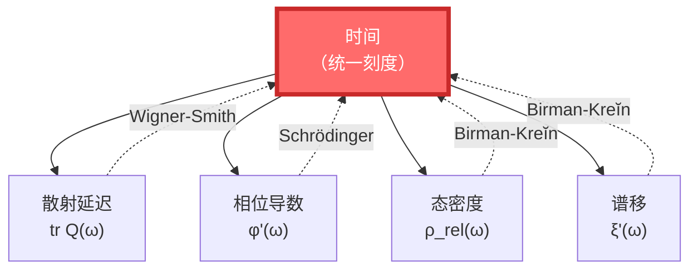

> 💡 **深刻洞见**：时间不是一个外部钟表，而是系统内在的散射-相位-谱结构的涌现。

---

## 散射实验：如何测量S矩阵

### 🔬 经典散射实验

**卢瑟福散射**（1909）：

- α粒子射向金箔
- 观察散射角度分布
- 发现原子核

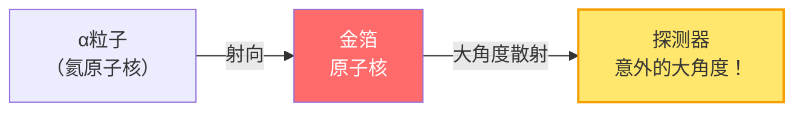

**结论**：原子不是"葡萄干布丁"，而是有一个极小、极密的核！

### ⚛️ 现代散射实验

**大型强子对撞机（LHC）**：

1. 加速质子到接近光速（99.9999991%光速）
2. 让两束质子对撞
3. 观察散射产物（各种粒子）
4. 重构S矩阵，寻找新物理

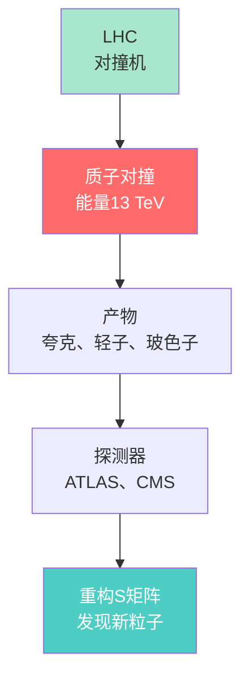

**重大发现**：

- 2012年：希格斯玻色子（$H$）
- 验证了标准模型的预言
- 诺贝尔奖（2013）

---

## 散射与边界

散射和边界有什么关系？

在GLS理论中，**散射发生在边界上**！

### 🎭 边界散射图景

想象一个因果钻石：

```
      未来顶点
       /|\
      / | \
     /  |  \  散射区
    /   |   \  (边界)
   /____|____\
   边界  |  边界
        |
      过去顶点
```

**散射的两种理解**：

1. **体积观点**：粒子在内部运动，受势能影响
2. **边界观点**：粒子在边界上散射，内部是"空的"

**GLS理论说**：边界观点才是基本的！

- 散射数据（S矩阵）定义在边界上
- 体积中的"演化"是从边界数据重构的

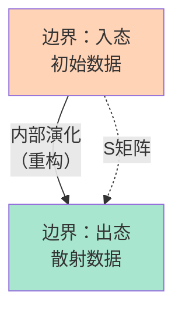

这又是全息原理的体现！

---

## 小结：散射的多重面孔

| 视角 | 散射是什么 | 核心思想 | 比喻 |
|------|-----------|---------|------|
| **日常** | 回声 | 声波反射，推断环境 | 山谷回声 |
| **经典物理** | 粒子碰撞 | 动量交换，轨迹改变 | 台球碰撞 |
| **量子力学** | S矩阵 | 幺正演化，概率幅 | 入态→出态 |
| **粒子物理** | 发现新粒子 | 高能对撞，观测产物 | LHC实验 |
| **GLS理论** | 时间的起源 | 散射延迟=时间 | 相位的导数 |

### 🎯 核心要点

1. **S矩阵**：连接入态和出态的幺正算子
2. **Wigner-Smith延迟**：$Q(\omega) = -iS^\dagger \partial_\omega S$
3. **时间延迟**：$\text{tr}\,Q$ = 粒子在散射区停留的时间
4. **Birman-Kreĭn公式**：$\det S(\omega) = e^{-2\pi i \xi(\omega)}$
5. **统一刻度**：散射延迟 = 相位导数 = 态密度

### 💡 最深刻的洞见

> **时间不是外部钟表，而是散射过程的内在延迟。宇宙的演化，本质上就是一个巨大的散射过程。**

就像回声告诉你山洞的形状，散射告诉你宇宙的结构——甚至告诉你时间本身是什么。

---

## 接下来

我们理解了散射。最后一个基础概念是：**熵**。

- 为什么时间有方向？
- 为什么熵总是增加？
- 熵和因果、散射有什么关系？

这些问题的答案，就在下一篇：

[下一篇：熵是什么？ →](05-what-is-entropy.md)

---

**记住**：散射不是简单的"碰撞"，而是物理世界获取信息、演化、甚至定义时间的基本过程。理解散射，你就理解了宇宙如何"运行"。

[← 上一篇：边界是什么](03-what-is-boundary.md) | [返回主页](../index.md) | [下一篇：熵是什么 →](05-what-is-entropy.md)
