# What is Scattering?

> "Echoes tell you the shape of a cave. Scattering tells you properties of particles, even tells you what time itself is."

[← Previous: What is Boundary](03-what-is-boundary_en.md) | [Back to Home](../index_en.md) | [Next: What is Entropy →](05-what-is-entropy_en.md)

---

## Starting from Echoes

Stand in a valley and shout: "Hello—"

A few seconds later, you hear the echo: "Hello—"

### 🗻 What Does Echo Tell You?


Through echo, you can infer:

1. **Distance**: Delay time × Sound speed ÷ 2 = Distance to mountain wall
2. **Shape**: Direction of echo → Shape of mountain wall
3. **Material**: Timbre change of echo → Properties of rock

> 💡 **Key Insight**: You "emit" sound waves into valley, mountain wall "scatters" sound waves, you receive scattered sound waves, thus learning about the valley.

This is the basic idea of **scattering**!

---

## What is Scattering?

In physics, scattering refers to:

> **Process where objects (particles, waves) interact with another object and change direction or properties.**

### 📊 Three Elements of Scattering

```mermaid
graph LR
    Input["Incident<br/>Initial State |ψ_in⟩"] -->|interaction| Scattering["Scattering Region<br/>Potential V(r)"]
    Scattering -->|after scattering| Output["Outgoing<br/>Final State |ψ_out⟩"]

    style Scattering fill:#ff6b6b,color:#fff
```



**Three Key Parts**:

1. **In-State** $|\psi_{\text{in}}\rangle$: State before scattering
2. **Scattering Region**: Region where interaction occurs
3. **Out-State** $|\psi_{\text{out}}\rangle$: State after scattering

### 🎱 Classical Example: Billiard Ball Collision

On a billiard table, white ball hits red ball:


**Scattering Results**:

- White ball changes direction and speed
- Red ball gains momentum
- Total momentum conserved

By measuring scattered velocities and angles, can infer:

- Mass of balls
- Elastic coefficient of collision
- Interaction time

---

## Quantum Scattering: S-Matrix

In quantum mechanics, scattering is described by the **S-matrix** (scattering matrix).

### 📐 Definition of S-Matrix

S-matrix connects in-state and out-state:

$$
|\psi_{\text{out}}\rangle = S |\psi_{\text{in}}\rangle
$$

**Properties of S-Matrix**:

1. **Unitarity**: $S^\dagger S = I$ (probability conservation)
2. **Energy Dependent**: $S = S(\omega)$ ($\omega$ is energy)
3. **Symmetry**: Reflects system symmetries (time reversal, parity, etc.)

```mermaid
graph TB
    In["In-State<br/>|ψ_in⟩"] --> SMatrix["S-Matrix<br/>Unitary Evolution"]
    SMatrix --> Out["Out-State<br/>|ψ_out⟩ = S|ψ_in⟩"]

    SMatrix --> Info1["Amplitude<br/>Probability"]
    SMatrix --> Info2["Phase<br/>Time Delay"]
    SMatrix --> Info3["Channels<br/>Possible Out-States"]

    style SMatrix fill:#ff6b6b,stroke:#c92a2a,stroke-width:3px,color:#fff
```



### 🔍 What Can We Learn from S-Matrix?

**Example**: Particle Physics Experiments

In large colliders (like LHC):

1. **In-State**: Two protons collide
2. **Scattering**: Protons collide at extremely high energy, produce various particles
3. **Out-State**: Particles observed by detectors (electrons, muons, photons, etc.)

By measuring S-matrix, physicists discovered:

- Quarks
- W/Z bosons
- Higgs boson


> 💡 **S-Matrix is the "Dictionary" of Particle Physics**: It tells you "given in-state, possible out-states and their probabilities."

---

## Scattering Delay: Where Does Time Come From

### ⏱️ Wigner-Smith Time Delay

In scattering process, how long does a particle "stay" in the scattering region?

This is described by **Wigner-Smith Time Delay Matrix**:

$$
Q(\omega) = -i S(\omega)^\dagger \frac{\partial S(\omega)}{\partial \omega}
$$

**Physical Meaning of Q-Matrix**:

- Eigenvalues of $Q$ = Time delays of different scattering channels
- $\text{tr}\,Q$ = Total time delay (average over all channels)

```mermaid
graph LR
    Particle["Particle<br/>Incident"] -->|enter| Zone["Scattering Region<br/>Stay Time τ"]
    Zone -->|leave| Out["Particle<br/>Outgoing"]

    Zone -.measure.-> Delay["Time Delay<br/>τ = tr Q(ω)"]

    style Zone fill:#ff6b6b,color:#fff
    style Delay fill:#4ecdc4,color:#fff
```



**Example**: Tunneling Effect

Quantum tunneling: Particle passes through potential barrier, even if energy insufficient

```
     Energy
       ↑
       |    ╭──Potential Barrier──╮
       |    │                     │
  E ──|────┼───→  │   Particle Tunnels
       |    │                     │
       └────┴─────────────────────┴─→ Position
```

**Time Delay Tells You**: How long particle "stays" in barrier

- Thicker barrier → Longer delay
- Lower energy → Longer delay

### 🌊 Phase and Time

In scattering process, wave function acquires a phase:

$$
\psi_{\text{out}} = e^{i\varphi(\omega)} \psi_{\text{in}}
$$

**Key Relationship**:

$$
\text{Time Delay} = \frac{\partial \varphi}{\partial \omega}
$$

That is: **Derivative of phase with respect to energy is time delay!**

> 💡 **GLS Theory Proposes**: This might be the quantum origin of time—time might not be an external parameter, but the derivative of scattering phase!

---

## GLS Theory: Scattering is Evolution

One of GLS unified theory's core insights:

> **GLS theory argues: Scattering is not just particle collisions, it might be the essence of time evolution.**

### 🔄 Evolution = Scattering

Imagine universe as a huge scattering system:


**Unitary Evolution Operator** $U(t) = e^{-iHt/\hbar}$ can be seen as "scattering matrix" in energy eigenstate basis:

$$
U(t) \leftrightarrow S(\omega)
$$

**Part of Unified Time Scale Identity**:

$$
\text{Scattering Delay} = \frac{1}{2\pi}\text{tr}\,Q(\omega) = \frac{\varphi'(\omega)}{\pi}
$$

Translation:

- **Scattering Delay** ($\text{tr}\,Q$) = Time particle stays in scattering region
- **Phase Derivative** ($\varphi'$) = Rate of change of wave function phase with respect to energy

**In the GLS framework, they are mathematically equivalent!**

---

## Birman-Kreĭn Formula: Phase and Spectrum

### 📊 Spectral Shift Function

When you add a perturbation to system (like potential $V$), energy levels shift:

```
    No Perturbation         With Perturbation
    ------   →    ------  E₃' (shifted up)
    ------   →    ------  E₂' (almost unchanged)
    ------   →    ------  E₁' (shifted down)
```

**Spectral Shift Function** $\xi(\omega)$ tells you: Total shift of energy levels near $\omega$

**Birman-Kreĭn Formula**:

$$
\det S(\omega) = e^{-2\pi i \xi(\omega)}
$$

That is:

- Phase of S-matrix determinant = Spectral shift function
- Derivative of spectral shift function = Relative density of states

$$
\rho_{\text{rel}}(\omega) = -\xi'(\omega)
$$

### 🎯 Complete Form of Unified Time Scale

Now we can write the complete unified time scale identity:

$$
\boxed{\kappa(\omega) = \frac{\varphi'(\omega)}{\pi} = \rho_{\text{rel}}(\omega) = \frac{1}{2\pi}\text{tr}\,Q(\omega)}
$$

**Four Equivalent Quantities**:

1. $\kappa(\omega)$ = Scattering time delay (how long particle stays)
2. $\varphi'(\omega)/\pi$ = Phase derivative (how fast wave function rotates)
3. $\rho_{\text{rel}}(\omega)$ = Relative density of states (how many energy levels)
4. $\text{tr}\,Q(\omega)/2\pi$ = Trace of Wigner-Smith delay

```mermaid
graph TD
    Center["Time<br/>(Unified Scale)"] --> Delay["Scattering Delay<br/>tr Q(ω)"]
    Center --> Phase["Phase Derivative<br/>φ'(ω)"]
    Center --> Density["Density of States<br/>ρ_rel(ω)"]
    Center --> Spectral["Spectral Shift<br/>ξ'(ω)"]

    Delay -.Wigner-Smith.-> Center
    Phase -.Schrödinger.-> Center
    Density -.Birman-Kreĭn.-> Center
    Spectral -.Birman-Kreĭn.-> Center

    style Center fill:#ff6b6b,stroke:#c92a2a,stroke-width:4px,color:#fff
```



> 💡 **Core Insight of GLS Theory**: Time might not be an external clock, but an intrinsic emergent property of scattering-phase-spectrum structure.

---

## Scattering Experiments: How to Measure S-Matrix

### 🔬 Classical Scattering Experiment

**Rutherford Scattering** (1909):

- α particles shot at gold foil
- Observe scattering angle distribution
- Discovered atomic nucleus

```mermaid
graph LR
    Alpha["α Particles<br/>(Helium Nuclei)"] -->|shot at| Gold["Gold Foil<br/>Atomic Nuclei"]
    Gold -->|large angle scattering| Detector["Detector<br/>Unexpected Large Angles!"]

    style Gold fill:#ff6b6b,color:#fff
    style Detector fill:#ffe66d,stroke:#f59f00,stroke-width:2px
```



**Conclusion**: Atom is not "plum pudding," but has an extremely small, dense nucleus!

### ⚛️ Modern Scattering Experiments

**Large Hadron Collider (LHC)**:

1. Accelerate protons to near light speed (99.9999991% of c)
2. Collide two proton beams
3. Observe scattering products (various particles)
4. Reconstruct S-matrix, search for new physics


**Major Discoveries**:

- 2012: Higgs boson ($H$)
- Verified standard model predictions
- Nobel Prize (2013)

---

## Scattering and Boundary

What's the relationship between scattering and boundary?

In GLS theory, **scattering occurs on boundary**!

### 🎭 Boundary Scattering Picture

Imagine a causal diamond:

```
      Future Vertex
       /|\
      / | \
     /  |  \  Scattering Region
    /   |   \  (Boundary)
   /____|____\
   Boundary  |  Boundary
        |
      Past Vertex
```

**Two Understandings of Scattering**:

1. **Bulk View**: Particles move in interior, affected by potential
2. **Boundary View**: Particles scatter on boundary, interior is "empty"

**GLS Theory Advocates**: Boundary view might be more fundamental!

- Scattering data (S-matrix) defined on boundary
- "Evolution" in bulk is reconstructed from boundary data

```mermaid
graph TB
    Boundary1["Boundary: In-State<br/>Initial Data"] -->|Bulk Evolution<br/>(Reconstruction)| Boundary2["Boundary: Out-State<br/>Scattering Data"]

    Boundary1 -.S-Matrix.-> Boundary2

    style Boundary1 fill:#ffd3b6
    style Boundary2 fill:#a8e6cf
```

This is another manifestation of holographic principle!

---

## Summary: Multiple Faces of Scattering

| Perspective | What is Scattering | Core Idea | Analogy |
|------------|-------------------|-----------|---------|
| **Everyday** | Echo | Sound reflection, infer environment | Valley echo |
| **Classical Physics** | Particle Collision | Momentum exchange, trajectory change | Billiard collision |
| **Quantum Mechanics** | S-Matrix | Unitary evolution, probability amplitude | In-state→Out-state |
| **Particle Physics** | Discovering New Particles | High-energy collision, observe products | LHC experiments |
| **GLS Theory** | Origin of Time | Scattering delay=Time | Derivative of phase |

### 🎯 Key Points

1. **S-Matrix**: Unitary operator connecting in-state and out-state
2. **Wigner-Smith Delay**: $Q(\omega) = -iS^\dagger \partial_\omega S$
3. **Time Delay**: $\text{tr}\,Q$ = Time particle stays in scattering region
4. **Birman-Kreĭn Formula**: $\det S(\omega) = e^{-2\pi i \xi(\omega)}$
5. **Unified Scale**: Scattering delay = Phase derivative = Density of states

### 💡 Most Profound Insight

> **GLS theory proposes: Time might not be an external clock, but intrinsic delay of scattering processes. Evolution of universe is essentially a huge scattering process.**

Just as echo tells you the shape of a cave, scattering tells you the structure of universe—even what time itself is.

---

## What's Next

We understand scattering. The last fundamental concept is: **Entropy**.

- Why does time have direction?
- Why does entropy always increase?
- What's the relationship between entropy and causality, scattering?

Answers to these questions are in the next article:

[Next: What is Entropy? →](05-what-is-entropy_en.md)

---

**Remember**: Scattering is not simple "collision," but the fundamental process by which physical world acquires information, evolves, and even defines time. Understanding scattering, you understand how the universe "runs."

[← Previous: What is Boundary](03-what-is-boundary_en.md) | [Back to Home](../index_en.md) | [Next: What is Entropy →](05-what-is-entropy_en.md)

