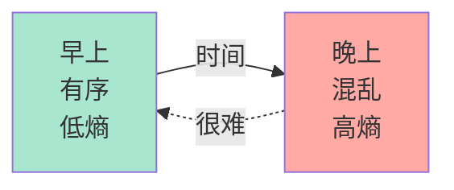
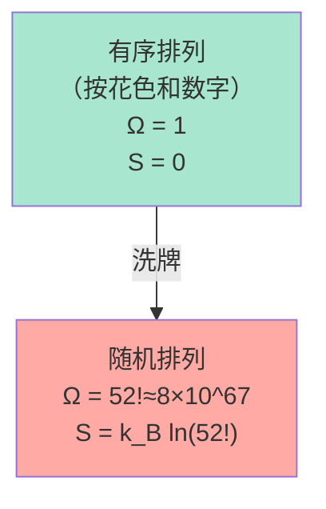
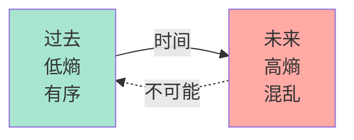
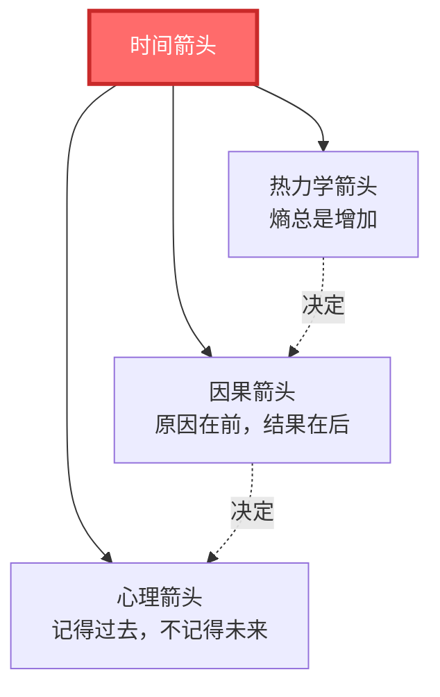
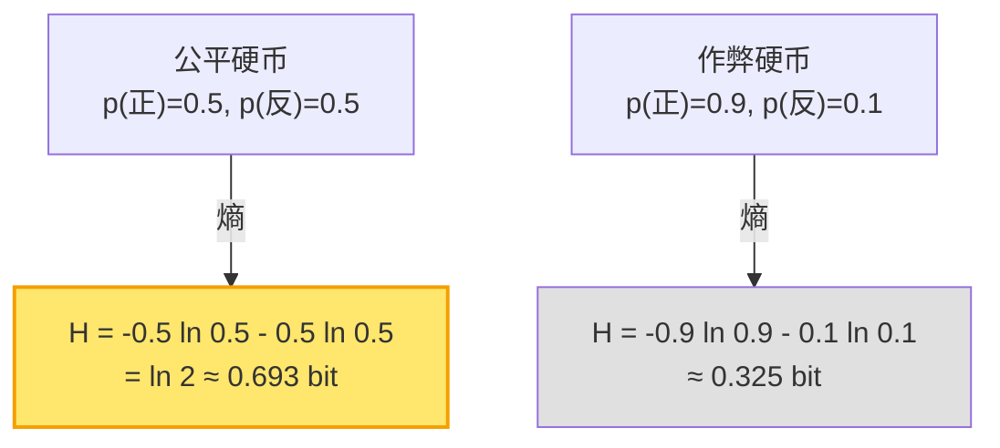
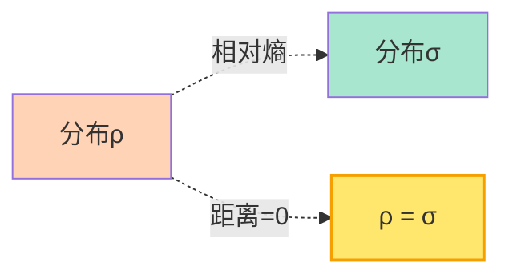
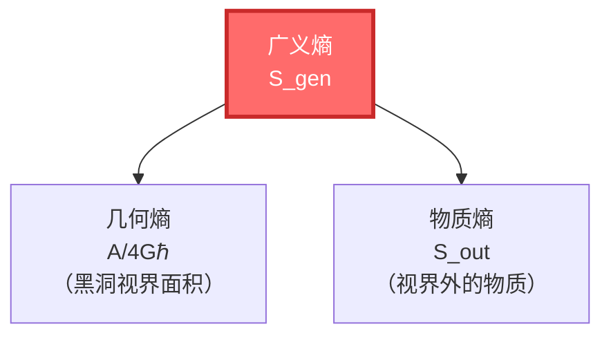
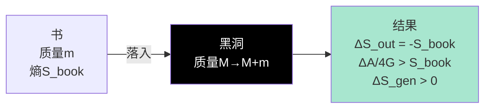
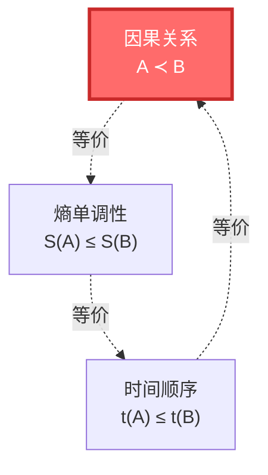
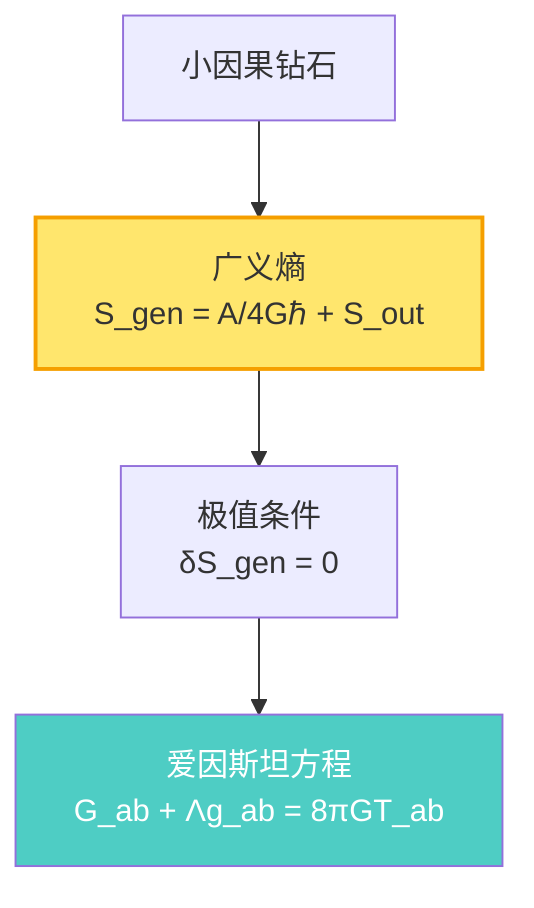

# 熵是什么？

> "熵是时间之箭，是宇宙不可逆的见证，是从秩序走向混沌的度量——但它远比你想象的更深刻。"

[← 上一篇：散射是什么](04-what-is-scattering.md) | [返回主页](../index.md) | [下一篇：基础篇小结 →](06-foundation-summary.md)

---

## 从房间的混乱开始

想象你的房间：

**早上（刚整理完）**：
- 书整齐地放在书架上
- 衣服叠好在衣柜里
- 桌面干净整洁

**晚上（一天后）**：
- 书散落在桌上、床上
- 衣服堆在椅子上
- 桌面一片狼藉

**问题**：为什么房间总是越来越乱？为什么它不会自己变整洁？

**答案**：**熵**（entropy）

---

## 熵的定义：混乱的度量

### 📊 统计定义（玻尔兹曼）

**熵**是系统"混乱度"或"可能的微观状态数"的度量。

玻尔兹曼公式：

$$
S = k_B \ln \Omega
$$

其中：
- $S$ = 熵
- $k_B$ = 玻尔兹曼常数
- $\Omega$ = 微观状态数（有多少种方式实现这个宏观状态）

**例子**：扑克牌

- **有序排列**：只有一种方式（A♠, 2♠, ..., K♠, A♥, ...）
  - $\Omega = 1$，$S = 0$

- **随机排列**：有 $52! \approx 8 \times 10^{67}$ 种方式
  - $\Omega = 52!$，$S = k_B \ln(52!)$ （巨大）

> 💡 **关键洞见**：熵大=混乱=可能性多；熵小=有序=可能性少

### 🌡️ 热力学定义（克劳修斯）

在热力学中，熵定义为：

$$
dS = \frac{dQ_{\text{rev}}}{T}
$$

其中：
- $dS$ = 熵的变化
- $dQ_{\text{rev}}$ = 可逆过程中的热量转移
- $T$ = 温度

**物理意义**：

- 熵衡量"不可用的能量"
- 温度越低，同样的热量对应更大的熵变
- 不可逆过程会产生熵

---

## 热力学第二定律：熵总是增加

### 📈 宇宙最重要的定律

**热力学第二定律**：

> 在一个孤立系统中，熵总是增加或保持不变，永不减少。

$$
\Delta S_{\text{孤立系统}} \geq 0
$$

**例子**：

1. **冰块融化**：有序的晶体 → 无序的水（熵增）
2. **香水扩散**：集中的香水分子 → 均匀分布（熵增）
3. **打碎鸡蛋**：完整的蛋壳 → 碎片（熵增）
4. **宇宙膨胀**：密集的大爆炸 → 稀疏的星系（熵增）

### ⏰ 熵与时间箭头

为什么我们记得过去，不记得未来？为什么时间有方向？

**答案**：因为熵在增加！

**三种箭头，一个本质**：

1. **热力学箭头**：熵增的方向
2. **因果箭头**：因在前，果在后
3. **心理箭头**：记忆的方向

它们都指向同一个方向——**熵增的方向**！

---

## 信息熵：惊讶的度量

### 📡 香农熵

信息论中，熵衡量"信息量"或"不确定性"。

香农熵公式：

$$
H = -\sum_{i} p_i \ln p_i
$$

其中：
- $H$ = 信息熵
- $p_i$ = 事件$i$发生的概率

**例子**：抛硬币

- **公平硬币**：最不确定（$H$最大）
- **作弊硬币**：比较确定（$H$较小）
- **确定结果**：完全确定（$H = 0$）

> 💡 **关键洞见**：熵 = 惊讶程度。越不确定的事，发生时越惊讶，熵越大。

### 🔗 信息熵 = 热力学熵

令人震撼的是，**物理学界普遍认为：信息熵和热力学熵本质上有着深刻的联系**！

兰道尔原理：

> 擦除1 bit信息，至少要耗散 $k_B T \ln 2$ 的能量，产生 $k_B \ln 2$ 的熵。

这说明：**信息是物理的**！

---

## 相对熵：距离的度量

### 📏 Kullback-Leibler散度

相对熵（KL散度）衡量两个概率分布的"距离"：

$$
D(\rho \| \sigma) = \sum_i \rho_i \ln \frac{\rho_i}{\sigma_i}
$$

或连续版本：

$$
D(\rho \| \sigma) = \int \rho(x) \ln \frac{\rho(x)}{\sigma(x)} dx
$$

**性质**：

1. **非负性**：$D(\rho \| \sigma) \geq 0$
2. **不对称**：$D(\rho \| \sigma) \neq D(\sigma \| \rho)$
3. **单调性**：在某些演化下单调递减

**物理意义**：

在GLS理论中，相对熵的单调性被视为**时间箭头的基础**！

$$
\frac{dD(\rho_t \| \rho_{\text{平衡}})}{dt} \leq 0
$$

系统总是向平衡态演化，相对熵单调递减。

---

## 广义熵：面积 + 物质

### 🕳️ 黑洞的广义熵

在引力系统中，熵不仅包括物质的熵，还包括**几何的熵**：

$$
S_{\text{gen}} = \underbrace{\frac{A}{4G\hbar}}_{\text{几何熵}} + \underbrace{S_{\text{out}}}_{\text{物质熵}}
$$

**贝肯斯坦-霍金熵**：

黑洞的熵正比于视界面积：

$$
S_{\text{BH}} = \frac{A}{4G\hbar} = \frac{k_B c^3}{4G\hbar} A
$$

**例子**：太阳质量黑洞

- 质量：$M_\odot \approx 2 \times 10^{30}$ kg
- 史瓦西半径：$r_s \approx 3$ km
- 面积：$A = 4\pi r_s^2 \approx 10^{14}$ m²
- 熵：$S_{\text{BH}} \approx 10^{54} k_B$

这是**巨大的**！比同质量气体的熵大得多。

### 📊 广义第二定律

**广义第二定律**（GSL）：

> 广义熵总是增加或不变。

$$
\Delta S_{\text{gen}} = \Delta \left( \frac{A}{4G\hbar} \right) + \Delta S_{\text{out}} \geq 0
$$

**霍金的思想实验**：

向黑洞扔一本书：

1. 书掉进黑洞 → 外部物质熵减少（$\Delta S_{\text{out}} < 0$）
2. 黑洞质量增加 → 视界面积增加（$\Delta A > 0$）
3. **总效果**：$\Delta S_{\text{gen}} > 0$（广义熵仍然增加）

---

## 熵与因果：GLS理论的统一

在GLS统一理论中，熵扮演着核心角色：

### 🔗 因果 = 熵单调

还记得我们在"因果是什么"中说的吗？

$$
A \prec B \quad \Leftrightarrow \quad S(A) \leq S(B)
$$

**GLS理论推论：因果顺序在数学上等价于熵的单调性！**

这意味着：

- 说"A在B之前" = 说"A的熵≤B的熵"
- 时间箭头 = 熵增方向
- 因果关系 = 熵的偏序关系

### 📐 小因果钻石上的熵极值

GLS理论的核心洞见之一：

> **GLS理论推导表明**：在小因果钻石上，广义熵取极值，当且仅当爱因斯坦方程成立。

**信息几何变分原理**（IGVP）：

$$
\delta S_{\text{gen}} = 0 \quad \Rightarrow \quad G_{ab} + \Lambda g_{ab} = 8\pi G T_{ab}
$$

翻译成人话：

- 在小因果钻石上，要求广义熵取极值
- 这个极值条件，自动导出爱因斯坦方程！

**意义**：

**GLS理论认为**：引力可能不是基本力，而是**熵极值的几何涌现**！

就像肥皂泡自动形成球形（表面积最小），时空自动满足爱因斯坦方程（熵极值）！

---

## 熵的深层意义

### 🌌 宇宙的终极命运

如果熵总是增加，宇宙的最终状态是什么？

**热寂**（heat death）：

- 所有能量均匀分布
- 没有温度差
- 没有可用能量做功
- 熵达到最大值
- 时间"停止"（没有变化）

**时间尺度**：约 $10^{100}$ 年（远远超过宇宙当前年龄138亿年）

### 🤔 低熵的过去之谜

如果熵总是增加，为什么宇宙开始时（大爆炸）熵这么低？

这是物理学未解之谜之一！

**可能的解释**：

1. **宇宙学原理**：宇宙开始时的初始条件就是低熵的（但为什么？）
2. **引力的特殊性**：引力系统的熵与其他系统不同
3. **多元宇宙**：我们的宇宙是众多宇宙中碰巧低熵的一个
4. **GLS理论**：边界条件可能决定了初始低熵

---

## 小结：熵的多重面孔

| 视角 | 熵是什么 | 公式 | 比喻 |
|------|---------|------|-----|
| **统计力学** | 微观状态数 | $S = k_B \ln \Omega$ | 房间的混乱度 |
| **热力学** | 不可用能量 | $dS = dQ/T$ | 散失的能量 |
| **信息论** | 不确定性 | $H = -\sum p_i \ln p_i$ | 惊讶程度 |
| **黑洞物理** | 视界面积 | $S = A/4G\hbar$ | 全息编码 |
| **相对熵** | 分布距离 | $D(\rho\|\sigma)$ | KL散度 |
| **GLS理论** | 因果顺序 | $A \prec B \Leftrightarrow S(A) \leq S(B)$ | 时间箭头 |

### 🎯 核心要点

1. **热力学第二定律**：熵总是增加（孤立系统）
2. **时间箭头**：熵增的方向就是时间的方向
3. **信息=物理**：信息熵和热力学熵本质相同
4. **广义熵**：$S_{\text{gen}} = A/4G\hbar + S_{\text{out}}$
5. **因果=熵**：因果顺序等价于熵的单调性
6. **IGVP**：熵极值导出爱因斯坦方程

### 💡 最深刻的洞见

> **GLS理论提出：熵不仅是"混乱度"，它可能是时间之箭、因果之序、引力之源。宇宙的一切演化，本质上可能是熵增的过程。**

熵把热力学、信息论、引力、因果统一起来：

- 热力学：熵 = 能量的耗散
- 信息论：熵 = 信息的度量
- 引力：熵 = 视界的面积
- 因果：熵 = 时间的箭头

**它们都是同一个"熵"的不同侧面！**

---

## 接下来

恭喜！你已经学完了五个基础概念：时间、因果、边界、散射、熵。

现在是时候总结一下，看看它们如何拼成一个完整的图景：

[下一篇：基础篇小结 →](06-foundation-summary.md)

在那里，我们会看到这五个概念如何在GLS统一理论中融为一体。

---

**记住**：熵是宇宙最深刻的概念之一。它不仅告诉我们"为什么房间会变乱"，更告诉我们"为什么时间有方向"、"为什么引力存在"、"为什么宇宙在演化"。理解熵，你就理解了宇宙变化的本质。

[← 上一篇：散射是什么](04-what-is-scattering.md) | [返回主页](../index.md) | [下一篇：基础篇小结 →](06-foundation-summary.md)
