# What is Entropy?

> "Entropy is the arrow of time, the witness of the universe's irreversibility, the measure from order to chaos—but it is far deeper than you imagine."

[← Previous: What is Scattering](04-what-is-scattering_en.md) | [Back to Home](../index_en.md) | [Next: Foundation Summary →](06-foundation-summary_en.md)

---

## Starting from Room Chaos

Imagine your room:

**Morning (just tidied)**:
- Books neatly arranged on shelves
- Clothes folded in wardrobe
- Desk clean and tidy

**Evening (after a day)**:
- Books scattered on table and bed
- Clothes piled on chair
- Desk in complete disarray

**Question**: Why does the room always get messier? Why doesn't it tidy itself?

**Answer**: **Entropy**

---

## Definition of Entropy: Measure of Chaos

### 📊 Statistical Definition (Boltzmann)

**Entropy** is a measure of the system's "chaos" or "number of possible microstates."

Boltzmann formula:

$$
S = k_B \ln \Omega
$$

where:
- $S$ = entropy
- $k_B$ = Boltzmann constant
- $\Omega$ = number of microstates (how many ways to realize this macrostate)

**Example**: Playing cards

```mermaid
graph TB
    Ordered["Ordered Arrangement<br/>(by suit and rank)<br/>Ω = 1<br/>S = 0"] -->|shuffle| Random["Random Arrangement<br/>Ω = 52!≈8×10^67<br/>S = k_B ln(52!)"]

    style Ordered fill:#a8e6cf
    style Random fill:#ffaaa5
```

- **Ordered arrangement**: Only one way (A♠, 2♠, ..., K♠, A♥, ...)
  - $\Omega = 1$, $S = 0$

- **Random arrangement**: There are $52! \approx 8 \times 10^{67}$ ways
  - $\Omega = 52!$, $S = k_B \ln(52!)$ (huge)

> 💡 **Key Insight**: High entropy = chaos = many possibilities; Low entropy = order = few possibilities

### 🌡️ Thermodynamic Definition (Clausius)

In thermodynamics, entropy is defined as:

$$
dS = \frac{dQ_{\text{rev}}}{T}
$$

where:
- $dS$ = change in entropy
- $dQ_{\text{rev}}$ = heat transfer in reversible process
- $T$ = temperature

**Physical meaning**:

- Entropy measures "unavailable energy"
- Lower temperature means same heat corresponds to larger entropy change
- Irreversible processes produce entropy

---

## Second Law of Thermodynamics: Entropy Always Increases

### 📈 The Most Important Law of the Universe

**Second Law of Thermodynamics**:

> In an isolated system, entropy always increases or remains constant, never decreases.

$$
\Delta S_{\text{isolated system}} \geq 0
$$

**Examples**:

1. **Ice melting**: Ordered crystal → Disordered water (entropy increase)
2. **Perfume diffusion**: Concentrated perfume molecules → Uniform distribution (entropy increase)
3. **Breaking an egg**: Intact shell → Fragments (entropy increase)
4. **Universe expansion**: Dense Big Bang → Sparse galaxies (entropy increase)

### ⏰ Entropy and Time Arrow

Why do we remember the past but not the future? Why does time have a direction?

**Answer**: Because entropy is increasing!

**Three arrows, one essence**:

1. **Thermodynamic arrow**: Direction of entropy increase
2. **Causal arrow**: Cause before effect
3. **Psychological arrow**: Direction of memory

They all point in the same direction—**the direction of entropy increase**!

---

## Information Entropy: Measure of Surprise

### 📡 Shannon Entropy

In information theory, entropy measures "information content" or "uncertainty."

Shannon entropy formula:

$$
H = -\sum_{i} p_i \ln p_i
$$

where:
- $H$ = information entropy
- $p_i$ = probability of event $i$ occurring

**Example**: Coin toss

```mermaid
graph TB
    Fair["Fair Coin<br/>p(heads)=0.5, p(tails)=0.5"] -->|entropy| H1["H = -0.5 ln 0.5 - 0.5 ln 0.5<br/>= ln 2 ≈ 0.693 bit"]

    Biased["Biased Coin<br/>p(heads)=0.9, p(tails)=0.1"] -->|entropy| H2["H = -0.9 ln 0.9 - 0.1 ln 0.1<br/>≈ 0.325 bit"]

    style H1 fill:#ffe66d,stroke:#f59f00,stroke-width:2px
    style H2 fill:#e0e0e0
```

- **Fair coin**: Most uncertain ($H$ maximum)
- **Biased coin**: Relatively certain ($H$ smaller)
- **Deterministic outcome**: Completely certain ($H = 0$)

> 💡 **Key Insight**: Entropy = degree of surprise. The more uncertain something is, the more surprising when it occurs, the greater the entropy.

### 🔗 Information Entropy = Thermodynamic Entropy

Remarkably, **information entropy and thermodynamic entropy are essentially the same thing**!

Landauer's principle:

> Erasing 1 bit of information requires dissipating at least $k_B T \ln 2$ of energy, producing $k_B \ln 2$ of entropy.

This shows: **Information is physical**!

---

## Relative Entropy: Measure of Distance

### 📏 Kullback-Leibler Divergence

Relative entropy (KL divergence) measures the "distance" between two probability distributions:

$$
D(\rho \| \sigma) = \sum_i \rho_i \ln \frac{\rho_i}{\sigma_i}
$$

Or continuous version:

$$
D(\rho \| \sigma) = \int \rho(x) \ln \frac{\rho(x)}{\sigma(x)} dx
$$

**Properties**:

1. **Non-negativity**: $D(\rho \| \sigma) \geq 0$
2. **Asymmetry**: $D(\rho \| \sigma) \neq D(\sigma \| \rho)$
3. **Monotonicity**: Monotonically decreasing under certain evolutions

```mermaid
graph LR
    Rho["Distribution ρ"] -.relative entropy.-> Sigma["Distribution σ"]
    Rho -.distance=0.-> Rho2["ρ = σ"]

    style Rho fill:#ffd3b6
    style Sigma fill:#a8e6cf
    style Rho2 fill:#ffe66d,stroke:#f59f00,stroke-width:2px
```

**Physical meaning**:

In GLS theory, the monotonicity of relative entropy is the **foundation of the time arrow**!

$$
\frac{dD(\rho_t \| \rho_{\text{equilibrium}})}{dt} \leq 0
$$

The system always evolves toward equilibrium, relative entropy monotonically decreasing.

---

## Generalized Entropy: Area + Matter

### 🕳️ Generalized Entropy of Black Holes

In gravitational systems, entropy includes not only matter entropy but also **geometric entropy**:

$$
S_{\text{gen}} = \underbrace{\frac{A}{4G\hbar}}_{\text{geometric entropy}} + \underbrace{S_{\text{out}}}_{\text{matter entropy}}
$$

**Bekenstein-Hawking entropy**:

Black hole entropy is proportional to horizon area:

$$
S_{\text{BH}} = \frac{A}{4G\hbar} = \frac{k_B c^3}{4G\hbar} A
$$

**Example**: Solar mass black hole

- Mass: $M_\odot \approx 2 \times 10^{30}$ kg
- Schwarzschild radius: $r_s \approx 3$ km
- Area: $A = 4\pi r_s^2 \approx 10^{14}$ m²
- Entropy: $S_{\text{BH}} \approx 10^{54} k_B$

This is **enormous**! Much larger than the entropy of gas of the same mass.

### 📊 Generalized Second Law

**Generalized Second Law** (GSL):

> Generalized entropy always increases or remains constant.

$$
\Delta S_{\text{gen}} = \Delta \left( \frac{A}{4G\hbar} \right) + \Delta S_{\text{out}} \geq 0
$$

**Hawking's thought experiment**:

Throw a book into a black hole:

1. Book falls into black hole → External matter entropy decreases ($\Delta S_{\text{out}} < 0$)
2. Black hole mass increases → Horizon area increases ($\Delta A > 0$)
3. **Total effect**: $\Delta S_{\text{gen}} > 0$ (generalized entropy still increases)

```mermaid
graph LR
    Book["Book<br/>Mass m<br/>Entropy S_book"] -->|falls into| BH["Black Hole<br/>Mass M→M+m"]
    BH --> Result["Result<br/>ΔS_out = -S_book<br/>ΔA/4G > S_book<br/>ΔS_gen > 0"]

    style BH fill:#000,color:#fff
    style Result fill:#a8e6cf
```

---

## Entropy and Causality: Unification in GLS Theory

In GLS unified theory, entropy plays a central role:

### 🔗 Causality = Entropy Monotonicity

Remember what we said in "What is Causality"?

$$
A \prec B \quad \Leftrightarrow \quad S(A) \leq S(B)
$$

**Causal order is equivalent to entropy monotonicity!**

This means:

- Saying "A is before B" = saying "A's entropy ≤ B's entropy"
- Time arrow = direction of entropy increase
- Causality = partial order relation of entropy

```mermaid
graph TD
    Causality["Causality<br/>A ≺ B"] -.equivalent.-> EntropyMonotone["Entropy Monotonicity<br/>S(A) ≤ S(B)"]
    EntropyMonotone -.equivalent.-> TimeOrder["Time Order<br/>t(A) ≤ t(B)"]
    TimeOrder -.equivalent.-> Causality

    style Causality fill:#ff6b6b,stroke:#c92a2a,stroke-width:3px,color:#fff
```

### 📐 Entropy Extremum on Small Causal Diamonds

One of the core insights of GLS theory:

> On small causal diamonds, generalized entropy takes an extremum if and only if Einstein's equation holds.

**Information Geometric Variational Principle** (IGVP):

$$
\delta S_{\text{gen}} = 0 \quad \Rightarrow \quad G_{ab} + \Lambda g_{ab} = 8\pi G T_{ab}
$$

In plain language:

- On small causal diamonds, require generalized entropy to take an extremum
- This extremum condition automatically derives Einstein's equation!

**Significance**:

Gravity is not a fundamental force, but a **geometric emergence of entropy extremum**!

```mermaid
graph TB
    Diamond["Small Causal Diamond"] --> Entropy["Generalized Entropy<br/>S_gen = A/4Gℏ + S_out"]
    Entropy --> Extremum["Extremum Condition<br/>δS_gen = 0"]
    Extremum --> Einstein["Einstein's Equation<br/>G_ab + Λg_ab = 8πGT_ab"]

    style Entropy fill:#ffe66d,stroke:#f59f00,stroke-width:2px
    style Einstein fill:#4ecdc4,color:#fff
```

Just as soap bubbles automatically form spheres (minimum surface area), spacetime automatically satisfies Einstein's equation (entropy extremum)!

---

## Deeper Meaning of Entropy

### 🌌 Ultimate Fate of the Universe

If entropy always increases, what is the final state of the universe?

**Heat death**:

- All energy uniformly distributed
- No temperature differences
- No available energy to do work
- Entropy reaches maximum
- Time "stops" (no change)

**Time scale**: About $10^{100}$ years (far exceeding the universe's current age of 13.8 billion years)

### 🤔 Mystery of Low-Entropy Past

If entropy always increases, why was entropy so low at the beginning (Big Bang)?

This is one of the unsolved mysteries of physics!

**Possible explanations**:

1. **Cosmological principle**: Initial conditions at universe's beginning were low-entropy (but why?)
2. **Special nature of gravity**: Entropy of gravitational systems differs from other systems
3. **Multiverse**: Our universe is one of many that happens to be low-entropy
4. **GLS theory**: Boundary conditions determine initial low entropy

---

## Summary: Multiple Faces of Entropy

| Perspective | What is Entropy | Formula | Analogy |
|------------|----------------|---------|---------|
| **Statistical Mechanics** | Number of microstates | $S = k_B \ln \Omega$ | Room chaos |
| **Thermodynamics** | Unavailable energy | $dS = dQ/T$ | Dissipated energy |
| **Information Theory** | Uncertainty | $H = -\sum p_i \ln p_i$ | Degree of surprise |
| **Black Hole Physics** | Horizon area | $S = A/4G\hbar$ | Holographic encoding |
| **Relative Entropy** | Distribution distance | $D(\rho\|\sigma)$ | KL divergence |
| **GLS Theory** | Causal order | $A \prec B \Leftrightarrow S(A) \leq S(B)$ | Time arrow |

### 🎯 Key Points

1. **Second Law of Thermodynamics**: Entropy always increases (isolated systems)
2. **Time arrow**: Direction of entropy increase is the direction of time
3. **Information = Physics**: Information entropy and thermodynamic entropy are essentially the same
4. **Generalized entropy**: $S_{\text{gen}} = A/4G\hbar + S_{\text{out}}$
5. **Causality = Entropy**: Causal order is equivalent to entropy monotonicity
6. **IGVP**: Entropy extremum derives Einstein's equation

### 💡 Most Profound Insight

> **Entropy is not just "chaos," it is the arrow of time, the order of causality, the source of gravity. All evolution in the universe is a process of entropy increase.**

Entropy unifies thermodynamics, information theory, gravity, and causality:

- Thermodynamics: Entropy = dissipation of energy
- Information theory: Entropy = measure of information
- Gravity: Entropy = area of horizon
- Causality: Entropy = arrow of time

**They are all different aspects of the same "entropy"!**

---

## Next

Congratulations! You have learned five fundamental concepts: time, causality, boundary, scattering, entropy.

Now it's time to summarize and see how they fit together into a complete picture:

[Next: Foundation Summary →](06-foundation-summary_en.md)

There, we will see how these five concepts merge into one in GLS unified theory.

---

**Remember**: Entropy is one of the most profound concepts in the universe. It not only tells us "why rooms get messy," but also "why time has direction," "why gravity exists," "why the universe evolves." Understanding entropy, you understand the essence of cosmic change.

[← Previous: What is Scattering](04-what-is-scattering_en.md) | [Back to Home](../index_en.md) | [Next: Foundation Summary →](06-foundation-summary_en.md)

