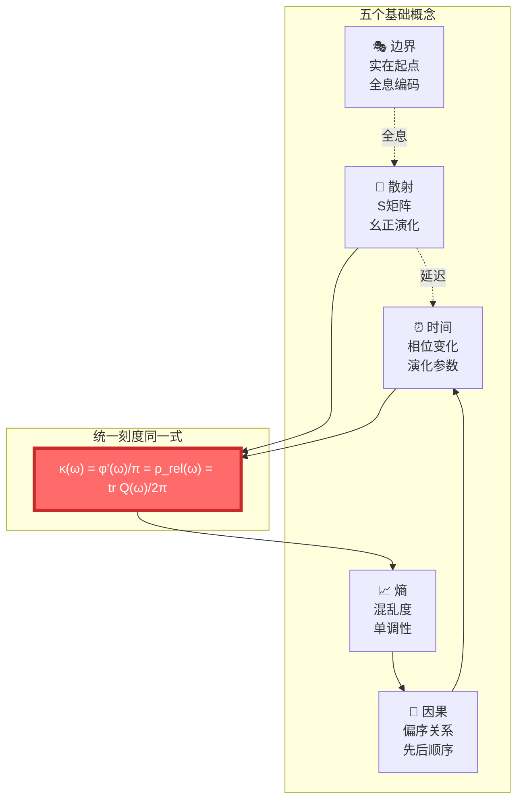
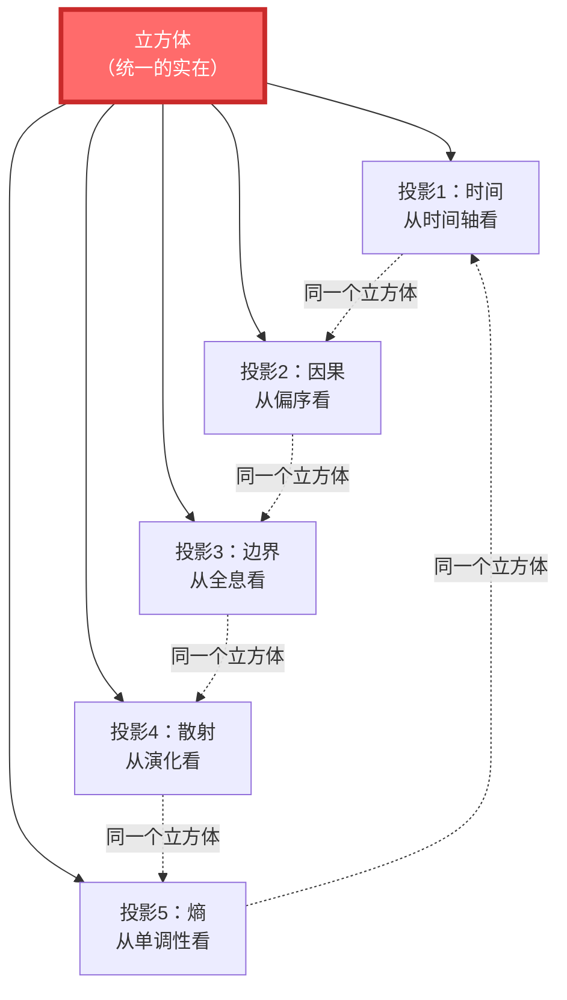
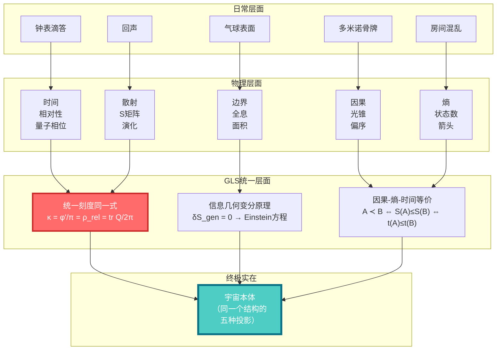

# 基础篇小结：五个概念，一个宇宙

> "时间、因果、边界、散射、熵——它们不是五个独立的概念，而是同一个实在的五重投影。"

[← 上一篇：熵是什么](05-what-is-entropy.md) | [返回主页](../index.md) | [下一篇：核心思想篇 →](../02-core-ideas/)

---

## 我们学到了什么？

在基础篇中，我们从日常经验出发，理解了五个核心概念。让我们回顾一下：

### ⏰ 1. 时间是什么？

**日常理解**：钟表的滴答，时间的流逝

**物理理解**：

- 相对论：时间是第四维，可以弯曲、变慢
- 量子力学：时间 = 相位的变化
- 热力学：时间有箭头（熵增方向）

**GLS洞见**：

$$
\text{时间} = \text{相位变化} = \text{散射延迟} = \text{熵增方向}
$$

### 🎯 2. 因果是什么？

**日常理解**：多米诺骨牌，A导致B

**物理理解**：

- 光锥结构：光速限制因果传播
- 偏序关系：事件之间的"先后"顺序

**GLS洞见**：

$$
A \prec B \quad \Leftrightarrow \quad S(A) \leq S(B) \quad \Leftrightarrow \quad t(A) \leq t(B)
$$

因果 = 偏序 = 熵单调 = 时间顺序

### 🎭 3. 边界是什么？

**日常理解**：容器的表面，国界线

**物理理解**：

- 全息原理：体积的信息编码在边界上
- 黑洞熵：$S \propto A$（面积），不是$V$（体积）

**GLS洞见**：

$$
\text{边界} = \text{实在的起点} \quad ; \quad \text{体积} = \text{边界的重构}
$$

### 🌊 4. 散射是什么？

**日常理解**：回声，台球碰撞

**物理理解**：

- S矩阵：入态→出态的幺正演化
- Wigner-Smith延迟：粒子在散射区停留的时间

**GLS洞见**：

$$
\text{时间延迟} = \text{tr}\,Q = \frac{\partial \varphi}{\partial \omega} = \text{散射相位的导数}
$$

### 📈 5. 熵是什么？

**日常理解**：房间的混乱度

**物理理解**：

- 统计力学：$S = k_B \ln \Omega$（微观状态数）
- 信息论：$H = -\sum p_i \ln p_i$（不确定性）
- 黑洞：$S = A/4G\hbar$（视界面积）

**GLS洞见**：

$$
\text{熵} = \text{时间箭头} = \text{因果顺序} = \text{引力的源头}
$$

---

## 五者如何联系？

这五个概念不是孤立的，它们紧密相连：

### 🔗 关键联系

1. **时间 ↔ 散射**
   - 时间不是外部参数，而是散射过程的内在延迟
   - $\text{tr}\,Q(\omega)$ = 总时间延迟

2. **因果 ↔ 熵**
   - 因果顺序等价于熵的单调性
   - $A \prec B \Leftrightarrow S(A) \leq S(B)$

3. **边界 ↔ 散射**
   - 散射数据（S矩阵）定义在边界上
   - 体积中的演化是边界数据的重构

4. **熵 ↔ 时间**
   - 熵增的方向就是时间的方向
   - 时间箭头 = 热力学箭头

5. **边界 ↔ 熵**
   - 广义熵包含几何项（面积）和物质项
   - $S_{\text{gen}} = A/4G\hbar + S_{\text{out}}$

---

## 从五到一：统一的愿景

GLS统一理论的核心主张是：

> **这五个概念不是五个独立的东西，而是同一个更深层结构的五种表现形式。**

### 📦 比喻：立方体的五个投影

想象一个立方体，你从五个不同角度观察它：

**关键理解**：

- 你问"时间是什么" → 你看到了立方体的一个面
- 你问"因果是什么" → 你看到了立方体的另一个面
- ……

但**立方体只有一个**！不同的问题，只是从不同角度看同一个对象。

---

## 统一的数学语言

在数学上，这五者的统一体现在几个关键公式中：

### 🎯 统一时间刻度同一式

$$
\boxed{\kappa(\omega) = \frac{\varphi'(\omega)}{\pi} = \rho_{\text{rel}}(\omega) = \frac{1}{2\pi}\text{tr}\,Q(\omega)}
$$

**意义**：

- 散射延迟 $\kappa$ = 相位导数 $\varphi'/\pi$
- = 相对态密度 $\rho_{\text{rel}}$
- = Wigner-Smith群延迟 $\text{tr}\,Q/2\pi$

**四个量，同一个东西！**

### 📐 IGVP：从熵到引力

$$
\delta S_{\text{gen}} = 0 \quad \Rightarrow \quad G_{ab} + \Lambda g_{ab} = 8\pi G T_{ab}
$$

**意义**：

在小因果钻石上，要求广义熵取极值，自动导出爱因斯坦方程。

**引力不是基本力，而是熵极值的几何涌现！**

### 🔗 因果-熵-时间三重等价

$$
A \prec B \quad \Leftrightarrow \quad S(A) \leq S(B) \quad \Leftrightarrow \quad t(A) \leq t(B)
$$

**意义**：

- 因果关系（$\prec$）
- 熵的单调性（$S$）
- 时间的顺序（$t$）

**三者完全等价！**

---

## 五个概念的统一图景

让我们用一个大图展示它们如何统一：

---

## 为什么统一很重要？

### 🎓 理论的美

物理学家寻求统一，不仅因为它简洁，更因为它揭示了深层的真理。

**历史上的统一**：

1. **牛顿**：天上的行星运动 = 地上的苹果下落
2. **麦克斯韦**：电 = 磁（电磁统一）
3. **爱因斯坦**：时间 = 空间（时空统一）
4. **温伯格-萨拉姆**：电磁力 = 弱核力（电弱统一）

每一次统一，都带来了深刻的洞见和新的预言。

**GLS统一**：时间 = 因果 = 边界 = 散射 = 熵

### 🔬 预言力

统一理论不仅解释已知现象，还能预言新现象：

**GLS理论的预言**：

1. **引力的涌现**：引力不是基本力，而是熵极值的结果
2. **时间的起源**：时间来自散射延迟，不是外部参数
3. **全息的普遍性**：体积中的物理都是边界的全息投影
4. **因果的量化**：因果关系可以用熵精确量化

### 🌍 世界观的改变

理解这个统一，会改变你对世界的看法：

| 传统观点 | GLS统一观点 |
|---------|------------|
| 时间是绝对的外部钟表 | 时间是散射过程的内在涌现 |
| 因果是神秘的"力量" | 因果是熵的偏序关系 |
| 边界是无关紧要的"壳" | 边界是实在的本源 |
| 散射只是粒子碰撞 | 散射是演化的本质 |
| 熵只是混乱度 | 熵是时间、因果、引力的根源 |

---

## 你已经走了多远？

### ✅ 你现在理解的

1. **时间不是绝对的**
   - 速度和引力会改变时间的流逝
   - 时间的本质是相位的变化、散射的延迟

2. **因果不是神秘的**
   - 因果受光速限制（光锥）
   - 因果等价于熵的单调性

3. **边界不是边缘的**
   - 边界是实在的起点（全息原理）
   - 黑洞的熵正比于面积，不是体积

4. **散射不是简单的碰撞**
   - S矩阵包含了系统的全部信息
   - 散射延迟就是时间本身

5. **熵不仅是混乱**
   - 熵是时间的箭头
   - 熵的极值导出引力方程

### 🎯 你准备好了

你现在已经准备好进入**核心思想篇**，在那里我们会看到：

- 五者如何在**统一时间刻度同一式**中融为一体
- 如何从**信息几何变分原理**导出爱因斯坦方程
- 什么是**Null-模双覆盖**，它如何统一拓扑和几何
- 宇宙作为**量子元胞自动机**的图景
- **单一变分原理**如何导出所有物理定律

---

## 回顾测试：你理解了吗？

在进入下一篇之前，试着回答这些问题（不看笔记）：

### 问题1：时间的三种表述

统一时间刻度同一式中，时间的三种等价表述是什么？

点击查看答案

1. **散射时间**：$\text{tr}\,Q(\omega)/2\pi$（Wigner-Smith群延迟）
2. **相位时间**：$\varphi'(\omega)/\pi$（相位导数）
3. **态密度时间**：$\rho_{\text{rel}}(\omega)$（相对态密度）

它们通过Birman-Kreĭn公式统一：

$$
\kappa(\omega) = \frac{\varphi'(\omega)}{\pi} = \rho_{\text{rel}}(\omega) = \frac{1}{2\pi}\text{tr}\,Q(\omega)
$$

### 问题2：因果与熵的关系

如何用熵来定义因果关系？

点击查看答案

事件$A$在事件$B$之前，当且仅当$A$的熵不大于$B$的熵：

$$
A \prec B \quad \Leftrightarrow \quad S(A) \leq S(B)
$$

因为熵总是增加（热力学第二定律），所以熵的单调性给出了因果的偏序关系。

### 问题3：为什么黑洞熵正比于面积？

黑洞熵为什么不正比于体积，而正比于视界面积？

点击查看答案

**贝肯斯坦-霍金公式**：

$$
S_{\text{BH}} = \frac{A}{4G\hbar}
$$

这是**全息原理**的体现：黑洞的信息全部编码在它的表面（视界）上，而不是内部。就像全息图把3D图像编码在2D胶片上一样。

这暗示：宇宙的"内部"可能是"表面"的全息投影！

---

## 接下来的旅程

你已经掌握了基础概念。现在是时候深入核心思想了！

在**核心思想篇**中，我们将探索：

1. **时间即几何**：时间如何从几何结构涌现
2. **因果即偏序**：因果关系的数学本质
3. **边界即实在**：全息原理的深刻意义
4. **散射即演化**：为什么散射是宇宙演化的本质
5. **熵即箭头**：时间箭头的终极来源
6. ⭐ **五者合一**：统一时间刻度同一式的详细解读

准备好了吗？让我们继续这场思想的冒险！

[下一篇：核心思想篇 →](../02-core-ideas/)

---

## 最后的话

恭喜你完成了基础篇！你现在对时间、因果、边界、散射、熵有了全新的理解。

**记住这个核心洞见**：

> **宇宙不是由五个独立的"东西"（时间、因果、边界、散射、熵）组成的，而是同一个深层结构的五种表现形式。就像立方体的五个投影，它们看起来不同，但描述的是同一个对象。**

**理解这一点，你就理解了GLS统一理论的灵魂。**

现在，让我们进入下一阶段，看看这个统一如何在数学和物理中精确实现！

[← 上一篇：熵是什么](05-what-is-entropy.md) | [返回主页](../index.md) | [下一篇：核心思想篇 →](../02-core-ideas/)
