# Foundation Summary: Five Concepts, One Universe

> "Time, causality, boundary, scattering, entropy—they are not five independent concepts, but five projections of the same reality."

[← Previous: What is Entropy](05-what-is-entropy_en.md) | [Back to Home](../index_en.md) | [Next: Core Ideas →](../02-core-ideas/01-time-is-geometry_en.md)

---

## What Have We Learned?

In the foundation section, starting from everyday experience, we understood five core concepts. Let's review:

### ⏰ 1. What is Time?

**Everyday understanding**: Clock ticking, passage of time

**Physical understanding**:

- Relativity: Time is the fourth dimension, can bend and slow down
- Quantum mechanics: Time = change of phase
- Thermodynamics: Time has an arrow (direction of entropy increase)

**Perspective proposed by GLS theory**:

$$
\text{Time} = \text{phase change} = \text{scattering delay} = \text{direction of entropy increase}
$$

### 🎯 2. What is Causality?

**Everyday understanding**: Domino effect, A causes B

**Physical understanding**:

- Light cone structure: Speed of light limits causal propagation
- Partial order relation: "Before-after" order between events

**GLS insight**:

$$
A \prec B \quad \Leftrightarrow \quad S(A) \leq S(B) \quad \Leftrightarrow \quad t(A) \leq t(B)
$$

**GLS theory infers**: Causality, partial order, entropy monotonicity, and time order are mathematically equivalent.

### 🎭 3. What is Boundary?

**Everyday understanding**: Surface of container, national border

**Physical understanding**:

- Holographic principle: Information in volume is encoded on boundary
- Black hole entropy: $S \propto A$ (area), not $V$ (volume)

**GLS insight**:

$$
\text{Boundary} = \text{origin of reality} \quad ; \quad \text{Volume} = \text{reconstruction of boundary}
$$

### 🌊 4. What is Scattering?

**Everyday understanding**: Echo, billiard ball collision

**Physical understanding**:

- S-matrix: Unitary evolution from in-state to out-state
- Wigner-Smith delay: Time particle stays in scattering region

**GLS insight**:

$$
\text{Time delay} = \text{tr}\,Q = \frac{\partial \varphi}{\partial \omega} = \text{derivative of scattering phase}
$$

### 📈 5. What is Entropy?

**Everyday understanding**: Room chaos

**Physical understanding**:

- Statistical mechanics: $S = k_B \ln \Omega$ (number of microstates)
- Information theory: $H = -\sum p_i \ln p_i$ (uncertainty)
- Black holes: $S = A/4G\hbar$ (horizon area)

**GLS insight**:

$$
> **GLS theory suggests**: Entropy might be the time arrow, causal order, and the source of gravity
$$

---

## How Are the Five Connected?

These five concepts are not isolated; they are closely connected:

```mermaid
graph TB
    subgraph "Five Fundamental Concepts"
        Time["⏰ Time<br/>Phase Change<br/>Evolution Parameter"]
        Cause["🎯 Causality<br/>Partial Order<br/>Before-After Order"]
        Boundary["🎭 Boundary<br/>Origin of Reality<br/>Holographic Encoding"]
        Scatter["🌊 Scattering<br/>S-Matrix<br/>Unitary Evolution"]
        Entropy["📈 Entropy<br/>Chaos<br/>Monotonicity"]
    end

    subgraph "Unified Time Scale Identity"
        Unity["κ(ω) = φ'(ω)/π = ρ_rel(ω) = tr Q(ω)/2π"]
    end

    Time --> Unity
    Scatter --> Unity
    Unity --> Entropy
    Entropy --> Cause
    Cause --> Time

    Boundary -.holographic.-> Scatter
    Scatter -.delay.-> Time

    style Unity fill:#ff6b6b,stroke:#c92a2a,stroke-width:4px,color:#fff
```

### 🔗 Key Connections

1. **Time ↔ Scattering**
   - Time is not an external parameter, but an intrinsic delay of scattering process
   - $\text{tr}\,Q(\omega)$ = total time delay

2. **Causality ↔ Entropy**
   - Causal order is equivalent to entropy monotonicity
   - $A \prec B \Leftrightarrow S(A) \leq S(B)$

3. **Boundary ↔ Scattering**
   - Scattering data (S-matrix) is defined on boundary
   - Evolution in volume is reconstruction from boundary data

4. **Entropy ↔ Time**
   - Direction of entropy increase is the direction of time
   - Time arrow = thermodynamic arrow

5. **Boundary ↔ Entropy**
   - Generalized entropy includes geometric term (area) and matter term
   - $S_{\text{gen}} = A/4G\hbar + S_{\text{out}}$

---

## From Five to One: Vision of Unification

The core claim of GLS unified theory is:

> **These five concepts are not five independent things, but five manifestations of the same deeper structure.**

### 📦 Analogy: Five Projections of a Cube

Imagine a cube, viewed from five different angles:

**Key understanding**:

- You ask "What is time?" → You see one face of the cube
- You ask "What is causality?" → You see another face of the cube
- ...

But **there is only one cube**! Different questions are just viewing the same object from different angles.

---

## Unified Mathematical Language

Mathematically, the unification of these five is embodied in several key formulas:

### 🎯 Unified Time Scale Identity

$$
\boxed{\kappa(\omega) = \frac{\varphi'(\omega)}{\pi} = \rho_{\text{rel}}(\omega) = \frac{1}{2\pi}\text{tr}\,Q(\omega)}
$$

**Meaning**:

- Scattering delay $\kappa$ = phase derivative $\varphi'/\pi$
- = relative density of states $\rho_{\text{rel}}$
- = Wigner-Smith group delay $\text{tr}\,Q/2\pi$

**In the GLS framework, these four quantities are mathematically equivalent!**

### 📐 IGVP: From Entropy to Gravity

$$
\delta S_{\text{gen}} = 0 \quad \Rightarrow \quad G_{ab} + \Lambda g_{ab} = 8\pi G T_{ab}
$$

**Meaning**:

On small causal diamonds, requiring generalized entropy to take an extremum automatically derives Einstein's equation.

**GLS theory suggests: Gravity might not be a fundamental force, but a geometric emergence of entropy extremum!**

### 🔗 Causality-Entropy-Time Triple Equivalence

$$
A \prec B \quad \Leftrightarrow \quad S(A) \leq S(B) \quad \Leftrightarrow \quad t(A) \leq t(B)
$$

**Meaning**:

- Causal relation ($\prec$)
- Entropy monotonicity ($S$)
- Time order ($t$)

**The three are completely equivalent!**

---

## Unified Picture of Five Concepts

Let's use a large diagram to show how they unify:

```mermaid
graph TB
    subgraph "Everyday Level"
        D1["Clock Ticking"]
        D2["Domino Effect"]
        D3["Balloon Surface"]
        D4["Echo"]
        D5["Room Chaos"]
    end

    subgraph "Physical Level"
        P1["Time<br/>Relativity<br/>Quantum Phase"]
        P2["Causality<br/>Light Cone<br/>Partial Order"]
        P3["Boundary<br/>Holographic<br/>Area"]
        P4["Scattering<br/>S-Matrix<br/>Evolution"]
        P5["Entropy<br/>State Number<br/>Arrow"]
    end

    subgraph "GLS Unification Level"
        U["Unified Time Scale Identity<br/>κ = φ'/π = ρ_rel = tr Q/2π"]
        IGVP["Information Geometric Variational Principle<br/>δS_gen = 0 → Einstein Equation"]
        Equiv["Causality-Entropy-Time Equivalence<br/>A ≺ B ⇔ S(A)≤S(B) ⇔ t(A)≤t(B)"]
    end

    subgraph "Ultimate Reality"
        Reality["Cosmic Ontology<br/>(Five Projections of<br/>Same Structure)"]
    end

    D1 --> P1
    D2 --> P2
    D3 --> P3
    D4 --> P4
    D5 --> P5

    P1 --> U
    P2 --> Equiv
    P3 --> IGVP
    P4 --> U
    P5 --> Equiv

    U --> Reality
    IGVP --> Reality
    Equiv --> Reality

    style Reality fill:#4ecdc4,stroke:#0b7285,stroke-width:4px,color:#fff
    style U fill:#ff6b6b,stroke:#c92a2a,stroke-width:3px,color:#fff
```

---

## Why Is Unification Important?

### 🎓 Beauty of Theory

Physicists seek unification not only because it's elegant, but because it reveals deep truths.

**Historical unifications**:

1. **Newton**: Planetary motion in sky = Apple falling on ground
2. **Maxwell**: Electricity = Magnetism (electromagnetic unification)
3. **Einstein**: Time = Space (spacetime unification)
4. **Weinberg-Salam**: Electromagnetic force = Weak nuclear force (electroweak unification)

Each unification brought profound insights and new predictions.

**GLS unification**: Time = Causality = Boundary = Scattering = Entropy

### 🔬 Predictive Power

Unified theories not only explain known phenomena but can predict new ones:

**Theoretical inferences of GLS theory**:

1. **Emergence of gravity**: Gravity is not a fundamental force, but a result of entropy extremum
2. **Origin of time**: Time comes from scattering delay, not external parameter
3. **Universality of holography**: Physics in volume is holographic projection of boundary
4. **Quantification of causality**: Causal relations can be precisely quantified using entropy

### 🌍 Change in Worldview

Understanding this unification changes your view of the world:

| Traditional View | GLS Unified View |
|-----------------|------------------|
| Time is absolute external clock | Time is intrinsic emergence of scattering process |
| Causality is mysterious "force" | Causality is partial order relation of entropy |
| Boundary is unimportant "shell" | Boundary is origin of reality |
| Scattering is just particle collision | Scattering is essence of evolution |
| Entropy is just chaos | Entropy is source of time, causality, gravity |

---

## How Far Have You Come?

### ✅ What You Now Understand

1. **Time is not absolute**
   - Speed and gravity change time's passage
   - Essence of time is phase change, scattering delay

2. **Causality is not mysterious**
   - Causality is limited by speed of light (light cone)
   - Causality is equivalent to entropy monotonicity

3. **Boundary is not peripheral**
   - Boundary is origin of reality (holographic principle)
   - Black hole entropy is proportional to area, not volume

4. **Scattering is not simple collision**
   - S-matrix contains all information of system
   - Scattering delay is time itself

5. **Entropy is not just chaos**
   - Entropy is arrow of time
   - Entropy extremum derives gravitational equation

### 🎯 You Are Ready

You are now ready to enter **Core Ideas**, where we will see:

- How the five merge into one in **Unified Time Scale Identity**
- How to derive Einstein's equation from **Information Geometric Variational Principle**
- What is **Null-module Double Cover**, how it unifies topology and geometry
- Picture of universe as **Quantum Cellular Automaton**
- How **Single Variational Principle** derives all physical laws

---

## Review Test: Do You Understand?

Before entering the next section, try answering these questions (without notes):

### Question 1: Three Formulations of Time

What are the three equivalent formulations of time in the Unified Time Scale Identity?

Click to view answer

1. **Scattering time**: $\text{tr}\,Q(\omega)/2\pi$ (Wigner-Smith group delay)
2. **Phase time**: $\varphi'(\omega)/\pi$ (phase derivative)
3. **Density of states time**: $\rho_{\text{rel}}(\omega)$ (relative density of states)

They are unified through Birman-Kreĭn formula:

$$
\kappa(\omega) = \frac{\varphi'(\omega)}{\pi} = \rho_{\text{rel}}(\omega) = \frac{1}{2\pi}\text{tr}\,Q(\omega)
$$

### Question 2: Relation Between Causality and Entropy

How to define causal relation using entropy?

Click to view answer

Event $A$ is before event $B$ if and only if $A$'s entropy is not greater than $B$'s entropy:

$$
A \prec B \quad \Leftrightarrow \quad S(A) \leq S(B)
$$

Because entropy always increases (Second Law of Thermodynamics), entropy monotonicity gives the partial order relation of causality.

### Question 3: Why Is Black Hole Entropy Proportional to Area?

Why is black hole entropy proportional to horizon area, not volume?

Click to view answer

**Bekenstein-Hawking formula**:

$$
S_{\text{BH}} = \frac{A}{4G\hbar}
$$

This is a manifestation of the **holographic principle**: All information of a black hole is encoded on its surface (horizon), not inside. Just as a hologram encodes a 3D image on 2D film.

This suggests: The "interior" of the universe may be a holographic projection of the "surface"!

---

## Journey Ahead

You have mastered the fundamental concepts. Now it's time to delve into core ideas!

In **Core Ideas**, we will explore:

1. **Time as Geometry**: How time emerges from geometric structure
2. **Causality as Partial Order**: Mathematical essence of causal relations
3. **Boundary as Reality**: Profound meaning of holographic principle
4. **Scattering as Evolution**: Why scattering is the essence of cosmic evolution
5. **Entropy as Arrow**: Ultimate source of time arrow
6. ⭐ **Five into One**: Detailed interpretation of Unified Time Scale Identity

Ready? Let's continue this adventure of thought!

[Next: Core Ideas →](../02-core-ideas/01-time-is-geometry_en.md)

---

## Final Words

Congratulations on completing the foundation section! You now have a new understanding of time, causality, boundary, scattering, and entropy.

**Remember this core insight**:

> **GLS theory proposes: The universe might not be composed of five independent "things" (time, causality, boundary, scattering, entropy), but five manifestations of the same deeper structure. Like five projections of a cube, they look different but describe the same object.**

**Understanding this, you understand the soul of GLS unified theory.**

Now, let's enter the next stage and see how this unification is precisely realized in mathematics and physics!

[← Previous: What is Entropy](05-what-is-entropy_en.md) | [Back to Home](../index_en.md) | [Next: Core Ideas →](../02-core-ideas/01-time-is-geometry_en.md)

