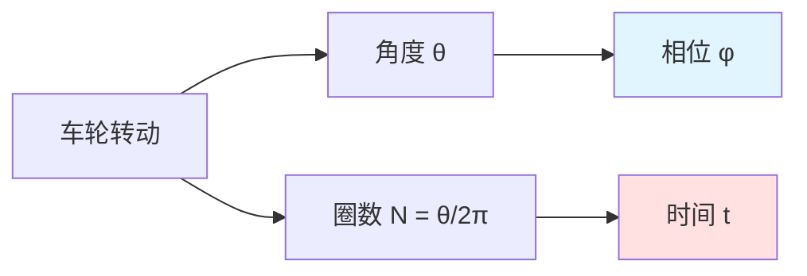
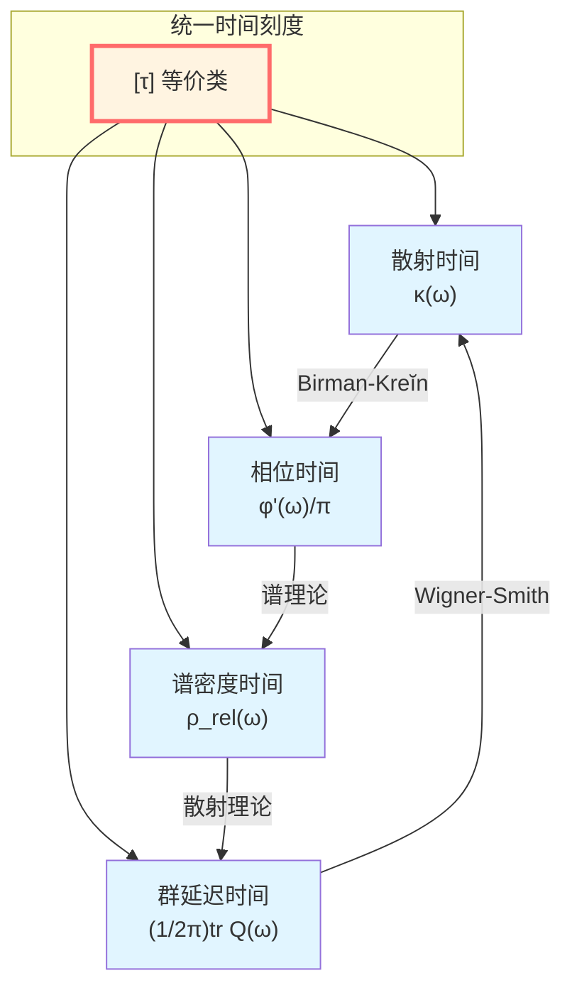
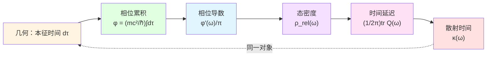
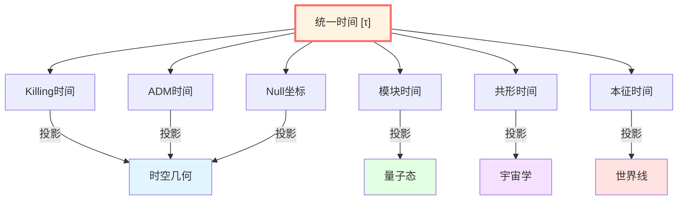

# 核心洞见一：时间就是几何

> *"时间不是舞台，而是舞蹈本身。"*

## 🎯 核心思想

在基础篇中，我们已经知道时间有多种面孔：散射时间、模块时间、几何时间。但GLS理论更进一步：

**时间不是外加的背景坐标，而是从几何结构中涌现的内禀参数。**

## 🌀 从转轮到相位：日常类比

### 转动的车轮

想象一个自行车轮在转动。我们可以用两种方式描述它的"进度"：

1. **角度方式**：车轮转了多少度？(0°→90°→180°→270°→360°)
2. **圈数方式**：车轮转了多少圈？(0圈→0.25圈→0.5圈→0.75圈→1圈)

这两种描述是**同一事物的不同表达**。

现在，关键洞察来了：

**如果我们把车轮的"转动角度"看作"相位"，把"转速"看作"频率"，那么车轮转动的"进度"就类似于物理学中的"时间"！**

### 相位就是几何角度

在量子力学和波动理论中，**相位 φ** 扮演着类似"转动角度"的角色：

- 光波：电场矢量的旋转相位
- 粒子：量子态的相位
- 宇宙学：共动坐标中的相位演化

**关键公式**（先不用怕，后面会详细解释）：

$$
\varphi = \frac{mc^2}{\hbar} \int d\tau
$$

这个公式说：**相位 = (质量×光速²/ℏ) × 本征时间积分**

换句话说：**时间就是相位的累积！**

## 🧊 立方体投影：多种时间的统一

回忆基础篇的立方体比喻。现在我们深入一步：

**这个图告诉我们**：

所有这些"时间"都是**同一个几何对象在不同投影下的样子**！就像立方体在不同角度看起来是正方形、菱形、六边形，但本质上还是那个立方体。

## 📐 几何是如何产生时间的？

### 第一步：本征时间与相位

在广义相对论中，沿着时间样世界线的**本征时间 τ**（proper time）是几何不变量：

$$
d\tau = \sqrt{-g_{\mu\nu} dx^\mu dx^\nu}
$$

对于一个静止质量为 $m$ 的粒子，其量子相位为：

$$
\varphi = \frac{mc^2}{\hbar} \int d\tau
$$

**物理意义**：
- 相位 $\varphi$ 是沿世界线累积的"几何角度"
- 每走一段本征时间 $d\tau$，相位就增加 $(mc^2/\hbar) d\tau$
- **时间就是这个相位的"转速"！**

### 第二步：相位导数给出时间刻度

如果我们对频率 $\omega$ 求相位的导数：

$$
\frac{d\varphi}{d\omega} = \frac{1}{\pi} \frac{d\varphi}{d\omega}
$$

这个导数告诉我们：**频率变化时，相位如何变化**。

但根据 Birman-Kreĭn 公式，这个导数恰好等于：

$$
\frac{\varphi'(\omega)}{\pi} = \rho_{\text{rel}}(\omega)
$$

其中 $\rho_{\text{rel}}$ 是**相对态密度**——描述系统在能量 $\omega$ 附近有多少量子态。

### 第三步：态密度就是时间延迟

进一步，散射理论告诉我们，态密度又等于**Wigner-Smith时间延迟矩阵的迹**：

$$
\rho_{\text{rel}}(\omega) = \frac{1}{2\pi} \text{tr}\, Q(\omega)
$$

其中 $Q(\omega) = -i S(\omega)^\dagger \partial_\omega S(\omega)$ 是散射矩阵 $S$ 对频率的导数。

### 第四步：散射延迟就是几何时间

最后，通过 Birman-Kreĭn 公式，我们可以证明：

$$
\kappa(\omega) = \frac{\varphi'(\omega)}{\pi} = \rho_{\text{rel}}(\omega) = \frac{1}{2\pi}\text{tr}\,Q(\omega)
$$

**这就是统一时间刻度同一式！**

## 🔬 物理含义：时间从哪里来？

这个推导链告诉我们一个深刻的事实：

**时间不是预先给定的舞台，而是从系统的内部结构（散射矩阵、态密度、相位）中涌现出来的！**

具体来说：

1. **微观层面**：粒子沿世界线累积相位 $\varphi$
2. **介观层面**：散射过程产生时间延迟 $Q(\omega)$
3. **宏观层面**：态密度 $\rho_{\text{rel}}$ 定义时间流逝
4. **几何层面**：本征时间 $\tau$ 是度规的函数

**所有这些都是同一个东西！**

## 🌍 广义相对论中的多种时间

在广义相对论中，我们有很多"时间"概念：

| 时间类型 | 定义 | 物理场景 |
|---------|-----|---------|
| **本征时间 τ** | $d\tau = \sqrt{-g_{tt}} dt$ | 粒子自身的"手表时间" |
| **Killing时间** | 由时间样Killing矢量定义 | 静态时空（如Schwarzschild） |
| **ADM时间** | 3+1分解中的叶片时间 | 数值相对论 |
| **Null坐标时间** | $u = t - r^*$, $v = t + r^*$ | 黑洞视界附近 |
| **模块时间** | 由Tomita-Takesaki流定义 | 量子场论的热状态 |
| **共形时间** | $d\eta = dt/a(t)$ | 宇宙学FRW度规 |

**GLS的洞见**：这些看似不同的"时间"都是**统一时间刻度等价类的不同坐标化**！

就像东经、西经、UTC时间、本地时间都是"地球自转"这同一现象的不同表示方式。

## 💡 关键公式回顾

$$
\boxed{\varphi = \frac{mc^2}{\hbar} \int d\tau} \quad \text{(相位-本征时间关系)}
$$

$$
\boxed{\kappa(\omega) = \frac{\varphi'(\omega)}{\pi} = \rho_{\text{rel}}(\omega) = \frac{1}{2\pi}\text{tr}\,Q(\omega)} \quad \text{(时间刻度同一式)}
$$

$$
\boxed{[\tau] \sim \{\tau, t_K, N, \lambda, u, v, \eta, \omega^{-1}, z, s_{\text{mod}}\}} \quad \text{(时间等价类)}
$$

## 🔗 与其他核心思想的联系

- **因果是序**：时间排序 ⟺ 因果偏序 ⟺ 熵单调性
- **边界是实在**：时间在边界上通过散射矩阵 $S(\omega)$ 定义
- **散射是演化**：散射延迟 $Q(\omega)$ 直接给出时间
- **熵是箭头**：时间方向由熵增定义，熵增又由相对态密度 $\rho_{\text{rel}}$ 描述

## 🎓 深入阅读

想要理解更多技术细节，可以阅读：

- 理论文档：[unified-time-scale-geometry.md](../../euler-gls-paper-time/unified-time-scale-geometry.md)
- 边界框架：[boundary-time-geometry-unified-framework.md](../../euler-gls-paper-bondary/boundary-time-geometry-unified-framework.md)
- 下一篇：[02-causality-is-order.md](./02-causality-is-order.md) - 因果就是偏序

## 🤔 思考题

1. 为什么说"时间就是相位的累积"？
2. 统一时间刻度同一式中的四个量分别代表什么物理含义？
3. 广义相对论中的多种"时间"为什么可以统一？
4. 如果时间是从几何涌现的，那么"时空"的地位是什么？

---

**下一步**：在理解了"时间就是几何"之后，我们将看到"因果就是序"——因果结构原来是数学上的偏序关系，而这又与熵单调性等价！

