# Core Insight 1: Time Modeled as Geometry

> *"Time is not the stage, but the dance itself."*

## 🎯 Core Idea

In the foundation section, we already know time has many faces: scattering time, modular time, geometric time. But GLS theory goes further:

**GLS theory proposes: Time might not be an external background coordinate, but an intrinsic parameter emerging from geometric structure.**

## 🌀 From Rotation to Phase: Everyday Analogy

### Rotating Wheel

Imagine a bicycle wheel rotating. We can describe its "progress" in two ways:

1. **Angle way**: How many degrees has the wheel rotated? (0°→90°→180°→270°→360°)
2. **Revolutions way**: How many revolutions has the wheel made? (0 rev→0.25 rev→0.5 rev→0.75 rev→1 rev)

These two descriptions are **different expressions of the same thing**.

Now, the key insight comes:

**If we regard the wheel's "rotation angle" as "phase" and "rotation rate" as "frequency," then the wheel's "progress" is analogous to "time" in physics!**

```mermaid
graph LR
    A["Wheel Rotation"] --> B["Angle θ"]
    A --> C["Revolutions N = θ/2π"]
    B --> D["Phase φ"]
    C --> E["Time t"]

    style D fill:#e1f5ff
    style E fill:#ffe1e1
```

### Phase is Geometric Angle

In quantum mechanics and wave theory, **phase φ** plays a role similar to "rotation angle":

- Light waves: Rotation phase of electric field vector
- Particles: Phase of quantum state
- Cosmology: Phase evolution in comoving coordinates

**Key formula** (don't worry, we'll explain in detail later):

$$
\varphi = \frac{mc^2}{\hbar} \int d\tau
$$

This formula says: **Phase = (mass×speed of light²/ℏ) × proper time integral**

In other words: **In the GLS framework, time is mathematically equivalent to the accumulation of phase!**

## 🧊 Cube Projection: Unification of Multiple Times

Recall the cube analogy from the foundation section. Now we go deeper:

```mermaid
graph TB
    subgraph "Unified Time Scale"
        U["[τ] Equivalence Class"]
    end

    U --> S["Scattering Time<br/>κ(ω)"]
    U --> P["Phase Time<br/>φ'(ω)/π"]
    U --> R["Spectral Density Time<br/>ρ_rel(ω)"]
    U --> Q["Group Delay Time<br/>(1/2π)tr Q(ω)"]

    S --> |"Birman-Kreĭn"| P
    P --> |"Spectral Theory"| R
    R --> |"Scattering Theory"| Q
    Q --> |"Wigner-Smith"| S

    style U fill:#fff4e1,stroke:#ff6b6b,stroke-width:3px
    style S fill:#e1f5ff
    style P fill:#e1f5ff
    style R fill:#e1f5ff
    style Q fill:#e1f5ff
```

**This diagram tells us**:

All these "times" might be **the same geometric object viewed from different projections**! Just as a cube looks like a square, diamond, or hexagon from different angles, but is essentially still that cube.

## 📐 How Does Geometry Generate Time?

### Step 1: Proper Time and Phase

In general relativity, **proper time τ** along a timelike worldline is a geometric invariant:

$$
d\tau = \sqrt{-g_{\mu\nu} dx^\mu dx^\nu}
$$

For a particle with rest mass $m$, its quantum phase is:

$$
\varphi = \frac{mc^2}{\hbar} \int d\tau
$$

**Physical meaning**:
- Phase $\varphi$ is the accumulated "geometric angle" along the worldline
- For each increment of proper time $d\tau$, phase increases by $(mc^2/\hbar) d\tau$
- **Time can be understood as the "rotation rate" of this phase!**

### Step 2: Phase Derivative Gives Time Scale

If we take the derivative of phase with respect to frequency $\omega$:

$$
\frac{d\varphi}{d\omega} = \frac{1}{\pi} \frac{d\varphi}{d\omega}
$$

This derivative tells us: **How phase changes when frequency changes**.

But according to Birman-Kreĭn formula, this derivative equals:

$$
\frac{\varphi'(\omega)}{\pi} = \rho_{\text{rel}}(\omega)
$$

where $\rho_{\text{rel}}$ is the **relative density of states**—describing how many quantum states the system has near energy $\omega$.

### Step 3: Density of States is Time Delay

Further, scattering theory tells us that density of states equals the **trace of Wigner-Smith time delay matrix**:

$$
\rho_{\text{rel}}(\omega) = \frac{1}{2\pi} \text{tr}\, Q(\omega)
$$

where $Q(\omega) = -i S(\omega)^\dagger \partial_\omega S(\omega)$ is the derivative of scattering matrix $S$ with respect to frequency.

### Step 4: Scattering Delay is Geometric Time

Finally, through Birman-Kreĭn formula, we can prove:

$$
\kappa(\omega) = \frac{\varphi'(\omega)}{\pi} = \rho_{\text{rel}}(\omega) = \frac{1}{2\pi}\text{tr}\,Q(\omega)
$$

**This is the Unified Time Scale Identity proposed by GLS theory!**

```mermaid
graph LR
    A["Geometry: Proper Time dτ"] --> B["Phase Accumulation<br/>φ = (mc²/ℏ)∫dτ"]
    B --> C["Phase Derivative<br/>φ'(ω)/π"]
    C --> D["Density of States<br/>ρ_rel(ω)"]
    D --> E["Time Delay<br/>(1/2π)tr Q(ω)"]
    E --> F["Scattering Time<br/>κ(ω)"]

    F -.-> |"Same Object"| A

    style A fill:#fff4e1
    style B fill:#e1ffe1
    style C fill:#e1f5ff
    style D fill:#f5e1ff
    style E fill:#ffe1f5
    style F fill:#ffe1e1
```

## 🔬 Physical Meaning: Where Does Time Come From?

This derivation chain tells us a profound fact:

**GLS theory argues: Time might not be a pre-given stage, but emerges from the internal structure of the system (scattering matrix, density of states, phase)!**

Specifically:

1. **Microscopic level**: Particles accumulate phase $\varphi$ along worldlines
2. **Mesoscopic level**: Scattering process produces time delay $Q(\omega)$
3. **Macroscopic level**: Density of states $\rho_{\text{rel}}$ defines time passage
4. **Geometric level**: Proper time $\tau$ is a function of the metric

**Mathematically, they might be equivalent!**

## 🌍 Multiple Times in General Relativity

In general relativity, we have many "time" concepts:

| Time Type | Definition | Physical Scenario |
|-----------|-----------|------------------|
| **Proper Time τ** | $d\tau = \sqrt{-g_{tt}} dt$ | Particle's own "watch time" |
| **Killing Time** | Defined by timelike Killing vector | Static spacetime (e.g., Schwarzschild) |
| **ADM Time** | Foliating time in 3+1 decomposition | Numerical relativity |
| **Null Coordinate Time** | $u = t - r^*$, $v = t + r^*$ | Near black hole horizon |
| **Modular Time** | Defined by Tomita-Takesaki flow | Thermal states in quantum field theory |
| **Conformal Time** | $d\eta = dt/a(t)$ | Cosmological FRW metric |

**GLS insight**: These seemingly different "times" might all be **different coordinatizations of the unified time scale equivalence class**!

Just as east longitude, west longitude, UTC time, and local time are different representations of the same phenomenon—Earth's rotation.

```mermaid
graph TB
    T["Unified Time [τ]"] --> K["Killing Time"]
    T --> A["ADM Time"]
    T --> N["Null Coordinates"]
    T --> M["Modular Time"]
    T --> C["Conformal Time"]
    T --> P["Proper Time"]

    K --> |"Projection"| G["Spacetime Geometry"]
    A --> |"Projection"| G
    N --> |"Projection"| G
    M --> |"Projection"| Q["Quantum States"]
    C --> |"Projection"| U["Cosmology"]
    P --> |"Projection"| W["Worldlines"]

    style T fill:#fff4e1,stroke:#ff6b6b,stroke-width:3px
    style G fill:#e1f5ff
    style Q fill:#e1ffe1
    style U fill:#f5e1ff
    style W fill:#ffe1e1
```

## 💡 Key Formulas Review

$$
\boxed{\varphi = \frac{mc^2}{\hbar} \int d\tau} \quad \text{(Phase-Proper Time Relation)}
$$

$$
\boxed{\kappa(\omega) = \frac{\varphi'(\omega)}{\pi} = \rho_{\text{rel}}(\omega) = \frac{1}{2\pi}\text{tr}\,Q(\omega)} \quad \text{(Time Scale Identity)}
$$

$$
\boxed{[\tau] \sim \{\tau, t_K, N, \lambda, u, v, \eta, \omega^{-1}, z, s_{\text{mod}}\}} \quad \text{(Time Equivalence Class)}
$$

## 🔗 Connections to Other Core Ideas

- **Causality is Order**: Time ordering ⟺ Causal partial order ⟺ Entropy monotonicity
- **Boundary is Reality**: Time is defined on boundary through scattering matrix $S(\omega)$
- **Scattering is Evolution**: Scattering delay $Q(\omega)$ directly gives time
- **Entropy is Arrow**: Time direction is defined by entropy increase, which is described by relative density of states $\rho_{\text{rel}}$

## 🎓 Further Reading

To understand more technical details, you can read:

- Theory document: unified-time-scale-geometry.md
- Boundary framework: boundary-time-geometry-unified-framework.md
- Next: [02-causality-is-order_en.md](02-causality-is-order_en.md) - Causality is Partial Order

## 🤔 Questions for Reflection

1. Why do we say "time is the accumulation of phase"?
2. What physical meanings do the four quantities in the Unified Time Scale Identity represent?
3. Why can the multiple "times" in general relativity be unified?
4. If time emerges from geometry, what is the status of "spacetime"?

---

**Next Step**: After understanding "Time is Geometry," we will see "Causality is Order"—causal structure turns out to be a mathematical partial order relation, which is equivalent to entropy monotonicity!

