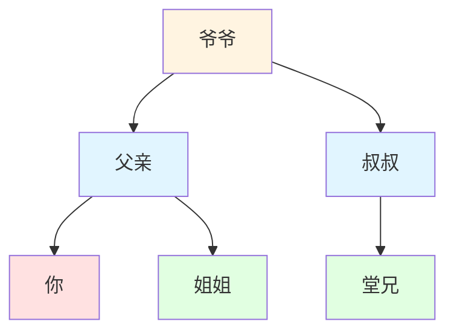
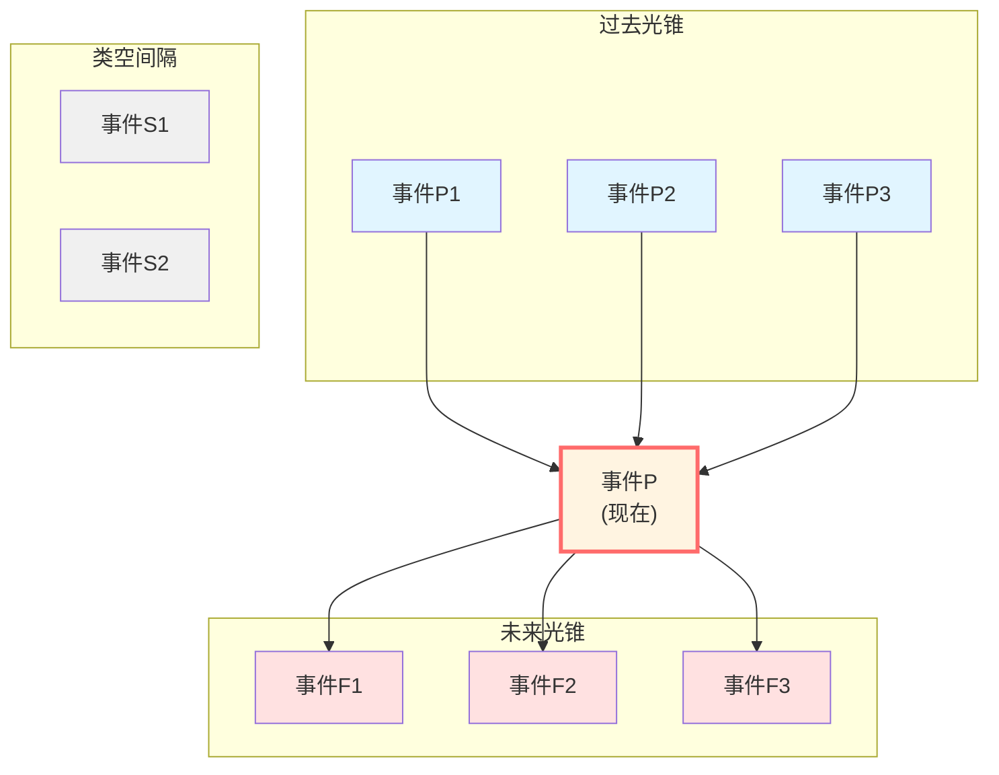
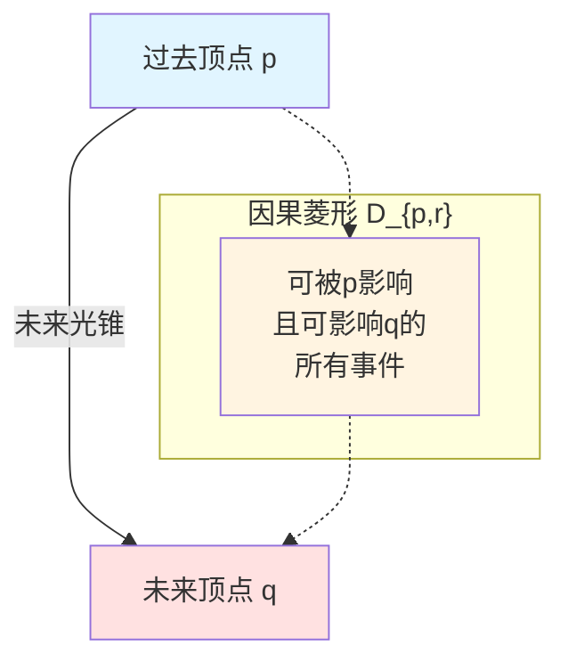
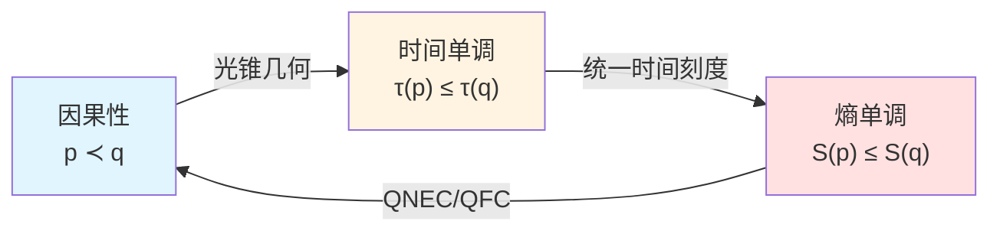
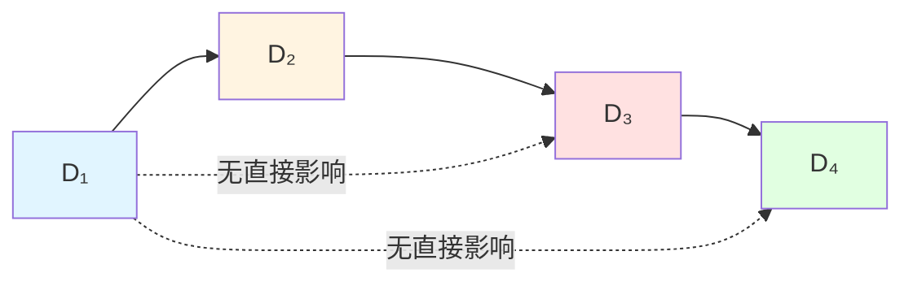

# 核心洞见二：因果就是偏序

> *"因果不是神秘的'力'，而是数学的'关系'。"*

## 🎯 核心思想

在日常生活中，我们说"因为A所以B"，似乎A对B有某种神秘的"推动力"。

但GLS理论揭示了一个惊人的真相：

**因果性就是数学上的偏序关系（partial order），而这又等价于时间单调性，进而等价于熵单调性！**

换句话说：**因果 ⟺ 偏序 ⟺ 时间箭头 ⟺ 熵增**

## 🎲 从多米诺骨牌到偏序

### 多米诺效应的误导

想象一排多米诺骨牌：

```
[A] → [B] → [C] → [D] → [E]
```

我们直觉上认为：**A推倒了B，B推倒了C**……似乎有一种"因果力"在传递。

但数学家会这样看：

**这只是一个偏序关系！**

- A ≺ B（A在B之前）
- B ≺ C（B在C之前）
- A ≺ C（传递性：A在C之前）

**重点**：这里没有"力"，只有"关系"！

### 家族树：偏序的另一个例子

再看一个更清晰的例子——家族关系：



在这个家族树中：

- "爷爷"是"你"的祖先（爷爷 ≺ 你）
- "父亲"是"你"的祖先（父亲 ≺ 你）
- 但"叔叔"和"父亲"之间没有祖先关系（他们不可比）

这就是**偏序**的特点：
1. **自反性**：A ≼ A（每个人是自己的"祖先"，广义上）
2. **传递性**：若 A ≺ B 且 B ≺ C，则 A ≺ C
3. **反对称性**：若 A ≼ B 且 B ≼ A，则 A = B
4. **部分性**：不是所有元素都可比（叔叔和父亲不可比）

**物理学中的因果关系，正是这样的偏序！**

## 🌌 物理学中的因果偏序

### 光锥结构

在相对论中，因果关系由**光锥**定义：



**因果关系的数学定义**：

事件 $p$ 可以影响事件 $q$（记作 $p \prec q$），当且仅当：

$$
q \in J^+(p)
$$

其中 $J^+(p)$ 是 $p$ 的**未来因果锥**——从 $p$ 出发的所有未来定向非类空曲线能到达的点的集合。

**关键洞察**：这个定义**没有提到任何力或相互作用**，只是几何关系！

### 小因果菱形：因果的基本单元

在GLS理论中，最基本的因果结构是**小因果菱形**（causal diamond）：

$$
D_{p,r} = J^+(p) \cap J^-(q)
$$

其中 $q$ 在 $p$ 的未来，距离为 $r$。



**物理意义**：
- 这是宇宙中最小的"有意义的区域"
- 它是有限的（有上下界）
- 它是因果完备的（内部事件的因果关系完全确定）

## 🔗 三重等价：因果=偏序=时间=熵

现在来到GLS理论最核心的洞见之一：

**定理 2（因果偏序的等价刻画）**

对任意两个事件 $p, q$，以下命题**完全等价**：

1. **几何因果性**：$q \in J^+(p)$（q在p的未来光锥内）

2. **时间刻度单调性**：存在统一时间刻度 $\tau \in [\tau]$，使得 $\tau(p) \le \tau(q)$

3. **广义熵单调性**：沿从 $p$ 到 $q$ 的任何因果链，广义熵 $S_{\text{gen}}$ 单调不减

$$
\boxed{p \prec q \quad \Longleftrightarrow \quad \tau(p) \le \tau(q) \quad \Longleftrightarrow \quad S_{\text{gen}}(p) \le S_{\text{gen}}(q)}
$$



**这意味着什么？**

1. **因果不是外加的**：它就是时间排序本身
2. **时间箭头 = 因果箭头**：时间流逝的方向就是因果传播的方向
3. **熵增 = 因果传播**：熵增定律不是独立的，而是因果结构的必然结果

## 📊 偏序的数学刻画

让我们用数学语言更精确地描述：

### 偏序的定义

一个集合 $M$（例如时空中的事件集）上的二元关系 $\preceq$ 是**偏序**，如果满足：

1. **自反性（Reflexivity）**：$\forall p: p \preceq p$
2. **传递性（Transitivity）**：若 $p \preceq q$ 且 $q \preceq r$，则 $p \preceq r$
3. **反对称性（Antisymmetry）**：若 $p \preceq q$ 且 $q \preceq p$，则 $p = q$

### 因果偏序的具体形式

在时空 $(M, g_{\mu\nu})$ 中，定义：

$$
p \preceq q \quad :\Longleftrightarrow \quad q \in J^+(p) \cup \{p\}
$$

可以验证：

- **自反性**：$p \in J^+(p) \cup \{p\}$（显然）
- **传递性**：若 $q \in J^+(p)$ 且 $r \in J^+(q)$，则存在从 $p$ 经 $q$ 到 $r$ 的未来定向曲线，故 $r \in J^+(p)$
- **反对称性**：若 $q \in J^+(p)$ 且 $p \in J^+(q)$，则存在闭合类时曲线（CTC），在标准因果性假设下这被排除，故 $p = q$

### 时间函数

一个**时间函数** $t: M \to \mathbb{R}$ 是一个函数，满足：

$$
p \prec q \quad \Longrightarrow \quad t(p) < t(q)
$$

**Bernal-Sánchez定理**：在全局双曲时空中，总存在光滑的时间函数。

**GLS的贡献**：这个时间函数可以从统一时间刻度 $[\tau]$ 中取出，且与散射、模流、熵结构自然对齐！

## 🌊 Markov性：因果链的无记忆性

GLS理论还揭示了因果链的一个深刻性质：**Markov性**。

### 什么是Markov性？

在概率论中，一个过程是Markov过程，如果"未来只依赖于现在，与过去无关"：

$$
P(X_{n+1} | X_n, X_{n-1}, \ldots, X_1) = P(X_{n+1} | X_n)
$$

### 因果菱形链的Markov性

**定理 4（部分）**：在共形场论中，因果菱形链 $\{D_1, D_2, \ldots, D_n\}$ 满足：

1. 信息传播是Markov过程
2. 模哈密顿量满足容斥结构（inclusion-exclusion）
3. 相对熵满足强次可加性（strong subadditivity）饱和



**物理意义**：
- $D_4$ 的状态只依赖于 $D_3$，不直接依赖于 $D_1$ 或 $D_2$
- 所有来自过去的影响都通过"现在"传递
- **这就是因果性的本质**：过去→现在→未来的链式传播

## 💡 休谟的挑战与GLS的回答

### 休谟的问题

18世纪哲学家休谟（David Hume）提出：

> "我们从未观察到'因果连接'本身，只观察到事件的恒常连接（constant conjunction）。"

例如：台球A撞击台球B，我们看到B运动了。但我们真的"看到"了A"导致"B运动吗？还是只是看到两个事件依次发生？

### GLS的回答

**GLS理论完全同意休谟**：没有神秘的"因果力"！

因果性就是：
1. **几何关系**：$q \in J^+(p)$（光锥结构）
2. **偏序关系**：$p \prec q$（可比较性）
3. **时间单调**：$\tau(p) < \tau(q)$（时间排序）
4. **熵单调**：$S(p) \le S(q)$（热力学箭头）

**这些都是可观测的数学关系，不涉及任何神秘的"推动"或"力"。**

## 🔗 与其他核心思想的联系

- **时间是几何**：时间函数 $t(p)$ 从偏序结构中涌现
- **边界是实在**：因果菱形 $D_{p,r}$ 的边界定义了内部的因果结构
- **散射是演化**：散射矩阵 $S(\omega)$ 编码了因果传播的幺正演化
- **熵是箭头**：熵单调性 $\partial_s S_{\text{gen}} \ge 0$ 与因果箭头一致

## 🎓 深入阅读

想要理解更多技术细节，可以阅读：

- 理论文档：unified-theory-causal-structure-time-scale-partial-order-generalized-entropy.md
- 观测者共识：observer-consensus-geometrization.md
- 上一篇：[01-time-is-geometry.md](01-time-is-geometry.md) - 时间就是几何
- 下一篇：[03-boundary-is-reality.md](03-boundary-is-reality.md) - 边界就是实在

## 🤔 思考题

1. 为什么说因果关系是"偏序"而不是"全序"？类空间隔的事件说明了什么？
2. 家族树的例子中，"堂兄"和"姐姐"之间是什么关系？这类似于物理学中的什么情况？
3. 如果没有闭合类时曲线（CTC），反对称性是如何保证的？
4. Markov性为什么对理解因果传播很重要？
5. 休谟的怀疑论对现代物理学有什么启发？

## 📝 关键公式回顾

$$
\boxed{p \prec q \quad \Longleftrightarrow \quad q \in J^+(p)} \quad \text{(因果定义)}
$$

$$
\boxed{p \prec q \quad \Longleftrightarrow \quad \tau(p) \le \tau(q) \quad \Longleftrightarrow \quad S_{\text{gen}}(p) \le S_{\text{gen}}(q)} \quad \text{(三重等价)}
$$

$$
\boxed{D_{p,r} = J^+(p) \cap J^-(q)} \quad \text{(小因果菱形)}
$$

---

**下一步**：在理解了"因果就是偏序"之后，我们将看到"边界就是实在"——为什么物理实在不在体积中，而在边界上！

