# Core Insight 2: Causality is Partial Order

> *"Causality is not a mysterious 'force,' but a mathematical 'relation.'"*

## 🎯 Core Idea

In everyday life, we say "because A, therefore B," as if A has some mysterious "driving force" on B.

But GLS theory reveals a surprising truth:

**Causality is a mathematical partial order relation, which is equivalent to time monotonicity, and further equivalent to entropy monotonicity!**

In other words: **Causality ⟺ Partial Order ⟺ Time Arrow ⟺ Entropy Increase**

## 🎲 From Dominoes to Partial Order

### The Misleading Domino Effect

Imagine a row of dominoes:

```
[A] → [B] → [C] → [D] → [E]
```

We intuitively think: **A knocks down B, B knocks down C**... as if there's a "causal force" being transmitted.

But mathematicians see it this way:

**This is just a partial order relation!**

- A ≺ B (A is before B)
- B ≺ C (B is before C)
- A ≺ C (transitivity: A is before C)

**Key point**: There's no "force" here, only "relation"!

### Family Tree: Another Example of Partial Order

Consider a clearer example—family relationships:


In this family tree:

- "Grandfather" is an ancestor of "You" (Grandfather ≺ You)
- "Father" is an ancestor of "You" (Father ≺ You)
- But "Uncle" and "Father" have no ancestor relation (they are incomparable)

This is the characteristic of **partial order**:
1. **Reflexivity**: A ≼ A (everyone is their own "ancestor," in a generalized sense)
2. **Transitivity**: If A ≺ B and B ≺ C, then A ≺ C
3. **Antisymmetry**: If A ≼ B and B ≼ A, then A = B
4. **Partiality**: Not all elements are comparable (Uncle and Father are incomparable)

**Causal relations in physics are exactly such partial orders!**

## 🌌 Causal Partial Order in Physics

### Light Cone Structure

In relativity, causal relations are defined by **light cones**:


**Mathematical definition of causal relation**:

Event $p$ can influence event $q$ (denoted $p \prec q$) if and only if:

$$
q \in J^+(p)
$$

where $J^+(p)$ is the **future causal cone** of $p$—the set of all points reachable by future-directed non-spacelike curves starting from $p$.

**Key insight**: This definition **mentions no force or interaction**, only geometric relations!

### Small Causal Diamonds: Basic Units of Causality

In GLS theory, the most basic causal structure is the **small causal diamond**:

$$
D_{p,r} = J^+(p) \cap J^-(q)
$$

where $q$ is in the future of $p$, at distance $r$.


**Physical meaning**:
- This is the smallest "meaningful region" in the universe
- It is finite (has upper and lower bounds)
- It is causally complete (causal relations of internal events are fully determined)

## 🔗 Triple Equivalence: Causality = Partial Order = Time = Entropy

Now we come to one of the core insights of GLS theory:

**Theorem 2 (Equivalent Characterizations of Causal Partial Order)**

For any two events $p, q$, the following propositions are **completely equivalent**:

1. **Geometric Causality**: $q \in J^+(p)$ (q is in p's future light cone)

2. **Time Scale Monotonicity**: There exists a unified time scale $\tau \in [\tau]$ such that $\tau(p) \le \tau(q)$

3. **Generalized Entropy Monotonicity**: Along any causal chain from $p$ to $q$, generalized entropy $S_{\text{gen}}$ is monotonically non-decreasing

$$
\boxed{p \prec q \quad \Longleftrightarrow \quad \tau(p) \le \tau(q) \quad \Longleftrightarrow \quad S_{\text{gen}}(p) \le S_{\text{gen}}(q)}
$$



```mermaid
graph LR
    C["Causality<br/>p ≺ q"] --> |"Light Cone Geometry"| T["Time Monotonicity<br/>τ(p) ≤ τ(q)"]
    T --> |"Unified Time Scale"| S["Entropy Monotonicity<br/>S(p) ≤ S(q)"]
    S --> |"QNEC/QFC"| C

    style C fill:#e1f5ff
    style T fill:#fff4e1
    style S fill:#ffe1e1
```

**What does this mean?**

1. **Causality is not external**: It is time ordering itself
2. **Time arrow = Causal arrow**: Direction of time passage is direction of causal propagation
3. **Entropy increase = Causal propagation**: Entropy increase law is not independent, but a necessary consequence of causal structure

## 📊 Mathematical Characterization of Partial Order

Let's describe it more precisely in mathematical language:

### Definition of Partial Order

A binary relation $\preceq$ on a set $M$ (e.g., the set of events in spacetime) is a **partial order** if it satisfies:

1. **Reflexivity**: $\forall p: p \preceq p$
2. **Transitivity**: If $p \preceq q$ and $q \preceq r$, then $p \preceq r$
3. **Antisymmetry**: If $p \preceq q$ and $q \preceq p$, then $p = q$

### Specific Form of Causal Partial Order

In spacetime $(M, g_{\mu\nu})$, define:

$$
p \preceq q \quad :\Longleftrightarrow \quad q \in J^+(p) \cup \{p\}
$$

We can verify:

- **Reflexivity**: $p \in J^+(p) \cup \{p\}$ (obvious)
- **Transitivity**: If $q \in J^+(p)$ and $r \in J^+(q)$, then there exists a future-directed curve from $p$ through $q$ to $r$, so $r \in J^+(p)$
- **Antisymmetry**: If $q \in J^+(p)$ and $p \in J^+(q)$, then there exists a closed timelike curve (CTC), which is excluded under standard causality assumptions, so $p = q$

### Time Function

A **time function** $t: M \to \mathbb{R}$ is a function satisfying:

$$
p \prec q \quad \Longrightarrow \quad t(p) < t(q)
$$

**Bernal-Sánchez theorem**: In globally hyperbolic spacetime, there always exists a smooth time function.

**GLS contribution**: This time function can be extracted from the unified time scale $[\tau]$, and naturally aligns with scattering, modular flow, and entropy structure!

## 🌊 Markov Property: Memorylessness of Causal Chains

GLS theory also reveals a profound property of causal chains: **Markov property**.

### What is Markov Property?

In probability theory, a process is Markovian if "future depends only on present, independent of past":

$$
P(X_{n+1} | X_n, X_{n-1}, \ldots, X_1) = P(X_{n+1} | X_n)
$$

### Markov Property of Causal Diamond Chains

**Theorem 4 (Partial)**: In conformal field theory, causal diamond chains $\{D_1, D_2, \ldots, D_n\}$ satisfy:

1. Information propagation is a Markov process
2. Modular Hamiltonian satisfies inclusion-exclusion structure
3. Relative entropy satisfies strong subadditivity saturation

```mermaid
graph LR
    D1["D₁"] --> D2["D₂"]
    D2 --> D3["D₃"]
    D3 --> D4["D₄"]

    D1 -.-> |"No Direct Influence"| D3
    D1 -.-> |"No Direct Influence"| D4

    style D1 fill:#e1f5ff
    style D2 fill:#fff4e1
    style D3 fill:#ffe1e1
    style D4 fill:#e1ffe1
```



**Physical meaning**:
- State of $D_4$ depends only on $D_3$, not directly on $D_1$ or $D_2$
- All influences from the past are transmitted through the "present"
- **This is the essence of causality**: Chain propagation of past→present→future

## 💡 Hume's Challenge and GLS's Answer

### Hume's Problem

18th-century philosopher David Hume asked:

> "We never observe 'causal connection' itself, only constant conjunction of events."

For example: Billiard ball A hits billiard ball B, we see B move. But do we really "see" A "causing" B to move? Or do we just see two events occurring sequentially?

### GLS's Answer

**GLS theory completely agrees with Hume**: There's no mysterious "causal force"!

Causality is:
1. **Geometric relation**: $q \in J^+(p)$ (light cone structure)
2. **Partial order relation**: $p \prec q$ (comparability)
3. **Time monotonicity**: $\tau(p) < \tau(q)$ (time ordering)
4. **Entropy monotonicity**: $S(p) \le S(q)$ (thermodynamic arrow)

**These are all observable mathematical relations, involving no mysterious 'pushing' or 'force.'**

## 🔗 Connections to Other Core Ideas

- **Time is Geometry**: Time function $t(p)$ emerges from partial order structure
- **Boundary is Reality**: Boundary of causal diamond $D_{p,r}$ defines internal causal structure
- **Scattering is Evolution**: Scattering matrix $S(\omega)$ encodes unitary evolution of causal propagation
- **Entropy is Arrow**: Entropy monotonicity $\partial_s S_{\text{gen}} \ge 0$ is consistent with causal arrow

## 🎓 Further Reading

To understand more technical details, you can read:

- Theory document: unified-theory-causal-structure-time-scale-partial-order-generalized-entropy.md
- Observer consensus: observer-consensus-geometrization.md
- Previous: [01-time-is-geometry_en.md](01-time-is-geometry_en.md) - Time is Geometry
- Next: [03-boundary-is-reality_en.md](03-boundary-is-reality_en.md) - Boundary is Reality

## 🤔 Questions for Reflection

1. Why do we say causal relations are "partial order" rather than "total order"? What do spacelike-separated events illustrate?
2. In the family tree example, what is the relation between "Cousin" and "Sister"? What does this resemble in physics?
3. Without closed timelike curves (CTC), how is antisymmetry guaranteed?
4. Why is Markov property important for understanding causal propagation?
5. What inspiration does Hume's skepticism offer to modern physics?

## 📝 Key Formulas Review

$$
\boxed{p \prec q \quad \Longleftrightarrow \quad q \in J^+(p)} \quad \text{(Causal Definition)}
$$

$$
\boxed{p \prec q \quad \Longleftrightarrow \quad \tau(p) \le \tau(q) \quad \Longleftrightarrow \quad S_{\text{gen}}(p) \le S_{\text{gen}}(q)} \quad \text{(Triple Equivalence)}
$$

$$
\boxed{D_{p,r} = J^+(p) \cap J^-(q)} \quad \text{(Small Causal Diamond)}
$$

---

**Next Step**: After understanding "Causality is Partial Order," we will see "Boundary is Reality"—why physical reality is not in volume, but on the boundary!

