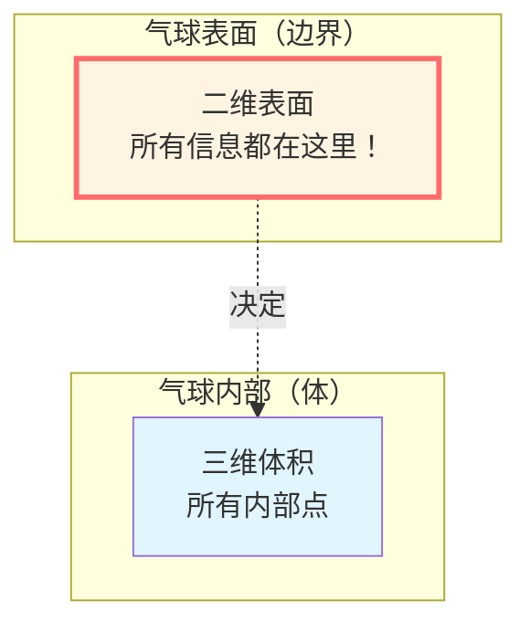
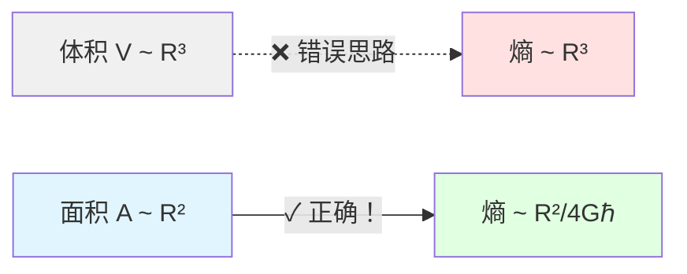
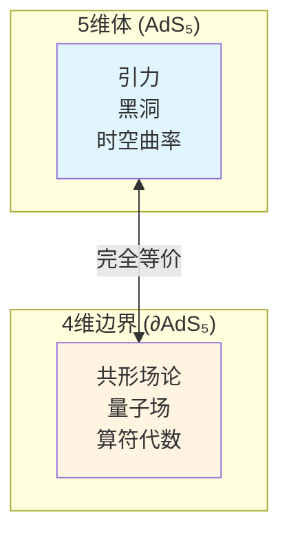
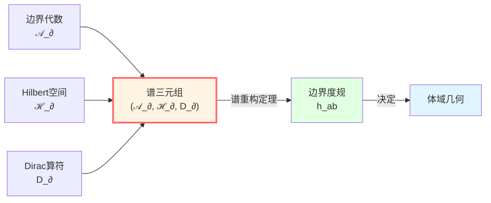
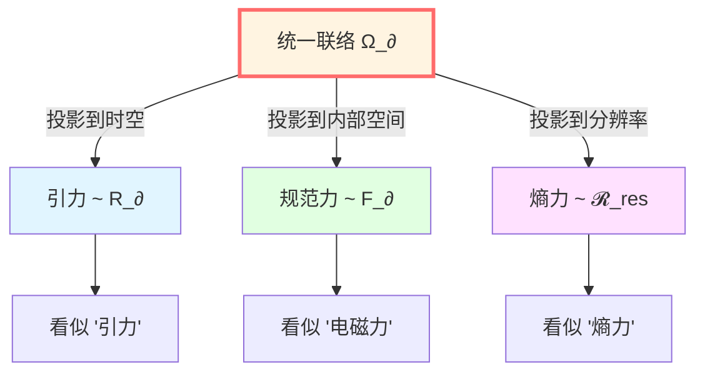
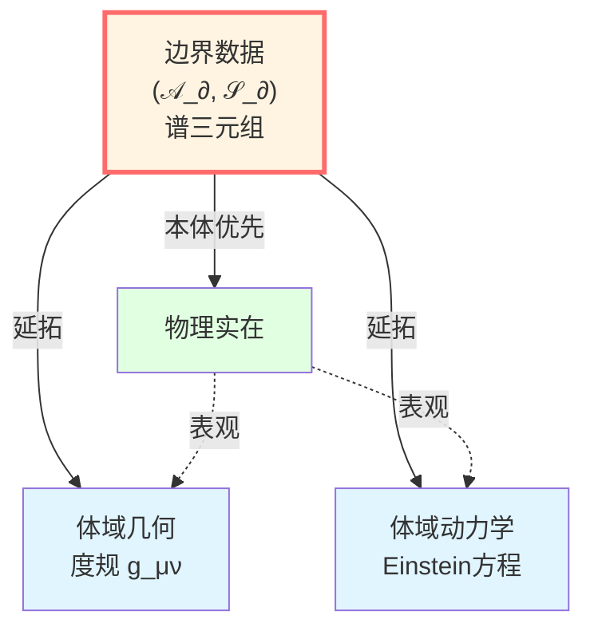

# 核心洞见三：边界就是实在

> *"宇宙不在体积中，而在表面上。"*

## 🎯 核心思想

这是GLS理论中最令人震撼的洞见之一：

**物理实在不是首先存在于三维空间的"体积"中，而是存在于二维的"边界"上！**

或者更准确地说：

**边界数据（boundary data）是本体（ontological priority），体域动力学（bulk dynamics）只是边界数据的延拓（extension）。**

## 🎈 从气球说起：边界包含一切信息

### 气球的比喻

想象一个气球：

**惊人的事实**：如果你知道气球表面的**所有信息**（形状、温度、压力分布、振动模式...），你就能推导出内部的一切！

**为什么？**

- 表面的形状 → 决定内部的体积
- 表面的压力 → 决定内部的气体状态
- 表面的振动 → 决定内部的声波模式

**气球内部不是独立的实在，而是表面数据的"阴影"！**

### Bekenstein-Hawking熵：面积，不是体积！

这个洞见最早来自黑洞物理学。

传统上，我们认为熵（信息量）应该正比于**体积**：

$$
S_{\text{naive}} \propto V = \frac{4}{3}\pi R^3 \quad \text{(❌ 错误！)}
$$

但Bekenstein和Hawking发现，黑洞的熵正比于**表面积**：

$$
\boxed{S_{\text{BH}} = \frac{A}{4G\hbar}} \quad \text{(✓ 正确！)}
$$

其中 $A = 4\pi R^2$ 是视界面积。

**这意味着什么？**

**黑洞的所有信息都编码在二维表面上，而不是三维体积中！**

## 🌌 全息原理：宇宙是全息图

### 什么是全息图？

你可能见过信用卡上的全息防伪标签：

- **二维的图案**中，编码了**三维的图像**
- 当你转动卡片，三维图像从不同角度显现

全息原理（Holographic Principle）说：

**我们的宇宙就是一张"全息图"——所有信息都在边界上！**

### AdS/CFT对应：最伟大的例证

在弦理论中，Maldacena在1997年发现了一个惊人的对应关系：

$$
\boxed{\text{AdS}_5 \text{ Gravity} \quad \longleftrightarrow \quad \text{CFT}_4 \text{ on Boundary}}
$$

**翻译**：
- 左边：五维反德西特空间中的引力理论（有体积）
- 右边：四维边界上的共形场论（没有体积！）
- **它们描述的是同一个物理系统！**

**物理含义**：
- 边界上的量子场论包含了体域引力理论的所有信息
- 引力、时空曲率都是边界数据的"涌现"
- **体域不是基本的，边界才是！**

## 📐 边界谱三元组：用代数定义几何

### 什么是谱三元组？

在非交换几何中，Alain Connes提出：**几何可以完全由代数数据定义**。

一个**边界谱三元组**是：

$$
(\mathcal{A}_\partial, \mathcal{H}_\partial, D_\partial)
$$

其中：
- $\mathcal{A}_\partial$：边界可观测代数（函数、算符）
- $\mathcal{H}_\partial$：Hilbert空间（量子态）
- $D_\partial$：Dirac算符（几何信息的载体）

**惊人的定理**：给定谱三元组，可以**唯一重构边界度规** $h_{ab}$！

$$
d(x,y) = \sup\{|a(x)-a(y)| : a \in \mathcal{A}_\partial, \ |[D_\partial, a]| \le 1\}
$$

**这意味着**：

**几何（度规、距离）不是预先给定的舞台，而是从边界代数的谱数据中涌现的！**

## 🔧 Brown-York边界应力张量：从边界定义能量

### 引力作用量需要边界项

在广义相对论中，Einstein-Hilbert作用量是：

$$
S_{\text{EH}} = \frac{1}{16\pi G} \int_M R \sqrt{-g} \, d^4x
$$

但是，当你对它做**变分**（求极值）时，会在边界上产生多余的项！

**解决方法**：加上Gibbons-Hawking-York (GHY)边界项：

$$
S_{\text{GHY}} = \frac{1}{8\pi G} \int_{\partial M} K \sqrt{|h|} \, d^3x
$$

其中 $K$ 是边界的外曲率。

### Brown-York应力张量

有了完整的作用量 $S = S_{\text{EH}} + S_{\text{GHY}}$，我们可以定义**边界应力张量**：

$$
T^{ab}_{\text{BY}} = \frac{2}{\sqrt{|h|}} \frac{\delta S}{\delta h_{ab}}
$$

**物理意义**：

**这个张量在边界上定义了能量、动量和应力！**

进一步，积分得到**准局域Hamilton量**：

$$
H_\partial = \int_{\Sigma \cap \partial M} \sqrt{\sigma} \, u_a T^{ab}_{\text{BY}} \xi_b \, d^{d-2}x
$$

**关键洞察**：
- 体域的能量不是基本的
- 能量首先在边界上定义
- 体域的Hamilton动力学是边界Hamilton量的延拓

## ⚡ 无基本力定理：所有力都是曲率的投影

这是GLS边界理论最惊人的结论之一：

**定理 3（无基本力定理）**

在边界时间几何（BTG）框架下，所有"力"——引力、电磁力、弱力、强力——都不是基本的，而是**统一边界联络曲率的不同投影**！

### 统一边界联络

在边界上定义一个**总联络**：

$$
\Omega_\partial = \omega_{\text{LC}} \oplus A_{\text{YM}} \oplus \Gamma_{\text{res}}
$$

其中：
- $\omega_{\text{LC}}$：Levi-Civita自旋联络（引力）
- $A_{\text{YM}}$：Yang-Mills联络（规范力：电磁、弱、强）
- $\Gamma_{\text{res}}$：分辨率联络（熵力、信息力）

相应的曲率：

$$
\mathcal{R}_\partial = R_\partial \oplus F_\partial \oplus \mathcal{R}_{\text{res}}
$$

### "力"是什么？

考虑边界上一个试验粒子的轨迹 $\gamma(\tau)$。

**"无力运动"**的定义是：在统一联络下的**平行移动**：

$$
D_\tau \dot{\gamma} = 0
$$

展开这个方程，在基底空间（spacetime）的投影是：

$$
m \frac{D^2 x^\mu}{D\tau^2} = q F^\mu{}_\nu \dot{x}^\nu + f^\mu_{\text{res}}
$$

**看！**右边出现了：
- $F^\mu{}_\nu$：Yang-Mills场强（"电磁力"）
- $f^\mu_{\text{res}}$：分辨率曲率（"熵力"）
- 测地偏离效应：曲率张量（"引力"）

**关键洞察**：

**这些"力"不是外加的，而是我们忽略了某些纤维方向时的投影效应！**

就像地球上的物体沿测地线运动，但投影到二维地图上看起来像受了"力"一样。

## 🧩 边界优先性公理

让我们把这一切总结成GLS的核心公理：

**公理 1（边界优先性）**

给定一个时空区域 $(M, g)$ 及其边界 $\partial M$，物理可观测量的基本描述以边界可观测代数 $\mathcal{A}_\partial$ 与状态集合 $\mathcal{S}_\partial$ 为主；体域可观测量与动力学可视为由 $(\mathcal{A}_\partial, \mathcal{S}_\partial)$ 决定的延拓。

**用大白话说**：

1. **本体优先**：边界数据是"真实的"，体域是"派生的"
2. **信息完备**：边界包含体域的所有信息
3. **动力学涌现**：体域的演化规律从边界数据推导

## 🌊 广义熵：边界的信息度量

回到熵的话题。在GLS理论中，**广义熵**定义为：

$$
S_{\text{gen}}(\Sigma) = \frac{A(\Sigma)}{4G\hbar} + S_{\text{out}}(\Sigma)
$$

其中：
- $A(\Sigma)/(4G\hbar)$：Bekenstein-Hawking面积项（几何熵）
- $S_{\text{out}}(\Sigma)$：割面外侧的量子场熵（von Neumann熵）

**关键洞察**：

**熵有两部分——几何部分（面积）和量子部分（场熵）——都定义在边界/割面上！**

而且，正是广义熵的**极值条件**导出了Einstein场方程（这是IGVP框架的核心，我们将在后面详述）。

## 🔗 与其他核心思想的联系

- **时间是几何**：边界时间刻度 $\tau_\partial$ 由边界谱数据 $D_\partial$ 定义
- **因果是偏序**：小因果菱形 $D_{p,r}$ 的边界定义内部的因果结构
- **散射是演化**：散射矩阵 $S(\omega)$ 是边界数据，定义演化
- **熵是箭头**：广义熵 $S_{\text{gen}}$ 在边界上单调增加

## 🎓 深入阅读

想要理解更多技术细节，可以阅读：

- 理论文档：[boundary-time-geometry-unified-framework.md](../../euler-gls-paper-bondary/boundary-time-geometry-unified-framework.md)
- 全息原理：[trinity-master-scale-boundary-time-geometry-null-modular-unification.md](../../euler-gls-paper-bondary/trinity-master-scale-boundary-time-geometry-null-modular-unification.md)
- 上一篇：[02-causality-is-order.md](./02-causality-is-order.md) - 因果就是偏序
- 下一篇：[04-scattering-is-evolution.md](./04-scattering-is-evolution.md) - 散射就是演化

## 🤔 思考题

1. 为什么黑洞熵正比于面积而不是体积？这暗示了什么？
2. AdS/CFT对应中，"完全等价"意味着什么？是否存在某种意义上的"更基本"？
3. 在日常生活中，你能想到其他"边界决定体积"的例子吗？
4. 如果所有力都是联络曲率的投影，那"力"的本质是什么？
5. 气球比喻的局限性在哪里？它与真实的全息原理有何不同？

## 📝 关键公式回顾

$$
\boxed{S_{\text{BH}} = \frac{A}{4G\hbar}} \quad \text{(Bekenstein-Hawking熵)}
$$

$$
\boxed{(\mathcal{A}_\partial, \mathcal{H}_\partial, D_\partial)} \quad \text{(边界谱三元组)}
$$

$$
\boxed{T^{ab}_{\text{BY}} = \frac{2}{\sqrt{|h|}} \frac{\delta S}{\delta h_{ab}}} \quad \text{(Brown-York应力张量)}
$$

$$
\boxed{\Omega_\partial = \omega_{\text{LC}} \oplus A_{\text{YM}} \oplus \Gamma_{\text{res}}} \quad \text{(统一边界联络)}
$$

$$
\boxed{S_{\text{gen}}(\Sigma) = \frac{A(\Sigma)}{4G\hbar} + S_{\text{out}}(\Sigma)} \quad \text{(广义熵)}
$$

---

**下一步**：在理解了"边界就是实在"之后，我们将看到"散射就是演化"——系统的演化本质上就是散射过程，而散射矩阵编码了所有动力学信息！

