# Core Insight 3: Boundary Modeled as Reality

> *"GLS theory proposes: The universe might not be in volume, but on the surface."*

## 🎯 Core Idea

This is one of the most striking insights of GLS theory:

**Physical reality does not primarily exist in the "volume" of three-dimensional space, but on the two-dimensional "boundary"!**

Or more precisely:

**GLS theory argues: Boundary data might be ontological priority; bulk dynamics might be just an extension of boundary data.**

## 🎈 Starting from Balloons: Boundary Contains All Information

### The Balloon Analogy

Imagine a balloon:

**Amazing fact**: If you know **all information** on the balloon's surface (shape, temperature, pressure distribution, vibration modes...), you can derive everything inside!

**Why?**

- Surface shape → Determines interior volume
- Surface pressure → Determines interior gas state
- Surface vibration → Determines interior sound wave modes

**In this analogy, the balloon interior is not viewed as independent reality, but a "shadow" of surface data!**

### Bekenstein-Hawking Entropy: Area, Not Volume!

This insight first came from black hole physics.

Traditionally, we thought entropy (information content) should be proportional to **volume**:

$$
S_{\text{naive}} \propto V = \frac{4}{3}\pi R^3 \quad \text{(❌ Wrong!)}
$$

But Bekenstein and Hawking found that black hole entropy is proportional to **surface area**:

$$
\boxed{S_{\text{BH}} = \frac{A}{4G\hbar}} \quad \text{(✓ Correct!)}
$$

where $A = 4\pi R^2$ is the horizon area.

**What does this mean?**

**This implies that all information of a black hole might be encoded on the two-dimensional surface, not in the three-dimensional volume!**

```mermaid
graph LR
    V["Volume V ~ R³"] -.-> |"❌ Wrong Thinking"| S1["Entropy ~ R³"]
    A["Area A ~ R²"] --> |"✓ Correct!"| S2["Entropy ~ R²/4Gℏ"]

    style V fill:#f0f0f0
    style S1 fill:#ffe1e1
    style A fill:#e1f5ff
    style S2 fill:#e1ffe1
```

## 🌌 Holographic Principle: The Universe is a Hologram

### What is a Hologram?

You may have seen holographic security labels on credit cards:

- **Two-dimensional pattern** encodes a **three-dimensional image**
- When you rotate the card, the 3D image appears from different angles

The Holographic Principle says:

**The Holographic Principle suggests: Our universe might be like a "hologram"—all information might be on the boundary!**

### AdS/CFT Correspondence: The Greatest Example

In string theory, Maldacena discovered an amazing correspondence in 1997:

$$
\boxed{\text{AdS}_5 \text{ Gravity} \quad \longleftrightarrow \quad \text{CFT}_4 \text{ on Boundary}}
$$

**Translation**:
- Left: Gravity theory in five-dimensional anti-de Sitter space (has volume)
- Right: Conformal field theory on four-dimensional boundary (no volume!)
- **They describe the same physical system!**

```mermaid
graph TB
    subgraph "5D Bulk (AdS₅)"
        G["Gravity<br/>Black Holes<br/>Spacetime Curvature"]
    end

    subgraph "4D Boundary (∂AdS₅)"
        C["Conformal Field Theory<br/>Quantum Fields<br/>Operator Algebra"]
    end

    G <--> |"Completely Equivalent"| C

    style G fill:#e1f5ff
    style C fill:#fff4e1
```

**Physical meaning**:
- Quantum field theory on boundary contains all information of bulk gravity theory
- Gravity, spacetime curvature are "emergences" of boundary data
- **GLS theory posits: Bulk might not be fundamental; boundary is!**

## 📐 Boundary Spectral Triple: Defining Geometry with Algebra

### What is a Spectral Triple?

In noncommutative geometry, Alain Connes proposed: **Geometry can be completely defined by algebraic data**.

A **boundary spectral triple** is:

$$
(\mathcal{A}_\partial, \mathcal{H}_\partial, D_\partial)
$$

where:
- $\mathcal{A}_\partial$: Boundary observable algebra (functions, operators)
- $\mathcal{H}_\partial$: Hilbert space (quantum states)
- $D_\partial$: Dirac operator (carrier of geometric information)

**Amazing theorem**: Given a spectral triple, we can **uniquely reconstruct the boundary metric** $h_{ab}$!

$$
d(x,y) = \sup\{|a(x)-a(y)| : a \in \mathcal{A}_\partial, \ |[D_\partial, a]| \le 1\}
$$

**This means**:

**GLS theory proposes: Geometry (metric, distance) might not be a pre-given stage, but emerges from spectral data of boundary algebra!**

```mermaid
graph LR
    A["Boundary Algebra<br/>𝒜_∂"] --> T["Spectral Triple<br/>(𝒜_∂, ℋ_∂, D_∂)"]
    H["Hilbert Space<br/>ℋ_∂"] --> T
    D["Dirac Operator<br/>D_∂"] --> T

    T --> |"Spectral Reconstruction Theorem"| G["Boundary Metric<br/>h_ab"]
    G --> |"Determines"| V["Bulk Geometry"]

    style T fill:#fff4e1,stroke:#ff6b6b,stroke-width:3px
    style G fill:#e1ffe1
    style V fill:#e1f5ff
```

## 🔧 Brown-York Boundary Stress Tensor: Defining Energy from Boundary

### Gravitational Action Needs Boundary Term

In general relativity, the Einstein-Hilbert action is:

$$
S_{\text{EH}} = \frac{1}{16\pi G} \int_M R \sqrt{-g} \, d^4x
$$

But when you take its **variation** (find extremum), extra terms appear on the boundary!

**Solution**: Add Gibbons-Hawking-York (GHY) boundary term:

$$
S_{\text{GHY}} = \frac{1}{8\pi G} \int_{\partial M} K \sqrt{|h|} \, d^3x
$$

where $K$ is the extrinsic curvature of the boundary.

### Brown-York Stress Tensor

With the complete action $S = S_{\text{EH}} + S_{\text{GHY}}$, we can define the **boundary stress tensor**:

$$
T^{ab}_{\text{BY}} = \frac{2}{\sqrt{|h|}} \frac{\delta S}{\delta h_{ab}}
$$

**Physical meaning**:

**This tensor defines energy, momentum, and stress on the boundary!**

Further, integrating gives the **quasi-local Hamiltonian**:

$$
H_\partial = \int_{\Sigma \cap \partial M} \sqrt{\sigma} \, u_a T^{ab}_{\text{BY}} \xi_b \, d^{d-2}x
$$

**Key insight**:
- Bulk energy is not fundamental
- Energy is first defined on boundary
- Bulk Hamiltonian dynamics is an extension of boundary Hamiltonian

## ⚡ No Fundamental Force Theorem: All Forces are Projections of Curvature

This is one of the most striking conclusions of GLS boundary theory:

**Theoretical Inference 3 (No Fundamental Force Theorem)**

Under the Boundary Time Geometry (BTG) framework, all "forces"—gravity, electromagnetic, weak, strong—might not be fundamental, but **different projections of unified boundary connection curvature**!

### Unified Boundary Connection

Define a **total connection** on the boundary:

$$
\Omega_\partial = \omega_{\text{LC}} \oplus A_{\text{YM}} \oplus \Gamma_{\text{res}}
$$

where:
- $\omega_{\text{LC}}$: Levi-Civita spin connection (gravity)
- $A_{\text{YM}}$: Yang-Mills connection (gauge forces: electromagnetic, weak, strong)
- $\Gamma_{\text{res}}$: Resolution connection (entropy force, information force)

Corresponding curvature:

$$
\mathcal{R}_\partial = R_\partial \oplus F_\partial \oplus \mathcal{R}_{\text{res}}
$$

### What is "Force"?

Consider the trajectory $\gamma(\tau)$ of a test particle on the boundary.

**"Force-free motion"** is defined as **parallel transport** under the unified connection:

$$
D_\tau \dot{\gamma} = 0
$$

Expanding this equation, the projection onto base space (spacetime) is:

$$
m \frac{D^2 x^\mu}{D\tau^2} = q F^\mu{}_\nu \dot{x}^\nu + f^\mu_{\text{res}}
$$

**Look!** The right-hand side appears:
- $F^\mu{}_\nu$: Yang-Mills field strength ("electromagnetic force")
- $f^\mu_{\text{res}}$: Resolution curvature ("entropy force")
- Geodesic deviation effect: Curvature tensor ("gravity")

**Key insight**:

**These "forces" might not be external, but projection effects when we ignore certain fiber directions!**

Just as objects on Earth move along geodesics, but appear to be subject to "forces" when projected onto a two-dimensional map.

```mermaid
graph TB
    U["Unified Connection Ω_∂"] --> |"Project to Spacetime"| G["Gravity ~ R_∂"]
    U --> |"Project to Internal Space"| Y["Gauge Force ~ F_∂"]
    U --> |"Project to Resolution"| R["Entropy Force ~ 𝓡_res"]

    G --> F["Appears as 'Gravity'"]
    Y --> F2["Appears as 'EM Force'"]
    R --> F3["Appears as 'Entropy Force'"]

    style U fill:#fff4e1,stroke:#ff6b6b,stroke-width:3px
    style G fill:#e1f5ff
    style Y fill:#e1ffe1
    style R fill:#ffe1ff
```

## 🧩 Boundary Priority Axiom

Let's summarize all this into GLS's core axiom:

**Theoretical Axiom 1 (Boundary Priority)**

Given a spacetime region $(M, g)$ and its boundary $\partial M$, the fundamental description of physical observables is based on boundary observable algebra $\mathcal{A}_\partial$ and state set $\mathcal{S}_\partial$; bulk observables and dynamics can be viewed as extensions determined by $(\mathcal{A}_\partial, \mathcal{S}_\partial)$.

**In plain language**:

1. **Ontological priority**: Boundary data is viewed as "real," bulk is "derived"
2. **Information completeness**: Boundary contains all information of bulk
3. **Dynamics emergence**: Bulk evolution laws are derived from boundary data

```mermaid
graph TB
    B["Boundary Data<br/>(𝒜_∂, 𝒮_∂)<br/>Spectral Triple"] --> |"Ontological Priority"| R["Physical Reality"]

    B --> |"Extension"| V["Bulk Geometry<br/>Metric g_μν"]
    B --> |"Extension"| D["Bulk Dynamics<br/>Einstein Equation"]

    R -.-> |"Apparent"| V
    R -.-> |"Apparent"| D

    style B fill:#fff4e1,stroke:#ff6b6b,stroke-width:3px
    style R fill:#e1ffe1
    style V fill:#e1f5ff
    style D fill:#e1f5ff
```

## 🌊 Generalized Entropy: Information Measure on Boundary

Returning to entropy. In GLS theory, **generalized entropy** is defined as:

$$
S_{\text{gen}}(\Sigma) = \frac{A(\Sigma)}{4G\hbar} + S_{\text{out}}(\Sigma)
$$

where:
- $A(\Sigma)/(4G\hbar)$: Bekenstein-Hawking area term (geometric entropy)
- $S_{\text{out}}(\Sigma)$: Quantum field entropy outside the cut (von Neumann entropy)

**Key insight**:

**Entropy has two parts—geometric part (area) and quantum part (field entropy)—both defined on boundary/cut!**

Moreover, it is the **extremum condition** of generalized entropy that derives Einstein's field equation (this is the core of the IGVP framework, which we will detail later).

## 🔗 Connections to Other Core Ideas

- **Time is Geometry**: Boundary time scale $\tau_\partial$ is defined by boundary spectral data $D_\partial$
- **Causality is Partial Order**: Boundary of small causal diamond $D_{p,r}$ defines internal causal structure
- **Scattering is Evolution**: Scattering matrix $S(\omega)$ is boundary data, defines evolution
- **Entropy is Arrow**: Generalized entropy $S_{\text{gen}}$ monotonically increases on boundary

## 🎓 Further Reading

To understand more technical details, you can read:

- Theory document: boundary-time-geometry-unified-framework.md
- Holographic principle: trinity-master-scale-boundary-time-geometry-null-modular-unification.md
- Previous: [02-causality-is-order_en.md](02-causality-is-order_en.md) - Causality is Partial Order
- Next: [04-scattering-is-evolution_en.md](04-scattering-is-evolution_en.md) - Scattering is Evolution

## 🤔 Questions for Reflection

1. Why is black hole entropy proportional to area rather than volume? What does this imply?
2. In AdS/CFT correspondence, what does "completely equivalent" mean? Is there a sense in which one is "more fundamental"?
3. In everyday life, can you think of other examples of "boundary determines volume"?
4. If all forces are projections of connection curvature, what is the essence of "force"?
5. What are the limitations of the balloon analogy? How does it differ from the real holographic principle?

## 📝 Key Formulas Review

$$
\boxed{S_{\text{BH}} = \frac{A}{4G\hbar}} \quad \text{(Bekenstein-Hawking Entropy)}
$$

$$
\boxed{(\mathcal{A}_\partial, \mathcal{H}_\partial, D_\partial)} \quad \text{(Boundary Spectral Triple)}
$$

$$
\boxed{T^{ab}_{\text{BY}} = \frac{2}{\sqrt{|h|}} \frac{\delta S}{\delta h_{ab}}} \quad \text{(Brown-York Stress Tensor)}
$$

$$
\boxed{\Omega_\partial = \omega_{\text{LC}} \oplus A_{\text{YM}} \oplus \Gamma_{\text{res}}} \quad \text{(Unified Boundary Connection)}
$$

$$
\boxed{S_{\text{gen}}(\Sigma) = \frac{A(\Sigma)}{4G\hbar} + S_{\text{out}}(\Sigma)} \quad \text{(Generalized Entropy)}
$$

---

**Next Step**: After understanding "Boundary is Reality," we will see "Scattering is Evolution"—system evolution is essentially a scattering process, and the scattering matrix encodes all dynamical information!

