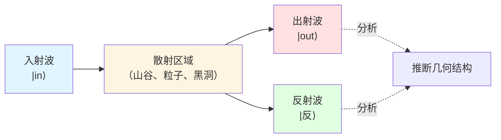
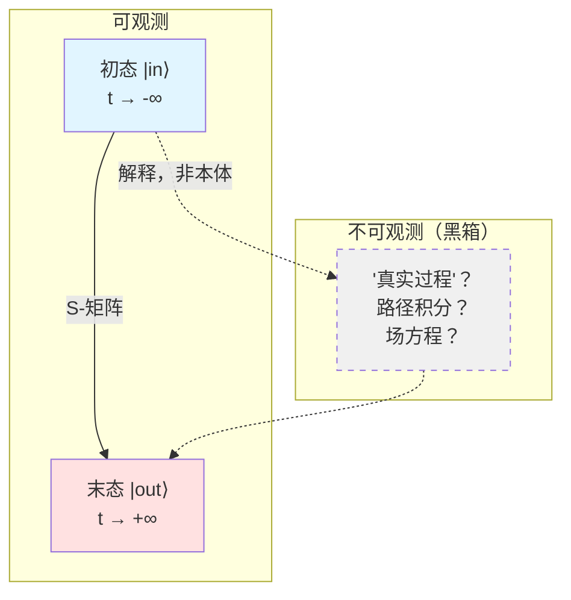
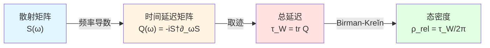
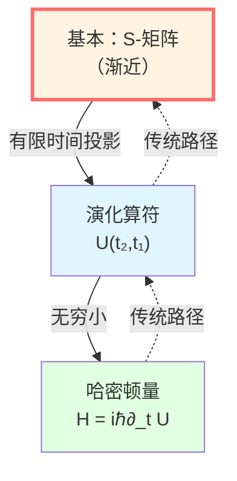
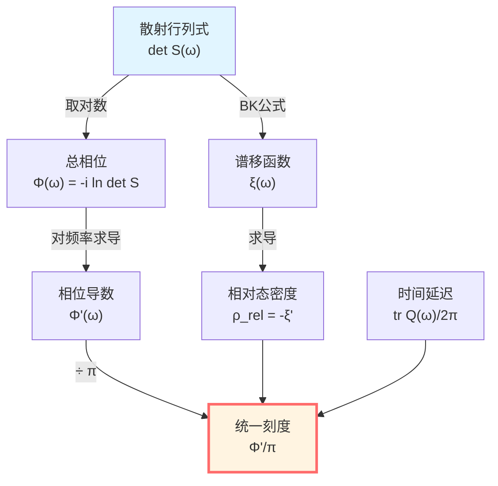
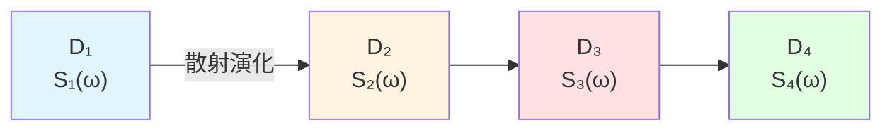

# 核心洞见四：散射就是演化

> *"宇宙不是在'运动'，而是在'散射'。"*

## 🎯 核心思想

在传统物理学中，我们用微分方程描述系统的演化：

$$
\frac{d\psi}{dt} = \text{(某个算符)} \cdot \psi
$$

但GLS理论提出了一个更深刻的视角：

**系统的演化本质上就是散射过程，而散射矩阵 $S(\omega)$ 编码了所有动力学信息！**

换句话说：

**演化 = 散射，动力学 = S-矩阵**

## 🏔️ 从山谷回声说起：散射揭示结构

### 山谷回声的比喻

想象你在山谷中大喊一声：

```
你发出声波 → 声波遇到山壁 → 反射回来（回声）
```

**通过分析回声**，你可以推断：
- 山谷的形状（几何）
- 山壁的材质（吸收/反射系数）
- 山谷的大小（延迟时间）



**物理学中的散射就是这样**：
- 发射粒子/波（输入）
- 与目标相互作用（散射）
- 探测出射态（输出）
- **从输入-输出关系推断内部结构！**

### 为什么散射如此基本？

因为在量子理论中，我们**永远无法直接看到"内部"**，只能：

1. 准备初态 $|\text{in}\rangle$（在过去无穷远）
2. 测量末态 $|\text{out}\rangle$（在未来无穷远）
3. 两者之间的关系就是 **S-矩阵**！

$$
|\text{out}\rangle = S |\text{in}\rangle
$$

**关键洞察**：

**S-矩阵是唯一可观测的东西！中间过程的"真实描述"是多余的，甚至是误导的！**

## 🌀 S-矩阵：演化的本质

### 什么是S-矩阵？

**S-矩阵**（Scattering matrix，散射矩阵）是一个幺正算符：

$$
S: \mathcal{H}_{\text{in}} \to \mathcal{H}_{\text{out}}
$$

满足：

1. **幺正性**：$S^\dagger S = S S^\dagger = \mathbb{I}$（概率守恒）
2. **因果性**：只连接过去渐近态与未来渐近态
3. **洛伦兹协变**：在相对论框架下协变

**物理意义**：

**S-矩阵元 $S_{fi} = \langle f | S | i \rangle$ 是从初态 $|i\rangle$ 到末态 $|f\rangle$ 的跃迁幅度。**

散射截面（可观测量）：

$$
\sigma \propto |S_{fi}|^2
$$

### S-矩阵包含所有信息

**Heisenberg的S-矩阵纲领**（1943）提出：

> "物理学的任务不是描述'过程'，而是计算S-矩阵元。"

**为什么？**

- 初态和末态是可观测的（在实验室制备和测量）
- 中间过程是不可观测的（Heisenberg不确定性原理）
- **可观测的东西就是S-矩阵！**



## ⏱️ Wigner-Smith时间延迟矩阵

### 群延迟：波包在散射区的停留时间

考虑一个波包入射到散射区：

**问题**：它在散射区"停留"了多长时间？

**答案**：Wigner-Smith时间延迟矩阵 $Q(\omega)$ 给出！

$$
\boxed{Q(\omega) = -i S(\omega)^\dagger \frac{\partial S(\omega)}{\partial \omega}}
$$

**物理意义**：

- $Q(\omega)$ 的本征值 $\tau_n(\omega)$ 是各个通道的时间延迟
- $\text{tr}\, Q(\omega) = \sum_n \tau_n(\omega)$ 是总延迟

**关键公式**（Eisenbud-Wigner公式）：

$$
\tau_W(\omega) = \frac{\partial \Phi(\omega)}{\partial \omega}
$$

其中 $\Phi(\omega) = -i \ln \det S(\omega)$ 是总散射相位。

### 时间延迟 = 态密度

更神奇的是，通过 **Birman-Kreĭn 公式**：

$$
\frac{1}{2\pi} \text{tr}\, Q(\omega) = \rho_{\text{rel}}(\omega)
$$

其中 $\rho_{\text{rel}}(\omega)$ 是**相对态密度**（散射系统比自由系统多出的量子态密度）。

**这意味着**：

**时间延迟就是态密度！系统的"复杂度"（有多少态）决定了波包的"停留时间"！**



## 🔄 演化 = 散射：统一视角

### 为什么说演化就是散射？

在GLS理论中，**任何物理过程都可以看作散射**：

| 传统描述 | 散射描述 |
|---------|---------|
| 粒子运动 | 粒子-粒子散射 |
| 场演化 | 场模式的散射 |
| 黑洞蒸发 | Hawking辐射的散射 |
| 宇宙膨胀 | 共形模式的散射 |
| 量子测量 | 系统-仪器散射 |

**核心原则**：

**只要有"输入"和"输出"，中间无论发生什么，都可以用S-矩阵描述！**

### 幺正演化的深层含义

量子力学的演化算符：

$$
U(t_2, t_1) = e^{-i H (t_2 - t_1) / \hbar}
$$

在 $t_1 \to -\infty$，$t_2 \to +\infty$ 的极限下，就是S-矩阵：

$$
S = \lim_{t_1 \to -\infty, t_2 \to +\infty} U(t_2, t_1)
$$

**但GLS理论反转了这个逻辑**：

**不是"先有演化U，再定义S"，而是"先有S，演化U是S在有限时间的投影"！**



## 🧮 Birman-Kreĭn公式：谱、相位、延迟的统一

这是GLS理论的核心数学工具之一。

**Birman-Kreĭn 公式**联系了：

1. **谱移函数** $\xi(\omega)$：散射系统比自由系统多出的谱权重
2. **散射行列式**：$\det S(\omega) = e^{-2\pi i \xi(\omega)}$
3. **相对态密度**：$\rho_{\text{rel}}(\omega) = -\xi'(\omega)$

完整的公式链：

$$
\boxed{\det S(\omega) = e^{-2\pi i \xi(\omega)} \quad \Rightarrow \quad \frac{\Phi'(\omega)}{\pi} = \rho_{\text{rel}}(\omega) = \frac{1}{2\pi} \text{tr}\, Q(\omega)}
$$

**这就是统一时间刻度同一式的来源！**



## 🌌 宇宙作为散射矩阵

### 整个宇宙就是一个S-矩阵！

在GLS的**矩阵宇宙**框架中（我们将在后面详述），有一个惊人的命题：

**宇宙的本体就是一个巨大的散射矩阵族 $\mathbb{S}(\omega)$！**

- 每个频率 $\omega$ 对应一个幺正矩阵 $S(\omega)$
- 所有时空、引力、粒子都是这个矩阵的"涌现"
- 演化就是矩阵的"流动"

**THE-MATRIX 不是科幻，而是数学实在！**

### 因果网络 = 散射网络

在因果结构的语言中：

- 每个小因果菱形 $D_{p,r}$ 都有一个关联的散射矩阵 $S_{p,r}(\omega)$
- 菱形的演化由 $S$ 的幺正性保证
- 菱形链的Markov性由散射的局域性保证

**因果传播 = 散射传播！**



## 🔬 实验可验证性

散射理论的美妙之处在于：**它是直接可观测的！**

### 实验1：介观导体的Wigner-Smith延迟

在量子点、介观环等系统中，可以直接测量：

- 多端口散射矩阵 $S_{ij}(\omega)$（用矢量网络分析仪）
- 时间延迟矩阵 $Q(\omega)$（从 $S$ 的频率导数）
- 验证：$\text{tr}\, Q / 2\pi = \rho_{\text{rel}}$（通过态密度测量）

### 实验2：Shapiro引力时间延迟

雷达信号经过太阳附近时的延迟：

$$
\Delta t \simeq \frac{4GM}{c^3} \ln \frac{4r_E r_R}{b^2}
$$

**这就是引力散射的群延迟！**

可以用 $Q(\omega)$ 框架重新解释：引力场就是一个散射势，Shapiro延迟就是 $\text{tr}\, Q$！

### 实验3：宇宙学红移作为相位节奏

FRW宇宙中的红移：

$$
1 + z = \frac{a(t_0)}{a(t_e)}
$$

可以重写为相位节奏比：

$$
1 + z = \frac{(d\phi/dt)_e}{(d\phi/dt)_0}
$$

**红移就是宇宙散射矩阵的相位演化！**

## 🔗 与其他核心思想的联系

- **时间是几何**：时间刻度 $\tau$ 从 $Q(\omega)$ 导出
- **因果是偏序**：散射保持因果序（S只连接过去与未来）
- **边界是实在**：S-矩阵定义在边界渐近态上
- **熵是箭头**：散射过程熵单调增（幺正性+粗粒化）

## 🎓 深入阅读

想要理解更多技术细节，可以阅读：

- 理论文档：[unified-time-scale-geometry.md](../../euler-gls-paper-time/unified-time-scale-geometry.md)
- 边界框架：[boundary-time-geometry-unified-framework.md](../../euler-gls-paper-bondary/boundary-time-geometry-unified-framework.md)
- 上一篇：[03-boundary-is-reality.md](./03-boundary-is-reality.md) - 边界就是实在
- 下一篇：[05-entropy-is-arrow.md](./05-entropy-is-arrow.md) - 熵就是箭头

## 🤔 思考题

1. 为什么说"中间过程"是不可观测的？量子力学的哪些特性导致了这一点？
2. Wigner-Smith矩阵为什么定义为 $Q = -i S^\dagger \partial_\omega S$ 而不是其他形式？
3. 如果宇宙就是一个S-矩阵，那"时间演化"意味着什么？
4. 散射的幺正性与概率守恒有什么关系？
5. Birman-Kreĭn公式在什么条件下成立？谱移函数的物理意义是什么？

## 📝 关键公式回顾

$$
\boxed{|\text{out}\rangle = S |\text{in}\rangle} \quad \text{(S-矩阵定义)}
$$

$$
\boxed{Q(\omega) = -i S(\omega)^\dagger \frac{\partial S(\omega)}{\partial \omega}} \quad \text{(Wigner-Smith矩阵)}
$$

$$
\boxed{\det S(\omega) = e^{-2\pi i \xi(\omega)}} \quad \text{(Birman-Kreĭn公式)}
$$

$$
\boxed{\frac{1}{2\pi} \text{tr}\, Q(\omega) = \rho_{\text{rel}}(\omega) = \frac{\Phi'(\omega)}{\pi}} \quad \text{(时间刻度同一式)}
$$

---

**下一步**：在理解了"散射就是演化"之后，我们将看到"熵就是箭头"——时间的方向性来自熵增，而熵增又与因果、散射、边界紧密相连！

