# Core Insight 4: Scattering Modeled as Evolution

> *"GLS theory proposes: The universe might not be 'moving,' but 'scattering.'"*

## 🎯 Core Idea

In traditional physics, we describe system evolution with differential equations:

$$
\frac{d\psi}{dt} = \text{(some operator)} \cdot \psi
$$

But GLS theory proposes a deeper perspective:

**GLS theory proposes: System evolution might be essentially a scattering process, and the scattering matrix $S(\omega)$ encodes all dynamical information!**

In other words:

**In GLS framework: Evolution ⟺ Scattering, Dynamics ⟺ S-Matrix**

## 🏔️ Starting from Valley Echoes: Scattering Reveals Structure

### The Valley Echo Analogy

Imagine you shout in a valley:

```
You emit sound wave → Sound wave hits mountain wall → Reflects back (echo)
```

**By analyzing the echo**, you can infer:
- Valley shape (geometry)
- Wall material (absorption/reflection coefficient)
- Valley size (delay time)


**Scattering in physics is like this**:
- Emit particles/waves (input)
- Interact with target (scattering)
- Detect outgoing states (output)
- **Infer internal structure from input-output relations!**

### Why is Scattering So Fundamental?

Because in quantum theory, we **can never directly see the "interior"**, only:

1. Prepare initial state $|\text{in}\rangle$ (at past infinity)
2. Measure final state $|\text{out}\rangle$ (at future infinity)
3. The relation between them is the **S-matrix**!

$$
|\text{out}\rangle = S |\text{in}\rangle
$$

**Key insight**:

**S-matrix is considered the only observable thing! The "real description" of intermediate processes might be redundant, even misleading!**

## 🌀 S-Matrix: Essence of Evolution

### What is S-Matrix?

**S-matrix** (Scattering matrix) is a unitary operator:

$$
S: \mathcal{H}_{\text{in}} \to \mathcal{H}_{\text{out}}
$$

Satisfying:

1. **Unitarity**: $S^\dagger S = S S^\dagger = \mathbb{I}$ (probability conservation)
2. **Causality**: Only connects past asymptotic states with future asymptotic states
3. **Lorentz covariance**: Covariant under relativistic framework

**Physical meaning**:

**S-matrix element $S_{fi} = \langle f | S | i \rangle$ is the transition amplitude from initial state $|i\rangle$ to final state $|f\rangle$.**

Scattering cross-section (observable):

$$
\sigma \propto |S_{fi}|^2
$$

### S-Matrix Contains All Information

**Heisenberg's S-matrix program** (1943) proposed:

> "The task of physics is not to describe 'processes,' but to calculate S-matrix elements."

**Why?**

- Initial and final states are observable (prepared and measured in laboratory)
- Intermediate processes are unobservable (Heisenberg uncertainty principle)
- **What is theoretically observable is the S-matrix!**

```mermaid
graph TB
    subgraph "Observable"
        I["Initial State |in⟩<br/>t → -∞"]
        O["Final State |out⟩<br/>t → +∞"]
    end

    subgraph "Unobservable (Black Box)"
        P["'Real Process'?<br/>Path Integral?<br/>Field Equation?"]
    end

    I --> |"S-Matrix"| O
    I -.-> |"Interpretation, Not Ontology"| P
    P -.-> O

    style I fill:#e1f5ff
    style O fill:#ffe1e1
    style P fill:#f0f0f0,stroke-dasharray: 5 5
```



## ⏱️ Wigner-Smith Time Delay Matrix

### Group Delay: Time Wave Packet Stays in Scattering Region

Consider a wave packet incident on a scattering region:

**Question**: How long does it "stay" in the scattering region?

**Answer**: Given by Wigner-Smith time delay matrix $Q(\omega)$!

$$
\boxed{Q(\omega) = -i S(\omega)^\dagger \frac{\partial S(\omega)}{\partial \omega}}
$$

**Physical meaning**:

- Eigenvalues $\tau_n(\omega)$ of $Q(\omega)$ are time delays of each channel
- $\text{tr}\, Q(\omega) = \sum_n \tau_n(\omega)$ is total delay

**Key formula** (Eisenbud-Wigner formula):

$$
\tau_W(\omega) = \frac{\partial \Phi(\omega)}{\partial \omega}
$$

where $\Phi(\omega) = -i \ln \det S(\omega)$ is the total scattering phase.

### Time Delay = Density of States

More remarkably, through **Birman-Kreĭn formula**:

$$
\frac{1}{2\pi} \text{tr}\, Q(\omega) = \rho_{\text{rel}}(\omega)
$$

where $\rho_{\text{rel}}(\omega)$ is the **relative density of states** (quantum state density that scattering system has more than free system).

**This means**:

**Time delay is mathematically equivalent to density of states! The system's "complexity" (how many states) determines the wave packet's "stay time"!**

```mermaid
graph LR
    S["Scattering Matrix<br/>S(ω)"] --> |"Frequency Derivative"| Q["Time Delay Matrix<br/>Q(ω) = -iS†∂_ωS"]
    Q --> |"Take Trace"| T["Total Delay<br/>τ_W = tr Q"]
    T --> |"Birman-Kreĭn"| R["Density of States<br/>ρ_rel = τ_W/2π"]

    style S fill:#e1f5ff
    style Q fill:#fff4e1
    style T fill:#ffe1e1
    style R fill:#e1ffe1
```



## 🔄 Evolution = Scattering: Unified Perspective

### Why Say Evolution is Scattering?

In GLS theory, **any physical process might be viewed as scattering**:

| Traditional Description | Scattering Description |
|------------------------|----------------------|
| Particle motion | Particle-particle scattering |
| Field evolution | Scattering of field modes |
| Black hole evaporation | Scattering of Hawking radiation |
| Universe expansion | Scattering of conformal modes |
| Quantum measurement | System-apparatus scattering |

**Core principle**:

**As long as there is "input" and "output," whatever happens in between can theoretically be described by S-matrix!**

### Deep Meaning of Unitary Evolution

Quantum mechanical evolution operator:

$$
U(t_2, t_1) = e^{-i H (t_2 - t_1) / \hbar}
$$

In the limit $t_1 \to -\infty$, $t_2 \to +\infty$, it becomes the S-matrix:

$$
S = \lim_{t_1 \to -\infty, t_2 \to +\infty} U(t_2, t_1)
$$

**But GLS theory reverses this logic**:

**GLS theory argues: Maybe not "first have evolution U, then define S," but "first have S, evolution U is a projection of S at finite time"!**

```mermaid
graph TB
    S["Fundamental: S-Matrix<br/>(Asymptotic)"] --> |"Finite Time Projection"| U["Evolution Operator<br/>U(t₂,t₁)"]
    U --> |"Infinitesimal"| H["Hamiltonian<br/>H = iℏ∂_t U"]

    H -.-> |"Traditional Path"| U
    U -.-> |"Traditional Path"| S

    style S fill:#fff4e1,stroke:#ff6b6b,stroke-width:3px
    style U fill:#e1f5ff
    style H fill:#e1ffe1
```



## 🧮 Birman-Kreĭn Formula: Unification of Spectrum, Phase, Delay

This is one of the core mathematical tools of GLS theory.

**Birman-Kreĭn formula** connects:

1. **Spectral shift function** $\xi(\omega)$: Extra spectral weight that scattering system has compared to free system
2. **Scattering determinant**: $\det S(\omega) = e^{-2\pi i \xi(\omega)}$
3. **Relative density of states**: $\rho_{\text{rel}}(\omega) = -\xi'(\omega)$

Complete formula chain:

$$
\boxed{\det S(\omega) = e^{-2\pi i \xi(\omega)} \quad \Rightarrow \quad \frac{\Phi'(\omega)}{\pi} = \rho_{\text{rel}}(\omega) = \frac{1}{2\pi} \text{tr}\, Q(\omega)}
$$

**This is the mathematical source of the Unified Time Scale Identity!**

```mermaid
graph TB
    D["Scattering Determinant<br/>det S(ω)"] --> |"Take Logarithm"| P["Total Phase<br/>Φ(ω) = -i ln det S"]
    P --> |"Derivative w.r.t. Frequency"| Pp["Phase Derivative<br/>Φ'(ω)"]

    D --> |"BK Formula"| X["Spectral Shift Function<br/>ξ(ω)"]
    X --> |"Derivative"| Xp["Relative Density of States<br/>ρ_rel = -ξ'"]

    Pp --> |"÷ π"| U["Unified Scale<br/>Φ'/π"]
    Xp --> U

    Q["Time Delay<br/>tr Q(ω)/2π"] --> U

    style D fill:#e1f5ff
    style U fill:#fff4e1,stroke:#ff6b6b,stroke-width:3px
```



## 🌌 Universe as Scattering Matrix

### The Entire Universe is an S-Matrix!

In GLS's **matrix universe** framework (which we will detail later), there is an amazing proposition:

**GLS theory hypothesizes: The ontology of the universe might be a huge family of scattering matrices $\mathbb{S}(\omega)$!**

- Each frequency $\omega$ corresponds to a unitary matrix $S(\omega)$
- All spacetime, gravity, particles are "emergences" of this matrix
- Evolution is the "flow" of the matrix

**THE-MATRIX might not be science fiction, but a mathematical reality!**

### Causal Network = Scattering Network

In the language of causal structure:

- Each small causal diamond $D_{p,r}$ has an associated scattering matrix $S_{p,r}(\omega)$
- Diamond evolution is guaranteed by unitarity of $S$
- Markov property of diamond chains is guaranteed by locality of scattering

**Causal propagation ⟺ Scattering propagation!**

```mermaid
graph LR
    D1["D₁<br/>S₁(ω)"] --> |"Scattering Evolution"| D2["D₂<br/>S₂(ω)"]
    D2 --> D3["D₃<br/>S₃(ω)"]
    D3 --> D4["D₄<br/>S₄(ω)"]

    style D1 fill:#e1f5ff
    style D2 fill:#fff4e1
    style D3 fill:#ffe1e1
    style D4 fill:#e1ffe1
```



## 🔬 Experimental Verifiability

The beauty of scattering theory is: **It is theoretically directly observable!**

### Experiment 1: Wigner-Smith Delay in Mesoscopic Conductors

In quantum dots, mesoscopic rings, etc., we can directly measure:

- Multi-port scattering matrix $S_{ij}(\omega)$ (using vector network analyzer)
- Time delay matrix $Q(\omega)$ (from frequency derivative of $S$)
- Verification: $\text{tr}\, Q / 2\pi = \rho_{\text{rel}}$ (through density of states measurement)

### Experiment 2: Shapiro Gravitational Time Delay

Delay of radar signal passing near the Sun:

$$
\Delta t \simeq \frac{4GM}{c^3} \ln \frac{4r_E r_R}{b^2}
$$

**This is the group delay of gravitational scattering!**

Can be reinterpreted using $Q(\omega)$ framework: Gravitational field is a scattering potential, Shapiro delay is $\text{tr}\, Q$!

### Experiment 3: Cosmological Redshift as Phase Rhythm

Redshift in FRW universe:

$$
1 + z = \frac{a(t_0)}{a(t_e)}
$$

Can be rewritten as phase rhythm ratio:

$$
1 + z = \frac{(d\phi/dt)_e}{(d\phi/dt)_0}
$$

**Redshift can be interpreted as the phase evolution of cosmic scattering matrix!**

## 🔗 Connections to Other Core Ideas

- **Time is Geometry**: Time scale $\tau$ is derived from $Q(\omega)$
- **Causality is Partial Order**: Scattering preserves causal order (S only connects past with future)
- **Boundary is Reality**: S-matrix is defined on boundary asymptotic states
- **Entropy is Arrow**: Scattering process entropy monotonically increases (unitarity + coarse-graining)

## 🎓 Further Reading

To understand more technical details, you can read:

- Theory document: unified-time-scale-geometry.md
- Boundary framework: boundary-time-geometry-unified-framework.md
- Previous: [03-boundary-is-reality_en.md](03-boundary-is-reality_en.md) - Boundary is Reality
- Next: [05-entropy-is-arrow_en.md](05-entropy-is-arrow_en.md) - Entropy is Arrow

## 🤔 Questions for Reflection

1. Why do we say "intermediate processes" are unobservable? What properties of quantum mechanics lead to this?
2. Why is Wigner-Smith matrix defined as $Q = -i S^\dagger \partial_\omega S$ rather than other forms?
3. If the universe is an S-matrix, what does "time evolution" mean?
4. What is the relationship between unitarity of scattering and probability conservation?
5. Under what conditions does Birman-Kreĭn formula hold? What is the physical meaning of spectral shift function?

## 📝 Key Formulas Review

$$
\boxed{|\text{out}\rangle = S |\text{in}\rangle} \quad \text{(S-Matrix Definition)}
$$

$$
\boxed{Q(\omega) = -i S(\omega)^\dagger \frac{\partial S(\omega)}{\partial \omega}} \quad \text{(Wigner-Smith Matrix)}
$$

$$
\boxed{\det S(\omega) = e^{-2\pi i \xi(\omega)}} \quad \text{(Birman-Kreĭn Formula)}
$$

$$
\boxed{\frac{1}{2\pi} \text{tr}\, Q(\omega) = \rho_{\text{rel}}(\omega) = \frac{\Phi'(\omega)}{\pi}} \quad \text{(Time Scale Identity)}
$$

---

**Next Step**: After understanding "Scattering is Evolution," we will see "Entropy is Arrow"—time's directionality comes from entropy increase, which is closely connected with causality, scattering, and boundary!

