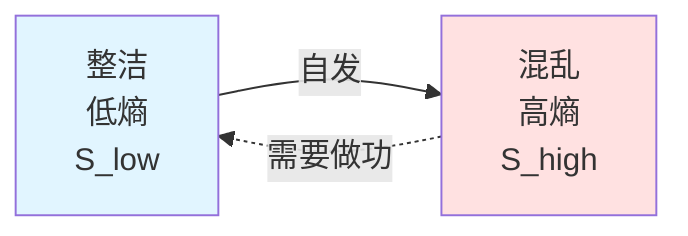
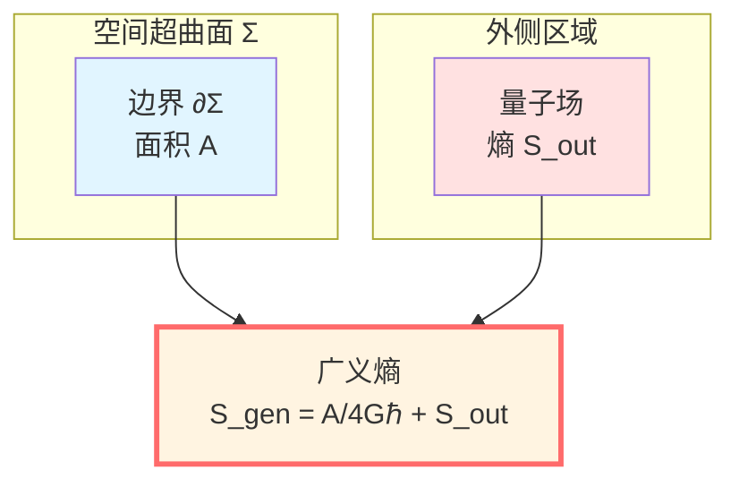
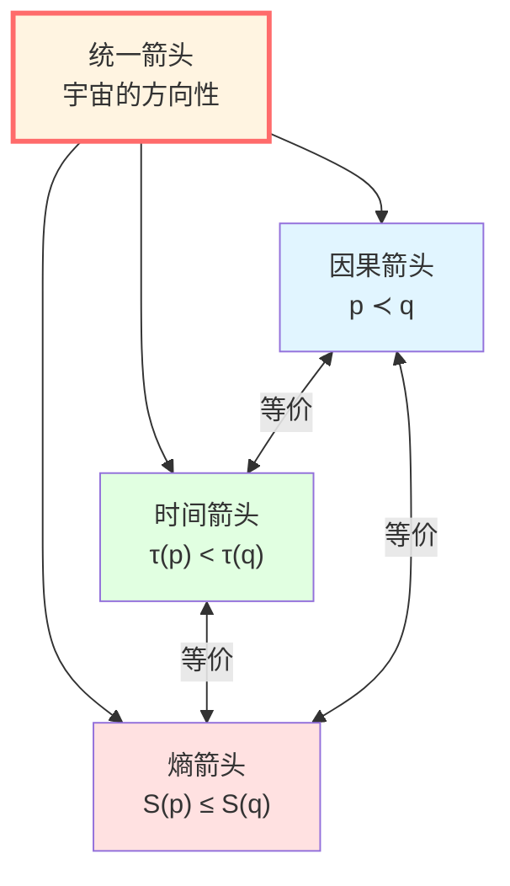
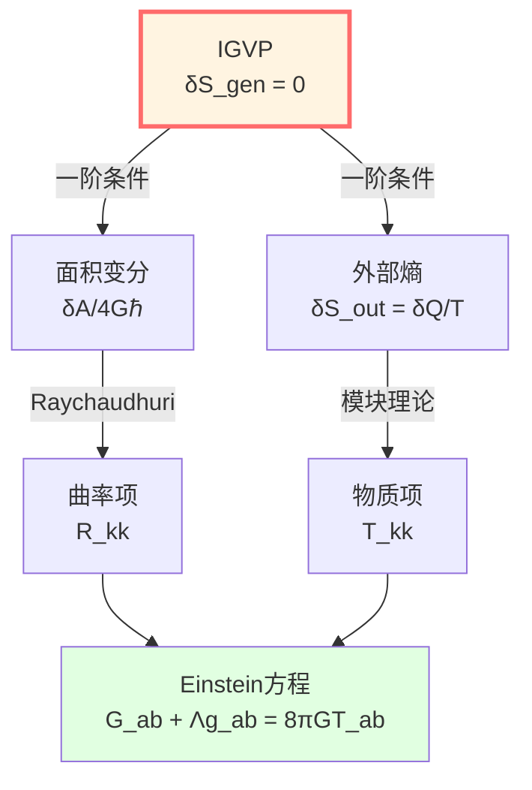
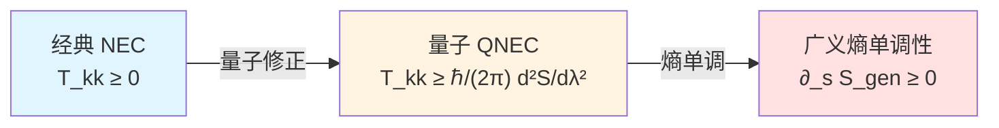

# 核心洞见五：熵可被建模为箭头

> *"GLS理论提出：时间为什么有方向？可能因为熵在增加。"*

## 🎯 核心思想

在前面的洞见中，我们看到：
- 时间是几何
- 因果是偏序
- 边界是实在
- 散射是演化

但还有一个深刻的问题：**为什么时间有方向？**

物理定律（牛顿、麦克斯韦、薛定谔、Einstein）大多是**时间反演对称**的——倒放录像带，它们仍然成立。

**那么"过去→未来"的箭头从何而来？**

GLS理论的答案：

**在GLS框架下：时间的箭头 ⟺ 熵的箭头 ⟺ 因果的箭头**

而这三者，在统一时间刻度下，**在数学上可能等价于同一个对象**！

## 🏠 从房间混乱说起：熵是什么？

### 房间的"熵"

想象你的房间：

**整洁状态**：
- 书在书架上，按字母排序
- 衣服在衣柜里，分类整齐
- 桌面干净，文具归位

**混乱状态**：
- 书散落地上
- 衣服堆成山
- 桌面一片狼藉

**观察**：
- 房间自发地从整洁变混乱（熵增）
- 从混乱恢复整洁需要**做功**（你得收拾）
- **时间箭头与熵增方向一致**

### Boltzmann公式：熵的定义

Ludwig Boltzmann在1877年给出了熵的精确定义：

$$
\boxed{S = k_B \ln \Omega}
$$

其中：
- $S$：熵（entropy）
- $k_B$：Boltzmann常数
- $\Omega$：微观状态数（microstate）

**物理意义**：

**熵衡量的是"有多少种微观排列方式对应同一宏观状态"。**

例如：
- 整洁房间：$\Omega_{\text{整洁}} \approx 10^{10}$（只有少数几种整洁方式）
- 混乱房间：$\Omega_{\text{混乱}} \approx 10^{100}$（有无数种混乱方式）

所以：

$$
S_{\text{混乱}} = k_B \ln(10^{100}) \gg S_{\text{整洁}} = k_B \ln(10^{10})
$$

## 📈 热力学第二定律：熵永远增加

### 第二定律的表述

**Clausius表述**（1850）：
> "热量不能自发地从冷物体流向热物体。"

**Kelvin表述**（1851）：
> "不可能从单一热源吸热使之完全转化为有用功而不产生其他影响。"

**统计力学表述**（Boltzmann）：
> "孤立系统的熵永不减少。"

$$
\boxed{\Delta S \ge 0} \quad \text{（孤立系统）}
$$

**GLS洞察**：

在统一时间刻度框架下，第二定律可能不是独立的"定律"，而是因果结构的**必然结果**！

## 🌌 广义熵：几何+量子

### Bekenstein-Hawking熵的启示

我们在"边界是实在"中已经看到，黑洞的熵正比于**面积**：

$$
S_{\text{BH}} = \frac{A}{4G\hbar}
$$

**这暗示**：熵可能不仅是"微观状态数"，还有**几何意义**！

### 广义熵的定义

在量子引力中，**广义熵**（generalized entropy）包含两部分：

$$
\boxed{S_{\text{gen}}(\Sigma) = \underbrace{\frac{A(\Sigma)}{4G\hbar}}_{\text{几何熵（面积）}} + \underbrace{S_{\text{out}}(\Sigma)}_{\text{量子场熵（von Neumann）}}}
$$

其中：
- $\Sigma$：一个空间超曲面（Cauchy slice）
- $A(\Sigma)$：超曲面边界的面积
- $S_{\text{out}}(\Sigma)$：边界外侧量子场的冯·诺依曼熵

**物理意义**：

1. **几何部分** $A/(4G\hbar)$：来自引力/时空的自由度
2. **量子部分** $S_{\text{out}}$：来自物质场的自由度
3. **总熵**：两者之和才是完整的熵

**关键洞察**：

在GLS理论中，**广义熵的极值/单调性条件被推导为直接导出Einstein场方程！**

## 🔗 三重箭头的统一

现在我们可以揭示GLS理论的核心洞见之一：

**理论推论 2（因果偏序的等价刻画）**

在GLS框架下，对任意两个事件 $p, q$，以下**在数学上等价**：

1. **几何因果性**：$q \in J^+(p)$
2. **时间单调性**：$\tau(p) \le \tau(q)$
3. **熵单调性**：$S_{\text{gen}}(p) \le S_{\text{gen}}(q)$

$$
\boxed{p \prec q \quad \Longleftrightarrow \quad \tau(p) \le \tau(q) \quad \Longleftrightarrow \quad S_{\text{gen}}(p) \le S_{\text{gen}}(q)}
$$

**这意味着**：

- **因果箭头**（过去→未来）
- **时间箭头**（时钟前进）
- **熵箭头**（混乱增加）

**可能是同一个箭头的三种表现！**

## 🎓 IGVP：从熵到Einstein方程

这是GLS理论最惊人的成就之一：**尝试用熵的变分原理推导引力场方程！**

### 信息几何变分原理（IGVP）

**核心思想**：

在每个时空点 $p$ 附近的小因果菱形 $\mathcal{D}_\ell(p)$ 上，要求：

**（一阶条件）**：在固定体积约束 $\delta V = 0$ 下，广义熵取极值：

$$
\delta S_{\text{gen}} = 0
$$

**（二阶条件）**：相对熵非负：

$$
\delta^2 S_{\text{rel}} \ge 0
$$

### 推导Einstein方程的步骤

**步骤1**：计算广义熵的变分：

$$
\delta S_{\text{gen}} = \frac{\delta A}{4G\hbar} + \delta S_{\text{out}}
$$

**步骤2**：利用外部熵的一阶律（来自模块理论）：

$$
\delta S_{\text{out}} = \frac{\delta Q}{T} = \frac{2\pi}{\hbar} \int_{\mathcal{H}} \lambda \, T_{kk} \, d\lambda \, dA
$$

其中 $T_{kk} = T_{ab} k^a k^b$ 是沿零方向的应力能量张量。

**步骤3**：利用Raychaudhuri方程，面积变分与曲率相关：

$$
\delta A \sim -\int R_{kk} \, (\text{光线测度})
$$

**步骤4**：令 $\delta S_{\text{gen}} = 0$，得到：

$$
\frac{\delta A}{4G\hbar} + \frac{2\pi}{\hbar} \int \lambda \, T_{kk} \, d\lambda \, dA = 0
$$

**步骤5**：通过Radon型闭包（将积分条件转化为点态条件），得到：

$$
\boxed{R_{kk} = 8\pi G \, T_{kk}}
$$

**步骤6**：对所有零方向 $k^a$ 成立，升格为张量方程：

$$
\boxed{G_{ab} + \Lambda g_{ab} = 8\pi G \, T_{ab}}
$$

**这在形式上推导出了Einstein场方程！**

**深刻含义**：

**GLS理论主张：引力场方程可能不是基本公理，而是熵的极值条件的必然结果！**

## 🌊 QNEC：量子零能量条件

### 经典能量条件的困境

在经典广义相对论中，我们常假设**能量条件**，例如：

**零能量条件（NEC）**：

$$
T_{ab} k^a k^b \ge 0 \quad (\text{对所有零向量 } k^a)
$$

但在量子场论中，**这个条件可以被违反**！（例如Casimir效应）

### 量子零能量条件（QNEC）

GLS理论（及相关工作）发现了一个更深刻的条件：

**QNEC**（Quantum Null Energy Condition）：

$$
\boxed{\langle T_{kk}(x) \rangle_\psi \ge \frac{\hbar}{2\pi} \frac{d^2 S_{\text{out}}}{d\lambda^2}(x)}
$$

其中：
- $\langle T_{kk} \rangle_\psi$：零方向应力能量张量的量子期望值
- $d^2 S_{\text{out}} / d\lambda^2$：沿零测地线的熵的二阶导数
- $\lambda$：零测地线的仿射参数

**物理意义**：

**能量密度的下界可能由熵的变化率决定！**

这个条件：
1. 在经典极限恢复 NEC
2. 在量子情形允许局部负能量
3. 已在大量CFT中得到严格证明
4. 是IGVP二阶条件的体现

## 🔄 熵增 = 信息增？

### Shannon信息熵

在信息论中，Claude Shannon定义了**信息熵**：

$$
S = -\sum_i p_i \ln p_i
$$

其中 $p_i$ 是事件 $i$ 的概率。

**物理意义**：

- 熵 = 不确定性 = 缺失的信息
- 熵越大，我们对系统的了解越少

### 信息永不丢失？

量子力学的幺正演化保证**信息守恒**（von Neumann熵不变）。

但热力学第二定律说**熵增加**（信息丢失？）。

**矛盾？**

**GLS的解释**：

1. **微观层面**：幺正演化，信息守恒
2. **宏观层面**：粗粒化后，可访问信息减少
3. **广义熵**：包含几何+量子，总熵单调增
4. **边界视角**：信息可能不丢失，只是转移到边界！

**黑洞信息悖论的启示**：

- 落入黑洞的信息编码在视界面积上
- Hawking辐射携带信息
- 广义熵 $S_{\text{gen}} = A/(4G\hbar) + S_{\text{rad}}$ 单调增

## 🔗 与其他核心思想的联系

- **时间是几何**：时间刻度 $\tau$ 与熵的单调性等价
- **因果是偏序**：偏序关系 $p \prec q \Leftrightarrow S(p) \le S(q)$
- **边界是实在**：熵的几何部分 $A/(4G\hbar)$ 是边界面积
- **散射是演化**：散射过程满足幺正性（熵可逆），粗粒化后熵增

## 🎓 深入阅读

想要理解更多技术细节，可以阅读：

- 理论文档：igvp-einstein-complete.md
- 因果与熵：unified-theory-causal-structure-time-scale-partial-order-generalized-entropy.md
- 上一篇：[04-scattering-is-evolution.md](04-scattering-is-evolution.md) - 散射就是演化
- 下一篇：[06-unity-of-five.md](06-unity-of-five.md) - 五者合一（详解）
- 总结：[07-core-summary.md](07-core-summary.md) - 核心思想总结

## 🤔 思考题

1. 为什么鸡蛋可以自发打碎，但碎鸡蛋不会自发复原？
2. Boltzmann公式 $S = k_B \ln \Omega$ 中，为什么用对数而不是直接用 $\Omega$？
3. 如果微观定律时间可逆，宏观为何不可逆？粗粒化起什么作用？
4. 广义熵的两部分（几何+量子）在什么情况下哪个占主导？
5. QNEC允许局部负能量，这与"能量非负"的直觉矛盾吗？
6. 黑洞信息悖论的核心问题是什么？GLS理论如何解决？

## 📝 关键公式回顾

$$
\boxed{S = k_B \ln \Omega} \quad \text{(Boltzmann公式)}
$$

$$
\boxed{S_{\text{gen}}(\Sigma) = \frac{A(\Sigma)}{4G\hbar} + S_{\text{out}}(\Sigma)} \quad \text{(广义熵)}
$$

$$
\boxed{p \prec q \Leftrightarrow \tau(p) \le \tau(q) \Leftrightarrow S_{\text{gen}}(p) \le S_{\text{gen}}(q)} \quad \text{(三重等价)}
$$

$$
\boxed{\delta S_{\text{gen}} = 0 \quad \Rightarrow \quad G_{ab} + \Lambda g_{ab} = 8\pi G T_{ab}} \quad \text{(IGVP)}
$$

$$
\boxed{\langle T_{kk} \rangle \ge \frac{\hbar}{2\pi} \frac{d^2 S_{\text{out}}}{d\lambda^2}} \quad \text{(QNEC)}
$$

---

**下一步**：我们已经理解了五个核心洞见。接下来，在"五者合一"中，我们将看到它们如何通过**统一时间刻度同一式**完美结合成一个整体！

