# Core Insight 5: Entropy Modeled as Arrow

> *"GLS theory proposes: Why does time have direction? Possibly because entropy is increasing."*

## 🎯 Core Idea

In previous insights, we saw:
- Time is geometry
- Causality is partial order
- Boundary is reality
- Scattering is evolution

But there's a deeper question: **Why does time have direction?**

Physical laws (Newton, Maxwell, Schrödinger, Einstein) are mostly **time-reversal symmetric**—play the tape backwards, they still hold.

**So where does the "past→future" arrow come from?**

GLS theory's answer:

**In GLS framework: Arrow of time ⟺ Arrow of entropy ⟺ Arrow of causality**

And these three, under unified time scale, **might be mathematically equivalent to the same object**!

## 🏠 Starting from Room Chaos: What is Entropy?

### Room "Entropy"

Imagine your room:

**Tidy state**:
- Books on shelves, alphabetically sorted
- Clothes in wardrobe, neatly organized
- Desk clean, stationery in place

**Chaotic state**:
- Books scattered on floor
- Clothes piled up
- Desk in complete disarray

**Observation**:
- Room spontaneously goes from tidy to chaotic (entropy increase)
- Restoring order from chaos requires **work** (you have to clean up)
- **Time arrow aligns with direction of entropy increase**

### Boltzmann Formula: Definition of Entropy

Ludwig Boltzmann gave the precise definition of entropy in 1877:

$$
\boxed{S = k_B \ln \Omega}
$$

where:
- $S$: Entropy
- $k_B$: Boltzmann constant
- $\Omega$: Number of microstates

**Physical meaning**:

**Entropy measures "how many microscopic arrangements correspond to the same macroscopic state."**

For example:
- Tidy room: $\Omega_{\text{tidy}} \approx 10^{10}$ (only a few tidy ways)
- Chaotic room: $\Omega_{\text{chaotic}} \approx 10^{100}$ (countless chaotic ways)

So:

$$
S_{\text{chaotic}} = k_B \ln(10^{100}) \gg S_{\text{tidy}} = k_B \ln(10^{10})
$$

## 📈 Second Law of Thermodynamics: Entropy Always Increases

### Statements of Second Law

**Clausius statement** (1850):
> "Heat cannot spontaneously flow from cold object to hot object."

**Kelvin statement** (1851):
> "It is impossible to extract heat from a single heat source and completely convert it to useful work without other effects."

**Statistical mechanics statement** (Boltzmann):
> "Entropy of isolated system never decreases."

$$
\boxed{\Delta S \ge 0} \quad \text{(Isolated System)}
$$

**GLS insight**:

Under unified time scale framework, the second law might not be an independent "law," but a **necessary consequence** of causal structure!

## 🌌 Generalized Entropy: Geometry + Quantum

### Inspiration from Bekenstein-Hawking Entropy

We already saw in "Boundary is Reality" that black hole entropy is proportional to **area**:

$$
S_{\text{BH}} = \frac{A}{4G\hbar}
$$

**This suggests**: Entropy might not just be "number of microstates," but has **geometric meaning**!

### Definition of Generalized Entropy

In quantum gravity, **generalized entropy** contains two parts:

$$
\boxed{S_{\text{gen}}(\Sigma) = \underbrace{\frac{A(\Sigma)}{4G\hbar}}_{\text{Geometric Entropy (Area)}} + \underbrace{S_{\text{out}}(\Sigma)}_{\text{Quantum Field Entropy (von Neumann)}}}
$$

where:
- $\Sigma$: A spatial hypersurface (Cauchy slice)
- $A(\Sigma)$: Area of hypersurface boundary
- $S_{\text{out}}(\Sigma)$: von Neumann entropy of quantum fields outside boundary

```mermaid
graph TB
    subgraph "Spatial Hypersurface Σ"
        B["Boundary ∂Σ<br/>Area A"]
    end

    subgraph "Outside Region"
        O["Quantum Fields<br/>Entropy S_out"]
    end

    S["Generalized Entropy<br/>S_gen = A/4Gℏ + S_out"]

    B --> S
    O --> S

    style B fill:#e1f5ff
    style O fill:#ffe1e1
    style S fill:#fff4e1,stroke:#ff6b6b,stroke-width:3px
```

**Physical meaning**:

1. **Geometric part** $A/(4G\hbar)$: From degrees of freedom of gravity/spacetime
2. **Quantum part** $S_{\text{out}}$: From degrees of freedom of matter fields
3. **Total entropy**: Sum of both is complete entropy

**Key insight**:

In GLS theory, **extremum/monotonicity conditions of generalized entropy are derived to directly yield Einstein's field equation!**

## 🔗 Unification of Triple Arrows

Now we can reveal one of the core insights of GLS theory:

**Theoretical Inference 2 (Equivalent Characterizations of Causal Partial Order)**

In GLS framework, for any two events $p, q$, the following are **mathematically equivalent**:

1. **Geometric Causality**: $q \in J^+(p)$
2. **Time Monotonicity**: $\tau(p) \le \tau(q)$
3. **Entropy Monotonicity**: $S_{\text{gen}}(p) \le S_{\text{gen}}(q)$

$$
\boxed{p \prec q \quad \Longleftrightarrow \quad \tau(p) \le \tau(q) \quad \Longleftrightarrow \quad S_{\text{gen}}(p) \le S_{\text{gen}}(q)}
$$

**This means**:

- **Causal arrow** (past→future)
- **Time arrow** (clock advances)
- **Entropy arrow** (chaos increases)

**Might be three manifestations of the same arrow!**

```mermaid
graph TB
    U["Unified Arrow<br/>Directionality of Universe"] --> C["Causal Arrow<br/>p ≺ q"]
    U --> T["Time Arrow<br/>τ(p) < τ(q)"]
    U --> S["Entropy Arrow<br/>S(p) ≤ S(q)"]

    C <--> |"Equivalent"| T
    T <--> |"Equivalent"| S
    S <--> |"Equivalent"| C

    style U fill:#fff4e1,stroke:#ff6b6b,stroke-width:3px
    style C fill:#e1f5ff
    style T fill:#e1ffe1
    style S fill:#ffe1e1
```

## 🎓 IGVP: From Entropy to Einstein Equation

This is one of the most amazing achievements of GLS theory: **Attempting to derive gravitational field equation using variational principle of entropy!**

### Information Geometric Variational Principle (IGVP)

**Core idea**:

On small causal diamond $\mathcal{D}_\ell(p)$ near each spacetime point $p$, require:

**(First-order condition)**: Under fixed volume constraint $\delta V = 0$, generalized entropy takes extremum:

$$
\delta S_{\text{gen}} = 0
$$

**(Second-order condition)**: Relative entropy non-negative:

$$
\delta^2 S_{\text{rel}} \ge 0
$$

### Steps to Derive Einstein Equation

**Step 1**: Calculate variation of generalized entropy:

$$
\delta S_{\text{gen}} = \frac{\delta A}{4G\hbar} + \delta S_{\text{out}}
$$

**Step 2**: Use first law of external entropy (from modular theory):

$$
\delta S_{\text{out}} = \frac{\delta Q}{T} = \frac{2\pi}{\hbar} \int_{\mathcal{H}} \lambda \, T_{kk} \, d\lambda \, dA
$$

where $T_{kk} = T_{ab} k^a k^b$ is stress-energy tensor along null direction.

**Step 3**: Using Raychaudhuri equation, area variation relates to curvature:

$$
\delta A \sim -\int R_{kk} \, (\text{light ray measure})
$$

**Step 4**: Setting $\delta S_{\text{gen}} = 0$, we get:

$$
\frac{\delta A}{4G\hbar} + \frac{2\pi}{\hbar} \int \lambda \, T_{kk} \, d\lambda \, dA = 0
$$

**Step 5**: Through Radon-type closure (converting integral condition to pointwise condition), we get:

$$
\boxed{R_{kk} = 8\pi G \, T_{kk}}
$$

**Step 6**: Holding for all null directions $k^a$, upgrading to tensor equation:

$$
\boxed{G_{ab} + \Lambda g_{ab} = 8\pi G \, T_{ab}}
$$

**This formally yields Einstein's field equation!**

```mermaid
graph TB
    I["IGVP<br/>δS_gen = 0"] --> |"First-Order Condition"| A["Area Variation<br/>δA/4Gℏ"]
    I --> |"First-Order Condition"| Q["External Entropy<br/>δS_out = δQ/T"]

    A --> |"Raychaudhuri"| R["Curvature Term<br/>R_kk"]
    Q --> |"Modular Theory"| T["Matter Term<br/>T_kk"]

    R --> E["Einstein Equation<br/>G_ab + Λg_ab = 8πGT_ab"]
    T --> E

    style I fill:#fff4e1,stroke:#ff6b6b,stroke-width:3px
    style E fill:#e1ffe1
```

**Profound meaning**:

**GLS theory argues: Gravitational field equation might not be a fundamental axiom, but a necessary consequence of entropy extremum condition!**

## 🌊 QNEC: Quantum Null Energy Condition

### Dilemma of Classical Energy Conditions

In classical general relativity, we often assume **energy conditions**, for example:

**Null Energy Condition (NEC)**:

$$
T_{ab} k^a k^b \ge 0 \quad (\text{for all null vectors } k^a)
$$

But in quantum field theory, **this condition can be violated**! (e.g., Casimir effect)

### Quantum Null Energy Condition (QNEC)

GLS theory (and related work) discovered a deeper condition:

**QNEC** (Quantum Null Energy Condition):

$$
\boxed{\langle T_{kk}(x) \rangle_\psi \ge \frac{\hbar}{2\pi} \frac{d^2 S_{\text{out}}}{d\lambda^2}(x)}
$$

where:
- $\langle T_{kk} \rangle_\psi$: Quantum expectation value of null stress-energy tensor
- $d^2 S_{\text{out}} / d\lambda^2$: Second derivative of entropy along null geodesic
- $\lambda$: Affine parameter of null geodesic

**Physical meaning**:

**Lower bound of energy density might be determined by rate of entropy change!**

This condition:
1. Recovers NEC in classical limit
2. Allows local negative energy in quantum case
3. Has been rigorously proven in many CFTs
4. Is manifestation of IGVP second-order condition

```mermaid
graph LR
    C["Classical NEC<br/>T_kk ≥ 0"] --> |"Quantum Correction"| Q["Quantum QNEC<br/>T_kk ≥ ℏ/(2π) d²S/dλ²"]
    Q --> |"Entropy Monotonicity"| S["Generalized Entropy Monotonicity<br/>∂_s S_gen ≥ 0"]

    style C fill:#e1f5ff
    style Q fill:#fff4e1
    style S fill:#ffe1e1
```

## 🔄 Entropy Increase = Information Increase?

### Shannon Information Entropy

In information theory, Claude Shannon defined **information entropy**:

$$
S = -\sum_i p_i \ln p_i
$$

where $p_i$ is probability of event $i$.

**Physical meaning**:

- Entropy = Uncertainty = Missing information
- Larger entropy, less we know about system

### Information Never Lost?

Quantum mechanical unitary evolution guarantees **information conservation** (von Neumann entropy unchanged).

But second law of thermodynamics says **entropy increases** (information lost?).

**Contradiction?**

**GLS explanation**:

1. **Microscopic level**: Unitary evolution, information conserved
2. **Macroscopic level**: After coarse-graining, accessible information decreases
3. **Generalized entropy**: Contains geometry + quantum, total entropy monotonically increases
4. **Boundary perspective**: Information might not be lost, just transferred to boundary!

**Inspiration from black hole information paradox**:

- Information falling into black hole encoded on horizon area
- Hawking radiation carries information
- Generalized entropy $S_{\text{gen}} = A/(4G\hbar) + S_{\text{rad}}$ monotonically increases

## 🔗 Connections to Other Core Ideas

- **Time is Geometry**: Time scale $\tau$ is equivalent to entropy monotonicity
- **Causality is Partial Order**: Partial order relation $p \prec q \Leftrightarrow S(p) \le S(q)$
- **Boundary is Reality**: Geometric part of entropy $A/(4G\hbar)$ is boundary area
- **Scattering is Evolution**: Scattering process satisfies unitarity (entropy reversible), entropy increases after coarse-graining

## 🎓 Further Reading

To understand more technical details, you can read:

- Theory document: igvp-einstein-complete.md
- Causality and entropy: unified-theory-causal-structure-time-scale-partial-order-generalized-entropy.md
- Previous: [04-scattering-is-evolution_en.md](04-scattering-is-evolution_en.md) - Scattering is Evolution
- Next: [06-unity-of-five_en.md](06-unity-of-five_en.md) - Five into One (Detailed)
- Summary: [07-core-summary_en.md](07-core-summary_en.md) - Core Ideas Summary

## 🤔 Questions for Reflection

1. Why can an egg spontaneously break, but broken eggs don't spontaneously restore?
2. In Boltzmann formula $S = k_B \ln \Omega$, why use logarithm instead of directly using $\Omega$?
3. If microscopic laws are time-reversible, why is macroscopic irreversible? What role does coarse-graining play?
4. In the two parts of generalized entropy (geometry + quantum), which dominates under what circumstances?
5. QNEC allows local negative energy, does this contradict the intuition of "energy non-negative"?
6. What is the core problem of black hole information paradox? How does GLS theory solve it?

## 📝 Key Formulas Review

$$
\boxed{S = k_B \ln \Omega} \quad \text{(Boltzmann Formula)}
$$

$$
\boxed{S_{\text{gen}}(\Sigma) = \frac{A(\Sigma)}{4G\hbar} + S_{\text{out}}(\Sigma)} \quad \text{(Generalized Entropy)}
$$

$$
\boxed{p \prec q \Leftrightarrow \tau(p) \le \tau(q) \Leftrightarrow S_{\text{gen}}(p) \le S_{\text{gen}}(q)} \quad \text{(Triple Equivalence)}
$$

$$
\boxed{\delta S_{\text{gen}} = 0 \quad \Rightarrow \quad G_{ab} + \Lambda g_{ab} = 8\pi G T_{ab}} \quad \text{(IGVP)}
$$

$$
\boxed{\langle T_{kk} \rangle \ge \frac{\hbar}{2\pi} \frac{d^2 S_{\text{out}}}{d\lambda^2}} \quad \text{(QNEC)}
$$

---

**Next Step**: We have understood five core insights. Next, in "Five into One," we will see how they perfectly combine into one through the **Unified Time Scale Identity**!

