# 五者合一：统一时间刻度同一式

> "四个看起来完全不同的物理量，竟然完全相等。这不是巧合，而是宇宙深层统一的证据。"

[← 上一篇：熵即箭头](05-entropy-is-arrow.md) | [返回主页](../index.md) | [下一篇：核心思想小结 →](07-core-summary.md)

---

## 宇宙最深刻的等式

在基础篇中，我们学习了五个概念：时间、因果、边界、散射、熵。

现在，是时候揭示它们如何在**一个公式**中统一了。

### 🎯 统一时间刻度同一式

$$
\boxed{\kappa(\omega) = \frac{\varphi'(\omega)}{\pi} = \rho_{\text{rel}}(\omega) = \frac{1}{2\pi}\text{tr}\,Q(\omega)}
$$

这个公式说：**四个完全不同的物理量，其实是同一个东西！**

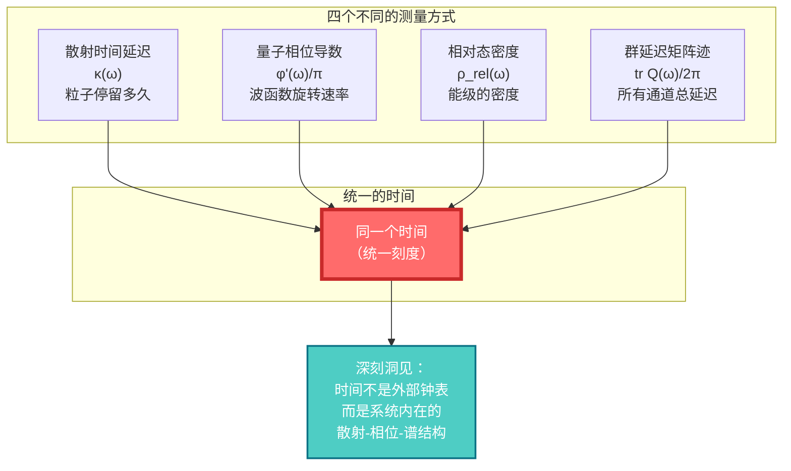

让我们一个一个理解这四个量。

---

## 第一个量：散射时间延迟 $\kappa(\omega)$

### 🌊 什么是散射延迟？

想象你对着山谷喊话，回声延迟了2秒才返回：


**时间延迟** = 2秒（从喊到听见）

在量子散射中：

- 粒子"入射"到散射区
- 在散射区"停留"一段时间
- 然后"出射"

**散射时间延迟** $\kappa(\omega)$ 就是这个"停留时间"。

### 📐 数学定义

对于能量为$\omega$的粒子，散射时间延迟定义为：

$$
\kappa(\omega) = \text{（散射后的相位） - （自由传播的相位）}
$$

### 🔬 如何测量？

**实验设置**：

1. 发射一个能量$\omega$的波包
2. 让它通过散射区（比如势垒）
3. 测量出射波包的位置
4. 与自由传播比较，计算延迟

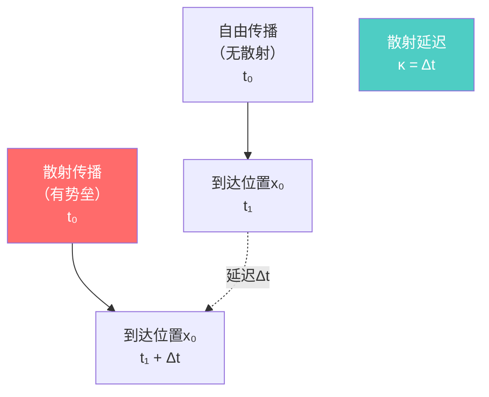

**物理意义**：

- 势垒越厚 → 延迟越长
- 能量越低 → 延迟越长
- 延迟反映了粒子与势能的"相互作用强度"

---

## 第二个量：量子相位导数 $\varphi'(\omega)/\pi$

### 🌀 什么是量子相位？

量子粒子就像一个旋转的时钟指针，它的"角度"就是相位$\varphi$。

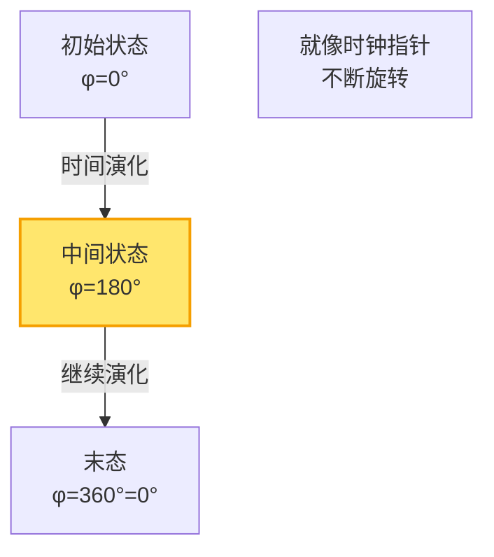

**相位的变化率**（导数）$\varphi'(\omega)$ 告诉你：能量变化时，相位变化多快。

### 🔄 相位与时间的关系

在量子力学中，**相位的变化** = **能量 × 时间**：

$$
\varphi = \frac{E t}{\hbar} = \omega t
$$

所以，**相位对能量的导数** = 时间：

$$
\frac{d\varphi}{d\omega} = t
$$

### 🎯 统一刻度中的相位

在散射过程中，粒子获得额外的相位。这个**散射相位的导数**，就是散射延迟时间！

$$
\kappa = \frac{\varphi'(\omega)}{\pi}
$$

> 💡 **深刻洞见**：时间不是外部参数，而是**相位空间的几何**！

---

## 第三个量：相对态密度 $\rho_{\text{rel}}(\omega)$

### 📊 什么是态密度？

想象能量是一条数轴，能级是这条数轴上的点：

```
  能级:  ●    ●●   ●  ●●●    ●   (能级位置)
  能量: ─┴────┴┴───┴──┴┴┴────┴─> ω
        稀疏  密集  稀疏  密集  稀疏
```

**态密度** $\rho(\omega)$ = 能量$\omega$附近有多"密集"

$$
\rho(\omega) = \frac{d N(\omega)}{d\omega} \quad \text{（能级数量对能量的导数）}
$$

### 🔄 相对态密度

当你给系统加一个扰动（比如势能），能级会移动：

```
  无扰动: ●   ●   ●   ●   ●
  有扰动: ●  ●  ●    ●    ●
         (间距改变)
```

**相对态密度** = 扰动后的态密度 - 扰动前的态密度

$$
\rho_{\text{rel}}(\omega) = \rho_{\text{有扰动}}(\omega) - \rho_{\text{无扰动}}(\omega)
$$

### 🔗 与散射的联系：Birman-Kreĭn公式

神奇的是，相对态密度可以从散射矩阵算出来！

**Birman-Kreĭn公式**：

$$
\det S(\omega) = e^{-2\pi i \xi(\omega)}
$$

其中：
- $S(\omega)$ = 散射矩阵
- $\xi(\omega)$ = 谱移函数
- $\rho_{\text{rel}}(\omega) = -\xi'(\omega)$ = 谱移函数的导数

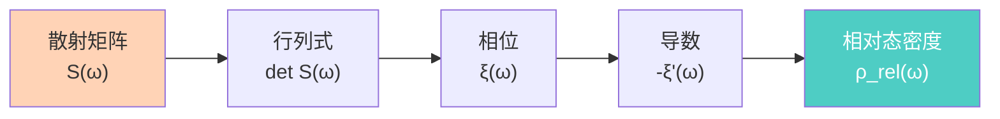

> 💡 **深刻洞见**：态密度（谱的信息）和散射（动力学的信息）是同一枚硬币的两面！

---

## 第四个量：Wigner-Smith群延迟 $\text{tr}\,Q(\omega)/2\pi$

### 🕰️ 什么是Wigner-Smith矩阵？

在多通道散射中（比如粒子可以从不同"门"进出），延迟不是一个数，而是一个**矩阵**：

$$
Q(\omega) = -i S(\omega)^\dagger \frac{\partial S(\omega)}{\partial \omega}
$$

**矩阵元** $Q_{ij}$：从通道$i$进入，从通道$j$出去的延迟时间

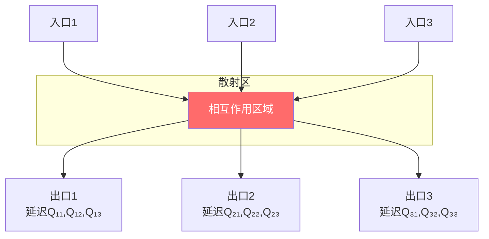

### 📏 总延迟：矩阵的迹

**迹**（trace）= 对角元素之和：

$$
\text{tr}\,Q = Q_{11} + Q_{22} + Q_{33} + \cdots
$$

物理意义：**所有通道的平均延迟**

### 🎯 与前面的联系

Wigner-Smith延迟的迹，正好等于散射相位的导数！

$$
\text{tr}\,Q(\omega) = \frac{\partial}{\partial \omega} \left[ \arg \det S(\omega) \right]
$$

也就是说：

$$
\frac{1}{2\pi}\text{tr}\,Q(\omega) = \frac{\varphi'(\omega)}{\pi}
$$

---

## 四者为一：统一的证明

现在我们可以理解，为什么这四个量相等。

### 🔗 证明的逻辑链

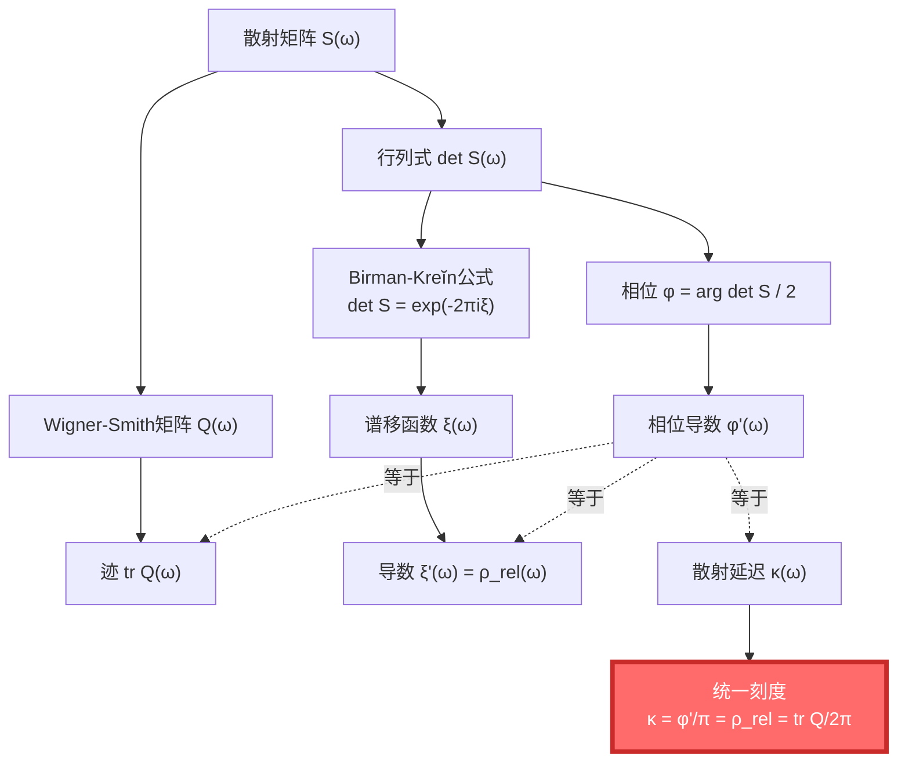

**步骤**：

1. **Birman-Kreĭn公式**：

$$
\det S(\omega) = e^{-2\pi i \xi(\omega)}
$$

取对数：

$$
\arg \det S(\omega) = -2\pi \xi(\omega) = -2\varphi(\omega)
$$

2. **对能量求导**：

$$
\frac{d}{d\omega} \arg \det S = -2\pi \xi'(\omega) = -2\varphi'(\omega)
$$

3. **Wigner-Smith矩阵的迹**：

$$
\text{tr}\,Q(\omega) = -i \text{tr}\left( S^\dagger \frac{\partial S}{\partial \omega} \right) = \frac{\partial}{\partial \omega} \arg \det S
$$

4. **合并**：

$$
\text{tr}\,Q = -2\varphi' = -2\pi \xi' = -2\pi \rho_{\text{rel}}
$$

整理得到：

$$
\kappa = \frac{\varphi'}{\pi} = -\xi' = \rho_{\text{rel}} = \frac{1}{2\pi}\text{tr}\,Q
$$

> 💡 **核心洞见**：这不是四个独立的物理量碰巧相等，而是同一个深层结构的四种表现形式！

---

## 物理意义：时间的起源

### 🌌 时间从何而来？

传统观点：时间是外部的、绝对的、先验存在的"钟表"。

GLS观点：**时间是系统内在的散射-相位-谱结构的涌现！**

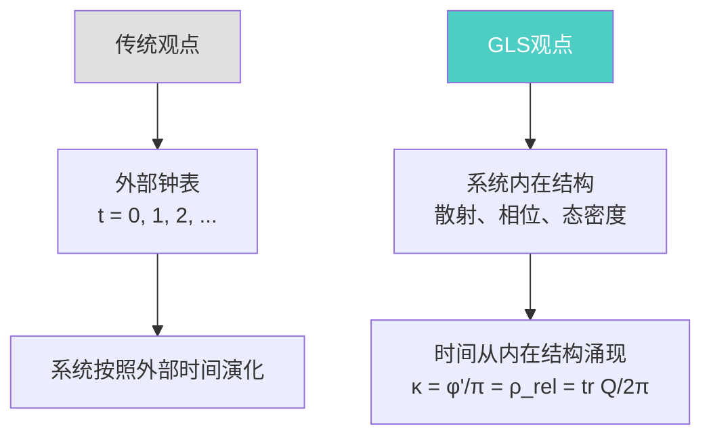

### 📏 三种时间，一个刻度

统一时间刻度同一式告诉我们，三种看似不同的"时间"是同一个：

1. **散射时间**：粒子散射的延迟 $\kappa$
2. **量子时间**：相位的变化率 $\varphi'/\pi$
3. **统计时间**：态密度（能级密度）$\rho_{\text{rel}}$

它们都等于Wigner-Smith群延迟 $\text{tr}\,Q/2\pi$。

### 🔬 可测量性

这个统一不仅是数学上的美，它还是**可以实验验证的**！

**实验方案**：

1. **测量散射延迟**：
   - 用波包通过势垒
   - 测量延迟时间 $\kappa$

2. **测量相位导数**：
   - 测量散射相位 $\varphi(\omega)$
   - 对能量求导 $\varphi'$

3. **测量态密度**：
   - 测量能级分布
   - 计算相对态密度 $\rho_{\text{rel}}$

4. **测量群延迟**：
   - 测量散射矩阵 $S(\omega)$
   - 计算 $Q = -iS^\dagger \partial_\omega S$
   - 求迹 $\text{tr}\,Q$

**预言**：这四个测量应该给出**完全相同**的结果！

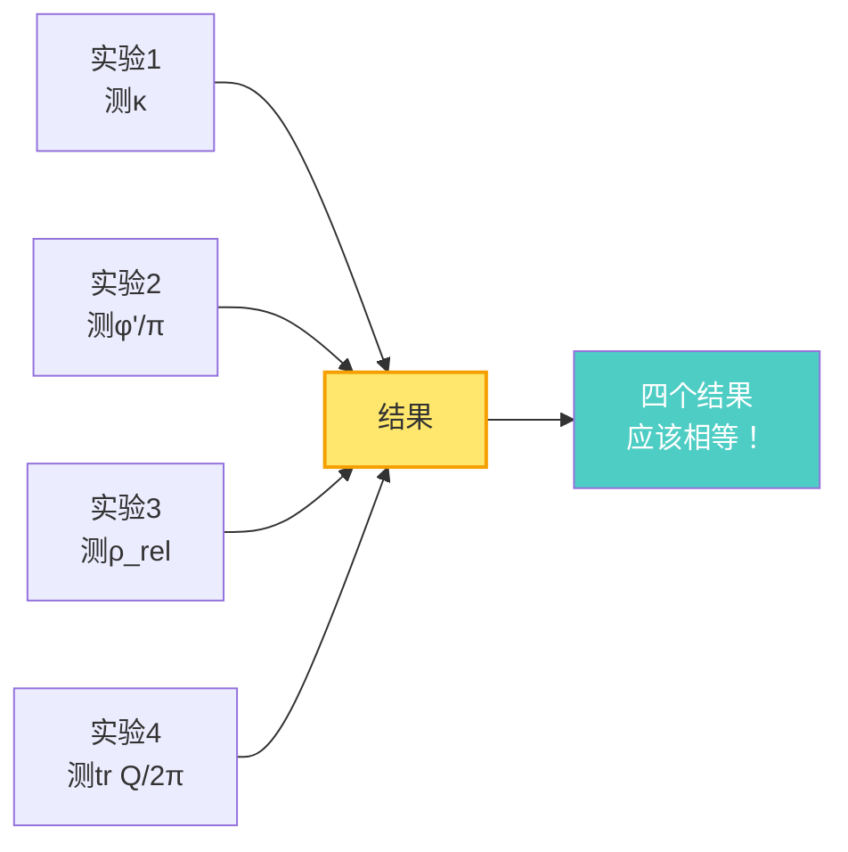

---

## 与其他概念的联系

统一时间刻度不仅统一了时间，它还连接了我们学过的所有概念：

### 🔗 时间 ↔ 因果

还记得吗？因果关系等价于熵的单调性：

$$
A \prec B \quad \Leftrightarrow \quad S(A) \leq S(B)
$$

而时间刻度$\kappa$定义了"时间流逝"，所以：

$$
A \prec B \quad \Leftrightarrow \quad t(A) \leq t(B) \quad \Leftrightarrow \quad S(A) \leq S(B)
$$

**因果 = 时间顺序 = 熵单调**

### 🔗 边界 ↔ 散射

散射矩阵$S(\omega)$定义在**边界**上（入口和出口）。

从边界的散射数据，可以重构内部的时间演化：

$$
\text{边界散射数据 } S(\omega) \quad \Rightarrow \quad \text{内部时间演化}
$$

这又是**全息原理**的体现！

### 🔗 熵 ↔ 散射

谱移函数$\xi(\omega)$连接了散射和态密度，而态密度又和熵有关：

$$
S = k_B \ln \Omega \quad \text{（玻尔兹曼）}
$$

其中$\Omega$是态数，和态密度$\rho$密切相关。

### 🎯 五者合一的完整图景

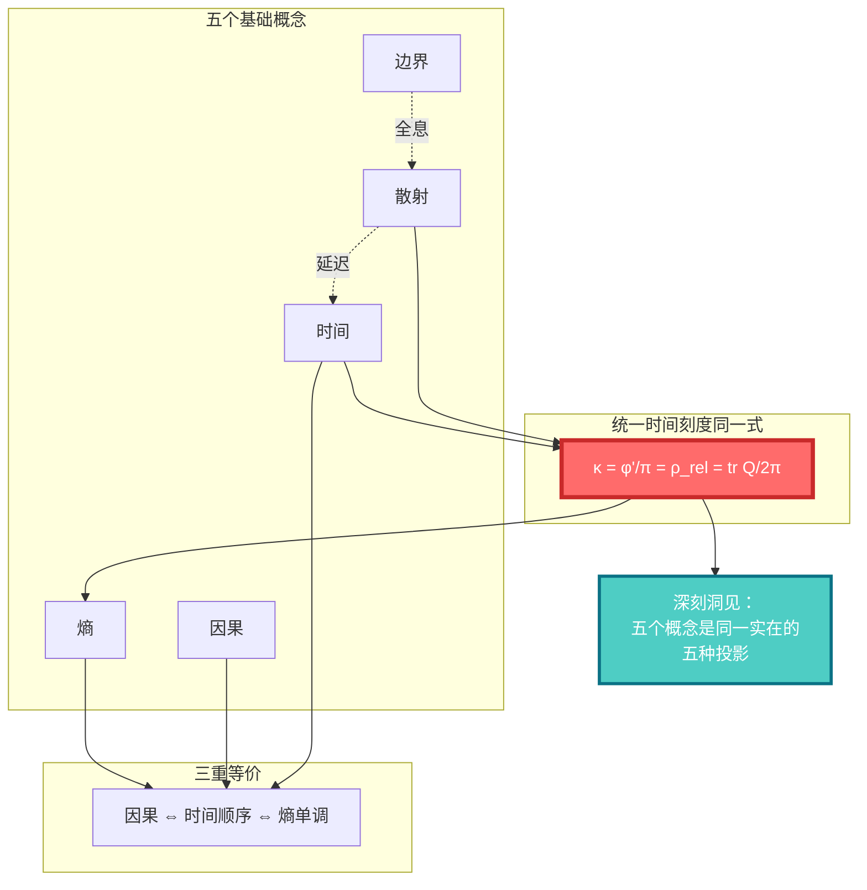

---

## 推广：三种时间的统一

统一时间刻度同一式还有一个更强的版本，统一了**三种不同的时间概念**：

### 🕰️ 三种时间

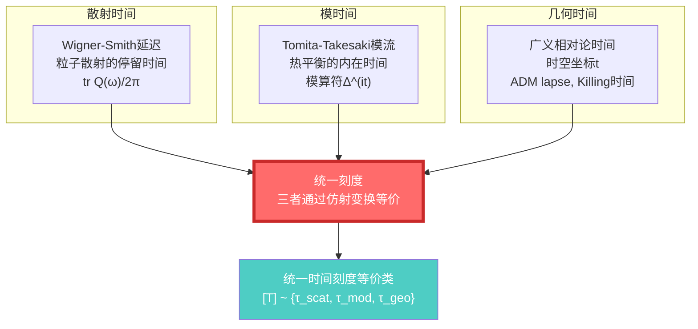

**统一的意义**：

在适当的半经典-全息窗口中，这三种时间通过仿射变换（平移+缩放）相互等价：

$$
\tau_{\text{散射}} = a_1 \tau + b_1, \quad \tau_{\text{模}} = a_2 \tau + b_2, \quad \tau_{\text{几何}} = a_3 \tau + b_3
$$

其中$\tau$是**统一的母时间刻度**。

---

## 比喻：立方体的四个投影

让我用一个最后的比喻来总结统一时间刻度同一式的意义：

### 📦 立方体与投影

想象一个立方体，你从四个不同角度看它：

```
     从上面看        从正面看      从侧面看       从斜角看
       ____            ____          ____           ____
      |____|          |____|        |____|        /    /|
    (正方形)        (正方形)      (正方形)      /____/ |
                                                 |    | /
                                                 |____|/
```

四个投影看起来不同，但它们都是**同一个立方体**的不同视角！

类似地：

- **散射延迟** $\kappa$ = 从动力学角度看时间
- **相位导数** $\varphi'/\pi$ = 从量子角度看时间
- **态密度** $\rho_{\text{rel}}$ = 从统计角度看时间
- **群延迟迹** $\text{tr}\,Q/2\pi$ = 从散射通道角度看时间

**四个不同的视角，同一个时间！**

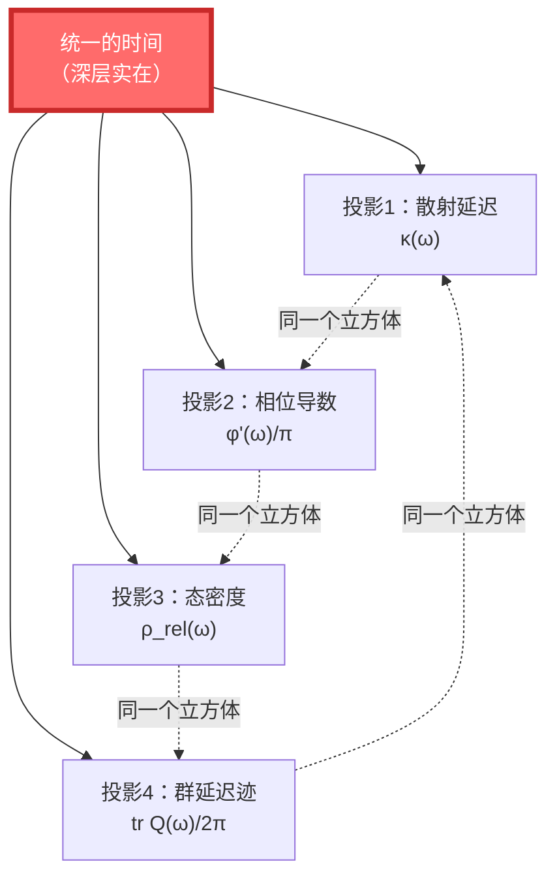

---

## 小结：五者为何合一？

### 🎯 核心要点

1. **统一时间刻度同一式**：

$$
\kappa(\omega) = \frac{\varphi'(\omega)}{\pi} = \rho_{\text{rel}}(\omega) = \frac{1}{2\pi}\text{tr}\,Q(\omega)
$$

2. **四个量的物理意义**：
   - $\kappa$：散射时间延迟
   - $\varphi'/\pi$：量子相位导数
   - $\rho_{\text{rel}}$：相对态密度
   - $\text{tr}\,Q/2\pi$：Wigner-Smith群延迟

3. **为什么相等**：
   - 通过Birman-Kreĭn公式联系散射和谱
   - 通过Wigner-Smith矩阵联系延迟和相位
   - 它们是同一个深层结构的不同侧面

4. **物理意义**：
   - 时间不是外部钟表，而是系统内在的散射-相位-谱结构
   - 三种时间（散射、模、几何）统一在同一刻度下

5. **与五个概念的联系**：
   - 时间：刻度同一式定义时间
   - 因果：等价于时间顺序和熵单调
   - 边界：散射发生在边界上
   - 散射：S矩阵决定所有时间量
   - 熵：与态密度和因果相关

### 💡 最深刻的洞见

> **宇宙不是由时间、因果、边界、散射、熵五个独立的"东西"构成的。它们是同一个深层实在的五种表现形式，就像立方体的五个不同投影。**
>
> **统一时间刻度同一式，就是这五个投影相互联系的数学证明。**

这不仅是理论的美，更揭示了宇宙的深层统一：

- 不需要假设"有一个外部时钟"
- 不需要假设"因果是神秘的力量"
- 不需要假设"边界是次要的"
- 不需要假设"散射只是碰撞"
- 不需要假设"熵只是混乱"

**它们都是同一个统一结构的不可分割的部分。**

---

## 接下来

恭喜！你已经理解了GLS统一理论的核心——**统一时间刻度同一式**。

这是整个理论的心脏，也是理解后续所有内容的基础。

在下一篇，我们会总结核心思想篇的五个洞见，并为深入数学和物理细节做准备：

[下一篇：核心思想小结 →](07-core-summary.md)

---

**记住这个公式**：

$$
\kappa = \frac{\varphi'}{\pi} = \rho_{\text{rel}} = \frac{1}{2\pi}\text{tr}\,Q
$$

**它不是四个量碰巧相等，而是同一个时间的四张面孔。**

[← 上一篇：熵即箭头](05-entropy-is-arrow.md) | [返回主页](../index.md) | [下一篇：核心思想小结 →](07-core-summary.md)
