# Five into One: Unified Time Scale Identity

> "Four seemingly completely different physical quantities are actually completely equal. This is not coincidence, but evidence of deep unity in the universe."

[← Previous: Entropy is Arrow](05-entropy-is-arrow_en.md) | [Back to Home](../index_en.md) | [Next: Core Ideas Summary →](07-core-summary_en.md)

---

## The Universe's Most Profound Equation

In the foundation section, we learned five concepts: time, causality, boundary, scattering, entropy.

Now, it's time to reveal how they unify in **one formula**.

### 🎯 Unified Time Scale Identity

$$
\boxed{\kappa(\omega) = \frac{\varphi'(\omega)}{\pi} = \rho_{\text{rel}}(\omega) = \frac{1}{2\pi}\text{tr}\,Q(\omega)}
$$

This formula says: **Four completely different physical quantities are actually the same thing!**


Let's understand these four quantities one by one.

---

## First Quantity: Scattering Time Delay $\kappa(\omega)$

### 🌊 What is Scattering Delay?

Imagine you shout at a valley, and the echo returns after 2 seconds:


**Time delay** = 2 seconds (from shout to hearing)

In quantum scattering:

- Particle "incident" on scattering region
- "Stays" in scattering region for some time
- Then "outgoing"

**Scattering time delay** $\kappa(\omega)$ is this "stay time".

### 📐 Mathematical Definition

For a particle with energy $\omega$, scattering time delay is defined as:

$$
\kappa(\omega) = \text{(Phase after scattering) - (Phase of free propagation)}
$$

### 🔬 How to Measure?

**Experimental Setup**:

1. Emit a wave packet with energy $\omega$
2. Let it pass through scattering region (e.g., potential barrier)
3. Measure position of outgoing wave packet
4. Compare with free propagation, calculate delay

```mermaid
graph TB
    Free["Free Propagation<br/>(No Scattering)<br/>t₀"] --> FreeEnd["Reaches Position x₀<br/>t₁"]
    Scatter["Scattering Propagation<br/>(With Barrier)<br/>t₀"] --> ScatterEnd["Reaches Position x₀<br/>t₁ + Δt"]

    FreeEnd -.Delay Δt.-> ScatterEnd

    Delay["Scattering Delay<br/>κ = Δt"]

    style Scatter fill:#ff6b6b,color:#fff
    style Delay fill:#4ecdc4,color:#fff
```



**Physical meaning**:

- Thicker barrier → Longer delay
- Lower energy → Longer delay
- Delay reflects "interaction strength" between particle and potential

---

## Second Quantity: Quantum Phase Derivative $\varphi'(\omega)/\pi$

### 🌀 What is Quantum Phase?

A quantum particle is like a rotating clock hand, its "angle" is the phase $\varphi$.

```mermaid
graph TD
    Start["Initial State<br/>φ=0°"] -->|Time Evolution| Mid["Intermediate State<br/>φ=180°"]
    Mid -->|Continue Evolution| End["Final State<br/>φ=360°=0°"]

    Clock["Like Clock Hand<br/>Continuously Rotating"]

    style Mid fill:#ffe66d,stroke:#f59f00,stroke-width:2px
```



**Rate of phase change** (derivative) $\varphi'(\omega)$ tells you: when energy changes, how fast does phase change.

### 🔄 Relation Between Phase and Time

In quantum mechanics, **phase change** = **Energy × Time**:

$$
\varphi = \frac{E t}{\hbar} = \omega t
$$

So, **derivative of phase with respect to energy** = time:

$$
\frac{d\varphi}{d\omega} = t
$$

### 🎯 Phase in Unified Scale

In scattering process, particle gains extra phase. The **derivative of scattering phase** is the scattering delay time!

$$
\kappa = \frac{\varphi'(\omega)}{\pi}
$$

> 💡 **Profound insight**: Time is not an external parameter, but **geometry of phase space**!

---

## Third Quantity: Relative Density of States $\rho_{\text{rel}}(\omega)$

### 📊 What is Density of States?

Imagine energy is a number line, energy levels are points on this line:

```
  Energy Levels:  ●    ●●   ●  ●●●    ●   (Level Positions)
  Energy:        ─┴────┴┴───┴──┴┴┴────┴─> ω
                 Sparse  Dense  Sparse  Dense  Sparse
```

**Density of states** $\rho(\omega)$ = How "dense" near energy $\omega$

$$
\rho(\omega) = \frac{d N(\omega)}{d\omega} \quad \text{(Derivative of number of levels w.r.t. energy)}
$$

### 🔄 Relative Density of States

When you add a perturbation to the system (e.g., potential), energy levels shift:

```
  No Perturbation: ●   ●   ●   ●   ●
  With Perturbation: ●  ●  ●    ●    ●
                    (Spacing Changes)
```

**Relative density of states** = Density after perturbation - Density before perturbation

$$
\rho_{\text{rel}}(\omega) = \rho_{\text{with perturbation}}(\omega) - \rho_{\text{no perturbation}}(\omega)
$$

### 🔗 Connection to Scattering: Birman-Kreĭn Formula

Remarkably, relative density of states can be calculated from scattering matrix!

**Birman-Kreĭn formula**:

$$
\det S(\omega) = e^{-2\pi i \xi(\omega)}
$$

where:
- $S(\omega)$ = Scattering matrix
- $\xi(\omega)$ = Spectral shift function
- $\rho_{\text{rel}}(\omega) = -\xi'(\omega)$ = Derivative of spectral shift function

```mermaid
graph LR
    SMatrix["Scattering Matrix<br/>S(ω)"] --> Det["Determinant<br/>det S(ω)"]
    Det --> Phase["Phase<br/>ξ(ω)"]
    Phase --> Derivative["Derivative<br/>-ξ'(ω)"]
    Derivative --> RelDensity["Relative Density of States<br/>ρ_rel(ω)"]

    style SMatrix fill:#ffd3b6
    style RelDensity fill:#4ecdc4,color:#fff
```



> 💡 **Profound insight**: Density of states (information of spectrum) and scattering (information of dynamics) are two sides of the same coin!

---

## Fourth Quantity: Wigner-Smith Group Delay $\text{tr}\,Q(\omega)/2\pi$

### 🕰️ What is Wigner-Smith Matrix?

In multi-channel scattering (e.g., particles can enter/exit through different "doors"), delay is not a number but a **matrix**:

$$
Q(\omega) = -i S(\omega)^\dagger \frac{\partial S(\omega)}{\partial \omega}
$$

**Matrix element** $Q_{ij}$: Delay time from channel $i$ entering, channel $j$ exiting

```mermaid
graph TB
    subgraph "Scattering Region"
        Center["Interaction Region"]
    end

    In1["Entrance 1"] --> Center
    In2["Entrance 2"] --> Center
    In3["Entrance 3"] --> Center

    Center --> Out1["Exit 1<br/>Delays Q₁₁,Q₁₂,Q₁₃"]
    Center --> Out2["Exit 2<br/>Delays Q₂₁,Q₂₂,Q₂₃"]
    Center --> Out3["Exit 3<br/>Delays Q₃₁,Q₃₂,Q₃₃"]

    style Center fill:#ff6b6b,color:#fff
```



### 📏 Total Delay: Trace of Matrix

**Trace** = Sum of diagonal elements:

$$
\text{tr}\,Q = Q_{11} + Q_{22} + Q_{33} + \cdots
$$

Physical meaning: **Average delay of all channels**

### 🎯 Connection to Previous

The trace of Wigner-Smith delay exactly equals the derivative of scattering phase!

$$
\text{tr}\,Q(\omega) = \frac{\partial}{\partial \omega} \left[ \arg \det S(\omega) \right]
$$

That is:

$$
\frac{1}{2\pi}\text{tr}\,Q(\omega) = \frac{\varphi'(\omega)}{\pi}
$$

---

## Four into One: Unified Proof

Now we can understand why these four quantities are equal.

### 🔗 Logic Chain of Proof

```mermaid
graph TB
    S["Scattering Matrix S(ω)"] --> Det["Determinant det S(ω)"]
    Det --> Phase["Phase φ = arg det S / 2"]
    Phase --> Deriv1["Phase Derivative φ'(ω)"]

    S --> Q["Wigner-Smith Matrix Q(ω)"]
    Q --> Trace["Trace tr Q(ω)"]

    Det --> BK["Birman-Kreĭn Formula<br/>det S = exp(-2πiξ)"]
    BK --> Xi["Spectral Shift Function ξ(ω)"]
    Xi --> Deriv2["Derivative -ξ'(ω) = ρ_rel(ω)"]

    Deriv1 -.Equals.-> Trace
    Deriv1 -.Equals.-> Deriv2
    Deriv1 -.Equals.-> Kappa["Scattering Delay κ(ω)"]

    Kappa --> Unity["Unified Scale<br/>κ = φ'/π = ρ_rel = tr Q/2π"]

    style Unity fill:#ff6b6b,stroke:#c92a2a,stroke-width:4px,color:#fff
```



**Steps**:

1. **Birman-Kreĭn formula**:

$$
\det S(\omega) = e^{-2\pi i \xi(\omega)}
$$

Taking logarithm:

$$
\arg \det S(\omega) = -2\pi \xi(\omega) = 2\varphi(\omega)
$$

2. **Derivative with respect to energy**:

$$
\frac{d}{d\omega} \arg \det S = -2\pi \xi'(\omega) = 2\varphi'(\omega)
$$

3. **Trace of Wigner-Smith matrix**:

$$
\text{tr}\,Q(\omega) = -i \text{tr}\left( S^\dagger \frac{\partial S}{\partial \omega} \right) = \frac{\partial}{\partial \omega} \arg \det S
$$

4. **Combining**:

$$
\text{tr}\,Q = 2\varphi' = -2\pi \xi' = 2\pi \rho_{\text{rel}}
$$

Rearranging:

$$
\kappa = \frac{\varphi'}{\pi} = -\xi' = \rho_{\text{rel}} = \frac{1}{2\pi}\text{tr}\,Q
$$

> 💡 **Core insight**: These are not four independent physical quantities that happen to be equal, but four manifestations of the same deep structure!

---

## Physical Meaning: Origin of Time

### 🌌 Where Does Time Come From?

Traditional view: Time is external, absolute, a priori existing "clock".

GLS view: **Time is an emergence of system's intrinsic scattering-phase-spectrum structure!**

```mermaid
graph TD
    Traditional["Traditional View"] --> Clock["External Clock<br/>t = 0, 1, 2, ..."]
    Clock --> Evolution["System Evolves According to External Time"]

    GLS["GLS View"] --> Internal["System's Intrinsic Structure<br/>Scattering, Phase, Density of States"]
    Internal --> Emergence["Time Emerges from Intrinsic Structure<br/>κ = φ'/π = ρ_rel = tr Q/2π"]

    style Traditional fill:#e0e0e0
    style GLS fill:#4ecdc4,color:#fff
```



### 📏 Three Times, One Scale

The Unified Time Scale Identity tells us that three seemingly different "times" are the same:

1. **Scattering time**: Delay of particle scattering $\kappa$
2. **Quantum time**: Rate of phase change $\varphi'/\pi$
3. **Statistical time**: Density of states (energy level density) $\rho_{\text{rel}}$

They all equal Wigner-Smith group delay $\text{tr}\,Q/2\pi$.

### 🔬 Measurability

This unification is not just mathematical beauty, it's **experimentally verifiable**!

**Experimental Plan**:

1. **Measure scattering delay**:
   - Use wave packet through barrier
   - Measure delay time $\kappa$

2. **Measure phase derivative**:
   - Measure scattering phase $\varphi(\omega)$
   - Take derivative w.r.t. energy $\varphi'$

3. **Measure density of states**:
   - Measure energy level distribution
   - Calculate relative density of states $\rho_{\text{rel}}$

4. **Measure group delay**:
   - Measure scattering matrix $S(\omega)$
   - Calculate $Q = -iS^\dagger \partial_\omega S$
   - Take trace $\text{tr}\,Q$

**Prediction**: These four measurements should give **exactly the same** result!

```mermaid
graph LR
    Exp1["Experiment 1<br/>Measure κ"] --> Result["Result"]
    Exp2["Experiment 2<br/>Measure φ'/π"] --> Result
    Exp3["Experiment 3<br/>Measure ρ_rel"] --> Result
    Exp4["Experiment 4<br/>Measure tr Q/2π"] --> Result

    Result --> Check["Four Results<br/>Should Be Equal!"]

    style Result fill:#ffe66d,stroke:#f59f00,stroke-width:2px
    style Check fill:#4ecdc4,color:#fff
```



---

## Connections to Other Concepts

Unified time scale not only unifies time, it also connects all concepts we've learned:

### 🔗 Time ↔ Causality

Remember? Causal relation is equivalent to entropy monotonicity:

$$
A \prec B \quad \Leftrightarrow \quad S(A) \leq S(B)
$$

And time scale $\kappa$ defines "time passage", so:

$$
A \prec B \quad \Leftrightarrow \quad t(A) \leq t(B) \quad \Leftrightarrow \quad S(A) \leq S(B)
$$

**Causality = Time Order = Entropy Monotonicity**

### 🔗 Boundary ↔ Scattering

Scattering matrix $S(\omega)$ is defined on **boundary** (entrance and exit).

From boundary scattering data, we can reconstruct internal time evolution:

$$
\text{Boundary Scattering Data } S(\omega) \quad \Rightarrow \quad \text{Internal Time Evolution}
$$

This is another manifestation of the **holographic principle**!

### 🔗 Entropy ↔ Scattering

Spectral shift function $\xi(\omega)$ connects scattering and density of states, and density of states relates to entropy:

$$
S = k_B \ln \Omega \quad \text{(Boltzmann)}
$$

where $\Omega$ is number of states, closely related to density of states $\rho$.

### 🎯 Complete Picture of Five into One

```mermaid
graph TB
    subgraph "Five Fundamental Concepts"
        Time["Time"]
        Cause["Causality"]
        Boundary["Boundary"]
        Scatter["Scattering"]
        Entropy["Entropy"]
    end

    subgraph "Unified Time Scale Identity"
        Unity["κ = φ'/π = ρ_rel = tr Q/2π"]
    end

    subgraph "Triple Equivalence"
        Equiv["Causality ⇔ Time Order ⇔ Entropy Monotonicity"]
    end

    Time --> Unity
    Scatter --> Unity
    Unity --> Entropy

    Entropy --> Equiv
    Cause --> Equiv
    Time --> Equiv

    Boundary -.Holographic.-> Scatter
    Scatter -.Delay.-> Time

    Unity --> DeepInsight["Profound Insight:<br/>Five Concepts Are Five<br/>Projections of Same Reality"]

    style Unity fill:#ff6b6b,stroke:#c92a2a,stroke-width:4px,color:#fff
    style DeepInsight fill:#4ecdc4,stroke:#0b7285,stroke-width:3px,color:#fff
```



---

## Generalization: Unification of Three Times

The Unified Time Scale Identity has a stronger version that unifies **three different time concepts**:

### 🕰️ Three Times

```mermaid
graph TD
    subgraph "Scattering Time"
        Scat["Wigner-Smith Delay<br/>Stay Time of Particle Scattering<br/>tr Q(ω)/2π"]
    end

    subgraph "Modular Time"
        Mod["Tomita-Takesaki Modular Flow<br/>Intrinsic Time of Thermal Equilibrium<br/>Modular Operator Δ^(it)"]
    end

    subgraph "Geometric Time"
        Geo["General Relativity Time<br/>Spacetime Coordinate t<br/>ADM Lapse, Killing Time"]
    end

    Unity["Unified Scale<br/>Three Equivalent via Affine Transform"]

    Scat --> Unity
    Mod --> Unity
    Geo --> Unity

    Unity --> TimeScale["Unified Time Scale Equivalence Class<br/>[T] ~ {τ_scat, τ_mod, τ_geo}"]

    style Unity fill:#ff6b6b,stroke:#c92a2a,stroke-width:4px,color:#fff
    style TimeScale fill:#4ecdc4,color:#fff
```



**Meaning of unification**:

In appropriate semiclassical-holographic window, these three times are equivalent via affine transformation (translation + scaling):

$$
\tau_{\text{scattering}} = a_1 \tau + b_1, \quad \tau_{\text{modular}} = a_2 \tau + b_2, \quad \tau_{\text{geometric}} = a_3 \tau + b_3
$$

where $\tau$ is the **unified master time scale**.

---

## Analogy: Four Projections of a Cube

Let me use a final analogy to summarize the meaning of Unified Time Scale Identity:

### 📦 Cube and Projections

Imagine a cube, viewed from four different angles:

```
     From Above      From Front     From Side      From Oblique
       ____            ____          ____           ____
      |____|          |____|        |____|        /    /|
    (Square)        (Square)      (Square)      /____/ |
                                               |    | /
                                               |____|/
```

Four projections look different, but they're all **the same cube** from different perspectives!

Similarly:

- **Scattering delay** $\kappa$ = Time from dynamics perspective
- **Phase derivative** $\varphi'/\pi$ = Time from quantum perspective
- **Density of states** $\rho_{\text{rel}}$ = Time from statistical perspective
- **Group delay trace** $\text{tr}\,Q/2\pi$ = Time from scattering channel perspective

**Four different perspectives, same time!**

```mermaid
graph TD
    Cube["Unified Time<br/>(Deep Reality)"] --> Proj1["Projection 1: Scattering Delay<br/>κ(ω)"]
    Cube --> Proj2["Projection 2: Phase Derivative<br/>φ'(ω)/π"]
    Cube --> Proj3["Projection 3: Density of States<br/>ρ_rel(ω)"]
    Cube --> Proj4["Projection 4: Group Delay Trace<br/>tr Q(ω)/2π"]

    Proj1 -.Same Cube.-> Proj2
    Proj2 -.Same Cube.-> Proj3
    Proj3 -.Same Cube.-> Proj4
    Proj4 -.Same Cube.-> Proj1

    style Cube fill:#ff6b6b,stroke:#c92a2a,stroke-width:4px,color:#fff
```



---

## Summary: Why Five into One?

### 🎯 Key Points

1. **Unified Time Scale Identity**:

$$
\kappa(\omega) = \frac{\varphi'(\omega)}{\pi} = \rho_{\text{rel}}(\omega) = \frac{1}{2\pi}\text{tr}\,Q(\omega)
$$

2. **Physical meanings of four quantities**:
   - $\kappa$: Scattering time delay
   - $\varphi'/\pi$: Quantum phase derivative
   - $\rho_{\text{rel}}$: Relative density of states
   - $\text{tr}\,Q/2\pi$: Wigner-Smith group delay

3. **Why they're equal**:
   - Connected through Birman-Kreĭn formula linking scattering and spectrum
   - Connected through Wigner-Smith matrix linking delay and phase
   - They are different aspects of the same deep structure

4. **Physical meaning**:
   - Time is not external clock, but system's intrinsic scattering-phase-spectrum structure
   - Three times (scattering, modular, geometric) unified under same scale

5. **Connections to five concepts**:
   - Time: Scale identity defines time
   - Causality: Equivalent to time order and entropy monotonicity
   - Boundary: Scattering occurs on boundary
   - Scattering: S-matrix determines all time quantities
   - Entropy: Related to density of states and causality

### 💡 Most Profound Insight

> **The universe is not composed of five independent "things": time, causality, boundary, scattering, entropy. They are five manifestations of the same deep reality, like five different projections of a cube.**
>
> **The Unified Time Scale Identity is the mathematical proof of how these five projections connect.**

This is not just theoretical beauty, but reveals deep unity of the universe:

- No need to assume "there is an external clock"
- No need to assume "causality is mysterious force"
- No need to assume "boundary is secondary"
- No need to assume "scattering is just collision"
- No need to assume "entropy is just chaos"

**They are all inseparable parts of the same unified structure.**

---

## Next

Congratulations! You have understood the core of GLS unified theory—**Unified Time Scale Identity**.

This is the heart of the entire theory, and the foundation for understanding all subsequent content.

In the next section, we will summarize the five insights of core ideas, and prepare for delving into mathematical and physical details:

[Next: Core Ideas Summary →](07-core-summary_en.md)

---

**Remember this formula**:

$$
\kappa = \frac{\varphi'}{\pi} = \rho_{\text{rel}} = \frac{1}{2\pi}\text{tr}\,Q
$$

**It's not four quantities that happen to be equal, but four faces of the same time.**

[← Previous: Entropy is Arrow](05-entropy-is-arrow_en.md) | [Back to Home](../index_en.md) | [Next: Core Ideas Summary →](07-core-summary_en.md)

