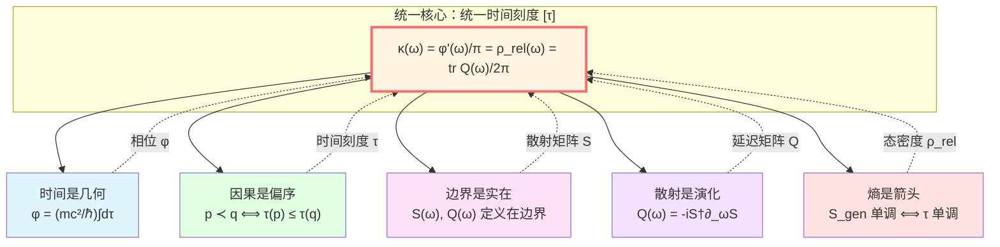
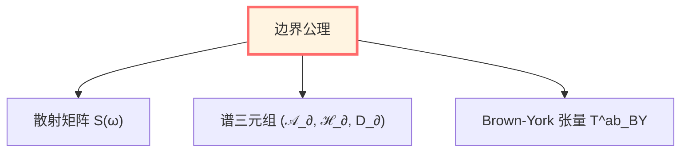
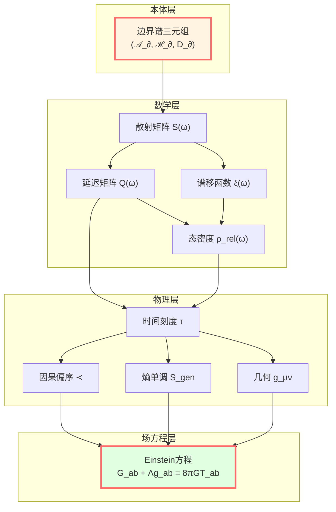

# 核心思想总结：从五个洞见到统一理论

> *"五个看似独立的洞见，实际上是同一真理的五个侧面。"*

## 🎯 我们学到了什么？

在这一章中，我们探讨了GLS理论的**五个核心洞见**：

1. **时间就是几何** - 时间不是外加的背景，而是从几何结构中涌现
2. **因果就是偏序** - 因果关系是数学的偏序，而非神秘的"力"
3. **边界就是实在** - 物理实在首先存在于边界，体域是边界的延拓
4. **散射就是演化** - 系统的演化本质是散射，S-矩阵编码所有动力学
5. **熵就是箭头** - 时间的方向性来自熵增，与因果、演化一致

现在，让我们看看它们如何统一成一个整体。

## 🧩 五者如何统一？



### 统一时间刻度同一式

**所有五个洞见通过一个公式统一**：

$$
\boxed{\kappa(\omega) = \frac{\varphi'(\omega)}{\pi} = \rho_{\text{rel}}(\omega) = \frac{1}{2\pi}\text{tr}\,Q(\omega)}
$$

让我们逐一解读这个公式中的四个量：

| 量 | 来源洞见 | 物理意义 |
|---|---------|---------|
| $\kappa(\omega)$ | 散射是演化 | 散射时间延迟（从散射矩阵） |
| $\varphi'(\omega)/\pi$ | 时间是几何 | 相位导数（几何本征时间累积） |
| $\rho_{\text{rel}}(\omega)$ | 熵是箭头 | 相对态密度（熵的微观来源） |
| $\text{tr}\,Q(\omega)/2\pi$ | 边界是实在 | 群延迟（边界Wigner-Smith矩阵） |

**因果偏序**则通过时间刻度的单调性与其他四者连接：

$$
p \prec q \quad \Longleftrightarrow \quad \tau(p) \le \tau(q) \quad \Longleftrightarrow \quad S_{\text{gen}}(p) \le S_{\text{gen}}(q)
$$

## 🔄 逻辑链：如何推导？

让我们重新走一遍完整的逻辑链：

### 第一步：从边界开始

**边界优先性公理**：物理实在以边界可观测代数 $\mathcal{A}_\partial$ 为主。

在边界上定义：
- 边界谱三元组 $(\mathcal{A}_\partial, \mathcal{H}_\partial, D_\partial)$
- 散射矩阵 $S(\omega)$（连接过去与未来渐近态）
- Brown-York应力张量 $T^{ab}_{\text{BY}}$



### 第二步：定义散射时间

从散射矩阵 $S(\omega)$，定义：

**Wigner-Smith时间延迟矩阵**：

$$
Q(\omega) = -i S(\omega)^\dagger \frac{\partial S(\omega)}{\partial \omega}
$$

**散射时间刻度**：

$$
\tau_{\text{scatt}}(\omega) = \frac{1}{2\pi} \text{tr}\, Q(\omega)
$$

### 第三步：连接到相位（几何时间）

通过**Birman-Kreĭn公式**：

$$
\det S(\omega) = e^{-2\pi i \xi(\omega)}
$$

得到：

$$
\frac{\varphi'(\omega)}{\pi} = \xi'(\omega) = \frac{1}{2\pi} \text{tr}\, Q(\omega)
$$

其中相位 $\varphi$ 与本征时间相关：

$$
\varphi = \frac{mc^2}{\hbar} \int d\tau
$$

**结论**：散射时间 = 几何时间（至仿射变换）

### 第四步：连接到态密度（熵）

Birman-Kreĭn公式还给出：

$$
\rho_{\text{rel}}(\omega) = -\xi'(\omega) = \frac{1}{2\pi} \text{tr}\, Q(\omega)
$$

其中 $\rho_{\text{rel}}$ 是相对态密度（散射系统比自由系统多出的量子态）。

而态密度正是**熵的微观起源**（Boltzmann: $S = k_B \ln \Omega$）！

**结论**：态密度 = 散射延迟 = 时间刻度

### 第五步：连接到因果偏序

在小因果菱形 $D_{p,r}$ 上，定义广义熵：

$$
S_{\text{gen}}(\Sigma) = \frac{A(\Sigma)}{4G\hbar} + S_{\text{out}}(\Sigma)
$$

**核心定理**：

$$
p \prec q \quad \Longleftrightarrow \quad \tau(p) \le \tau(q) \quad \Longleftrightarrow \quad S_{\text{gen}}(p) \le S_{\text{gen}}(q)
$$

**结论**：因果 = 时间序 = 熵序

### 第六步：IGVP推导场方程

在每个小因果菱形上，要求：

$$
\delta S_{\text{gen}} = 0 \quad (\text{固定体积})
$$

通过Raychaudhuri方程和模块理论，得到：

$$
\boxed{G_{ab} + \Lambda g_{ab} = 8\pi G T_{ab}}
$$

**结论**：引力场方程是熵极值的结果

## 🌐 大统一图景



## 💡 五个洞见的相互支撑

让我们看看五个洞见如何相互加强：

### 时间 ↔ 散射

- **时间是几何** → 相位 $\varphi$ 沿世界线累积
- **散射是演化** → 相位就是散射总相位 $\Phi(\omega)$
- **统一**：$\varphi'(\omega)/\pi = (1/2\pi)\text{tr}\,Q(\omega)$

### 因果 ↔ 熵

- **因果是偏序** → $p \prec q$ 定义时间序
- **熵是箭头** → 熵沿时间序单调增
- **统一**：$p \prec q \Leftrightarrow S_{\text{gen}}(p) \le S_{\text{gen}}(q)$

### 边界 ↔ 散射

- **边界是实在** → 物理定义在边界渐近态
- **散射是演化** → S-矩阵连接边界的过去和未来
- **统一**：$S(\omega): \mathcal{H}_{\text{in}} \to \mathcal{H}_{\text{out}}$（都在边界）

### 时间 ↔ 因果

- **时间是几何** → 时间函数 $t: M \to \mathbb{R}$
- **因果是偏序** → $p \prec q \Rightarrow t(p) < t(q)$
- **统一**：时间刻度 $\tau \in [\tau]$ 给出因果偏序

### 熵 ↔ 边界

- **熵是箭头** → 广义熵 $S_{\text{gen}} = A/(4G\hbar) + S_{\text{out}}$
- **边界是实在** → 熵的几何部分是边界面积
- **统一**：IGVP在边界上变分得到场方程

## 🎨 用比喻总结

想象一个**五面体水晶**：

```
       时间
        /\
       /  \
      /    \
    因果----边界
     /\    /\
    /  \  /  \
   /    \/    \
  熵----散射----几何
```

- 从任何一个面看，都是同一个水晶
- 转动它，不同的面依次显现
- 但**本质上只有一个对象**

**这个对象就是：统一时间刻度等价类 $[\tau]$**

## 🔍 关键数学对象回顾

| 对象 | 符号 | 定义域 | 关键性质 |
|-----|------|-------|---------|
| 散射矩阵 | $S(\omega)$ | $\omega \in \mathbb{R}$ | 幺正、因果 |
| 延迟矩阵 | $Q(\omega) = -iS^\dagger\partial_\omega S$ | $\omega \in \mathbb{R}$ | Hermitian、非负 |
| 谱移函数 | $\xi(\omega)$ | $\omega \in \mathbb{R}$ | $\det S = e^{-2\pi i\xi}$ |
| 相位 | $\varphi = (mc^2/\hbar)\int d\tau$ | 沿世界线 | 几何不变量 |
| 态密度 | $\rho_{\text{rel}} = -\xi'$ | $\omega \in \mathbb{R}$ | 非负 |
| 时间刻度 | $\tau \in [\tau]$ | 等价类 | 仿射唯一性 |
| 广义熵 | $S_{\text{gen}} = A/(4G\hbar) + S_{\text{out}}$ | 超曲面 | 单调性 |

## 🚀 下一步：深入专题

理解了五个核心洞见及其统一后，我们可以：

1. **数学工具篇**（03-mathematical-tools）- 学习必要的数学工具
   - 非交换几何
   - 谱理论
   - K-理论
   - 范畴论

2. **IGVP框架篇**（04-igvp-framework）- 深入理解从熵到Einstein
   - Raychaudhuri方程
   - 模块理论
   - 相对熵
   - 变分原理

3. **统一时间篇**（05-unified-time）- 详解时间刻度同一式
   - Birman-Kreĭn公式
   - Wigner-Smith延迟
   - 模块流
   - 几何时间

## 📝 自测题

**概念理解**：

1. 用自己的话解释"统一时间刻度同一式"的物理意义。
2. 为什么说"边界优先"而不是"体域优先"？
3. IGVP如何从熵推导出Einstein方程？
4. 五个洞见中哪一个最令你印象深刻？为什么？

**数学练习**：

5. 验证散射矩阵的幺正性 $S^\dagger S = \mathbb{I}$ 确保概率守恒。
6. 从 $\det S = e^{-2\pi i\xi}$ 推导 $\varphi'(\omega)/\pi = -\xi'(\omega)$。
7. 证明：若 $p \prec q$ 且 $q \prec r$，则 $p \prec r$（因果偏序的传递性）。

**应用思考**：

8. 如何在实验室中验证统一时间刻度同一式？
9. 黑洞蒸发如何体现"熵是箭头"？
10. AdS/CFT对应如何体现"边界是实在"？

## 🎓 推荐阅读路径

### 路径A：理论物理背景

1. 先阅读"数学工具篇"补充数学基础
2. 再深入"IGVP框架篇"理解场方程推导
3. 最后进入"边界理论篇"和"因果结构篇"

### 路径B：数学背景

1. 直接进入"数学工具篇"
2. 跳到"拓扑约束篇"和"范畴论视角"
3. 回头理解物理应用

### 路径C：实验物理背景

1. 阅读"应用与检验篇"了解可观测效应
2. 回到"统一时间篇"理解实验原理
3. 深入感兴趣的具体实验提案

## 🌟 结语

我们已经走过了GLS理论的核心思想。

**五个洞见，一个真理**：

**宇宙不是预先给定的舞台，而是边界数据的自洽延拓；时间、因果、演化、熵都是这一延拓的不同侧面，由统一时间刻度编织在一起。**

在接下来的章节中，我们将：

- 深入数学细节
- 探索物理应用
- 检验实验预言
- 直面哲学问题

**准备好了吗？让我们继续这段奇妙的旅程！**

---

**下一章预告**：

在"数学工具篇"中，我们将学习：
- 非交换几何与谱三元组
- 散射理论与Birman-Kreĭn公式
- 模块理论与Tomita-Takesaki流
- 信息几何与Fisher-Rao度量

**See you in the next chapter!**

