# Core Ideas Summary: From Five Insights to Unified Theory

> *"Five seemingly independent insights might theoretically be five aspects of the same truth."*

## 🎯 What Have We Learned?

In this chapter, we explored **five core insights** of GLS theory:

1. **Time Modeled as Geometry** - Time might not be an external background, but emerges from geometric structure
2. **Causality Modeled as Partial Order** - Causal relations are viewed as mathematical partial orders, not mysterious "forces"
3. **Boundary Viewed as Reality** - Physical reality is assumed to exist primarily on boundary, bulk is extension of boundary
4. **Scattering Modeled as Evolution** - System evolution might be essentially scattering, S-matrix encodes all dynamics
5. **Entropy Modeled as Arrow** - Time's directionality might come from entropy increase, consistent with causality and evolution

Now, let's see how they unify into one whole.

## 🧩 How Do the Five Unify?

```mermaid
graph TB
    subgraph "Unified Core: Unified Time Scale [τ]"
        U["κ(ω) = φ'(ω)/π = ρ_rel(ω) = tr Q(ω)/2π"]
    end

    U --> T["Time is Geometry<br/>φ = (mc²/ℏ)∫dτ"]
    U --> C["Causality is Partial Order<br/>p ≺ q ⟺ τ(p) ≤ τ(q)"]
    U --> B["Boundary is Reality<br/>S(ω), Q(ω) Defined on Boundary"]
    U --> S["Scattering is Evolution<br/>Q(ω) = -iS†∂_ωS"]
    U --> E["Entropy is Arrow<br/>S_gen Monotonic ⟺ τ Monotonic"]

    T -.-> |"Phase φ"| U
    C -.-> |"Time Scale τ"| U
    B -.-> |"Scattering Matrix S"| U
    S -.-> |"Delay Matrix Q"| U
    E -.-> |"Density of States ρ_rel"| U

    style U fill:#fff4e1,stroke:#ff6b6b,stroke-width:3px
    style T fill:#e1f5ff
    style C fill:#e1ffe1
    style B fill:#ffe1f5
    style S fill:#f5e1ff
    style E fill:#ffe1e1
```



### Unified Time Scale Identity

**All five insights might unify through one formula**:

$$
\boxed{\kappa(\omega) = \frac{\varphi'(\omega)}{\pi} = \rho_{\text{rel}}(\omega) = \frac{1}{2\pi}\text{tr}\,Q(\omega)}
$$

Let's interpret the four quantities in this formula one by one:

| Quantity | Source Insight | Physical Meaning |
|----------|---------------|------------------|
| $\kappa(\omega)$ | Scattering is Evolution | Scattering time delay (from scattering matrix) |
| $\varphi'(\omega)/\pi$ | Time is Geometry | Phase derivative (geometric proper time accumulation) |
| $\rho_{\text{rel}}(\omega)$ | Entropy is Arrow | Relative density of states (microscopic origin of entropy) |
| $\text{tr}\,Q(\omega)/2\pi$ | Boundary is Reality | Group delay (boundary Wigner-Smith matrix) |

**Causal partial order** is considered to connect to the other four through monotonicity of time scale:

$$
p \prec q \quad \Longleftrightarrow \quad \tau(p) \le \tau(q) \quad \Longleftrightarrow \quad S_{\text{gen}}(p) \le S_{\text{gen}}(q)
$$

## 🔄 Logic Chain: How to Derive?

Let's walk through the complete logic chain again:

### Step 1: Start from Boundary

**Boundary Priority Axiom assumes**: Physical reality is primarily based on boundary observable algebra $\mathcal{A}_\partial$.

On boundary, define:
- Boundary spectral triple $(\mathcal{A}_\partial, \mathcal{H}_\partial, D_\partial)$
- Scattering matrix $S(\omega)$ (connecting past and future asymptotic states)
- Brown-York stress tensor $T^{ab}_{\text{BY}}$

```mermaid
graph TB
    A["Boundary Axiom"] --> S["Scattering Matrix S(ω)"]
    A --> D["Spectral Triple (𝒜_∂, ℋ_∂, D_∂)"]
    A --> T["Brown-York Tensor T^ab_BY"]

    style A fill:#fff4e1,stroke:#ff6b6b,stroke-width:3px
```



### Step 2: Define Scattering Time

From scattering matrix $S(\omega)$, define:

**Wigner-Smith time delay matrix**:

$$
Q(\omega) = -i S(\omega)^\dagger \frac{\partial S(\omega)}{\partial \omega}
$$

**Scattering time scale**:

$$
\tau_{\text{scatt}}(\omega) = \frac{1}{2\pi} \text{tr}\, Q(\omega)
$$

### Step 3: Connect to Phase (Geometric Time)

Through **Birman-Kreĭn formula**:

$$
\det S(\omega) = e^{-2\pi i \xi(\omega)}
$$

We get:

$$
\frac{\varphi'(\omega)}{\pi} = \xi'(\omega) = \frac{1}{2\pi} \text{tr}\, Q(\omega)
$$

where phase $\varphi$ relates to proper time:

$$
\varphi = \frac{mc^2}{\hbar} \int d\tau
$$

**Conclusion**: Scattering time ⟺ Geometric time (up to affine transformation)

### Step 4: Connect to Density of States (Entropy)

Birman-Kreĭn formula also gives:

$$
\rho_{\text{rel}}(\omega) = -\xi'(\omega) = \frac{1}{2\pi} \text{tr}\, Q(\omega)
$$

where $\rho_{\text{rel}}$ is relative density of states (quantum states that scattering system has more than free system).

And density of states is precisely the **microscopic origin of entropy** (Boltzmann: $S = k_B \ln \Omega$)!

**Conclusion**: Density of states ⟺ Scattering delay ⟺ Time scale

### Step 5: Connect to Causal Partial Order

On small causal diamond $D_{p,r}$, define generalized entropy:

$$
S_{\text{gen}}(\Sigma) = \frac{A(\Sigma)}{4G\hbar} + S_{\text{out}}(\Sigma)
$$

**Core theorem**:

$$
p \prec q \quad \Longleftrightarrow \quad \tau(p) \le \tau(q) \quad \Longleftrightarrow \quad S_{\text{gen}}(p) \le S_{\text{gen}}(q)
$$

**Conclusion**: Causality ⟺ Time order ⟺ Entropy order

### Step 6: IGVP Derives Field Equation

On each small causal diamond, require:

$$
\delta S_{\text{gen}} = 0 \quad (\text{fixed volume})
$$

Through Raychaudhuri equation and modular theory, we get:

$$
\boxed{G_{ab} + \Lambda g_{ab} = 8\pi G T_{ab}}
$$

**Conclusion**: Gravitational field equation might be a result of entropy extremum

## 🌐 Grand Unification Picture

```mermaid
graph TB
    subgraph "Ontological Layer"
        B["Boundary Spectral Triple<br/>(𝒜_∂, ℋ_∂, D_∂)"]
    end

    subgraph "Mathematical Layer"
        S["Scattering Matrix S(ω)"]
        Q["Delay Matrix Q(ω)"]
        Xi["Spectral Shift Function ξ(ω)"]
        Rho["Density of States ρ_rel(ω)"]
    end

    subgraph "Physical Layer"
        T["Time Scale τ"]
        C["Causal Partial Order ≺"]
        E["Entropy Monotonicity S_gen"]
        G["Geometry g_μν"]
    end

    subgraph "Field Equation Layer"
        Ein["Einstein Equation<br/>G_ab + Λg_ab = 8πGT_ab"]
    end

    B --> S
    S --> Q
    S --> Xi
    Q --> Rho
    Xi --> Rho

    Q --> T
    Rho --> T
    T --> C
    T --> E
    T --> G

    C --> Ein
    E --> Ein
    G --> Ein

    style B fill:#fff4e1,stroke:#ff6b6b,stroke-width:3px
    style Ein fill:#e1ffe1,stroke:#ff6b6b,stroke-width:3px
```



## 💡 Mutual Support of Five Insights

Let's see how the five insights theoretically mutually reinforce:

### Time ↔ Scattering

- **Time is Geometry** → Phase $\varphi$ accumulates along worldline
- **Scattering is Evolution** → Phase is total scattering phase $\Phi(\omega)$
- **Unification**: $\varphi'(\omega)/\pi = (1/2\pi)\text{tr}\,Q(\omega)$

### Causality ↔ Entropy

- **Causality is Partial Order** → $p \prec q$ defines time order
- **Entropy is Arrow** → Entropy monotonically increases along time order
- **Unification**: $p \prec q \Leftrightarrow S_{\text{gen}}(p) \le S_{\text{gen}}(q)$

### Boundary ↔ Scattering

- **Boundary is Reality** → Physics defined on boundary asymptotic states
- **Scattering is Evolution** → S-matrix connects past and future of boundary
- **Unification**: $S(\omega): \mathcal{H}_{\text{in}} \to \mathcal{H}_{\text{out}}$ (both on boundary)

### Time ↔ Causality

- **Time is Geometry** → Time function $t: M \to \mathbb{R}$
- **Causality is Partial Order** → $p \prec q \Rightarrow t(p) < t(q)$
- **Unification**: Time scale $\tau \in [\tau]$ gives causal partial order

### Entropy ↔ Boundary

- **Entropy is Arrow** → Generalized entropy $S_{\text{gen}} = A/(4G\hbar) + S_{\text{out}}$
- **Boundary is Reality** → Geometric part of entropy is boundary area
- **Unification**: IGVP varies on boundary to get field equation

## 🎨 Summary with Analogy

Imagine a **five-faced crystal**:

```
        Time
        /\
       /  \
      /    \
  Causality----Boundary
     /\    /\
    /  \  /  \
   /    \/    \
  Entropy----Scattering----Geometry
```

- Viewing from any face, it's the same crystal
- Rotating it, different faces appear sequentially
- But **essentially there's only one object**

**This object is considered to be: Unified Time Scale Equivalence Class $[\tau]$**

## 🔍 Review of Key Mathematical Objects

| Object | Symbol | Domain | Key Property |
|--------|--------|--------|--------------|
| Scattering Matrix | $S(\omega)$ | $\omega \in \mathbb{R}$ | Unitary, Causal |
| Delay Matrix | $Q(\omega) = -iS^\dagger\partial_\omega S$ | $\omega \in \mathbb{R}$ | Hermitian, Non-negative |
| Spectral Shift Function | $\xi(\omega)$ | $\omega \in \mathbb{R}$ | $\det S = e^{-2\pi i\xi}$ |
| Phase | $\varphi = (mc^2/\hbar)\int d\tau$ | Along worldline | Geometric invariant |
| Density of States | $\rho_{\text{rel}} = -\xi'$ | $\omega \in \mathbb{R}$ | Non-negative |
| Time Scale | $\tau \in [\tau]$ | Equivalence class | Affine uniqueness |
| Generalized Entropy | $S_{\text{gen}} = A/(4G\hbar) + S_{\text{out}}$ | Hypersurface | Monotonicity |

## 🚀 Next: Delve into Topics

After understanding the five core insights and their unification, we can:

1. **Mathematical Tools** (03-mathematical-tools) - Learn necessary mathematical tools
   - Noncommutative geometry
   - Spectral theory
   - K-theory
   - Category theory

2. **IGVP Framework** (04-igvp-framework) - Deepen understanding from entropy to Einstein
   - Raychaudhuri equation
   - Modular theory
   - Relative entropy
   - Variational principle

3. **Unified Time** (05-unified-time) - Detailed explanation of time scale identity
   - Birman-Kreĭn formula
   - Wigner-Smith delay
   - Modular flow
   - Geometric time

## 📝 Self-Test Questions

**Conceptual Understanding**:

1. Explain in your own words the physical meaning of "Unified Time Scale Identity".
2. Why do we say "boundary priority" rather than "bulk priority"?
3. How does IGVP derive Einstein equation from entropy?
4. Which of the five insights impressed you most? Why?

**Mathematical Exercises**:

5. Verify that unitarity of scattering matrix $S^\dagger S = \mathbb{I}$ ensures probability conservation.
6. Derive $\varphi'(\omega)/\pi = -\xi'(\omega)$ from $\det S = e^{-2\pi i\xi}$.
7. Prove: If $p \prec q$ and $q \prec r$, then $p \prec r$ (transitivity of causal partial order).

**Application Thinking**:

8. How to verify Unified Time Scale Identity in laboratory?
9. How does black hole evaporation manifest "Entropy is Arrow"?
10. How does AdS/CFT correspondence manifest "Boundary is Reality"?

## 🎓 Recommended Reading Paths

### Path A: Theoretical Physics Background

1. First read "Mathematical Tools" to supplement mathematical foundation
2. Then delve into "IGVP Framework" to understand field equation derivation
3. Finally enter "Boundary Theory" and "Causal Structure"

### Path B: Mathematics Background

1. Directly enter "Mathematical Tools"
2. Jump to "Topological Constraints" and "Category Theory Perspective"
3. Return to understand physical applications

### Path C: Experimental Physics Background

1. Read "Applications and Tests" to understand observable effects
2. Return to "Unified Time" to understand experimental principles
3. Delve into specific experimental proposals of interest

## 🌟 Conclusion

We have traversed the core ideas of GLS theory.

**Five insights, one truth**:

**GLS theory proposes: The universe might not be a pre-given stage, but a self-consistent extension of boundary data; time, causality, evolution, entropy might all be different aspects of this extension, woven together by unified time scale.**

In the following chapters, we will:

- Delve into mathematical details
- Explore physical applications
- Test experimental predictions
- Confront philosophical questions

**Ready? Let's continue this amazing journey!**

---

**Next Chapter Preview**:

In "Mathematical Tools", we will learn:
- Noncommutative geometry and spectral triples
- Scattering theory and Birman-Kreĭn formula
- Modular theory and Tomita-Takesaki flow
- Information geometry and Fisher-Rao metric

**See you in the next chapter!**

