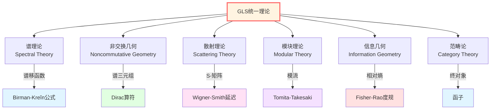

# 数学工具篇：理解GLS理论的数学语言

> *"数学不是障碍，而是通往真理的阶梯。"*

## 🎯 为什么需要这些数学工具？

在前面的章节中，我们理解了GLS理论的五个核心洞见。但要真正深入理论，我们需要掌握它所选用的数学语言。

**不要害怕！**我们会用**通俗的比喻**和**逐步的讲解**，让这些数学工具变得可亲近。

## 🗺️ 数学工具地图

GLS理论站在多个数学领域的交汇点：

## 📚 本章内容概览

### 1. 谱理论（Spectral Theory）
**用一句话概括**：研究算符的"频谱"——就像光的颜色分解。

**为什么重要**：
- 谱移函数 $\xi(\omega)$ 连接散射和态密度
- Birman-Kreĭn公式是统一时间刻度的核心数学工具
- 自伴算子的谱分解给出物理可观测量

**关键概念**：
- 自伴算子与谱分解
- 谱测度
- 谱移函数
- Birman-Kreĭn公式

**比喻**：谱理论就像用三棱镜分解白光——把复杂的算符分解成简单的"纯色"（本征值）。

### 2. 非交换几何（Noncommutative Geometry）
**用一句话概括**：用代数定义几何——不需要"点"和"坐标"。

**为什么重要**：
- 边界谱三元组 $(\mathcal{A}_\partial, \mathcal{H}_\partial, D_\partial)$ 定义几何
- Connes距离公式重构度规
- 被认为是量子空间的自然语言

**关键概念**：
- 谱三元组
- Dirac算符
- Connes距离
- K-理论

**比喻**：就像盲人通过触摸和声音"感知"房间的形状，非交换几何通过代数关系"定义"几何。

### 3. 散射理论（Scattering Theory）
**用一句话概括**：研究"输入→系统→输出"的数学理论。

**为什么重要**：
- S-矩阵是GLS本体论的核心数学对象
- Wigner-Smith延迟矩阵用于定义时间
- 演化被建模为散射

**关键概念**：
- S-矩阵（散射矩阵）
- Wigner-Smith矩阵 $Q(\omega)$
- 时间延迟
- 渐近态

**比喻**：散射理论就像研究回声——你喊一声（输入），山谷反射（系统），你听到回声（输出）。

### 4. 模块理论（Modular Theory）
**用一句话概括**：量子态自身决定的"时间流"。

**为什么重要**：
- Tomita-Takesaki流定义模块时间
- KMS条件描述热平衡
- 热时间假设：时间可能从态中涌现

**关键概念**：
- Tomita-Takesaki理论
- 模块算符 $\Delta$
- 模块流 $\sigma_t$
- KMS状态

**比喻**：就像每个生物体都有自己的"生物钟"，每个量子态都有自己的"模块时间"。

### 5. 信息几何（Information Geometry）
**用一句话概括**：把概率分布空间看作带度规的流形。

**为什么重要**：
- Fisher-Rao度规定义"概率的距离"
- 相对熵是IGVP的核心量
- 揭示信息与几何的深刻联系

**关键概念**：
- Fisher信息矩阵
- Fisher-Rao度规
- 相对熵（Kullback-Leibler散度）
- 量子相对熵

**比喻**：就像地球表面的距离由度规定义，概率分布之间的"距离"也可以用度规度量。

### 6. 范畴论（Category Theory）
**用一句话概括**："数学的数学"——研究数学结构之间的关系。

**为什么重要**：
- QCA宇宙被建模为范畴的终对象
- 矩阵宇宙的范畴等价性
- 统一框架的自然语言

**关键概念**：
- 范畴、对象、态射
- 函子（functor）
- 自然变换
- 终对象与始对象

**比喻**：范畴论不研究"房间里有什么"，而研究"房间之间的门如何连接"。

## 🎓 学习路径建议

### 路径A：最小必要路径（快速理解）

如果你只想快速理解GLS理论，重点学习：

1. **谱理论** → 理解Birman-Kreĭn公式
2. **散射理论** → 理解S-矩阵和Wigner-Smith矩阵
3. **信息几何** → 理解相对熵和IGVP

**预计时间**：3-5天

### 路径B：扎实基础路径（深入理解）

如果你想扎实掌握数学工具：

1. **谱理论** → 自伴算符、谱分解
2. **非交换几何** → 谱三元组、Dirac算符
3. **散射理论** → S-矩阵、时间延迟
4. **模块理论** → Tomita-Takesaki、KMS条件
5. **信息几何** → Fisher度规、相对熵
6. **范畴论** → 基本概念、函子

**预计时间**：2-3周

### 路径C：数学家路径（完全掌握）

如果你是数学背景，想完全掌握：

1. 全部学习，包括所有技术细节
2. 阅读原始论文
3. 完成所有练习题

**预计时间**：1-2个月

## 🔗 与GLS核心洞见的对应

| 核心洞见 | 主要数学工具 | 关键公式/概念 |
|---------|------------|-------------|
| 时间是几何 | 谱理论、非交换几何 | $\varphi = (mc^2/\hbar)\int d\tau$ 谱三元组 |
| 因果是偏序 | 范畴论、拓扑学 | 偏序关系 Cauchy面 |
| 边界是实在 | 非交换几何、模块理论 | 边界谱三元组 Brown-York张量 |
| 散射是演化 | 散射理论、谱理论 | S-矩阵 Birman-Kreĭn公式 |
| 熵是箭头 | 信息几何、模块理论 | 相对熵 KMS条件 |

## 📖 每章结构

每一篇文章都包含：

1. **直观比喻** - 用日常例子理解概念
2. **概念讲解** - 数学定义和物理意义
3. **关键公式** - 重要的数学关系
4. **在GLS中的应用** - 如何用于统一理论
5. **深入阅读** - 链接到原始文档
6. **练习题** - 巩固理解

## 🎨 符号约定

为了阅读方便，我们统一使用以下符号：

| 符号 | 含义 | 例子 |
|-----|------|-----|
| $\mathcal{H}$ | Hilbert空间 | $\mathcal{H}_\partial$ (边界Hilbert空间) |
| $\mathcal{A}$ | 代数 | $\mathcal{A}_\partial$ (边界可观测代数) |
| $H$ | 哈密顿算符 | $H = H_0 + V$ |
| $S(\omega)$ | 散射矩阵 | 依赖于能量 $\omega$ |
| $Q(\omega)$ | Wigner-Smith矩阵 | $Q = -iS^\dagger\partial_\omega S$ |
| $\xi(\omega)$ | 谱移函数 | $\det S = e^{-2\pi i\xi}$ |
| $\Delta$ | 模块算符 | Tomita-Takesaki理论 |
| $D$ | Dirac算符 | 谱三元组中的微分算符 |
| $\rho$ | 态密度 | $\rho_{\text{rel}}$ (相对态密度) |

## 🚀 准备好了吗？

数学工具篇的旅程即将开始！

记住：
- **不要急于求成** - 数学需要时间消化
- **多做类比** - 把抽象概念与具体例子联系
- **动手计算** - 理解来自实践
- **提出问题** - 思考"为什么"比记住"是什么"更重要

---

**下一步**：[01-spectral-theory.md](01-spectral-theory.md) - 谱理论：算符的"频谱分析"

让我们开始吧！

