# Mathematical Tools: Understanding the Mathematical Language of GLS Theory

> *"Mathematics is not an obstacle, but a ladder to truth."*

## 🎯 Why Do We Need These Mathematical Tools?

In previous chapters, we understood the five core insights of GLS theory. But to truly delve into the theory, we need to master the mathematical language it selects.

**Don't be afraid!** We will use **accessible analogies** and **step-by-step explanations** to make these mathematical tools approachable.

## 🗺️ Mathematical Tools Map

GLS theory stands at the intersection of multiple mathematical fields:

```mermaid
graph TB
    G["GLS Unified Theory"] --> ST["Spectral Theory<br/>Spectral Theory"]
    G --> NC["Noncommutative Geometry<br/>Noncommutative Geometry"]
    G --> SC["Scattering Theory<br/>Scattering Theory"]
    G --> MT["Modular Theory<br/>Modular Theory"]
    G --> IG["Information Geometry<br/>Information Geometry"]
    G --> CT["Category Theory<br/>Category Theory"]

    ST --> |"Spectral Shift Function"| BK["Birman-Kreĭn Formula"]
    NC --> |"Spectral Triple"| DS["Dirac Operator"]
    SC --> |"S-Matrix"| WS["Wigner-Smith Delay"]
    MT --> |"Modular Flow"| TT["Tomita-Takesaki"]
    IG --> |"Relative Entropy"| FR["Fisher-Rao Metric"]
    CT --> |"Terminal Object"| FU["Functor"]

    style G fill:#fff4e1,stroke:#ff6b6b,stroke-width:3px
    style BK fill:#e1f5ff
    style DS fill:#e1ffe1
    style WS fill:#ffe1f5
    style TT fill:#f5e1ff
    style FR fill:#ffe1e1
    style FU fill:#e1f5ff
```

## 📚 Chapter Content Overview

### 1. Spectral Theory
**In one sentence**: Study the "spectrum" of operators—like decomposing light into colors.

**Why important**:
- Spectral shift function $\xi(\omega)$ connects scattering and density of states
- Birman-Kreĭn formula is the core mathematical tool for unified time scale
- Spectral decomposition of self-adjoint operators gives physical observables

**Key concepts**:
- Self-adjoint operators and spectral decomposition
- Spectral measure
- Spectral shift function
- Birman-Kreĭn formula

**Analogy**: Spectral theory is like using a prism to decompose white light—decomposing complex operators into simple "pure colors" (eigenvalues).

### 2. Noncommutative Geometry
**In one sentence**: Define geometry using algebra—no need for "points" and "coordinates."

**Why important**:
- Boundary spectral triple $(\mathcal{A}_\partial, \mathcal{H}_\partial, D_\partial)$ defines geometry
- Connes distance formula reconstructs metric
- Considered the natural language for quantum spaces

**Key concepts**:
- Spectral triple
- Dirac operator
- Connes distance
- K-theory

**Analogy**: Just as a blind person "perceives" room shape through touch and sound, noncommutative geometry "defines" geometry through algebraic relations.

### 3. Scattering Theory
**In one sentence**: Mathematical theory studying "input→system→output."

**Why important**:
- S-matrix is the core mathematical object of GLS ontology
- Wigner-Smith delay matrix is used to define time
- Evolution is modeled as scattering

**Key concepts**:
- S-matrix (scattering matrix)
- Wigner-Smith matrix $Q(\omega)$
- Time delay
- Asymptotic states

**Analogy**: Scattering theory is like studying echoes—you shout (input), valley reflects (system), you hear echo (output).

### 4. Modular Theory
**In one sentence**: "Time flow" determined by quantum state itself.

**Why important**:
- Tomita-Takesaki flow defines modular time
- KMS condition describes thermal equilibrium
- Thermal time hypothesis: time might emerge from state

**Key concepts**:
- Tomita-Takesaki theory
- Modular operator $\Delta$
- Modular flow $\sigma_t$
- KMS states

**Analogy**: Just as each organism has its own "biological clock," each quantum state has its own "modular time."

### 5. Information Geometry
**In one sentence**: View probability distribution space as a manifold with metric.

**Why important**:
- Fisher-Rao metric defines "distance between probabilities"
- Relative entropy is the core quantity of IGVP
- Reveals deep connection between information and geometry

**Key concepts**:
- Fisher information matrix
- Fisher-Rao metric
- Relative entropy (Kullback-Leibler divergence)
- Quantum relative entropy

**Analogy**: Just as distances on Earth's surface are defined by metric, "distances" between probability distributions can also be measured by metric.

### 6. Category Theory
**In one sentence**: "Mathematics of mathematics"—studying relationships between mathematical structures.

**Why important**:
- QCA universe is modeled as terminal object of category
- Category equivalence of matrix universe
- Natural language for unified framework

**Key concepts**:
- Category, objects, morphisms
- Functor
- Natural transformation
- Terminal and initial objects

**Analogy**: Category theory doesn't study "what's in the room," but "how doors connect rooms."

## 🎓 Learning Path Suggestions

### Path A: Minimal Essential Path (Quick Understanding)

If you only want to quickly understand GLS theory, focus on:

1. **Spectral Theory** → Understand Birman-Kreĭn formula
2. **Scattering Theory** → Understand S-matrix and Wigner-Smith matrix
3. **Information Geometry** → Understand relative entropy and IGVP

**Estimated time**: 3-5 days

### Path B: Solid Foundation Path (Deep Understanding)

If you want to solidly master mathematical tools:

1. **Spectral Theory** → Self-adjoint operators, spectral decomposition
2. **Noncommutative Geometry** → Spectral triple, Dirac operator
3. **Scattering Theory** → S-matrix, time delay
4. **Modular Theory** → Tomita-Takesaki, KMS condition
5. **Information Geometry** → Fisher metric, relative entropy
6. **Category Theory** → Basic concepts, functors

**Estimated time**: 2-3 weeks

### Path C: Mathematician Path (Complete Mastery)

If you have mathematics background and want complete mastery:

1. Learn everything, including all technical details
2. Read original papers
3. Complete all exercises

**Estimated time**: 1-2 months

## 🔗 Correspondence to GLS Core Insights

| Core Insight | Main Mathematical Tool | Key Formula/Concept |
|-------------|----------------------|---------------------|
| Time is Geometry | Spectral Theory, Noncommutative Geometry | $\varphi = (mc^2/\hbar)\int d\tau$ Spectral Triple |
| Causality is Partial Order | Category Theory, Topology | Partial Order Relation Cauchy Surface |
| Boundary is Reality | Noncommutative Geometry, Modular Theory | Boundary Spectral Triple Brown-York Tensor |
| Scattering is Evolution | Scattering Theory, Spectral Theory | S-Matrix Birman-Kreĭn Formula |
| Entropy is Arrow | Information Geometry, Modular Theory | Relative Entropy KMS Condition |

## 📖 Structure of Each Chapter

Each article contains:

1. **Intuitive Analogy** - Understanding concepts with everyday examples
2. **Concept Explanation** - Mathematical definitions and physical meanings
3. **Key Formulas** - Important mathematical relations
4. **Application in GLS** - How used in unified theory
5. **Further Reading** - Links to original documents
6. **Exercises** - Consolidating understanding

## 🎨 Notation Conventions

For reading convenience, we uniformly use the following notation:

| Symbol | Meaning | Example |
|--------|---------|---------|
| $\mathcal{H}$ | Hilbert Space | $\mathcal{H}_\partial$ (Boundary Hilbert Space) |
| $\mathcal{A}$ | Algebra | $\mathcal{A}_\partial$ (Boundary Observable Algebra) |
| $H$ | Hamiltonian Operator | $H = H_0 + V$ |
| $S(\omega)$ | Scattering Matrix | Depends on energy $\omega$ |
| $Q(\omega)$ | Wigner-Smith Matrix | $Q = -iS^\dagger\partial_\omega S$ |
| $\xi(\omega)$ | Spectral Shift Function | $\det S = e^{-2\pi i\xi}$ |
| $\Delta$ | Modular Operator | Tomita-Takesaki Theory |
| $D$ | Dirac Operator | Differential Operator in Spectral Triple |
| $\rho$ | Density of States | $\rho_{\text{rel}}$ (Relative Density of States) |

## 🚀 Ready?

The journey through Mathematical Tools is about to begin!

Remember:
- **Don't rush** - Mathematics needs time to digest
- **Make analogies** - Connect abstract concepts with concrete examples
- **Practice calculations** - Understanding comes from practice
- **Ask questions** - Thinking "why" is more important than remembering "what"

---

**Next**: [01-spectral-theory_en.md](01-spectral-theory_en.md) - Spectral Theory: "Spectral Analysis" of Operators

Let's begin!

