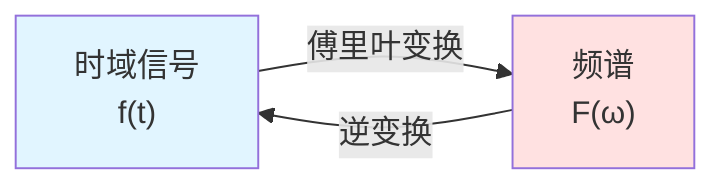
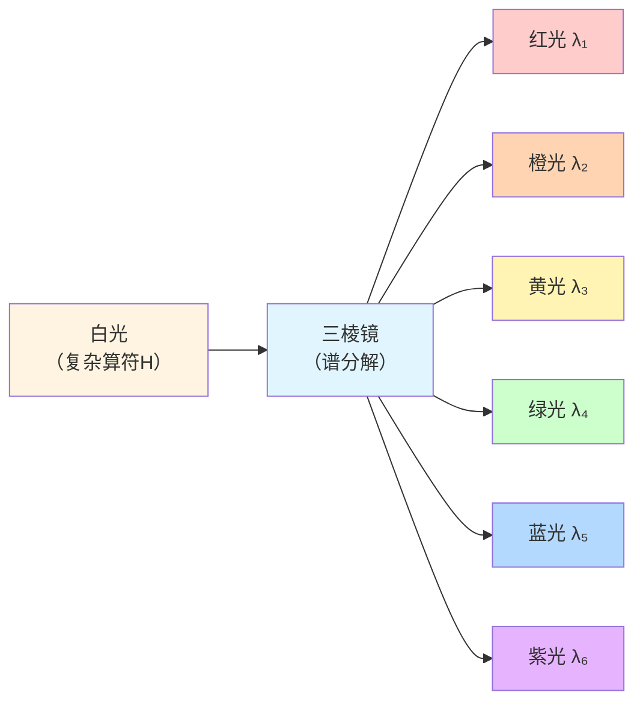
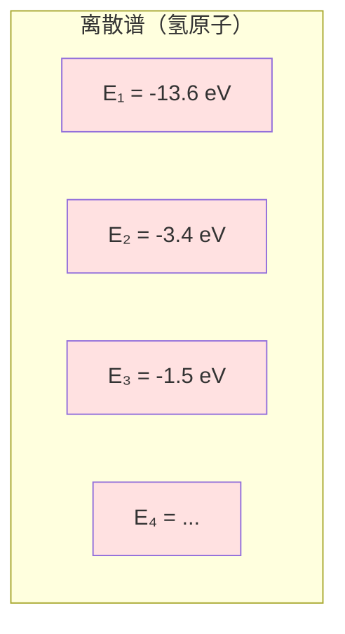
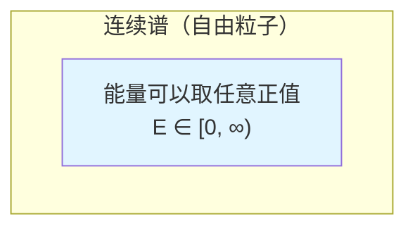
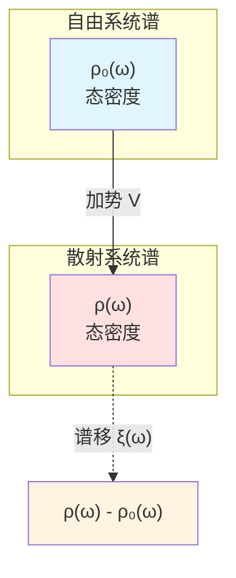
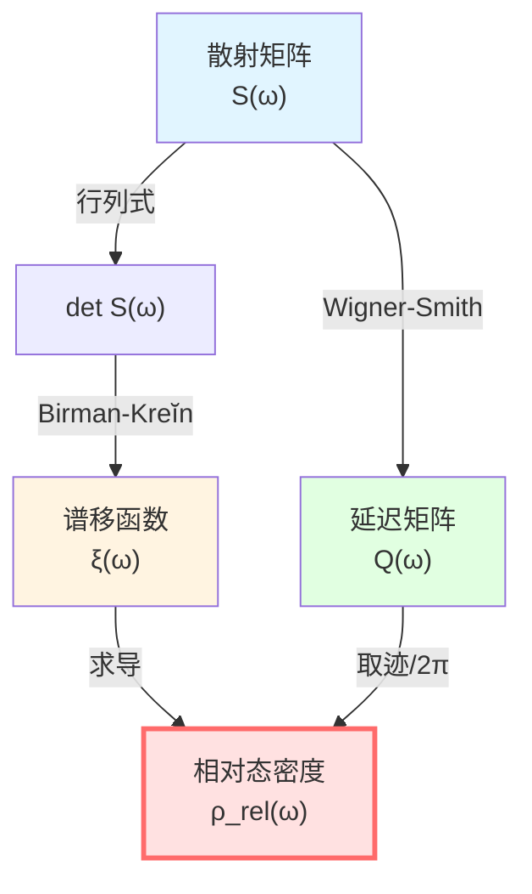

# 谱理论：算符的"频谱分析"

> *"就像光可以分解成彩虹，算符也可以分解成'本征值谱'。"*

## 🎯 什么是谱理论？

想象你在听一段音乐：

- **时域**：你听到的是随时间变化的声波
- **频域**：实际上这是许多不同频率的正弦波叠加

**傅里叶变换**就是把时域信号分解成频域"频谱"：

**谱理论**做的是类似的事情，但对象是**算符**而不是函数：

把复杂的算符 $H$ 分解成简单的"本征值"和"本征向量"。

## 🌈 比喻：三棱镜分光

- **白光** = 复杂算符 $H$
- **三棱镜** = 谱分解
- **各色光** = 本征值 $\lambda_1, \lambda_2, \ldots$

每个本征值对应一个"纯色"——系统的一个简单模式。

## 📐 自伴算符与谱分解

### 什么是自伴算符？

在量子力学中，所有可观测量都用**自伴算符**表示：

$$
H^\dagger = H
$$

（这里 $\dagger$ 表示共轭转置）

**为什么要求自伴**？

因为自伴算符的本征值一定是**实数**——这样才能对应物理上可测量的量！

### 谱定理（Spectral Theorem）

**定理**：任何自伴算符 $H$ 都可以"对角化"——写成本征值和投影的和：

$$
H = \int_{\sigma(H)} \lambda \, dE(\lambda)
$$

其中：
- $\sigma(H)$：算符 $H$ 的**谱**（所有本征值的集合）
- $\lambda$：本征值
- $E(\lambda)$：谱测度（投影值测度）

**物理意义**：

任何测量都可以分解成对各个本征态的投影测量！

### 离散谱 vs 连续谱

**离散谱**：本征值可数（例如氢原子能级）

$$
H = \sum_{n=1}^{\infty} E_n |n\rangle\langle n|
$$

**连续谱**：本征值连续（例如自由粒子动量）

$$
H = \int_{-\infty}^{\infty} \frac{p^2}{2m} |p\rangle\langle p| \, dp
$$

## 🔬 谱移函数：散射的"指纹"

### 从自由系统到散射系统

考虑两个哈密顿量：
- $H_0$：自由系统（无相互作用）
- $H = H_0 + V$：散射系统（有势 $V$）

**问题**：$H$ 的谱与 $H_0$ 的谱有什么关系？

**答案**：用**谱移函数** $\xi(\omega)$ 描述！

### 谱移函数的定义

**直观想法**：

$H$ 比 $H_0$ 多了多少"谱权重"在能量 $\omega$ 附近？

**数学定义**（Krein公式）：

对任何光滑试探函数 $f$：

$$
\text{tr}\big(f(H) - f(H_0)\big) = \int_{-\infty}^{\infty} f'(\omega) \, \xi(\omega) \, d\omega
$$

**物理意义**：

$\xi(\omega)$ 度量散射势 $V$ 在能量 $\omega$ 处"移动"了多少谱权重。

### 谱移与态密度

**关键关系**：

$$
\xi'(\omega) = \rho(\omega) - \rho_0(\omega) =: \rho_{\text{rel}}(\omega)
$$

其中：
- $\rho(\omega) = \text{tr}\, \delta(\omega - H)$：$H$ 的态密度
- $\rho_0(\omega) = \text{tr}\, \delta(\omega - H_0)$：$H_0$ 的态密度
- $\rho_{\text{rel}}(\omega)$：**相对态密度**

**物理意义**：

**谱移函数的导数 = 散射系统比自由系统多出的态密度！**

## ⚡ Birman-Kreĭn公式：核心工具

这是GLS理论中最重要的数学公式之一！

### S-矩阵与谱移的关系

**Birman-Kreĭn公式**：

$$
\boxed{\det S(\omega) = e^{-2\pi i \xi(\omega)}}
$$

其中：
- $S(\omega)$：散射矩阵（依赖能量 $\omega$）
- $\xi(\omega)$：谱移函数
- $\det$：行列式

**推论**：取对数并对 $\omega$ 求导：

$$
\frac{d}{d\omega}\big[-i \ln \det S(\omega)\big] = 2\pi \xi'(\omega) = -\,2\pi \rho_{\text{rel}}(\omega)
$$

定义**总散射相位**：

$$
\Phi(\omega) = -i \ln \det S(\omega)
$$

则有 $\Phi(\omega) = -2\pi\xi(\omega)$，从而

$$
\boxed{\frac{\Phi'(\omega)}{\pi} = -2\xi'(\omega) = 2\rho_{\text{rel}}(\omega)}
$$

或写成：

$$
\boxed{\frac{\varphi'(\omega)}{\pi} = \rho_{\text{rel}}(\omega)}
$$

（这里 $\varphi = \Phi/2$ 是半相位）

### 连接Wigner-Smith延迟

回忆Wigner-Smith时间延迟矩阵：

$$
Q(\omega) = -i S(\omega)^\dagger \frac{\partial S(\omega)}{\partial \omega}
$$

它的迹是：

$$
\text{tr}\, Q(\omega) = -i \text{tr}\big(S^\dagger \partial_\omega S\big) = -i \frac{\partial}{\partial\omega} \text{tr}\, \ln S = \frac{\partial \Phi}{\partial \omega}
$$

结合Birman-Kreĭn公式与上式 $\Phi'(\omega) = -2\pi\xi'(\omega) = 2\pi\rho_{\text{rel}}(\omega)$，得到

$$
\boxed{\frac{1}{2\pi} \text{tr}\, Q(\omega) = \frac{\Phi'(\omega)}{2\pi} = -\,\xi'(\omega) = \rho_{\text{rel}}(\omega)}
$$

**这就是统一时间刻度同一式的数学来源！**

## 🧮 简单例子：单通道散射

### 问题设定

考虑一维散射，单通道，散射矩阵是 $1 \times 1$ 矩阵（就是一个复数）：

$$
S(\omega) = e^{2i\delta(\omega)}
$$

其中 $\delta(\omega)$ 是散射相移。

### 计算谱移函数

由Birman-Kreĭn公式：

$$
\det S(\omega) = S(\omega) = e^{2i\delta(\omega)} = e^{-2\pi i\xi(\omega)}
$$

比较指数：

$$
2i\delta(\omega) = -2\pi i\xi(\omega)
$$

得到：

$$
\xi(\omega) = -\frac{\delta(\omega)}{\pi}
$$

### 计算态密度

相对态密度：

$$
\rho_{\text{rel}}(\omega) = \xi'(\omega) = -\frac{1}{\pi} \frac{d\delta(\omega)}{d\omega}
$$

这正是著名的**Friedel求和规则**！

### 计算时间延迟

Wigner-Smith矩阵（1×1情况）：

$$
Q(\omega) = -i e^{-2i\delta} \frac{d}{d\omega} e^{2i\delta} = -i \cdot 2i \frac{d\delta}{d\omega} = 2\frac{d\delta}{d\omega}
$$

时间延迟：

$$
\tau_W = \frac{Q(\omega)}{2\pi} = \frac{1}{\pi} \frac{d\delta}{d\omega} = -\rho_{\text{rel}}(\omega)
$$

**完美验证了公式！**

## 🔗 在GLS理论中的应用

### 1. 统一时间刻度

Birman-Kreĭn公式给出：

$$
\kappa(\omega) = \rho_{\text{rel}}(\omega) = \frac{1}{2\pi}\text{tr}\,Q(\omega) = \frac{\varphi'(\omega)}{\pi}
$$

这是**统一时间刻度同一式**的数学基础！

### 2. 态密度与熵

相对态密度 $\rho_{\text{rel}}$ 直接关联到熵：

$$
S = k_B \ln \Omega \approx k_B \int \rho(\omega) \ln \rho(\omega) \, d\omega
$$

### 3. 因果与谱

谱的非负性 $\rho_{\text{rel}}(\omega) \ge 0$ 确保时间刻度的单调性，进而被认为保证了因果性。

## 📝 关键公式总结

| 公式 | 名称 | 意义 |
|-----|------|------|
| $H = \int \lambda \, dE(\lambda)$ | 谱定理 | 算符的谱分解 |
| $\text{tr}(f(H)-f(H_0)) = \int f'(\omega)\xi(\omega)d\omega$ | Krein迹公式 | 谱移函数定义 |
| $\xi'(\omega) = \rho_{\text{rel}}(\omega)$ | 谱移导数 | 相对态密度 |
| $\det S(\omega) = e^{-2\pi i\xi(\omega)}$ | Birman-Kreĭn公式 | 散射与谱移的关系 |
| $\frac{1}{2\pi}\text{tr}\,Q = \xi' = \rho_{\text{rel}}$ | 时间刻度同一式 | 统一时间 |

## 🎓 深入阅读

- 理论文档：unified-time-scale-geometry.md 附录A
- 原始论文：Birman & Kreĭn, "On the theory of wave operators and scattering operators" (1962)
- Strohmaier & Waters, "The Birman-Krein formula for differential forms" (arXiv:2104.13589)
- 下一篇：[02-noncommutative-geometry.md](02-noncommutative-geometry.md) - 非交换几何

## 🤔 练习题

1. **概念理解**：
   - 为什么自伴算符的本征值一定是实数？
   - 谱移函数 $\xi(\omega)$ 为什么叫"移"（shift）？
   - 相对态密度为什么重要？

2. **计算练习**：
   - 验证：$\det(AB) = \det A \cdot \det B$
   - 对 $S(\omega) = e^{2i\delta(\omega)}$，计算 $Q(\omega)$
   - 证明：$\text{tr}\,\ln A = \ln \det A$（有限维）

3. **物理应用**：
   - 氢原子的能级是离散谱还是连续谱？
   - 自由粒子的谱是什么？
   - 散射相移 $\delta(\omega)$ 的物理意义是什么？

4. **进阶思考**：
   - 如果 $V$ 是吸引势，$\rho_{\text{rel}}$ 的符号是什么？
   - Birman-Kreĭn公式对多通道散射如何推广？
   - 谱移函数与Levinson定理有什么关系？

---

**下一步**：在理解了谱理论之后，我们将学习**非交换几何**——如何用代数定义几何，这是边界理论的数学语言！
