# Spectral Theory: "Spectral Analysis" of Operators

> *"Just as light can be decomposed into a rainbow, operators can be decomposed into 'eigenvalue spectra.'"*

## 🎯 What is Spectral Theory?

Imagine you're listening to music:

- **Time domain**: What you hear is sound waves changing over time
- **Frequency domain**: Actually this is superposition of many sine waves of different frequencies

**Fourier transform** decomposes time-domain signals into frequency-domain "spectrum":

```mermaid
graph LR
    T["Time Domain Signal<br/>f(t)"] --> |"Fourier Transform"| F["Spectrum<br/>F(ω)"]
    F --> |"Inverse Transform"| T

    style T fill:#e1f5ff
    style F fill:#ffe1e1
```

**Spectral theory** does something similar, but for **operators** rather than functions:

Decompose complex operator $H$ into simple "eigenvalues" and "eigenvectors".

## 🌈 Analogy: Prism Decomposing Light

```mermaid
graph LR
    W["White Light<br/>(Complex Operator H)"] --> P["Prism<br/>(Spectral Decomposition)"]
    P --> R["Red Light λ₁"]
    P --> O["Orange Light λ₂"]
    P --> Y["Yellow Light λ₃"]
    P --> G["Green Light λ₄"]
    P --> B["Blue Light λ₅"]
    P --> V["Violet Light λ₆"]

    style W fill:#fff4e1
    style P fill:#e1f5ff
    style R fill:#ffcccc
    style O fill:#ffd4b3
    style Y fill:#fff4b3
    style G fill:#ccffcc
    style B fill:#b3d9ff
    style V fill:#e6b3ff
```

- **White light** = Complex operator $H$
- **Prism** = Spectral decomposition
- **Colored lights** = Eigenvalues $\lambda_1, \lambda_2, \ldots$

Each eigenvalue corresponds to a "pure color"—a simple mode of the system.

## 📐 Self-Adjoint Operators and Spectral Decomposition

### What is a Self-Adjoint Operator?

In quantum mechanics, all observables are represented by **self-adjoint operators**:

$$
H^\dagger = H
$$

(Here $\dagger$ denotes conjugate transpose)

**Why require self-adjoint?**

Because eigenvalues of self-adjoint operators must be **real**—only then can they correspond to physically measurable quantities!

### Spectral Theorem

**Theorem**: Any self-adjoint operator $H$ can be "diagonalized"—written as sum of eigenvalues and projections:

$$
H = \int_{\sigma(H)} \lambda \, dE(\lambda)
$$

where:
- $\sigma(H)$: **Spectrum** of operator $H$ (set of all eigenvalues)
- $\lambda$: Eigenvalue
- $E(\lambda)$: Spectral measure (projection-valued measure)

**Physical meaning**:

Any measurement can be decomposed into projection measurements on various eigenstates!

### Discrete Spectrum vs Continuous Spectrum

**Discrete spectrum**: Eigenvalues are countable (e.g., hydrogen atom energy levels)

$$
H = \sum_{n=1}^{\infty} E_n |n\rangle\langle n|
$$

```mermaid
graph TB
    subgraph "Discrete Spectrum (Hydrogen Atom)"
        E1["E₁ = -13.6 eV"]
        E2["E₂ = -3.4 eV"]
        E3["E₃ = -1.5 eV"]
        E4["E₄ = ..."]
    end

    style E1 fill:#ffe1e1
    style E2 fill:#ffe1e1
    style E3 fill:#ffe1e1
    style E4 fill:#ffe1e1
```

**Continuous spectrum**: Eigenvalues are continuous (e.g., free particle momentum)

$$
H = \int_{-\infty}^{\infty} \frac{p^2}{2m} |p\rangle\langle p| \, dp
$$

```mermaid
graph TB
    subgraph "Continuous Spectrum (Free Particle)"
        C["Energy Can Take Any Positive Value<br/>E ∈ [0, ∞)"]
    end

    style C fill:#e1f5ff
```

## 🔬 Spectral Shift Function: "Fingerprint" of Scattering

### From Free System to Scattering System

Consider two Hamiltonians:
- $H_0$: Free system (no interaction)
- $H = H_0 + V$: Scattering system (with potential $V$)

**Question**: What is the relationship between spectrum of $H$ and spectrum of $H_0$?

**Answer**: Described by **spectral shift function** $\xi(\omega)$!

### Definition of Spectral Shift Function

**Intuitive idea**:

How much more "spectral weight" does $H$ have compared to $H_0$ near energy $\omega$?

**Mathematical definition** (Krein formula):

For any smooth test function $f$:

$$
\text{tr}\big(f(H) - f(H_0)\big) = \int_{-\infty}^{\infty} f'(\omega) \, \xi(\omega) \, d\omega
$$

**Physical meaning**:

$\xi(\omega)$ measures how much spectral weight the scattering potential $V$ "shifts" at energy $\omega$.

```mermaid
graph TB
    subgraph "Free System Spectrum"
        F["ρ₀(ω)<br/>Density of States"]
    end

    subgraph "Scattering System Spectrum"
        S["ρ(ω)<br/>Density of States"]
    end

    F --> |"Add Potential V"| S
    S -.-> |"Spectral Shift ξ(ω)"| D["ρ(ω) - ρ₀(ω)"]

    style F fill:#e1f5ff
    style S fill:#ffe1e1
    style D fill:#fff4e1
```

### Spectral Shift and Density of States

**Key relation**:

$$
\xi'(\omega) = \rho(\omega) - \rho_0(\omega) =: \rho_{\text{rel}}(\omega)
$$

where:
- $\rho(\omega) = \text{tr}\, \delta(\omega - H)$: Density of states of $H$
- $\rho_0(\omega) = \text{tr}\, \delta(\omega - H_0)$: Density of states of $H_0$
- $\rho_{\text{rel}}(\omega)$: **Relative density of states**

**Physical meaning**:

**Derivative of spectral shift function = Extra density of states that scattering system has compared to free system!**

## ⚡ Birman-Kreĭn Formula: Core Tool

This is one of the most important mathematical formulas in GLS theory!

### Relation Between S-Matrix and Spectral Shift

**Birman-Kreĭn formula**:

$$
\boxed{\det S(\omega) = e^{-2\pi i \xi(\omega)}}
$$

where:
- $S(\omega)$: Scattering matrix (depends on energy $\omega$)
- $\xi(\omega)$: Spectral shift function
- $\det$: Determinant

**Corollary**: Taking logarithm and differentiating w.r.t. $\omega$:

$$
\frac{d}{d\omega}\big[-i \ln \det S(\omega)\big] = 2\pi \xi'(\omega) = -\,2\pi \rho_{\text{rel}}(\omega)
$$

Define **total scattering phase**:

$$
\Phi(\omega) = -i \ln \det S(\omega)
$$

Then $\Phi(\omega) = -2\pi\xi(\omega)$, so

$$
\boxed{\frac{\Phi'(\omega)}{\pi} = -2\xi'(\omega) = 2\rho_{\text{rel}}(\omega)}
$$

Or written as:

$$
\boxed{\frac{\varphi'(\omega)}{\pi} = \rho_{\text{rel}}(\omega)}
$$

(Here $\varphi = \Phi/2$ is half-phase)

### Connection to Wigner-Smith Delay

Recall Wigner-Smith time delay matrix:

$$
Q(\omega) = -i S(\omega)^\dagger \frac{\partial S(\omega)}{\partial \omega}
$$

Its trace is:

$$
\text{tr}\, Q(\omega) = -i \text{tr}\big(S^\dagger \partial_\omega S\big) = -i \frac{\partial}{\partial\omega} \text{tr}\, \ln S = \frac{\partial \Phi}{\partial \omega}
$$

Combining Birman-Kreĭn formula with $\Phi'(\omega) = -2\pi\xi'(\omega) = 2\pi\rho_{\text{rel}}(\omega)$, we get

$$
\boxed{\frac{1}{2\pi} \text{tr}\, Q(\omega) = \frac{\Phi'(\omega)}{2\pi} = -\,\xi'(\omega) = \rho_{\text{rel}}(\omega)}
$$

**This is the mathematical source of the Unified Time Scale Identity!**

```mermaid
graph TB
    S["Scattering Matrix<br/>S(ω)"] --> |"Determinant"| D["det S(ω)"]
    D --> |"Birman-Kreĭn"| Xi["Spectral Shift Function<br/>ξ(ω)"]
    Xi --> |"Derivative"| Rho["Relative Density of States<br/>ρ_rel(ω)"]

    S --> |"Wigner-Smith"| Q["Delay Matrix<br/>Q(ω)"]
    Q --> |"Trace/2π"| Rho

    style S fill:#e1f5ff
    style Xi fill:#fff4e1
    style Rho fill:#ffe1e1,stroke:#ff6b6b,stroke-width:3px
    style Q fill:#e1ffe1
```

## 🧮 Simple Example: Single-Channel Scattering

### Problem Setup

Consider one-dimensional scattering, single channel, scattering matrix is $1 \times 1$ matrix (just a complex number):

$$
S(\omega) = e^{2i\delta(\omega)}
$$

where $\delta(\omega)$ is scattering phase shift.

### Calculate Spectral Shift Function

By Birman-Kreĭn formula:

$$
\det S(\omega) = S(\omega) = e^{2i\delta(\omega)} = e^{-2\pi i\xi(\omega)}
$$

Comparing exponents:

$$
2i\delta(\omega) = -2\pi i\xi(\omega)
$$

We get:

$$
\xi(\omega) = -\frac{\delta(\omega)}{\pi}
$$

### Calculate Density of States

Relative density of states:

$$
\rho_{\text{rel}}(\omega) = \xi'(\omega) = -\frac{1}{\pi} \frac{d\delta(\omega)}{d\omega}
$$

This is the famous **Friedel sum rule**!

### Calculate Time Delay

Wigner-Smith matrix (1×1 case):

$$
Q(\omega) = -i e^{-2i\delta} \frac{d}{d\omega} e^{2i\delta} = -i \cdot 2i \frac{d\delta}{d\omega} = 2\frac{d\delta}{d\omega}
$$

Time delay:

$$
\tau_W = \frac{Q(\omega)}{2\pi} = \frac{1}{\pi} \frac{d\delta}{d\omega} = -\rho_{\text{rel}}(\omega)
$$

**Perfectly verifies the formula!**

## 🔗 Applications in GLS Theory

### 1. Unified Time Scale

Birman-Kreĭn formula gives:

$$
\kappa(\omega) = \rho_{\text{rel}}(\omega) = \frac{1}{2\pi}\text{tr}\,Q(\omega) = \frac{\varphi'(\omega)}{\pi}
$$

This is the mathematical foundation of the **Unified Time Scale Identity**!

### 2. Density of States and Entropy

Relative density of states $\rho_{\text{rel}}$ directly relates to entropy:

$$
S = k_B \ln \Omega \approx k_B \int \rho(\omega) \ln \rho(\omega) \, d\omega
$$

### 3. Causality and Spectrum

Non-negativity of spectrum $\rho_{\text{rel}}(\omega) \ge 0$ ensures monotonicity of time scale, which in turn is considered to guarantee causality.

## 📝 Key Formulas Summary

| Formula | Name | Meaning |
|---------|------|---------|
| $H = \int \lambda \, dE(\lambda)$ | Spectral Theorem | Spectral decomposition of operator |
| $\text{tr}(f(H)-f(H_0)) = \int f'(\omega)\xi(\omega)d\omega$ | Krein Trace Formula | Definition of spectral shift function |
| $\xi'(\omega) = \rho_{\text{rel}}(\omega)$ | Spectral Shift Derivative | Relative density of states |
| $\det S(\omega) = e^{-2\pi i\xi(\omega)}$ | Birman-Kreĭn Formula | Relation between scattering and spectral shift |
| $\frac{1}{2\pi}\text{tr}\,Q = \xi' = \rho_{\text{rel}}$ | Time Scale Identity | Unified time |

## 🎓 Further Reading

- Theory document: unified-time-scale-geometry.md Appendix A
- Original paper: Birman & Kreĭn, "On the theory of wave operators and scattering operators" (1962)
- Strohmaier & Waters, "The Birman-Krein formula for differential forms" (arXiv:2104.13589)
- Next: [02-noncommutative-geometry_en.md](02-noncommutative-geometry_en.md) - Noncommutative Geometry

## 🤔 Exercises

1. **Conceptual Understanding**:
   - Why must eigenvalues of self-adjoint operators be real?
   - Why is spectral shift function $\xi(\omega)$ called "shift"?
   - Why is relative density of states important?

2. **Calculation Exercises**:
   - Verify: $\det(AB) = \det A \cdot \det B$
   - For $S(\omega) = e^{2i\delta(\omega)}$, calculate $Q(\omega)$
   - Prove: $\text{tr}\,\ln A = \ln \det A$ (finite-dimensional)

3. **Physical Applications**:
   - Are hydrogen atom energy levels discrete or continuous spectrum?
   - What is the spectrum of a free particle?
   - What is the physical meaning of scattering phase shift $\delta(\omega)$?

4. **Advanced Thinking**:
   - If $V$ is an attractive potential, what is the sign of $\rho_{\text{rel}}$?
   - How does Birman-Kreĭn formula generalize to multi-channel scattering?
   - What is the relationship between spectral shift function and Levinson's theorem?

---

**Next Step**: After understanding spectral theory, we will learn **Noncommutative Geometry**—how to define geometry using algebra, the mathematical language of boundary theory!

