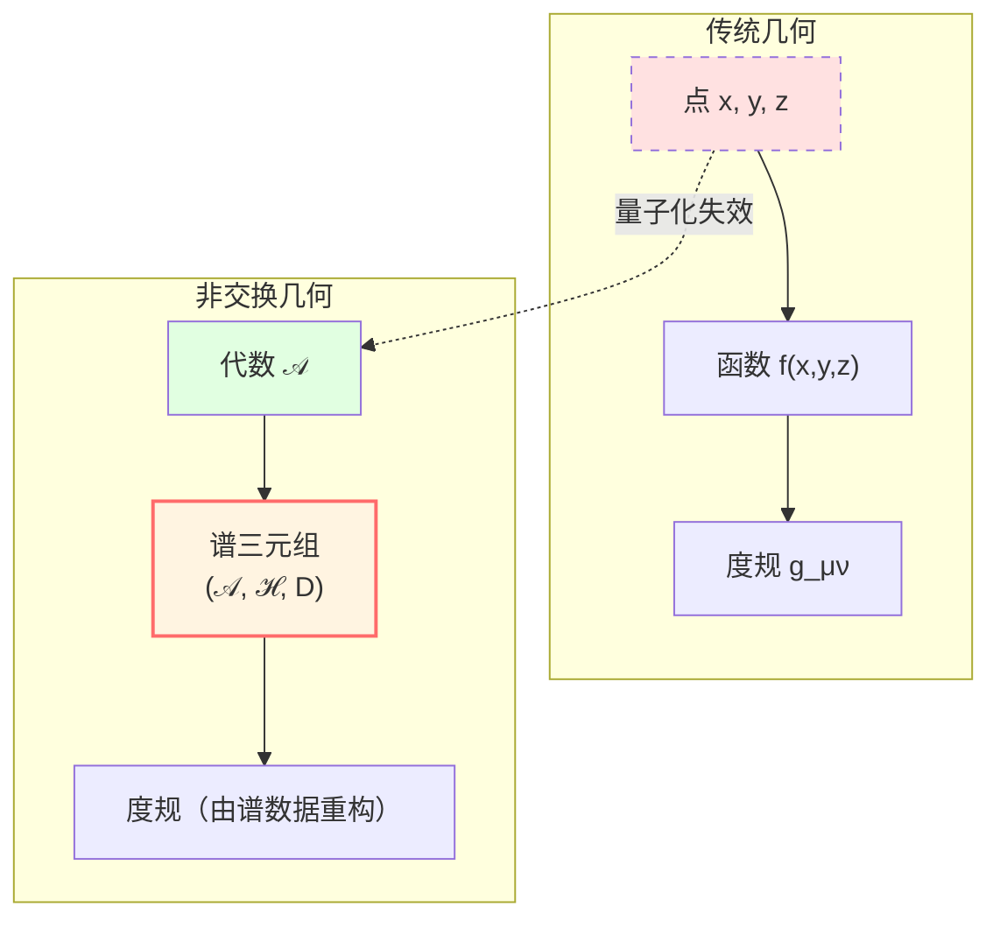
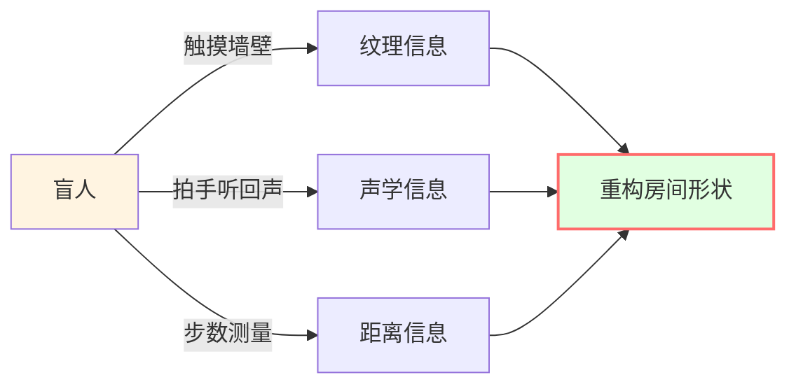
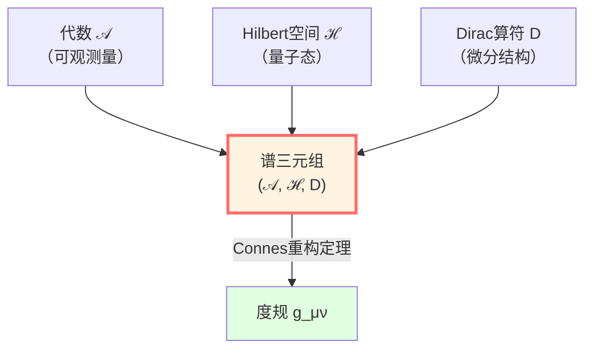
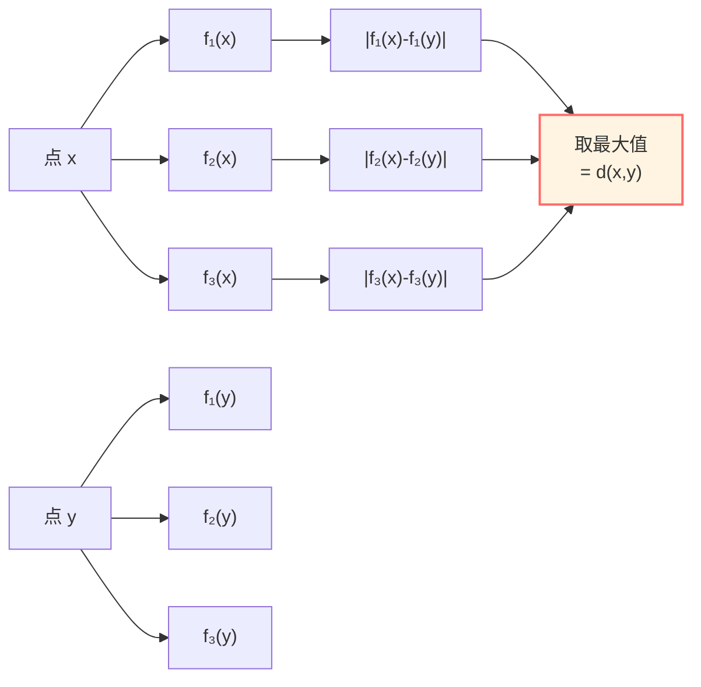
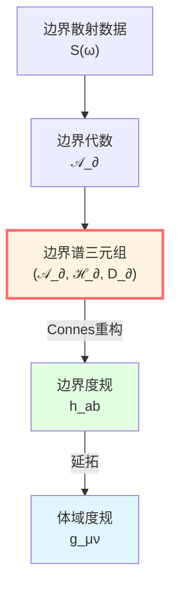

# 非交换几何：不需要"点"的几何学

> *"几何不是关于点的，而是关于代数的。"* — Alain Connes

## 🎯 什么是非交换几何？

### 传统几何的局限

在传统几何中，我们这样思考：

1. 空间由"点"组成
2. 每个点有坐标 $(x, y, z)$
3. 函数 $f(x, y, z)$ 定义在点上
4. 几何由度规 $g_{\mu\nu}$ 描述

但在量子世界中，**"点"的概念失效**了！

- Heisenberg不确定性：$\Delta x \cdot \Delta p \ge \hbar/2$
- 无法同时精确测量位置和动量
- **"点"不可观测！**

### 非交换几何的革命

Alain Connes在1980年代提出：

**不需要"点"！用代数关系定义几何！**

**关键洞察**：

**几何 = 代数 + 表示 + 微分结构**

不需要预先给定"点"和"坐标"！

## 🔮 盲人感知房间：类比理解

想象一个盲人如何"感知"房间的几何：

盲人不需要"看到"房间的点，而是通过：
- **触觉** → 代数关系（$f \cdot g = g \cdot f$ 在墙面上）
- **声音** → 谱数据（回声频率 = Dirac算符本征值）
- **步数** → 距离（Connes距离公式）

**非交换几何做的就是这个！**

## 📐 谱三元组：几何的"DNA"

### 定义

一个**谱三元组**（spectral triple）是三元组：

$$
(\mathcal{A}, \mathcal{H}, D)
$$

其中：

1. **$\mathcal{A}$**：*-代数（可观测量的代数）
   - 传统：$\mathcal{A} = C^\infty(M)$（流形上的光滑函数）
   - 量子：$\mathcal{A}$ 可以是非交换代数

2. **$\mathcal{H}$**：Hilbert空间（量子态）
   - $\mathcal{A}$ 在 $\mathcal{H}$ 上有表示：$a \in \mathcal{A} \mapsto \pi(a)$ （算符）

3. **$D$**：Dirac算符（微分结构的载体）
   - 自伴：$D^\dagger = D$
   - 有紧致预解算子（谱离散）
   - 交换子有界：$\forall a \in \mathcal{A}, \, [D, \pi(a)]$ 有界

### 为什么叫"谱"三元组？

因为几何信息编码在 $D$ 的**谱**（本征值）中！

$$
D \psi_n = \lambda_n \psi_n
$$

- $\lambda_n$：本征值（"频率"）
- $\psi_n$：本征函数（"模式"）

**Mark Kac的问题（1966）**："能否听出鼓的形状？"

答案：**几乎可以**——谱包含了几何的大部分信息！

## 🎵 经典例子：圆周上的谱三元组

### 设置

考虑圆周 $S^1 = \mathbb{R}/\mathbb{Z}$：

1. **代数**：$\mathcal{A} = C^\infty(S^1)$（圆周上的光滑函数）

2. **Hilbert空间**：$\mathcal{H} = L^2(S^1)$（平方可积函数）

3. **Dirac算符**：$D = -i \frac{d}{d\theta}$（导数算符）

### 谱

求解本征值问题：

$$
D \psi = -i \frac{d\psi}{d\theta} = \lambda \psi
$$

解是：

$$
\psi_n(\theta) = e^{in\theta}, \quad \lambda_n = n, \quad n \in \mathbb{Z}
$$

**谱**：$\sigma(D) = \mathbb{Z} = \{\ldots, -2, -1, 0, 1, 2, \ldots\}$

### 重构几何

从谱可以看出：

- 本征值间距均匀：$\Delta \lambda = 1$ → 圆周是**一维**的
- 谱是离散的 → 圆周是**紧致**的
- 谱无上下界 → 圆周**无边界**

**从谱数据就能"听出"这是一个圆周！**

## 📏 Connes距离公式：代数定义距离

### 传统距离

在黎曼流形上，两点间的距离是：

$$
d(x, y) = \inf_{\gamma} \int_\gamma \sqrt{g_{\mu\nu} \dot{x}^\mu \dot{x}^\nu} \, d\lambda
$$

（最短测地线长度）

### Connes距离

在谱三元组中，**不需要"点"**，距离这样定义：

$$
\boxed{d(x, y) = \sup\left\{ |f(x) - f(y)| : f \in \mathcal{A}, \, \|[D, f]\| \le 1 \right\}}
$$

**物理意义**：

- $[D, f]$ 是 $f$ 的"导数"（交换子）
- $\|[D, f]\| \le 1$ 表示 $f$ 的Lipschitz常数 $\le 1$
- $\sup$ 取所有Lipschitz-1函数的最大差值

**直观理解**：

距离 = 所有"速度受限"（Lipschitz）的观测量能区分的最大差异

### Connes重构定理

**定理**（Connes, 1994）：

对紧致自旋黎曼流形 $M$，若取：
- $\mathcal{A} = C^\infty(M)$
- $\mathcal{H} = L^2(S)$（旋量丛的截面）
- $D$ = Dirac算符

则Connes距离公式**精确恢复**黎曼度规诱导的距离！

$$
d_{\text{Connes}}(x, y) = d_{\text{Riemann}}(x, y)
$$

**这意味着**：

**度规可以从谱三元组唯一重构！**

## 🌊 边界谱三元组：GLS的核心

在GLS理论中，边界几何由**边界谱三元组**定义：

$$
(\mathcal{A}_\partial, \mathcal{H}_\partial, D_\partial)
$$

### 组成部分

1. **$\mathcal{A}_\partial$**：边界可观测代数
   - 经典情形：$C^\infty(\partial M)$
   - 量子情形：非交换代数（例如散射矩阵代数）

2. **$\mathcal{H}_\partial$**：边界Hilbert空间
   - $\mathbb{Z}_2$-分次（偶/奇）
   - 携带 $\mathcal{A}_\partial$ 的表示

3. **$D_\partial$**：边界Dirac算符
   - 编码边界几何
   - 与Brown-York应力张量相关

### 边界度规的重构

**定理 1**（边界度规的谱重构）：

若 $\partial M$ 为紧致自旋黎曼流形，则谱三元组

$$
(\mathcal{A}_\partial, \mathcal{H}_\partial, D_\partial) = (C^\infty(\partial M), L^2(S_\partial), D_\partial)
$$

唯一确定边界度规 $h_{ab}$，使得Connes距离等于路径长度距离。

**物理含义**：

**边界度规不是预先给定的，而是从Dirac算符的谱结构中涌现！**

## 🔗 非交换：当乘法不可交换

### 为什么"非交换"？

在经典几何中，函数的乘法是可交换的：

$$
f \cdot g = g \cdot f \quad \text{（对所有 } f, g \in C^\infty(M)\text{）}
$$

但在量子世界中，算符一般**不可交换**：

$$
[x, p] = xp - px = i\hbar \neq 0
$$

**非交换几何**允许代数 $\mathcal{A}$ 是非交换的！

### 简单例子：矩阵代数

考虑 $2 \times 2$ 复矩阵代数 $\mathcal{A} = M_2(\mathbb{C})$：

$$
A = \begin{pmatrix} a & b \\ c & d \end{pmatrix}, \quad B = \begin{pmatrix} e & f \\ g & h \end{pmatrix}
$$

一般地：

$$
AB \neq BA
$$

**这是最简单的非交换几何！**

- "空间"只有有限个"点"（矩阵的维数）
- 但几何结构非平凡（矩阵的非交换性）

### 物理应用

1. **量子相空间**：$(x, p)$ 的代数是非交换的
2. **规范理论**：非交换几何自然导出Yang-Mills理论
3. **弦理论**：D-膜上的坐标不可交换

## 💡 K-理论：拓扑的代数刻画

### 什么是K-理论？

**K-理论**研究向量丛的拓扑性质，但用**代数方法**。

在非交换几何中，K-理论给出：

$$
K_0(\mathcal{A}) = \text{投影算符的等价类}
$$

**物理意义**：

- $K_0$ 的元素对应"拓扑绝缘体"的分类
- Chern数、拓扑不变量都可以从K-理论导出

### 在GLS中的作用

在GLS的拓扑约束理论中：

- $\mathbb{Z}_2$ BF理论的扇区类：$[K] \in H^2(Y, \partial Y; \mathbb{Z}_2)$
- 零模的拓扑保护
- 拓扑相变

## 🔗 在GLS理论中的应用

### 1. 边界优先性

非交换几何提供了"边界优先性"公理的数学语言：

**边界谱三元组 $(\mathcal{A}_\partial, \mathcal{H}_\partial, D_\partial)$ 是本体论的基础。**

### 2. 时间的涌现

边界Dirac算符 $D_\partial$ 的谱给出时间刻度：

$$
\tau \sim \text{谱数据} (D_\partial)
$$

### 3. 几何的重构

体域度规 $g_{\mu\nu}$ 从边界度规 $h_{ab}$ 延拓，而 $h_{ab}$ 由谱三元组重构。

## 📝 关键概念总结

| 概念 | 定义/公式 | 意义 |
|-----|---------|------|
| 谱三元组 | $(\mathcal{A}, \mathcal{H}, D)$ | 几何的代数定义 |
| Dirac算符 | $D: \mathcal{H} \to \mathcal{H}$ | 微分结构的载体 |
| Connes距离 | $d(x,y) = \sup\{|f(x)-f(y)|: \|[D,f]\|\le 1\}$ | 代数定义的度规 |
| 谱 | $\sigma(D) = \{\lambda: D\psi=\lambda\psi\}$ | 本征值集合 |
| 非交换性 | $ab \neq ba$ | 量子特征 |
| K-理论 | $K_0(\mathcal{A})$ | 拓扑不变量 |

## 🎓 深入阅读

- 经典著作：Alain Connes, *Noncommutative Geometry* (Academic Press, 1994)
- 理论文档：boundary-time-geometry-unified-framework.md
- 应用：[QCA宇宙篇](../09-qca-universe/00-qca-overview.md) - 量子元胞自动机的谱三元组
- 下一篇：[03-scattering-theory.md](03-scattering-theory.md) - 散射理论

## 🤔 练习题

1. **概念理解**：
   - 为什么量子力学中"点"的概念失效？
   - Connes距离公式如何推广传统的黎曼距离？
   - 非交换几何与量子力学有什么关系？

2. **计算练习**：
   - 验证圆周上Dirac算符 $D = -i d/d\theta$ 的本征值是整数
   - 计算 $2\times 2$ 矩阵 $[A, B]$ 并验证它一般非零
   - 对 $\mathcal{A} = C(X)$（连续函数），证明它是交换的

3. **物理应用**：
   - Heisenberg不确定性如何导致非交换？
   - 为什么自旋流形需要 $\mathbb{Z}_2$-分次Hilbert空间？
   - K-理论与拓扑绝缘体有什么关系？

4. **进阶思考**：
   - 如果代数非交换，"点"的概念还有意义吗？
   - Connes重构定理的条件能放宽吗？
   - 非交换几何能否统一引力和量子力学？

---

**下一步**：在理解了非交换几何之后，我们将深入学习**散射理论**——如何用S-矩阵描述物理演化，这是GLS本体论的核心！

