# Noncommutative Geometry: Geometry Without "Points"

> *"Geometry is not about points, but about algebra."* — Alain Connes

## 🎯 What is Noncommutative Geometry?

### Limitations of Traditional Geometry

In traditional geometry, we think like this:

1. Space consists of "points"
2. Each point has coordinates $(x, y, z)$
3. Functions $f(x, y, z)$ are defined on points
4. Geometry is described by metric $g_{\mu\nu}$

But in the quantum world, the concept of **"point" fails**!

- Heisenberg uncertainty: $\Delta x \cdot \Delta p \ge \hbar/2$
- Cannot simultaneously measure position and momentum precisely
- **"Point" is unobservable!**

### The Revolution of Noncommutative Geometry

Alain Connes proposed in the 1980s:

**No need for "points"! Define geometry using algebraic relations!**

```mermaid
graph TB
    subgraph "Traditional Geometry"
        P["Points x, y, z"] --> F["Functions f(x,y,z)"]
        F --> G["Metric g_μν"]
    end

    subgraph "Noncommutative Geometry"
        A["Algebra 𝒜"] --> S["Spectral Triple<br/>(𝒜, ℋ, D)"]
        S --> M["Metric (Reconstructed from Spectral Data)"]
    end

    P -.-> |"Quantization Fails"| A

    style P fill:#ffe1e1,stroke-dasharray: 5 5
    style A fill:#e1ffe1
    style S fill:#fff4e1,stroke:#ff6b6b,stroke-width:2px
```

**Key insight**:

**Geometry = Algebra + Representation + Differential Structure**

No need to pre-given "points" and "coordinates"!

## 🔮 Blind Person Perceiving Room: Analogy for Understanding

Imagine how a blind person "perceives" room geometry:

The blind person doesn't need to "see" room points, but through:
- **Touch** → Algebraic relations ($f \cdot g = g \cdot f$ on wall surface)
- **Sound** → Spectral data (echo frequency = Dirac operator eigenvalues)
- **Steps** → Distance (Connes distance formula)

**This is what noncommutative geometry does!**

## 📐 Spectral Triple: "DNA" of Geometry

### Definition

A **spectral triple** is a triple:

$$
(\mathcal{A}, \mathcal{H}, D)
$$

where:

1. **$\mathcal{A}$**: *-Algebra (algebra of observables)
   - Classical: $\mathcal{A} = C^\infty(M)$ (smooth functions on manifold)
   - Quantum: $\mathcal{A}$ can be noncommutative algebra

2. **$\mathcal{H}$**: Hilbert space (quantum states)
   - $\mathcal{A}$ has representation on $\mathcal{H}$: $a \in \mathcal{A} \mapsto \pi(a)$ (operator)

3. **$D$**: Dirac operator (carrier of differential structure)
   - Self-adjoint: $D^\dagger = D$
   - Has compact resolvent (discrete spectrum)
   - Commutator bounded: $\forall a \in \mathcal{A}, \, [D, \pi(a)]$ bounded

```mermaid
graph TB
    A["Algebra 𝒜<br/>(Observables)"] --> T["Spectral Triple<br/>(𝒜, ℋ, D)"]
    H["Hilbert Space ℋ<br/>(Quantum States)"] --> T
    D["Dirac Operator D<br/>(Differential Structure)"] --> T

    T --> |"Connes Reconstruction Theorem"| G["Metric g_μν"]

    style T fill:#fff4e1,stroke:#ff6b6b,stroke-width:3px
    style G fill:#e1ffe1
```

### Why Called "Spectral" Triple?

Because geometric information is encoded in the **spectrum** (eigenvalues) of $D$!

$$
D \psi_n = \lambda_n \psi_n
$$

- $\lambda_n$: Eigenvalue ("frequency")
- $\psi_n$: Eigenfunction ("mode")

**Mark Kac's question (1966)**: "Can one hear the shape of a drum?"

Answer: **Almost**—spectrum contains most geometric information!

## 🎵 Classic Example: Spectral Triple on Circle

### Setup

Consider circle $S^1 = \mathbb{R}/\mathbb{Z}$:

1. **Algebra**: $\mathcal{A} = C^\infty(S^1)$ (smooth functions on circle)

2. **Hilbert space**: $\mathcal{H} = L^2(S^1)$ (square-integrable functions)

3. **Dirac operator**: $D = -i \frac{d}{d\theta}$ (derivative operator)

### Spectrum

Solving eigenvalue problem:

$$
D \psi = -i \frac{d\psi}{d\theta} = \lambda \psi
$$

Solutions are:

$$
\psi_n(\theta) = e^{in\theta}, \quad \lambda_n = n, \quad n \in \mathbb{Z}
$$

**Spectrum**: $\sigma(D) = \mathbb{Z} = \{\ldots, -2, -1, 0, 1, 2, \ldots\}$

### Reconstructing Geometry

From spectrum we can see:

- Eigenvalue spacing uniform: $\Delta \lambda = 1$ → Circle is **one-dimensional**
- Spectrum discrete → Circle is **compact**
- Spectrum unbounded → Circle **has no boundary**

**From spectral data we can "hear" this is a circle!**

## 📏 Connes Distance Formula: Algebra Defines Distance

### Traditional Distance

On Riemannian manifold, distance between two points is:

$$
d(x, y) = \inf_{\gamma} \int_\gamma \sqrt{g_{\mu\nu} \dot{x}^\mu \dot{x}^\nu} \, d\lambda
$$

(Length of shortest geodesic)

### Connes Distance

In spectral triple, **no need for "points"**, distance is defined as:

$$
\boxed{d(x, y) = \sup\left\{ |f(x) - f(y)| : f \in \mathcal{A}, \, \|[D, f]\| \le 1 \right\}}
$$

**Physical meaning**:

- $[D, f]$ is "derivative" of $f$ (commutator)
- $\|[D, f]\| \le 1$ means Lipschitz constant of $f$ is $\le 1$
- $\sup$ takes maximum difference over all Lipschitz-1 functions

**Intuitive understanding**:

Distance = Maximum difference that all "speed-limited" (Lipschitz) observables can distinguish

```mermaid
graph LR
    X["Point x"] --> F1["f₁(x)"]
    X --> F2["f₂(x)"]
    X --> F3["f₃(x)"]

    Y["Point y"] --> F1y["f₁(y)"]
    Y --> F2y["f₂(y)"]
    Y --> F3y["f₃(y)"]

    F1 --> D1["|f₁(x)-f₁(y)|"]
    F2 --> D2["|f₂(x)-f₂(y)|"]
    F3 --> D3["|f₃(x)-f₃(y)|"]

    D1 --> M["Take Maximum<br/>= d(x,y)"]
    D2 --> M
    D3 --> M

    style M fill:#fff4e1,stroke:#ff6b6b,stroke-width:2px
```

### Connes Reconstruction Theorem

**Theorem** (Connes, 1994):

For compact spin Riemannian manifold $M$, if we take:
- $\mathcal{A} = C^\infty(M)$
- $\mathcal{H} = L^2(S)$ (sections of spinor bundle)
- $D$ = Dirac operator

Then Connes distance formula **exactly recovers** distance induced by Riemannian metric!

$$
d_{\text{Connes}}(x, y) = d_{\text{Riemann}}(x, y)
$$

**This means**:

**Metric can be uniquely reconstructed from spectral triple!**

## 🌊 Boundary Spectral Triple: Core of GLS

In GLS theory, boundary geometry is defined by **boundary spectral triple**:

$$
(\mathcal{A}_\partial, \mathcal{H}_\partial, D_\partial)
$$

### Components

1. **$\mathcal{A}_\partial$**: Boundary observable algebra
   - Classical case: $C^\infty(\partial M)$
   - Quantum case: Noncommutative algebra (e.g., scattering matrix algebra)

2. **$\mathcal{H}_\partial$**: Boundary Hilbert space
   - $\mathbb{Z}_2$-graded (even/odd)
   - Carries representation of $\mathcal{A}_\partial$

3. **$D_\partial$**: Boundary Dirac operator
   - Encodes boundary geometry
   - Related to Brown-York stress tensor

### Reconstruction of Boundary Metric

**Theorem 1** (Spectral Reconstruction of Boundary Metric):

If $\partial M$ is compact spin Riemannian manifold, then spectral triple

$$
(\mathcal{A}_\partial, \mathcal{H}_\partial, D_\partial) = (C^\infty(\partial M), L^2(S_\partial), D_\partial)
$$

uniquely determines boundary metric $h_{ab}$ such that Connes distance equals path length distance.

**Physical meaning**:

**Boundary metric is not pre-given, but emerges from spectral structure of Dirac operator!**

```mermaid
graph TB
    S["Boundary Scattering Data<br/>S(ω)"] --> A["Boundary Algebra<br/>𝒜_∂"]
    A --> T["Boundary Spectral Triple<br/>(𝒜_∂, ℋ_∂, D_∂)"]

    T --> |"Connes Reconstruction"| H["Boundary Metric<br/>h_ab"]
    H --> |"Extension"| G["Bulk Metric<br/>g_μν"]

    style T fill:#fff4e1,stroke:#ff6b6b,stroke-width:3px
    style H fill:#e1ffe1
    style G fill:#e1f5ff
```

## 🔗 Noncommutative: When Multiplication Doesn't Commute

### Why "Noncommutative"?

In classical geometry, multiplication of functions is commutative:

$$
f \cdot g = g \cdot f \quad \text{(for all } f, g \in C^\infty(M)\text{)}
$$

But in quantum world, operators generally **don't commute**:

$$
[x, p] = xp - px = i\hbar \neq 0
$$

**Noncommutative geometry** allows algebra $\mathcal{A}$ to be noncommutative!

### Simple Example: Matrix Algebra

Consider $2 \times 2$ complex matrix algebra $\mathcal{A} = M_2(\mathbb{C})$:

$$
A = \begin{pmatrix} a & b \\ c & d \end{pmatrix}, \quad B = \begin{pmatrix} e & f \\ g & h \end{pmatrix}
$$

Generally:

$$
AB \neq BA
$$

**This is the simplest noncommutative geometry!**

- "Space" has only finitely many "points" (dimension of matrix)
- But geometric structure is non-trivial (noncommutativity of matrices)

### Physical Applications

1. **Quantum phase space**: Algebra of $(x, p)$ is noncommutative
2. **Gauge theory**: Noncommutative geometry naturally derives Yang-Mills theory
3. **String theory**: Coordinates on D-branes don't commute

## 💡 K-Theory: Algebraic Characterization of Topology

### What is K-Theory?

**K-theory** studies topological properties of vector bundles, but using **algebraic methods**.

In noncommutative geometry, K-theory gives:

$$
K_0(\mathcal{A}) = \text{Equivalence classes of projection operators}
$$

**Physical meaning**:

- Elements of $K_0$ correspond to classification of "topological insulators"
- Chern numbers, topological invariants can all be derived from K-theory

### Role in GLS

In GLS's topological constraint theory:

- Sector classes of $\mathbb{Z}_2$ BF theory: $[K] \in H^2(Y, \partial Y; \mathbb{Z}_2)$
- Topological protection of zero modes
- Topological phase transitions

## 🔗 Applications in GLS Theory

### 1. Boundary Priority

Noncommutative geometry provides mathematical language for "boundary priority" axiom:

**Boundary spectral triple $(\mathcal{A}_\partial, \mathcal{H}_\partial, D_\partial)$ is the ontological foundation.**

### 2. Emergence of Time

Spectrum of boundary Dirac operator $D_\partial$ gives time scale:

$$
\tau \sim \text{spectral data} (D_\partial)
$$

### 3. Reconstruction of Geometry

Bulk metric $g_{\mu\nu}$ extends from boundary metric $h_{ab}$, and $h_{ab}$ is reconstructed from spectral triple.

## 📝 Key Concepts Summary

| Concept | Definition/Formula | Meaning |
|---------|-------------------|---------|
| Spectral Triple | $(\mathcal{A}, \mathcal{H}, D)$ | Algebraic definition of geometry |
| Dirac Operator | $D: \mathcal{H} \to \mathcal{H}$ | Carrier of differential structure |
| Connes Distance | $d(x,y) = \sup\{|f(x)-f(y)|: \|[D,f]\|\le 1\}$ | Algebraically defined metric |
| Spectrum | $\sigma(D) = \{\lambda: D\psi=\lambda\psi\}$ | Set of eigenvalues |
| Noncommutativity | $ab \neq ba$ | Quantum feature |
| K-Theory | $K_0(\mathcal{A})$ | Topological invariants |

## 🎓 Further Reading

- Classic work: Alain Connes, *Noncommutative Geometry* (Academic Press, 1994)
- Theory document: boundary-time-geometry-unified-framework.md
- Application: [QCA Universe](../09-qca-universe/00-qca-overview_en.md) - Spectral triple of quantum cellular automaton
- Next: [03-scattering-theory_en.md](03-scattering-theory_en.md) - Scattering Theory

## 🤔 Exercises

1. **Conceptual Understanding**:
   - Why does the concept of "point" fail in quantum mechanics?
   - How does Connes distance formula generalize traditional Riemannian distance?
   - What is the relationship between noncommutative geometry and quantum mechanics?

2. **Calculation Exercises**:
   - Verify eigenvalues of Dirac operator $D = -i d/d\theta$ on circle are integers
   - Calculate $[A, B]$ for $2\times 2$ matrices and verify it's generally non-zero
   - For $\mathcal{A} = C(X)$ (continuous functions), prove it's commutative

3. **Physical Applications**:
   - How does Heisenberg uncertainty lead to noncommutativity?
   - Why do spin manifolds need $\mathbb{Z}_2$-graded Hilbert space?
   - What is the relationship between K-theory and topological insulators?

4. **Advanced Thinking**:
   - If algebra is noncommutative, does the concept of "point" still make sense?
   - Can conditions of Connes reconstruction theorem be relaxed?
   - Can noncommutative geometry unify gravity and quantum mechanics?

---

**Next Step**: After understanding noncommutative geometry, we will deeply study **Scattering Theory**—how to describe physical evolution using S-matrix, the core of GLS ontology!

