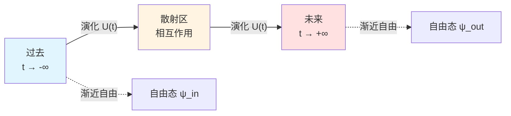
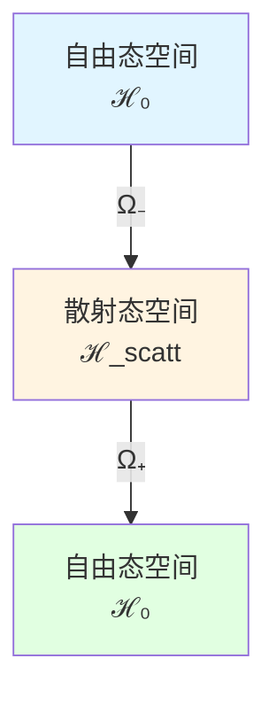

# 散射理论：S-矩阵的数学基础

> *"自然界不在意中间过程，只在意渐近态。"* — Werner Heisenberg

## 🎯 本文目标

在核心思想篇，我们已经直观理解了散射理论。本文将深入其**数学基础**：

- S-矩阵的严格定义
- 渐近完备性
- Wigner-Smith矩阵的推导
- Møller波算符
- LSZ约化公式

## 📐 散射问题的数学设定

### Hilbert空间分解

考虑哈密顿量：

$$
H = H_0 + V
$$

其中：
- $H_0$：自由哈密顿（已知本征态）
- $V$：相互作用势（散射势）

定义三个Hilbert空间：

1. **$\mathcal{H}$**：完整系统的Hilbert空间
2. **$\mathcal{H}_{\text{in}}$**：过去渐近态空间
3. **$\mathcal{H}_{\text{out}}$**：未来渐近态空间

### 渐近条件

**假设**：当 $|t| \to \infty$ 时，相互作用 $V$ 变得可忽略。

数学上，存在**极限**：

$$
\lim_{t \to \pm\infty} \|U(t) \psi - U_0(t) \phi_\pm\| = 0
$$

对某些自由态 $\phi_\pm$。

## 🌊 Møller波算符

### 定义

**Møller波算符**定义渐近态之间的映射：

$$
\Omega_\pm = \lim_{t \to \mp\infty} U^\dagger(t) U_0(t)
$$

或等价地：

$$
\Omega_\pm = s\text{-}\lim_{t \to \mp\infty} e^{iHt} e^{-iH_0 t}
$$

（$s$-lim 表示强极限）

**物理意义**：

- $\Omega_-$：将自由态映射到散射态（$t \to -\infty$）
- $\Omega_+$：将散射态映射到自由态（$t \to +\infty$）

### 性质

1. **部分等距**：$\Omega_\pm^\dagger \Omega_\pm = \mathbb{I}$（在适当的子空间上）
2. **交织性**：$H \Omega_\pm = \Omega_\pm H_0$
3. **完备性**（渐近完备性假设）：$\Omega_\pm \Omega_\pm^\dagger = P_{\text{sc}}$（投影到散射态）

## ⚡ S-矩阵的定义

### 通过波算符定义

**S-矩阵**（散射矩阵）定义为：

$$
\boxed{S = \Omega_+^\dagger \Omega_-}
$$

**物理意义**：

S-矩阵连接过去和未来的渐近自由态：

$$
|\text{out}\rangle = S |\text{in}\rangle
$$

### 通过时间演化定义

等价地，可以写成：

$$
S = \lim_{t_+ \to +\infty, t_- \to -\infty} U_0^\dagger(t_+) U(t_+, t_-) U_0(t_-)
$$

### S-矩阵的性质

1. **幺正性**：
   $$S^\dagger S = S S^\dagger = \mathbb{I}$$
   （概率守恒）

2. **因果性**：
   $S$ 只连接过去与未来，不破坏因果

3. **能量守恒**：
   $$[S, H_0] = 0$$

4. **洛伦兹协变**：
   在相对论情形，$S$ 是Lorentz标量

## 📊 能量表示中的S-矩阵

### Fourier变换

在能量表示中，$S$ 依赖能量 $\omega$：

$$
S(\omega) = \mathbb{I} - 2\pi i \delta(\omega - H_0) T(\omega)
$$

其中 $T(\omega)$ 是**T-矩阵**（跃迁矩阵）。

### 光学定理

**光学定理**（幺正性的结果）：

$$
\text{Im}\, T_{ii}(\omega) = \pi \sum_f |T_{fi}(\omega)|^2
$$

**物理意义**：

总散射截面（虚部）= 所有出射道的和（概率守恒）

## 🕰️ Wigner-Smith时间延迟矩阵

### 推导

考虑波包在散射区的平均驻留时间。

定义**Wigner-Smith矩阵**：

$$
\boxed{Q(\omega) = -i S(\omega)^\dagger \frac{\partial S(\omega)}{\partial \omega}}
$$

### 物理解释

**定理**（Wigner 1955, Smith 1960）：

$Q(\omega)$ 的本征值 $\tau_n(\omega)$ 是第 $n$ 个通道的时间延迟。

总时间延迟：

$$
\tau_W(\omega) = \text{tr}\, Q(\omega)
$$

### Eisenbud-Wigner公式

对单通道散射 $S(\omega) = e^{2i\delta(\omega)}$：

$$
\tau_W(\omega) = \frac{\partial \delta(\omega)}{\partial \omega}
$$

（相移对能量的导数）

### 与Birman-Kreĭn的联系

结合Birman-Kreĭn公式：

$$
\det S(\omega) = e^{-2\pi i \xi(\omega)}
$$

得到：

$$
\frac{1}{2\pi} \text{tr}\, Q(\omega) = -\,\xi'(\omega) = \rho_{\text{rel}}(\omega)
$$

**这是统一时间刻度的数学基础！**

## 🔬 LSZ约化公式

### 场论中的散射

在量子场论中，LSZ（Lehmann-Symanzik-Zimmermann）约化公式给出：

$$
\langle f | S | i \rangle = \text{i}^{n+m} \int \prod_k \frac{d^4 x_k}{\sqrt{Z}} e^{-ip_k \cdot x_k} (\square_k + m^2) \langle \Omega | T\{\phi(x_1)\cdots\phi(x_{n+m})\} | \Omega \rangle
$$

**物理意义**：

S-矩阵元 = 渐近粒子腿的截肢 × 时间有序关联函数

### Feynman规则

LSZ公式是推导Feynman规则的基础：

1. 外线：平面波因子 $e^{ip \cdot x}$
2. 内线：传播子 $\Delta_F(x-y)$
3. 顶点：相互作用 $-i\lambda$
4. 积分：$\int d^4 x$

## 🌐 多通道散射

### 通道分解

对 $N$ 个通道，$S(\omega)$ 是 $N \times N$ 幺正矩阵：

$$
S(\omega) = \begin{pmatrix}
S_{11} & S_{12} & \cdots & S_{1N} \\
S_{21} & S_{22} & \cdots & S_{2N} \\
\vdots & \vdots & \ddots & \vdots \\
S_{N1} & S_{N2} & \cdots & S_{NN}
\end{pmatrix}
$$

### Wigner-Smith矩阵的谱

$Q(\omega)$ 是 $N \times N$ Hermitian矩阵，有 $N$ 个实本征值：

$$
\tau_1(\omega), \tau_2(\omega), \ldots, \tau_N(\omega)
$$

这些是 $N$ 个正交通道的时间延迟。

## 🔗 在GLS理论中的应用

### 1. 本体论基础

在GLS的矩阵宇宙理论中：

**宇宙被建模为巨大的S-矩阵族 $\mathbb{S}(\omega)$**

所有物理被认为从S-矩阵数据涌现。

### 2. 时间刻度

统一时间刻度由 $Q(\omega)$ 定义：

$$
\tau(\omega) = \frac{1}{2\pi} \text{tr}\, Q(\omega)
$$

### 3. 因果结构

S-矩阵的因果性被认为保证时间箭头与因果箭头一致。

## 📝 关键公式总结

| 公式 | 名称 | 意义 |
|-----|------|------|
| $S = \Omega_+^\dagger \Omega_-$ | S-矩阵定义 | 波算符的组合 |
| $S^\dagger S = \mathbb{I}$ | 幺正性 | 概率守恒 |
| $Q = -iS^\dagger \partial_\omega S$ | Wigner-Smith矩阵 | 时间延迟 |
| $\tau_W = \text{tr}\, Q$ | 总延迟 | 所有通道之和 |
| $\frac{1}{2\pi}\text{tr}\,Q = \xi' = \rho_{\text{rel}}$ | 时间刻度同一式 | 谱-散射-态密度统一 |

## 🎓 深入阅读

- 经典教材：J.R. Taylor, *Scattering Theory* (Wiley, 1972)
- 原始论文：E.P. Wigner, "Lower limit for the energy derivative of the scattering phase shift" (Phys. Rev. 98, 145, 1955)
- GLS应用：[04-scattering-is-evolution.md](../02-core-ideas/04-scattering-is-evolution.md)
- 下一篇：[04-modular-theory.md](04-modular-theory.md) - 模块理论

## 🤔 练习题

1. **概念理解**：
   - Møller波算符为什么需要取强极限？
   - S-矩阵的幺正性如何保证概率守恒？
   - 时间延迟为什么是相移的导数？

2. **计算练习**：
   - 对 $S = e^{2i\delta}$，计算 $Q$
   - 验证 $S^\dagger S = \mathbb{I}$ 对 $2\times 2$ 幺正矩阵
   - 证明光学定理

3. **物理应用**：
   - Shapiro引力时间延迟的散射解释
   - 共振散射中的时间延迟
   - Levinson定理与束缚态数目

4. **进阶思考**：
   - 如何处理长程势（Coulomb势）的散射？
   - 相对论散射理论有何不同？
   - S-矩阵能否有复本征值？

---

**下一步**：掌握了散射理论后，我们将学习**模块理论**——量子态如何定义自己的"时间流"！
