# Scattering Theory: Mathematical Foundation of S-Matrix

> *"Nature doesn't care about intermediate processes, only asymptotic states."* — Werner Heisenberg

## 🎯 Goals of This Article

In the core ideas section, we intuitively understood scattering theory. This article will delve into its **mathematical foundation**:

- Rigorous definition of S-matrix
- Asymptotic completeness
- Derivation of Wigner-Smith matrix
- Møller wave operators
- LSZ reduction formula

## 📐 Mathematical Setup of Scattering Problem

### Hilbert Space Decomposition

Consider Hamiltonian:

$$
H = H_0 + V
$$

where:
- $H_0$: Free Hamiltonian (known eigenstates)
- $V$: Interaction potential (scattering potential)

Define three Hilbert spaces:

1. **$\mathcal{H}$**: Hilbert space of complete system
2. **$\mathcal{H}_{\text{in}}$**: Past asymptotic state space
3. **$\mathcal{H}_{\text{out}}$**: Future asymptotic state space

```mermaid
graph LR
    I["Past<br/>t → -∞"] --> |"Evolution U(t)"| M["Scattering Region<br/>Interaction"]
    M --> |"Evolution U(t)"| O["Future<br/>t → +∞"]

    I -.-> |"Asymptotically Free"| F1["Free State ψ_in"]
    O -.-> |"Asymptotically Free"| F2["Free State ψ_out"]

    style I fill:#e1f5ff
    style M fill:#fff4e1
    style O fill:#ffe1e1
```

### Asymptotic Conditions

**Assumption**: When $|t| \to \infty$, interaction $V$ becomes negligible.

Mathematically, there exists a **limit**:

$$
\lim_{t \to \pm\infty} \|U(t) \psi - U_0(t) \phi_\pm\| = 0
$$

for some free states $\phi_\pm$.

## 🌊 Møller Wave Operators

### Definition

**Møller wave operators** define mapping between asymptotic states:

$$
\Omega_\pm = \lim_{t \to \mp\infty} U^\dagger(t) U_0(t)
$$

Or equivalently:

$$
\Omega_\pm = s\text{-}\lim_{t \to \mp\infty} e^{iHt} e^{-iH_0 t}
$$

($s$-lim denotes strong limit)

**Physical meaning**:

- $\Omega_-$: Maps free states to scattering states ($t \to -\infty$)
- $\Omega_+$: Maps scattering states to free states ($t \to +\infty$)

```mermaid
graph TB
    F["Free State Space<br/>ℋ₀"] --> |"Ω₋"| S["Scattering State Space<br/>ℋ_scatt"]
    S --> |"Ω₊"| F2["Free State Space<br/>ℋ₀"]

    style F fill:#e1f5ff
    style S fill:#fff4e1
    style F2 fill:#e1ffe1
```

### Properties

1. **Partial isometry**: $\Omega_\pm^\dagger \Omega_\pm = \mathbb{I}$ (on appropriate subspace)
2. **Intertwining**: $H \Omega_\pm = \Omega_\pm H_0$
3. **Completeness** (asymptotic completeness assumption): $\Omega_\pm \Omega_\pm^\dagger = P_{\text{sc}}$ (projection onto scattering states)

## ⚡ Definition of S-Matrix

### Defined via Wave Operators

**S-matrix** (scattering matrix) is defined as:

$$
\boxed{S = \Omega_+^\dagger \Omega_-}
$$

**Physical meaning**:

S-matrix connects past and future asymptotic free states:

$$
|\text{out}\rangle = S |\text{in}\rangle
$$

### Defined via Time Evolution

Equivalently, can be written as:

$$
S = \lim_{t_+ \to +\infty, t_- \to -\infty} U_0^\dagger(t_+) U(t_+, t_-) U_0(t_-)
$$

### Properties of S-Matrix

1. **Unitarity**:
   $$S^\dagger S = S S^\dagger = \mathbb{I}$$
   (Probability conservation)

2. **Causality**:
   $S$ only connects past with future, doesn't violate causality

3. **Energy conservation**:
   $$[S, H_0] = 0$$

4. **Lorentz covariance**:
   In relativistic case, $S$ is Lorentz scalar

## 📊 S-Matrix in Energy Representation

### Fourier Transform

In energy representation, $S$ depends on energy $\omega$:

$$
S(\omega) = \mathbb{I} - 2\pi i \delta(\omega - H_0) T(\omega)
$$

where $T(\omega)$ is **T-matrix** (transition matrix).

### Optical Theorem

**Optical theorem** (consequence of unitarity):

$$
\text{Im}\, T_{ii}(\omega) = \pi \sum_f |T_{fi}(\omega)|^2
$$

**Physical meaning**:

Total scattering cross-section (imaginary part) = Sum of all outgoing channels (probability conservation)

## 🕰️ Wigner-Smith Time Delay Matrix

### Derivation

Consider average residence time of wave packet in scattering region.

Define **Wigner-Smith matrix**:

$$
\boxed{Q(\omega) = -i S(\omega)^\dagger \frac{\partial S(\omega)}{\partial \omega}}
$$

### Physical Interpretation

**Theorem** (Wigner 1955, Smith 1960):

Eigenvalues $\tau_n(\omega)$ of $Q(\omega)$ are time delays of $n$-th channel.

Total time delay:

$$
\tau_W(\omega) = \text{tr}\, Q(\omega)
$$

### Eisenbud-Wigner Formula

For single-channel scattering $S(\omega) = e^{2i\delta(\omega)}$:

$$
\tau_W(\omega) = \frac{\partial \delta(\omega)}{\partial \omega}
$$

(Derivative of phase shift w.r.t. energy)

### Connection to Birman-Kreĭn

Combining with Birman-Kreĭn formula:

$$
\det S(\omega) = e^{-2\pi i \xi(\omega)}
$$

We get:

$$
\frac{1}{2\pi} \text{tr}\, Q(\omega) = -\,\xi'(\omega) = \rho_{\text{rel}}(\omega)
$$

**This is the mathematical foundation of unified time scale!**

## 🔬 LSZ Reduction Formula

### Scattering in Field Theory

In quantum field theory, LSZ (Lehmann-Symanzik-Zimmermann) reduction formula gives:

$$
\langle f | S | i \rangle = \text{i}^{n+m} \int \prod_k \frac{d^4 x_k}{\sqrt{Z}} e^{-ip_k \cdot x_k} (\square_k + m^2) \langle \Omega | T\{\phi(x_1)\cdots\phi(x_{n+m})\} | \Omega \rangle
$$

**Physical meaning**:

S-matrix element = Amputated asymptotic particle legs × Time-ordered correlation function

### Feynman Rules

LSZ formula is the foundation for deriving Feynman rules:

1. External lines: Plane wave factor $e^{ip \cdot x}$
2. Internal lines: Propagator $\Delta_F(x-y)$
3. Vertices: Interaction $-i\lambda$
4. Integration: $\int d^4 x$

## 🌐 Multi-Channel Scattering

### Channel Decomposition

For $N$ channels, $S(\omega)$ is $N \times N$ unitary matrix:

$$
S(\omega) = \begin{pmatrix}
S_{11} & S_{12} & \cdots & S_{1N} \\
S_{21} & S_{22} & \cdots & S_{2N} \\
\vdots & \vdots & \ddots & \vdots \\
S_{N1} & S_{N2} & \cdots & S_{NN}
\end{pmatrix}
$$

### Spectrum of Wigner-Smith Matrix

$Q(\omega)$ is $N \times N$ Hermitian matrix with $N$ real eigenvalues:

$$
\tau_1(\omega), \tau_2(\omega), \ldots, \tau_N(\omega)
$$

These are time delays of $N$ orthogonal channels.

## 🔗 Applications in GLS Theory

### 1. Ontological Foundation

In GLS's matrix universe theory:

**Universe = Huge family of S-matrices $\mathbb{S}(\omega)$**

All physics emerges from S-matrix data.

### 2. Time Scale

Unified time scale is defined by $Q(\omega)$:

$$
\tau(\omega) = \frac{1}{2\pi} \text{tr}\, Q(\omega)
$$

### 3. Causal Structure

Causality of S-matrix ensures time arrow is consistent with causal arrow.

## 📝 Key Formulas Summary

| Formula | Name | Meaning |
|---------|------|---------|
| $S = \Omega_+^\dagger \Omega_-$ | S-Matrix Definition | Combination of wave operators |
| $S^\dagger S = \mathbb{I}$ | Unitarity | Probability conservation |
| $Q = -iS^\dagger \partial_\omega S$ | Wigner-Smith Matrix | Time delay |
| $\tau_W = \text{tr}\, Q$ | Total Delay | Sum of all channels |
| $\frac{1}{2\pi}\text{tr}\,Q = \xi' = \rho_{\text{rel}}$ | Time Scale Identity | Unification of spectrum-scattering-density of states |

## 🎓 Further Reading

- Classic textbook: J.R. Taylor, *Scattering Theory* (Wiley, 1972)
- Original paper: E.P. Wigner, "Lower limit for the energy derivative of the scattering phase shift" (Phys. Rev. 98, 145, 1955)
- GLS application: [04-scattering-is-evolution_en.md](../02-core-ideas/04-scattering-is-evolution_en.md)
- Next: [04-modular-theory_en.md](04-modular-theory_en.md) - Modular Theory

## 🤔 Exercises

1. **Conceptual Understanding**:
   - Why do Møller wave operators need strong limit?
   - How does unitarity of S-matrix guarantee probability conservation?
   - Why is time delay the derivative of phase shift?

2. **Calculation Exercises**:
   - For $S = e^{2i\delta}$, calculate $Q$
   - Verify $S^\dagger S = \mathbb{I}$ for $2\times 2$ unitary matrix
   - Prove optical theorem

3. **Physical Applications**:
   - Scattering interpretation of Shapiro gravitational time delay
   - Time delay in resonant scattering
   - Levinson's theorem and number of bound states

4. **Advanced Thinking**:
   - How to handle scattering of long-range potential (Coulomb potential)?
   - What's different in relativistic scattering theory?
   - Can S-matrix have complex eigenvalues?

---

**Next Step**: After mastering scattering theory, we will learn **Modular Theory**—how quantum states define their own "time flow"!

