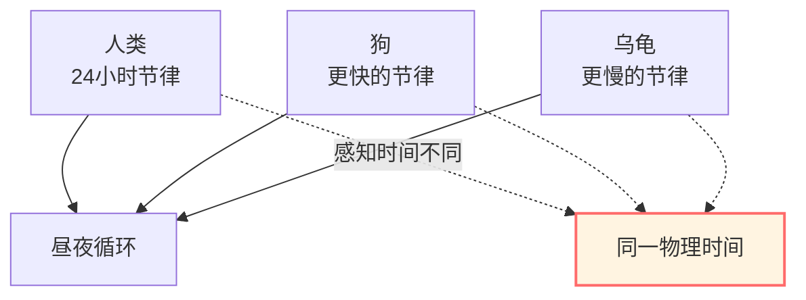
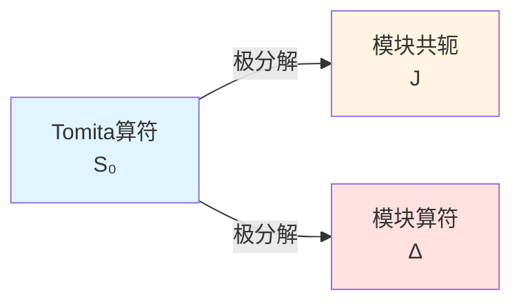
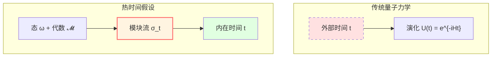

# 模块理论：态决定的"时间流"

> *"时间不是预先给定的，而是从态中涌现的。"* — Connes & Rovelli

## 🎯 核心思想

在前面的章节中，我们总是假设"时间"是预先给定的外部参数。

**模块理论**（Modular Theory）揭示了一个惊人的事实：

**给定一个量子态和可观测代数，它们天然地定义了一个"时间流"——模块流！**

这就是**热时间假设**（Thermal Time Hypothesis）的数学基础。

## 🕰️ 生物钟的比喻

想象不同的生物有不同的"生物钟"：

**模块理论说**：

每个量子态 $\omega$ 都有自己的"生物钟" $\sigma_t^\omega$——**模块流**。

不同的态有不同的时间流！

## 📐 Tomita-Takesaki理论

### 基本设定

给定：
1. **von Neumann代数** $\mathcal{M}$（可观测量代数）
2. **循环分离向量** $\Omega$（量子态）

**定义**（反线性算符）：

$$
S_0: A\Omega \mapsto A^\dagger \Omega, \quad A \in \mathcal{M}
$$

### 极分解

$S_0$ 不是有界算符，但可以极分解：

$$
S_0 = J \Delta^{1/2}
$$

其中：
- $J$：**模块共轭**（反酉算符）
- $\Delta$：**模块算符**（正算符）

### 模块流

**定义**（模块自同构群）：

$$
\boxed{\sigma_t(A) = \Delta^{it} A \Delta^{-it}}
$$

这是一个一参数自同构群：
- $\sigma_0 = \text{id}$（恒等）
- $\sigma_s \circ \sigma_t = \sigma_{s+t}$（群性质）
- $\sigma_t(\mathcal{M}) = \mathcal{M}$（保持代数）

**物理意义**：

**$t$ 就是这个态 $\Omega$ 的"固有时间"！**

## 🔥 KMS条件：热平衡的特征

### 定义

态 $\omega$ 在温度 $T = 1/\beta$ 下处于**热平衡**，如果满足**KMS条件**：

对所有 $A, B \in \mathcal{M}$，存在解析函数 $F_{AB}(z)$ 使得：

$$
F_{AB}(t) = \omega(A \sigma_t(B)), \quad F_{AB}(t + i\beta) = \omega(\sigma_t(B) A)
$$

**物理意义**：

KMS条件是量子版本的**热力学平衡条件**！

### Gibbs态

对哈密顿量 $H$，Gibbs态：

$$
\omega_\beta(A) = \frac{\text{tr}(e^{-\beta H} A)}{\text{tr}(e^{-\beta H})}
$$

满足KMS条件，其模块流是：

$$
\sigma_t(A) = e^{iHt} A e^{-iHt}
$$

（就是Heisenberg演化！）

## ⏰ 热时间假设

### Connes-Rovelli提议

**热时间假设**（1994）：

> 在一般协变的量子理论中，物理时间应该由态和代数共同决定，即**时间 = 模块流参数**。

数学上：

$$
\frac{d}{dt} A = \{H, A\} \quad \Leftrightarrow \quad A(t) = \sigma_t(A) = \Delta^{it} A \Delta^{-it}
$$

### 为什么合理？

1. **内在性**：时间不依赖外部参考系
2. **热力学**：与热平衡自然融合
3. **量子引力**：没有外部时间的理论需要这样的机制

## 🌊 边界上的模块时间

### GLS中的应用

在GLS理论中，边界代数 $\mathcal{A}_\partial$ 配上态 $\omega$ 给出模块流 $\sigma_t^\omega$。

**关键定理**：

在适当条件下，模块时间与散射时间、几何时间等价：

$$
\tau_{\text{mod}} = a \tau_{\text{scatt}} + b = c \tau_{\text{geom}} + d
$$

### Bisognano-Wichmann定理

对Minkowski空间的Rindler楔 $W$：

**定理**（1975）：

$\mathcal{A}(W)$ 在真空态下的模块流是沿楔保持的Lorentz boost。

**物理意义**：

**Rindler观察者的固有时间 = 模块时间！**

这是热时间假设的第一个非平凡验证。

## 📊 相对模块理论

### 两个态的相对熵

给定两个态 $\omega$ 和 $\phi$，定义**相对熵**：

$$
S(\omega || \phi) = -\text{tr}(\rho_\omega \ln \rho_\phi) + \text{tr}(\rho_\omega \ln \rho_\omega)
$$

如果 $\phi$ 是KMS态，则：

$$
S(\omega || \phi) = \beta(\langle H \rangle_\omega - F_\phi)
$$

其中 $F_\phi$ 是自由能。

### 相对模块算符

定义相对模块算符：

$$
\Delta_{\omega, \phi} = \frac{d\omega}{d\phi}
$$

（Radon-Nikodym导数）

相对模块流：

$$
\sigma_t^{\omega, \phi}(A) = \Delta_{\omega, \phi}^{it} A \Delta_{\omega, \phi}^{-it}
$$

## 🔗 在GLS理论中的应用

### 1. 时间刻度等价

模块时间 $\tau_{\text{mod}}$ 是统一时间刻度等价类 $[\tau]$ 的一员：

$$
\kappa(\omega) = \frac{\varphi'(\omega)}{\pi} = \rho_{\text{rel}}(\omega) = \frac{1}{2\pi}\text{tr}\,Q(\omega) \sim \tau_{\text{mod}}
$$

### 2. IGVP的二阶条件

在IGVP框架中，相对熵的非负性：

$$
\delta^2 S_{\text{rel}} \ge 0
$$

与模块理论的稳定性条件一致。

### 3. 边界代数的演化

边界代数 $\mathcal{A}_\partial$ 的演化由模块流定义：

$$
A(t) = \sigma_t(A) = \Delta^{it} A \Delta^{-it}
$$

不需要外部时间！

## 📝 关键概念总结

| 概念 | 定义/公式 | 意义 |
|-----|---------|------|
| Tomita算符 | $S_0: A\Omega \mapsto A^\dagger\Omega$ | 反线性算符 |
| 模块算符 | $\Delta$ | 极分解中的正算符 |
| 模块流 | $\sigma_t(A) = \Delta^{it} A \Delta^{-it}$ | 态决定的时间演化 |
| KMS条件 | $F(t+i\beta) = \omega(\sigma_t(B)A)$ | 热平衡特征 |
| 热时间假设 | 时间 = 模块流参数 | Connes-Rovelli提议 |
| 相对熵 | $S(\omega||\phi) = -\text{tr}(\rho_\omega \ln \rho_\phi) + \text{tr}(\rho_\omega \ln \rho_\omega)$ | 态之间的"距离" |

## 🎓 深入阅读

- 经典教材：M. Takesaki, *Theory of Operator Algebras* (Springer)
- 原始论文：A. Connes, C. Rovelli, "Von Neumann algebra automorphisms and time-thermodynamics relation" (Class. Quant. Grav. 11, 2899, 1994)
- GLS应用：boundary-time-geometry-unified-framework.md
- 下一篇：[05-information-geometry.md](05-information-geometry.md) - 信息几何

## 🤔 练习题

1. **概念理解**：
   - 为什么模块流是"时间"？
   - KMS条件与Gibbs分布有什么关系？
   - 热时间假设如何解决量子引力中的时间问题？

2. **计算练习**：
   - 验证 $\sigma_s \circ \sigma_t = \sigma_{s+t}$
   - 对简单算符 $A = \begin{pmatrix} 1 & 0 \\ 0 & -1 \end{pmatrix}$，计算 $\sigma_t(A)$
   - 计算两态的相对熵（有限维情形）

3. **物理应用**：
   - Unruh效应与模块流有什么关系？
   - Hawking辐射能否用模块理论理解？
   - Rindler时空的模块流是什么？

4. **进阶思考**：
   - 如果态非KMS，模块流还是"物理时间"吗？
   - 相对模块理论能否推广到场论？
   - 模块理论与量子信息有什么联系？

---

**下一步**：理解了模块理论后，我们将学习**信息几何**——概率分布的几何结构，这是IGVP的数学基础！

