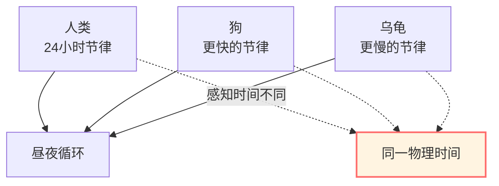
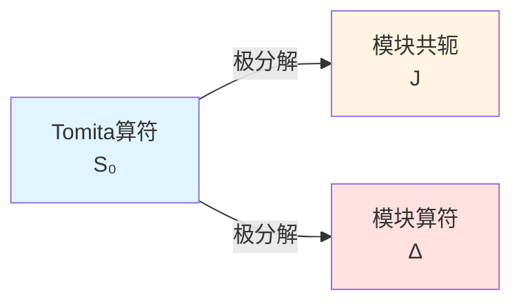

# 模块理论：态决定的"时间流"

> *"时间不是预先给定的，而是从态中涌现的。"* — Connes & Rovelli

## 🎯 核心思想

## 🎯 核心思想

在前面的章节中，我们通常将"时间"视为预先给定的外部参数。

**模块理论**（Modular Theory）提供了一个独特的视角：

**给定一个量子态和可观测代数，在特定条件下，它们自然地诱导出一个单参数自同构群——模块流！**

这构成了**热时间假设**（Thermal Time Hypothesis）的数学基础，该假设提议将物理时间等同于模块流参数。

## 🕰️ 生物钟的比喻

想象不同的生物有不同的"生物钟"：

**模块理论的物理诠释**：

每个量子态 $\omega$ 都定义了一个特定的"演化流" $\sigma_t^\omega$——**模块流**。

在热时间假设下，不同的态对应着不同的"时间流"。

## 📐 Tomita-Takesaki理论

### 基本设定

给定：
1. **von Neumann代数** $\mathcal{M}$（可观测量代数）
2. **循环分离向量** $\Omega$（表示一个忠实正规态）

**定义**（反线性算符）：

$$
S_0: A\Omega \mapsto A^\dagger \Omega, \quad A \in \mathcal{M}
$$

### 极分解

$S_0$ 通常是无界算符，但可以进行极分解：

$$
S_0 = J \Delta^{1/2}
$$

其中：
- $J$：**模块共轭**（反酉算符）
- $\Delta$：**模块算符**（正自伴算符）

### 模块流

**定义**（模块自同构群）：

$$
\boxed{\sigma_t(A) = \Delta^{it} A \Delta^{-it}}
$$

这是一个强连续的一参数自同构群：
- $\sigma_0 = \text{id}$（恒等）
- $\sigma_s \circ \sigma_t = \sigma_{s+t}$（群性质）
- $\sigma_t(\mathcal{M}) = \mathcal{M}$（保持代数结构）

**物理诠释**：

在Connes-Rovelli的框架下，参数 $t$ 被**解释**为与态 $\Omega$ 相关的"固有时间"。

## 🔥 KMS条件：热平衡的特征

### 定义

态 $\omega$ 在逆温度 $\beta$ 下相对于演化 $\sigma_t$ 满足**KMS条件**（Kubo-Martin-Schwinger条件），如果：

对所有 $A, B \in \mathcal{M}$，存在带状区域内的解析函数 $F_{AB}(z)$ 使得：

$$
F_{AB}(t) = \omega(A \sigma_t(B)), \quad F_{AB}(t + i\beta) = \omega(\sigma_t(B) A)
$$

### 物理意义

KMS条件在数学上严格刻画了量子统计力学中的**热力学平衡态**。

### Gibbs态

对于有限系统及哈密顿量 $H$，Gibbs态：

$$
\omega_\beta(A) = \frac{\text{tr}(e^{-\beta H} A)}{\text{tr}(e^{-\beta H})}
$$

满足相对于演化 $\sigma_t(A) = e^{iHt} A e^{-iHt}$ 的KMS条件（$\beta$为逆温度）。

这里，模块流 $\sigma_t$ 恰好重现了Heisenberg演化。

## ⏰ 热时间假设

### Connes-Rovelli提议

**热时间假设**（1994）提出：

> 在一般协变的量子理论中，如果缺乏外部时间定义，物理时间可能由系统的统计状态决定，即**时间流被识别为模块流**。

数学表述：

$$
\frac{d}{dt} A = \{H, A\} \quad \Leftrightarrow \quad A(t) = \sigma_t(A) = \Delta^{it} A \Delta^{-it}
$$

### 理论动机

1. **内在性**：提供了一种不依赖背景度规的时间定义。
2. **热力学联系**：将时间演化与热平衡条件自然联系起来。
3. **量子引力**：为背景无关理论中的"时间问题"提供了可能的解决方案。

## 🌊 边界上的模块时间

### GLS理论中的应用模型

在GLS理论框架中，我们**模型化**边界代数 $\mathcal{A}_\partial$ 上的态 $\omega$ 诱导出的模块流 $\sigma_t^\omega$ 为边界演化。

**核心猜想**：

在特定极限下，模块时间参数 $\tau_{\text{mod}}$ 与散射过程中的时间参数 $\tau_{\text{scatt}}$ 及几何时间 $\tau_{\text{geom}}$ 存在线性关系：

$$
\tau_{\text{mod}} \sim c \tau_{\text{geom}}
$$

### Bisognano-Wichmann定理

作为理论支持，Bisognano-Wichmann定理（1975）指出：

对于Minkowski空间中的Rindler楔 $W$：

$\mathcal{A}(W)$ 在真空态下的模块流几何上对应于保持楔不变的Lorentz boost。

**物理对应**：

**Rindler观察者的固有时间** 在数学形式上与 **模块流参数** 一致。

这被视为热时间假设在平直时空中的一个重要验证。

## 📊 相对模块理论

### 两个态的相对熵

给定两个态 $\omega$ 和 $\phi$，Araki定义的**相对熵**推广了经典概念：

$$
S(\omega || \phi) = -\text{tr}(\rho_\omega \ln \rho_\phi) + \text{tr}(\rho_\omega \ln \rho_\omega)
$$

如果 $\phi$ 是KMS态，则相对熵与自由能差有关：

$$
S(\omega || \phi) = \beta(\langle H \rangle_\omega - F_\phi)
$$

### 相对模块算符

定义相对模块算符 $\Delta_{\omega, \phi}$，其生成的相对模块流为：

$$
\sigma_t^{\omega, \phi}(A) = \Delta_{\omega, \phi}^{it} A \Delta_{\omega, \phi}^{-it}
$$

## 🔗 在GLS理论中的潜在联系

### 1. 时间刻度等价性

GLS理论**提议**模块时间 $\tau_{\text{mod}}$ 属于统一时间刻度等价类 $[\tau]$：

$$
\kappa(\omega) \sim \tau_{\text{mod}}
$$

### 2. 稳定性条件

在IGVP框架中，相对熵的非负性 $\delta^2 S_{\text{rel}} \ge 0$ 被解释为与模块动力学的稳定性条件相容。

### 3. 边界动力学

边界代数 $\mathcal{A}_\partial$ 的演化**可以被描述为**由模块流驱动：

$$
A(t) = \sigma_t(A)
$$

这提供了一种无需引入外部时间参数的动力学描述方式。

## 📝 关键概念总结

| 概念 | 定义/公式 | 意义 |
|-----|---------|------|
| Tomita算符 | $S_0: A\Omega \mapsto A^\dagger\Omega$ | 反线性算符 |
| 模块算符 | $\Delta$ | 极分解中的正算符 |
| 模块流 | $\sigma_t(A) = \Delta^{it} A \Delta^{-it}$ | 态决定的时间演化 |
| KMS条件 | $F(t+i\beta) = \omega(\sigma_t(B)A)$ | 热平衡特征 |
| 热时间假设 | 时间 = 模块流参数 | Connes-Rovelli提议 |
| 相对熵 | $S(\omega||\phi) = -\text{tr}(\rho_\omega \ln \rho_\phi) + \text{tr}(\rho_\omega \ln \rho_\omega)$ | 态之间的"距离" |

## 🎓 深入阅读

- 经典教材：M. Takesaki, *Theory of Operator Algebras* (Springer)
- 原始论文：A. Connes, C. Rovelli, "Von Neumann algebra automorphisms and time-thermodynamics relation" (Class. Quant. Grav. 11, 2899, 1994)
- GLS应用：boundary-time-geometry-unified-framework.md
- 下一篇：[05-information-geometry.md](05-information-geometry.md) - 信息几何

## 🤔 练习题

1. **概念理解**：
   - 为什么模块流是"时间"？
   - KMS条件与Gibbs分布有什么关系？
   - 热时间假设如何解决量子引力中的时间问题？

2. **计算练习**：
   - 验证 $\sigma_s \circ \sigma_t = \sigma_{s+t}$
   - 对简单算符 $A = \begin{pmatrix} 1 & 0 \\ 0 & -1 \end{pmatrix}$，计算 $\sigma_t(A)$
   - 计算两态的相对熵（有限维情形）

3. **物理应用**：
   - Unruh效应与模块流有什么关系？
   - Hawking辐射能否用模块理论理解？
   - Rindler时空的模块流是什么？

4. **进阶思考**：
   - 如果态非KMS，模块流还是"物理时间"吗？
   - 相对模块理论能否推广到场论？
   - 模块理论与量子信息有什么联系？

---

**下一步**：理解了模块理论后，我们将学习**信息几何**——概率分布的几何结构，这是IGVP的数学基础！

