# Modular Theory: "Time Flow" Determined by State

> *"Time is not pre-given, but emerges from state."* — Connes & Rovelli

## 🎯 Core Idea

In previous chapters, we always assumed "time" is a pre-given external parameter.

**Modular Theory** reveals an amazing fact:

**Given a quantum state and observable algebra, they naturally define a "time flow"—modular flow!**

This is the mathematical foundation of the **Thermal Time Hypothesis**.

## 🕰️ Analogy of Biological Clocks

Imagine different organisms have different "biological clocks":

**Modular theory says**:

Each quantum state $\omega$ has its own "biological clock" $\sigma_t^\omega$—**modular flow**.

Different states have different time flows!

## 📐 Tomita-Takesaki Theory

### Basic Setup

Given:
1. **von Neumann algebra** $\mathcal{M}$ (observable algebra)
2. **Cyclic separating vector** $\Omega$ (quantum state)

**Definition** (antilinear operator):

$$
S_0: A\Omega \mapsto A^\dagger \Omega, \quad A \in \mathcal{M}
$$

### Polar Decomposition

$S_0$ is not bounded, but can be polar decomposed:

$$
S_0 = J \Delta^{1/2}
$$

where:
- $J$: **Modular conjugation** (antiunitary operator)
- $\Delta$: **Modular operator** (positive operator)

### Modular Flow

**Definition** (modular automorphism group):

$$
\boxed{\sigma_t(A) = \Delta^{it} A \Delta^{-it}}
$$

This is a one-parameter automorphism group:
- $\sigma_0 = \text{id}$ (identity)
- $\sigma_s \circ \sigma_t = \sigma_{s+t}$ (group property)
- $\sigma_t(\mathcal{M}) = \mathcal{M}$ (preserves algebra)

**Physical meaning**:

**$t$ is the "intrinsic time" of this state $\Omega$!**

## 🔥 KMS Condition: Characteristic of Thermal Equilibrium

### Definition

State $\omega$ is in **thermal equilibrium** at temperature $T = 1/\beta$ if it satisfies **KMS condition**:

For all $A, B \in \mathcal{M}$, there exists analytic function $F_{AB}(z)$ such that:

$$
F_{AB}(t) = \omega(A \sigma_t(B)), \quad F_{AB}(t + i\beta) = \omega(\sigma_t(B) A)
$$

**Physical meaning**:

KMS condition is the quantum version of **thermodynamic equilibrium condition**!

### Gibbs State

For Hamiltonian $H$, Gibbs state:

$$
\omega_\beta(A) = \frac{\text{tr}(e^{-\beta H} A)}{\text{tr}(e^{-\beta H})}
$$

satisfies KMS condition, and its modular flow is:

$$
\sigma_t(A) = e^{iHt} A e^{-iHt}
$$

(This is Heisenberg evolution!)

## ⏰ Thermal Time Hypothesis

### Connes-Rovelli Proposal

**Thermal Time Hypothesis** (1994):

> In generally covariant quantum theories, physical time should be determined jointly by state and algebra, i.e., **time = modular flow parameter**.

Mathematically:

$$
\frac{d}{dt} A = \{H, A\} \quad \Leftrightarrow \quad A(t) = \sigma_t(A) = \Delta^{it} A \Delta^{-it}
$$

### Why Reasonable?

1. **Intrinsic**: Time doesn't depend on external reference frame
2. **Thermodynamics**: Naturally integrates with thermal equilibrium
3. **Quantum gravity**: Theories without external time need such mechanism

```mermaid
graph TB
    subgraph "Traditional Quantum Mechanics"
        T1["External Time t"] --> U["Evolution U(t) = e^{-iHt}"]
    end

    subgraph "Thermal Time Hypothesis"
        S["State ω + Algebra 𝓜"] --> M["Modular Flow σ_t"]
        M --> T2["Intrinsic Time t"]
    end

    style T1 fill:#ffe1e1,stroke-dasharray: 5 5
    style T2 fill:#e1ffe1
    style M fill:#fff4e1,stroke:#ff6b6b,stroke-width:2px
```

## 🌊 Modular Time on Boundary

### Application in GLS

In GLS theory, boundary algebra $\mathcal{A}_\partial$ with state $\omega$ gives modular flow $\sigma_t^\omega$.

**Key theorem**:

Under appropriate conditions, modular time is equivalent to scattering time and geometric time:

$$
\tau_{\text{mod}} = a \tau_{\text{scatt}} + b = c \tau_{\text{geom}} + d
$$

### Bisognano-Wichmann Theorem

For Rindler wedge $W$ of Minkowski space:

**Theorem** (1975):

Modular flow of $\mathcal{A}(W)$ in vacuum state is Lorentz boost preserving the wedge.

**Physical meaning**:

**Proper time of Rindler observer = Modular time!**

This is the first non-trivial verification of thermal time hypothesis.

## 📊 Relative Modular Theory

### Relative Entropy of Two States

Given two states $\omega$ and $\phi$, define **relative entropy**:

$$
S(\omega || \phi) = -\text{tr}(\rho_\omega \ln \rho_\phi) + \text{tr}(\rho_\omega \ln \rho_\omega)
$$

If $\phi$ is KMS state, then:

$$
S(\omega || \phi) = \beta(\langle H \rangle_\omega - F_\phi)
$$

where $F_\phi$ is free energy.

### Relative Modular Operator

Define relative modular operator:

$$
\Delta_{\omega, \phi} = \frac{d\omega}{d\phi}
$$

(Radon-Nikodym derivative)

Relative modular flow:

$$
\sigma_t^{\omega, \phi}(A) = \Delta_{\omega, \phi}^{it} A \Delta_{\omega, \phi}^{-it}
$$

## 🔗 Applications in GLS Theory

### 1. Time Scale Equivalence

Modular time $\tau_{\text{mod}}$ is a member of unified time scale equivalence class $[\tau]$:

$$
\kappa(\omega) = \frac{\varphi'(\omega)}{\pi} = \rho_{\text{rel}}(\omega) = \frac{1}{2\pi}\text{tr}\,Q(\omega) \sim \tau_{\text{mod}}
$$

### 2. Second-Order Condition of IGVP

In IGVP framework, non-negativity of relative entropy:

$$
\delta^2 S_{\text{rel}} \ge 0
$$

is consistent with stability condition of modular theory.

### 3. Evolution of Boundary Algebra

Evolution of boundary algebra $\mathcal{A}_\partial$ is defined by modular flow:

$$
A(t) = \sigma_t(A) = \Delta^{it} A \Delta^{-it}
$$

No need for external time!

## 📝 Key Concepts Summary

| Concept | Definition/Formula | Meaning |
|---------|-------------------|---------|
| Tomita Operator | $S_0: A\Omega \mapsto A^\dagger\Omega$ | Antilinear operator |
| Modular Operator | $\Delta$ | Positive operator in polar decomposition |
| Modular Flow | $\sigma_t(A) = \Delta^{it} A \Delta^{-it}$ | State-determined time evolution |
| KMS Condition | $F(t+i\beta) = \omega(\sigma_t(B)A)$ | Characteristic of thermal equilibrium |
| Thermal Time Hypothesis | Time = Modular flow parameter | Connes-Rovelli proposal |
| Relative Entropy | $S(\omega||\phi) = -\text{tr}(\rho_\omega \ln \rho_\phi) + \text{tr}(\rho_\omega \ln \rho_\omega)$ | "Distance" between states |

## 🎓 Further Reading

- Classic textbook: M. Takesaki, *Theory of Operator Algebras* (Springer)
- Original paper: A. Connes, C. Rovelli, "Von Neumann algebra automorphisms and time-thermodynamics relation" (Class. Quant. Grav. 11, 2899, 1994)
- GLS application: boundary-time-geometry-unified-framework.md
- Next: [05-information-geometry_en.md](05-information-geometry_en.md) - Information Geometry

## 🤔 Exercises

1. **Conceptual Understanding**:
   - Why is modular flow "time"?
   - What is the relationship between KMS condition and Gibbs distribution?
   - How does thermal time hypothesis solve the time problem in quantum gravity?

2. **Calculation Exercises**:
   - Verify $\sigma_s \circ \sigma_t = \sigma_{s+t}$
   - For simple operator $A = \begin{pmatrix} 1 & 0 \\ 0 & -1 \end{pmatrix}$, calculate $\sigma_t(A)$
   - Calculate relative entropy of two states (finite-dimensional case)

3. **Physical Applications**:
   - What is the relationship between Unruh effect and modular flow?
   - Can Hawking radiation be understood using modular theory?
   - What is modular flow of Rindler spacetime?

4. **Advanced Thinking**:
   - If state is not KMS, is modular flow still "physical time"?
   - Can relative modular theory be generalized to field theory?
   - What is the connection between modular theory and quantum information?

---

**Next Step**: After understanding modular theory, we will learn **Information Geometry**—geometric structure of probability distributions, the mathematical foundation of IGVP!

