# Modular Theory: "Time Flow" Determined by State

> *"Time is not pre-given, but emerges from state."* — Connes & Rovelli

## 🎯 Core Idea

## 🎯 Core Idea

In previous chapters, we typically treated "time" as a pre-given external parameter.

**Modular Theory** offers a unique perspective:

**Given a quantum state and an observable algebra, under specific conditions, they naturally induce a one-parameter automorphism group—modular flow!**

This constitutes the mathematical foundation of the **Thermal Time Hypothesis**, which proposes identifying physical time with the modular flow parameter.

## 🕰️ Analogy of Biological Clocks

Imagine different organisms have different "biological clocks":

**Physical Interpretation of Modular Theory**:

Each quantum state $\omega$ defines a specific "evolution flow" $\sigma_t^\omega$—**modular flow**.

Under the Thermal Time Hypothesis, different states correspond to different "time flows".

## 📐 Tomita-Takesaki Theory

### Basic Setup

Given:
1. **von Neumann algebra** $\mathcal{M}$ (observable algebra)
2. **Cyclic separating vector** $\Omega$ (representing a faithful normal state)

**Definition** (antilinear operator):

$$
S_0: A\Omega \mapsto A^\dagger \Omega, \quad A \in \mathcal{M}
$$

### Polar Decomposition

$S_0$ is generally unbounded, but admits a polar decomposition:

$$
S_0 = J \Delta^{1/2}
$$

where:
- $J$: **Modular conjugation** (antiunitary operator)
- $\Delta$: **Modular operator** (positive self-adjoint operator)

### Modular Flow

**Definition** (modular automorphism group):

$$
\boxed{\sigma_t(A) = \Delta^{it} A \Delta^{-it}}
$$

This is a strongly continuous one-parameter automorphism group:
- $\sigma_0 = \text{id}$ (identity)
- $\sigma_s \circ \sigma_t = \sigma_{s+t}$ (group property)
- $\sigma_t(\mathcal{M}) = \mathcal{M}$ (preserves algebraic structure)

**Physical Interpretation**:

In the Connes-Rovelli framework, the parameter $t$ is **interpreted** as the "intrinsic time" associated with the state $\Omega$.

## 🔥 KMS Condition: Characteristic of Thermal Equilibrium

### Definition

State $\omega$ satisfies the **KMS condition** (Kubo-Martin-Schwinger condition) at inverse temperature $\beta$ with respect to evolution $\sigma_t$ if:

For all $A, B \in \mathcal{M}$, there exists an analytic function $F_{AB}(z)$ in the strip such that:

$$
F_{AB}(t) = \omega(A \sigma_t(B)), \quad F_{AB}(t + i\beta) = \omega(\sigma_t(B) A)
$$

### Physical Meaning

The KMS condition mathematically characterizes **thermodynamic equilibrium states** in quantum statistical mechanics.

### Gibbs State

For a finite system with Hamiltonian $H$, the Gibbs state:

$$
\omega_\beta(A) = \frac{\text{tr}(e^{-\beta H} A)}{\text{tr}(e^{-\beta H})}
$$

satisfies the KMS condition with respect to the evolution $\sigma_t(A) = e^{iHt} A e^{-iHt}$ (where $\beta$ is inverse temperature).

Here, the modular flow $\sigma_t$ reproduces the Heisenberg evolution.

## ⏰ Thermal Time Hypothesis

### Connes-Rovelli Proposal

The **Thermal Time Hypothesis** (1994) proposes:

> In generally covariant quantum theories, if an external time definition is lacking, physical time might be determined by the statistical state of the system, i.e., **time flow is identified with modular flow**.

Mathematically:

$$
\frac{d}{dt} A = \{H, A\} \quad \Leftrightarrow \quad A(t) = \sigma_t(A) = \Delta^{it} A \Delta^{-it}
$$

### Theoretical Motivation

1. **Intrinsic Nature**: Provides a time definition independent of background metric.
2. **Thermodynamic Link**: Naturally connects time evolution with thermal equilibrium conditions.
3. **Quantum Gravity**: Offers a potential solution to the "problem of time" in background-independent theories.

```mermaid
graph TB
    subgraph "Traditional Quantum Mechanics"
        T1["External Time t"] --> U["Evolution U(t) = e^{-iHt}"]
    end

    subgraph "Thermal Time Hypothesis"
        S["State ω + Algebra 𝓜"] --> M["Modular Flow σ_t"]
        M --> T2["Emergent Time t"]
    end

    style T1 fill:#ffe1e1,stroke-dasharray: 5 5
    style T2 fill:#e1ffe1
    style M fill:#fff4e1,stroke:#ff6b6b,stroke-width:2px
```

## 🌊 Modular Time on Boundary

### Application Model in GLS

In the GLS theoretical framework, we **model** the modular flow $\sigma_t^\omega$ induced by the state $\omega$ on the boundary algebra $\mathcal{A}_\partial$ as boundary evolution.

**Core Conjecture**:

In specific limits, the modular time parameter $\tau_{\text{mod}}$ is linearly related to the scattering time parameter $\tau_{\text{scatt}}$ and geometric time $\tau_{\text{geom}}$:

$$
\tau_{\text{mod}} \sim c \tau_{\text{geom}}
$$

### Bisognano-Wichmann Theorem

As theoretical support, the Bisognano-Wichmann Theorem (1975) states:

For the Rindler wedge $W$ in Minkowski space:

The modular flow of $\mathcal{A}(W)$ in the vacuum state corresponds geometrically to the Lorentz boost preserving the wedge.

**Physical Correspondence**:

The **proper time of a Rindler observer** formally coincides with the **modular flow parameter**.

This is considered a significant verification of the Thermal Time Hypothesis in flat spacetime.

## 📊 Relative Modular Theory

### Relative Entropy of Two States

Given two states $\omega$ and $\phi$, the **relative entropy** defined by Araki generalizes the classical concept:

$$
S(\omega || \phi) = -\text{tr}(\rho_\omega \ln \rho_\phi) + \text{tr}(\rho_\omega \ln \rho_\omega)
$$

If $\phi$ is a KMS state, relative entropy relates to the free energy difference:

$$
S(\omega || \phi) = \beta(\langle H \rangle_\omega - F_\phi)
$$

### Relative Modular Operator

Define the relative modular operator $\Delta_{\omega, \phi}$, which generates the relative modular flow:

$$
\sigma_t^{\omega, \phi}(A) = \Delta_{\omega, \phi}^{it} A \Delta_{\omega, \phi}^{-it}
$$

## 🔗 Potential Connections in GLS Theory

### 1. Time Scale Equivalence

GLS theory **proposes** that modular time $\tau_{\text{mod}}$ belongs to the unified time scale equivalence class $[\tau]$:

$$
\kappa(\omega) \sim \tau_{\text{mod}}
$$

### 2. Stability Condition

In the IGVP framework, the non-negativity of relative entropy $\delta^2 S_{\text{rel}} \ge 0$ is interpreted as being compatible with the stability condition of modular dynamics.

### 3. Boundary Dynamics

The evolution of the boundary algebra $\mathcal{A}_\partial$ **can be described** as driven by modular flow:

$$
A(t) = \sigma_t(A)
$$

This offers a dynamical description without invoking an external time parameter.

## 📝 Key Concepts Summary

| Concept | Definition/Formula | Meaning |
|---------|-------------------|---------|
| Tomita Operator | $S_0: A\Omega \mapsto A^\dagger\Omega$ | Antilinear operator |
| Modular Operator | $\Delta$ | Positive operator in polar decomposition |
| Modular Flow | $\sigma_t(A) = \Delta^{it} A \Delta^{-it}$ | State-determined time evolution |
| KMS Condition | $F(t+i\beta) = \omega(\sigma_t(B)A)$ | Characteristic of thermal equilibrium |
| Thermal Time Hypothesis | Time = Modular flow parameter | Connes-Rovelli proposal |
| Relative Entropy | $S(\omega||\phi) = -\text{tr}(\rho_\omega \ln \rho_\phi) + \text{tr}(\rho_\omega \ln \rho_\omega)$ | "Distance" between states |

## 🎓 Further Reading

- Classic textbook: M. Takesaki, *Theory of Operator Algebras* (Springer)
- Original paper: A. Connes, C. Rovelli, "Von Neumann algebra automorphisms and time-thermodynamics relation" (Class. Quant. Grav. 11, 2899, 1994)
- GLS application: boundary-time-geometry-unified-framework.md
- Next: [05-information-geometry_en.md](05-information-geometry_en.md) - Information Geometry

## 🤔 Exercises

1. **Conceptual Understanding**:
   - Why is modular flow "time"?
   - What is the relationship between KMS condition and Gibbs distribution?
   - How does thermal time hypothesis solve the time problem in quantum gravity?

2. **Calculation Exercises**:
   - Verify $\sigma_s \circ \sigma_t = \sigma_{s+t}$
   - For simple operator $A = \begin{pmatrix} 1 & 0 \\ 0 & -1 \end{pmatrix}$, calculate $\sigma_t(A)$
   - Calculate relative entropy of two states (finite-dimensional case)

3. **Physical Applications**:
   - What is the relationship between Unruh effect and modular flow?
   - Can Hawking radiation be understood using modular theory?
   - What is modular flow of Rindler spacetime?

4. **Advanced Thinking**:
   - If state is not KMS, is modular flow still "physical time"?
   - Can relative modular theory be generalized to field theory?
   - What is the connection between modular theory and quantum information?

---

**Next Step**: After understanding modular theory, we will learn **Information Geometry**—geometric structure of probability distributions, the mathematical foundation of IGVP!

