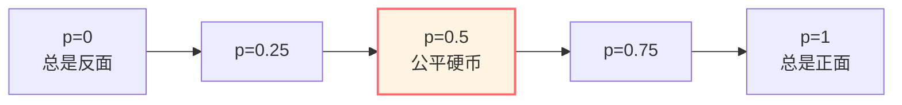
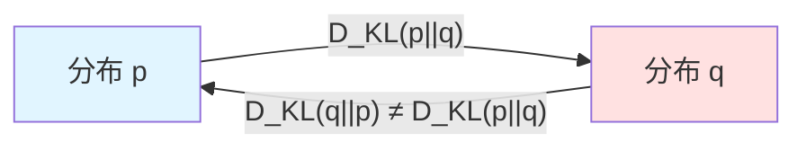
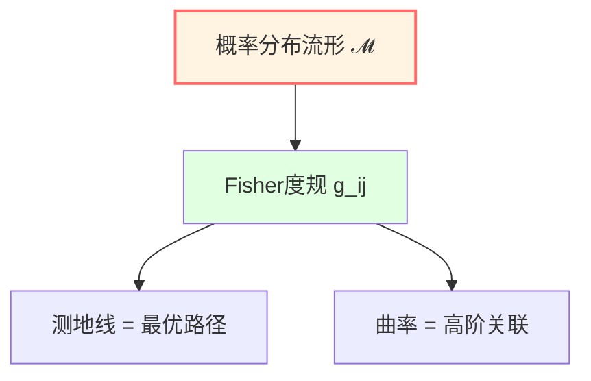
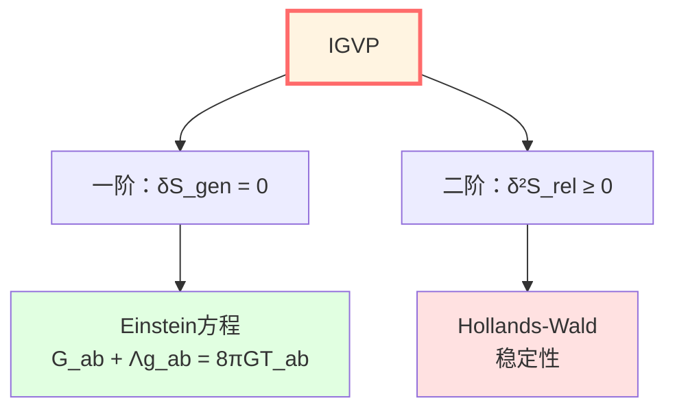

# 信息几何：概率的度规结构

> *"概率分布构成一个流形，Fisher信息是其度规。"* — Shun-ichi Amari

## 🎯 核心思想

我们通常认为概率分布只是一组数字。

**信息几何**揭示：概率分布空间其实是一个**带度规的流形**！

- **点** = 概率分布
- **距离** = 相对熵（KL散度）
- **度规** = Fisher信息矩阵
- **测地线** = 最优推断路径

这是IGVP（信息几何变分原理）的数学基础。

## 🗺️ 概率分布的空间

### 简单例子：抛硬币

考虑一个偏置硬币，正面概率为 $p$：

$$
P(H) = p, \quad P(T) = 1-p, \quad p \in [0, 1]
$$

所有可能的概率分布构成一个**一维流形**（区间 $[0,1]$）。

问题：如何测量两个分布 $p_1$ 和 $p_2$ 之间的"距离"？

## 📏 Kullback-Leibler散度（相对熵）

### 定义

**KL散度**（Kullback-Leibler divergence）：

$$
\boxed{D_{KL}(p || q) = \sum_i p_i \ln \frac{p_i}{q_i}}
$$

或连续情形：

$$
D_{KL}(p || q) = \int p(x) \ln \frac{p(x)}{q(x)} dx
$$

**物理意义**：

- 用分布 $q$ 编码真实分布 $p$ 的额外信息量
- $p$ 到 $q$ 的"距离"（但不对称！）

### 性质

1. **非负性**：$D_{KL}(p || q) \ge 0$
2. **为零当且仅当**：$D_{KL}(p || q) = 0 \Leftrightarrow p = q$
3. **非对称性**：$D_{KL}(p || q) \neq D_{KL}(q || p)$（不是真正的距离！）

## 🧮 Fisher信息矩阵

### 从KL散度到Fisher度规

考虑参数化的分布族 $p_\theta$，其中 $\theta = (\theta^1, \ldots, \theta^n)$。

**Fisher信息矩阵**定义为KL散度的Hessian：

$$
\boxed{g_{ij}(\theta) = \frac{\partial^2}{\partial \theta^i \partial \theta^j} D_{KL}(p_\theta || p_{\theta'})\Big|_{\theta'=\theta}}
$$

或等价地：

$$
g_{ij}(\theta) = \mathbb{E}_\theta\left[\frac{\partial \ln p_\theta}{\partial \theta^i} \frac{\partial \ln p_\theta}{\partial \theta^j}\right]
$$

**这是一个黎曼度规！**

### Fisher-Rao度规

**Fisher-Rao度规**将概率分布空间变成黎曼流形。

线元：

$$
ds^2 = g_{ij}(\theta) d\theta^i d\theta^j
$$

两个邻近分布 $p_\theta$ 和 $p_{\theta+d\theta}$ 之间的"距离"：

$$
ds^2 \approx 2 D_{KL}(p_\theta || p_{\theta+d\theta})
$$

## 🌀 简单例子：Bernoulli分布

### 参数化

Bernoulli分布：

$$
p(x | \theta) = \theta^x (1-\theta)^{1-x}, \quad x \in \{0, 1\}, \quad \theta \in (0, 1)
$$

对数似然：

$$
\ln p = x \ln \theta + (1-x) \ln(1-\theta)
$$

### Fisher信息

计算：

$$
\frac{\partial \ln p}{\partial \theta} = \frac{x}{\theta} - \frac{1-x}{1-\theta}
$$

$$
g(\theta) = \mathbb{E}\left[\left(\frac{x}{\theta} - \frac{1-x}{1-\theta}\right)^2\right] = \frac{1}{\theta(1-\theta)}
$$

### Fisher-Rao距离

两个Bernoulli分布 $p_{\theta_1}$ 和 $p_{\theta_2}$ 之间的距离：

$$
d(\theta_1, \theta_2) = \int_{\theta_1}^{\theta_2} \sqrt{g(\theta)} d\theta = \int_{\theta_1}^{\theta_2} \frac{d\theta}{\sqrt{\theta(1-\theta)}}
$$

计算得：

$$
d(\theta_1, \theta_2) = 2 \arccos\left(\sqrt{\theta_1\theta_2} + \sqrt{(1-\theta_1)(1-\theta_2)}\right)
$$

（这叫**Bhattacharyya距离**）

## 🔄 量子相对熵

### 定义

对量子态 $\rho$ 和 $\sigma$，定义**量子相对熵**：

$$
\boxed{S(\rho || \sigma) = \text{tr}(\rho \ln \rho) - \text{tr}(\rho \ln \sigma)}
$$

### 性质

1. **非负性**：$S(\rho || \sigma) \ge 0$（Klein不等式）
2. **单调性**：对任何完全正映射 $\Phi$，$S(\Phi(\rho) || \Phi(\sigma)) \le S(\rho || \sigma)$
3. **加性**：$S(\rho_1 \otimes \rho_2 || \sigma_1 \otimes \sigma_2) = S(\rho_1 || \sigma_1) + S(\rho_2 || \sigma_2)$

### 物理意义

量子相对熵度量两个量子态的"可区分性"。

在热力学中：

$$
S(\rho || \rho_{\text{thermal}}) = \beta(F - F_{\text{thermal}})
$$

（自由能差）

## 🎓 在IGVP中的应用

### 广义熵的变分

在IGVP框架中，一阶条件：

$$
\delta S_{\text{gen}} = 0
$$

涉及的是**广义熵**：

$$
S_{\text{gen}} = \frac{A}{4G\hbar} + S_{\text{out}}
$$

### 二阶条件：相对熵非负

二阶条件要求：

$$
\delta^2 S_{\text{rel}} \ge 0
$$

其中 $S_{\text{rel}}$ 是相对熵。

这保证了Einstein方程的稳定性。

### Fisher度规与度规变分

在信息几何视角下，度规 $g_{\mu\nu}$ 的变分对应于概率分布的变分。

Fisher信息矩阵给出度规空间的自然度规。

## 📝 关键概念总结

| 概念 | 定义/公式 | 意义 |
|-----|---------|------|
| KL散度 | $D_{KL}(p||q) = \sum p_i \ln(p_i/q_i)$ | 相对熵 |
| Fisher信息 | $g_{ij} = \mathbb{E}[\partial_i \ln p \cdot \partial_j \ln p]$ | 概率度规 |
| Fisher-Rao度规 | $ds^2 = g_{ij} d\theta^i d\theta^j$ | 分布空间的度规 |
| 量子相对熵 | $S(\rho||\sigma) = \text{tr}(\rho\ln\rho - \rho\ln\sigma)$ | 量子版KL散度 |
| Cramér-Rao界 | $\text{Var}(\hat{\theta}) \ge \frac{1}{g(\theta)}$ | 估计精度下界 |

## 🎓 深入阅读

- 经典教材：S. Amari, *Information Geometry and Its Applications* (Springer, 2016)
- 量子信息：M. Hayashi, *Quantum Information Theory* (Springer, 2017)
- GLS应用：igvp-einstein-complete.md
- 下一篇：[06-category-theory.md](06-category-theory.md) - 范畴论基础

## 🤔 练习题

1. **概念理解**：
   - 为什么KL散度不对称？
   - Fisher信息为什么是度规？
   - 量子相对熵的单调性有什么物理意义？

2. **计算练习**：
   - 计算两个正态分布 $N(\mu_1, \sigma^2)$ 和 $N(\mu_2, \sigma^2)$ 的KL散度
   - 验证Bernoulli分布的Fisher信息公式
   - 对 $2\times 2$ 密度矩阵，计算量子相对熵

3. **物理应用**：
   - Cramér-Rao界在量子测量中的应用
   - Fisher信息与量子Fisher信息有什么关系？
   - 相对熵在黑洞热力学中的角色

4. **进阶思考**：
   - 能否定义对称的"距离"？（提示：Bhattacharyya距离）
   - Fisher度规的曲率有什么意义？
   - 信息几何与热力学几何有什么联系？

---

**下一步**：最后，我们将学习**范畴论基础**——"数学的数学"，这是理解QCA宇宙和矩阵宇宙的关键！

