# 信息几何：概率的度规结构

> *"概率分布构成一个流形，Fisher信息是其度规。"* — Shun-ichi Amari

## 🎯 核心思想

## 🎯 核心思想

我们通常认为概率分布只是一组数字。

**信息几何**（Information Geometry）提供了一个几何视角：

**概率分布族可以被视为一个微分流形，而Fisher信息矩阵定义了其上的黎曼度规！**

- **点** $\leftrightarrow$ 概率分布
- **距离** $\leftrightarrow$ 相对熵（KL散度）/ Fisher-Rao距离
- **度规** $\leftrightarrow$ Fisher信息矩阵
- **测地线** $\leftrightarrow$ 最优推断路径或指数族

这构成了IGVP（信息几何变分原理）的数学基础之一。

## 🗺️ 概率分布的空间

### 简单例子：抛硬币

考虑一个偏置硬币，正面概率为 $p$：

$$
P(H) = p, \quad P(T) = 1-p, \quad p \in (0, 1)
$$

所有可能的概率分布构成一个**一维流形**（开区间 $(0,1)$）。

```mermaid
graph LR
    P0["p -> 0<br/>趋向反面"] --> P25["p=0.25"]
    P25 --> P50["p=0.5<br/>公平硬币"]
    P50 --> P75["p=0.75"]
    P75 --> P1["p -> 1<br/>趋向正面"]

    style P50 fill:#fff4e1,stroke:#ff6b6b,stroke-width:2px
```

问题：如何自然地定义两个分布 $p_1$ 和 $p_2$ 之间的"距离"？

## 📏 Kullback-Leibler散度（相对熵）

### 定义

**KL散度**（Kullback-Leibler divergence）是衡量两个概率分布差异的常用指标：

$$
\boxed{D_{KL}(p || q) = \sum_i p_i \ln \frac{p_i}{q_i}}
$$

或连续情形：

$$
D_{KL}(p || q) = \int p(x) \ln \frac{p(x)}{q(x)} dx
$$

### 物理与信息论意义

- **信息增益**：当修正先验分布 $q$ 为后验分布 $p$ 时获得的信息量。
- **编码代价**：用分布 $q$ 的编码方案来编码服从 $p$ 分布的数据时，所需的额外平均比特数。

### 性质

1. **非负性**：$D_{KL}(p || q) \ge 0$（Gibbs不等式）。
2. **同一性**：$D_{KL}(p || q) = 0 \Leftrightarrow p = q$（几乎处处）。
3. **非对称性**：一般而言 $D_{KL}(p || q) \neq D_{KL}(q || p)$（因此它不是严格的距离度量！）。

```mermaid
graph LR
    P["分布 p"] --> |"D_KL(p||q)"| Q["分布 q"]
    Q --> |"D_KL(q||p) ≠ D_KL(p||q)"| P

    style P fill:#e1f5ff
    style Q fill:#ffe1e1
```

## 🧮 Fisher信息矩阵

### 从KL散度到Fisher度规

考虑参数化的分布族 $p_\theta$，其中 $\theta = (\theta^1, \ldots, \theta^n)$。

**Fisher信息矩阵**可以定义为KL散度在一点附近的二阶展开项：

$$
D_{KL}(p_\theta || p_{\theta+d\theta}) \approx \frac{1}{2} \sum_{i,j} g_{ij}(\theta) d\theta^i d\theta^j
$$

其中：

$$
\boxed{g_{ij}(\theta) = \mathbb{E}_\theta\left[\frac{\partial \ln p_\theta}{\partial \theta^i} \frac{\partial \ln p_\theta}{\partial \theta^j}\right]}
$$

### 几何意义

**Fisher信息矩阵定义了一个黎曼度规（Fisher-Rao度规）！**

它不仅是唯一的（在Chentsov定理意义下）在充分统计量下不变的度规，而且赋予了概率流形弯曲的几何结构。

线元：

$$
ds^2 = g_{ij}(\theta) d\theta^i d\theta^j
$$

这意味着，在信息几何中，"距离"是由区分两个分布的难易程度决定的。

```mermaid
graph TB
    M["概率分布流形 𝓜"] --> G["Fisher度规 g_ij"]
    G --> D["测地线 = 最优推断路径"]
    G --> C["曲率 = 参数间的非平凡关联"]

    style M fill:#fff4e1,stroke:#ff6b6b,stroke-width:2px
    style G fill:#e1ffe1
```

## 🌀 简单例子：Bernoulli分布

### 参数化

Bernoulli分布：

$$
p(x | \theta) = \theta^x (1-\theta)^{1-x}, \quad x \in \{0, 1\}, \quad \theta \in (0, 1)
$$

对数似然：

$$
\ln p = x \ln \theta + (1-x) \ln(1-\theta)
$$

### Fisher信息

计算得分函数的方差：

$$
\frac{\partial \ln p}{\partial \theta} = \frac{x}{\theta} - \frac{1-x}{1-\theta}
$$

$$
g(\theta) = \mathbb{E}\left[\left(\frac{x}{\theta} - \frac{1-x}{1-\theta}\right)^2\right] = \frac{1}{\theta(1-\theta)}
$$

### Fisher-Rao距离

两个Bernoulli分布 $p_{\theta_1}$ 和 $p_{\theta_2}$ 之间的测地距离：

$$
d(\theta_1, \theta_2) = \int_{\theta_1}^{\theta_2} \sqrt{g(\theta)} d\theta = \int_{\theta_1}^{\theta_2} \frac{d\theta}{\sqrt{\theta(1-\theta)}}
$$

计算得：

$$
d(\theta_1, \theta_2) = 2 \arccos\left(\sqrt{\theta_1\theta_2} + \sqrt{(1-\theta_1)(1-\theta_2)}\right)
$$

这被称为**Bhattacharyya距离**，对应于球面上的大圆距离。

## 🔄 量子相对熵

### 定义

对量子态（密度算符）$\rho$ 和 $\sigma$，**量子相对熵**定义为：

$$
\boxed{S(\rho || \sigma) = \text{tr}(\rho \ln \rho) - \text{tr}(\rho \ln \sigma)}
$$

### 性质

1. **非负性**：$S(\rho || \sigma) \ge 0$（Klein不等式）。
2. **单调性**：对任何完全正保迹映射（CPTP）$\Phi$，$S(\Phi(\rho) || \Phi(\sigma)) \le S(\rho || \sigma)$。这反映了数据处理不等式：信息处理不会增加可区分性。
3. **联合凸性**：$S(\rho || \sigma)$ 是 $(\rho, \sigma)$ 的凸函数。

### 物理联系

在热力学中，如果 $\rho_{\text{thermal}}$ 是吉布斯态，则相对熵与自由能差成正比：

$$
S(\rho || \rho_{\text{thermal}}) = \beta(F(\rho) - F(\rho_{\text{thermal}}))
$$

这赋予了相对熵明确的热力学解释：偏离平衡态的程度。

## 🎓 在IGVP中的应用模型

### 广义熵的变分

在IGVP框架中，我们**假设**时空动力学遵循广义熵的变分原理。一阶条件：

$$
\delta S_{\text{gen}} = 0
$$

其中广义熵 $S_{\text{gen}}$ 包含面积项（Bekenstein-Hawking熵）和物质熵项。

### 二阶条件：稳定性

二阶变分涉及相对熵的二阶导数。稳定性条件要求：

$$
\delta^2 S_{\text{rel}} \ge 0
$$

这在物理上对应于系统的热力学稳定性，在数学上与Fisher信息的正定性相关。

```mermaid
graph TB
    I["IGVP框架"] --> F["一阶：δS_gen = 0"]
    I --> S["二阶：δ²S_rel ≥ 0"]

    F --> E["导出 Einstein方程<br/>(理论推测)"]
    S --> H["对应 Hollands-Wald<br/>稳定性条件"]

    style I fill:#fff4e1,stroke:#ff6b6b,stroke-width:3px
    style E fill:#e1ffe1
    style H fill:#ffe1e1
```

### Fisher度规与时空度规

在信息几何视角下，概率分布流形上的Fisher度规 $g_{ij}$ 与时空度规 $g_{\mu\nu}$ 之间可能存在深层联系。IGVP试图建立这种**全息对应**。

## 📝 关键概念总结

| 概念 | 定义/公式 | 意义 |
|-----|---------|------|
| KL散度 | $D_{KL}(p||q) = \sum p_i \ln(p_i/q_i)$ | 相对熵 |
| Fisher信息 | $g_{ij} = \mathbb{E}[\partial_i \ln p \cdot \partial_j \ln p]$ | 概率度规 |
| Fisher-Rao度规 | $ds^2 = g_{ij} d\theta^i d\theta^j$ | 分布空间的度规 |
| 量子相对熵 | $S(\rho||\sigma) = \text{tr}(\rho\ln\rho - \rho\ln\sigma)$ | 量子版KL散度 |
| Cramér-Rao界 | $\text{Var}(\hat{\theta}) \ge \frac{1}{g(\theta)}$ | 估计精度下界 |

## 🎓 深入阅读

- 经典教材：S. Amari, *Information Geometry and Its Applications* (Springer, 2016)
- 量子信息：M. Hayashi, *Quantum Information Theory* (Springer, 2017)
- GLS应用：igvp-einstein-complete.md
- 下一篇：[06-category-theory.md](06-category-theory.md) - 范畴论基础

## 🤔 练习题

1. **概念理解**：
   - 为什么KL散度不对称？
   - Fisher信息为什么是度规？
   - 量子相对熵的单调性有什么物理意义？

2. **计算练习**：
   - 计算两个正态分布 $N(\mu_1, \sigma^2)$ 和 $N(\mu_2, \sigma^2)$ 的KL散度
   - 验证Bernoulli分布的Fisher信息公式
   - 对 $2\times 2$ 密度矩阵，计算量子相对熵

3. **物理应用**：
   - Cramér-Rao界在量子测量中的应用
   - Fisher信息与量子Fisher信息有什么关系？
   - 相对熵在黑洞热力学中的角色

4. **进阶思考**：
   - 能否定义对称的"距离"？（提示：Bhattacharyya距离）
   - Fisher度规的曲率有什么意义？
   - 信息几何与热力学几何有什么联系？

---

**下一步**：最后，我们将学习**范畴论基础**——"数学的数学"，这是理解QCA宇宙和矩阵宇宙的关键！

